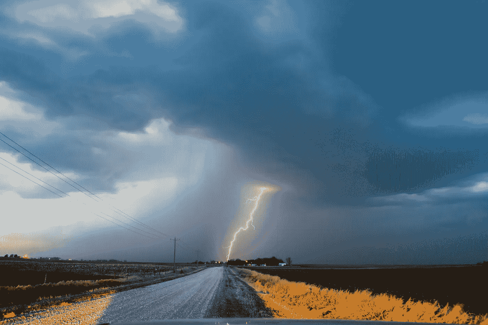

# 2022 年顶级机器学习算法和 Python 库

> 原文：<https://towardsdatascience.com/top-machine-learning-algorithms-and-python-libraries-for-2022-86820f7ca67f?source=collection_archive---------8----------------------->

## 意见

## …以及它们给数据科学家带来的主要好处


Moritz kn ringer 在[Unsplash](https://unsplash.com/s/photos/2022?utm_source=unsplash&utm_medium=referral&utm_content=creditCopyText)【1】上拍摄的照片。

# 目录

1.  介绍
2.  CatBoost
3.  深度预测
4.  PyCaret
5.  摘要
6.  参考

# 介绍

新算法很难出现，2022 年可能也不会例外。然而，仍然有一些机器学习算法和 python 库会越来越受欢迎。这些算法之所以与众不同，是因为它们包含了在其他算法中不常见的一些好处，我将对此进行更详细的讨论。无论是能够在您的模型中使用不同的数据类型的好处，还是将内置算法纳入您当前的公司基础架构，甚至是在一个地方比较几种算法的成功指标，您都可以预期这些在明年会因为各种原因变得更加流行。下面让我们更深入地探讨一下这些 2022 年的新兴算法和库。

# CatBoost


照片由[迈克尔萨姆](https://unsplash.com/@michaelsum1228?utm_source=unsplash&utm_medium=referral&utm_content=creditCopyText)在[Unsplash](https://unsplash.com/s/photos/cat?utm_source=unsplash&utm_medium=referral&utm_content=creditCopyText)【2】拍摄。

也许最新的，随着越来越受欢迎而频繁更新的，是 CatBoost。这种机器学习算法对于处理分类数据的数据科学家来说尤其有用。您可以考虑随机森林和 XGBoost 算法的好处，并将其中的大部分应用于 CatBoost，同时还可以获得更多好处。

> 以下是 CatBoost 的主要优势:

*   **不需要担心参数调整** —默认通常是正确的，手动调整可能不值得，除非您通过手动更改值来针对特定的误差分布
*   **更准确** —更少的过度拟合，当您使用更多的分类特征时，往往会得到更准确的结果
*   **快速** — 这种算法往往比其他基于树的算法更快，因为它不必担心大型稀疏数据集，例如应用了一键编码，因为它使用了一种目标编码
*   **预测更快** —就像你如何训练得更快一样，你也可以使用你的 CatBoost 模型预测得更快
*   **SHAP** —该库被集成，以便于解释整体模型上的特征重要性，以及具体的预测

总的来说，CatBoost 很棒，因为它易于使用，功能强大，在算法领域很有竞争力，也是可以放在简历上的东西。它可以帮助您创建更好的模型，最终使您的公司项目更好。

CatBoost 文档[此处](https://catboost.ai/)【3】。

# 深度预测



照片由 [NOAA](https://unsplash.com/@noaa?utm_source=unsplash&utm_medium=referral&utm_content=creditCopyText) 在[Unsplash](https://unsplash.com/s/photos/weather?utm_source=unsplash&utm_medium=referral&utm_content=creditCopyText)【4】拍摄。

这种算法内置于流行的平台 Amazon SageMaker 中，如果你的公司目前在 AWS 堆栈中或愿意使用它，这可能是一个好消息。在递归神经网络的帮助下，它被用于预测/时间序列应用中的监督学习。

> 以下是使用此算法时可能出现的输入文件字段的一些示例:

*   开始
*   目标
*   动态 _ 专长
*   猫

> 以下是使用这种算法/架构的一些好处:

*   **简单建模** —在同一个地方快速构建/培训/部署
*   **简单的架构** —专注于更少的编码，更多地关注您需要解决的数据和业务问题

当然，这个算法还有更多的内容，所以我限制了信息量，因为不是每个读者都在使用 AWS。

DeepAR 预测算法文档[此处](https://docs.aws.amazon.com/sagemaker/latest/dg/deepar.html)【5】。

# PyCaret


Jonathan Pielmayer 在[Unsplash](https://unsplash.com/s/photos/carot?utm_source=unsplash&utm_medium=referral&utm_content=creditCopyText)【6】上拍摄的照片。

因为没有那么多新算法要讨论，所以我想包括一个能够比较几种算法的库，其中一些算法可能会更新，因此是新的。这个 Python 库被称为开源和低代码。当我开始比较并最终为我的数据科学模型选择最终算法时，它让我更加了解新的和即将到来的机器学习算法。

> 以下是使用这个充满算法的库的一些好处:

*   **更少的编码时间** —您不需要导入库并设置每个算法特有的每个预处理步骤，相反，您可以填充一些参数，从而可以并排比较几乎所有您听说过的算法
*   **易于使用** —随着库的发展，它们的易用性也在发展。
*   **端到端处理** —可以研究从转换数据到预测结果的数据科学问题
*   **集成良好** —可以在 Power BI 中使用 AutoML
*   **混合和堆叠** —可以加入不同的算法以获得更多好处
*   **校准和优化模型**
*   **关联规则挖掘**
*   最重要的是，**一次比较 20 多种算法**

总的来说，这个库不直接是一个新算法，但它最有可能包括一个将在 2022 年出现的新算法，或者至少是最近的算法，甚至像上面提到的 CatBoost 这样的算法也包括在这个库中——这就是我如何发现它的。也就是说，我认为包含这个库很重要，这样你不仅可以随时了解 2022 年的最新情况，还可以了解你以前可能没有听说过或错过的旧算法，因为你可以将它们与简单的用户界面进行对比。

PyCaret 文档[此处](https://pycaret.org/)【7】。

# 摘要

如果你认为这个列表很短，那么你会意识到，并不是每年都有一组新的机器学习算法。我希望这里提到的这三个将增加他们的文档(或同行文档)和受欢迎程度，因为他们太棒了，并且不同于通常的逻辑回归/决策树等。

> 综上所述，以下是 2022 年值得期待的一些新的机器学习算法:

```
* CatBoost - algorithm* DeepAR Forecasting - algorithm/package* PyCaret - library including new algorithms
```

我希望你觉得我的文章既有趣又有用。如果你同意或不同意这些，请在下面随意评论。为什么或为什么不？你认为我们还可以包含哪些更重要的算法或包/库？这些当然可以进一步澄清，但我希望我能够揭示一些更独特的机器学习算法和库。感谢您的阅读！

***我与这些公司都没有关系。***

*请随时查看我的个人资料、* [马特·普日比拉](https://medium.com/u/abe5272eafd9?source=post_page-----86820f7ca67f--------------------------------)、*和其他文章，并通过以下链接订阅接收我的博客的电子邮件通知，或通过点击屏幕上方的订阅图标* *的* ***，如果您有任何问题或意见，请在 LinkedIn 上联系我。***

**订阅链接:**[https://datascience2.medium.com/subscribe](https://datascience2.medium.com/subscribe)

**引荐链接:**[https://datascience2.medium.com/membership](https://datascience2.medium.com/membership)

(*如果你在*上注册会员，我会收到一笔佣金)

# 参考

[1]Moritz kn ringer 在 [Unsplash](https://unsplash.com/s/photos/2022?utm_source=unsplash&utm_medium=referral&utm_content=creditCopyText) 上拍摄的照片，(2021)

[2]照片由 [Michael Sum](https://unsplash.com/@michaelsum1228?utm_source=unsplash&utm_medium=referral&utm_content=creditCopyText) 在 [Unsplash](https://unsplash.com/s/photos/cat?utm_source=unsplash&utm_medium=referral&utm_content=creditCopyText) 上拍摄，(2018)

[3] Yandex， [CatBoost 主页](https://catboost.ai/)，(2021)

[4]NOAA 在 [Unsplash](https://unsplash.com/s/photos/weather?utm_source=unsplash&utm_medium=referral&utm_content=creditCopyText) 上拍摄的照片，(2020)

[5]亚马逊网络服务公司或其附属公司， [DeepAR 预测算法](https://docs.aws.amazon.com/sagemaker/latest/dg/deepar.html)，(2021)

[6]Jonathan piel Mayer 在 [Unsplash](https://unsplash.com/s/photos/carot?utm_source=unsplash&utm_medium=referral&utm_content=creditCopyText) 上拍摄的照片，(2015)

[7] [Moez Ali](https://medium.com/u/fba05660b60f?source=post_page-----86820f7ca67f--------------------------------) ， [PyCaret 主页](https://pycaret.org/)，(2021)