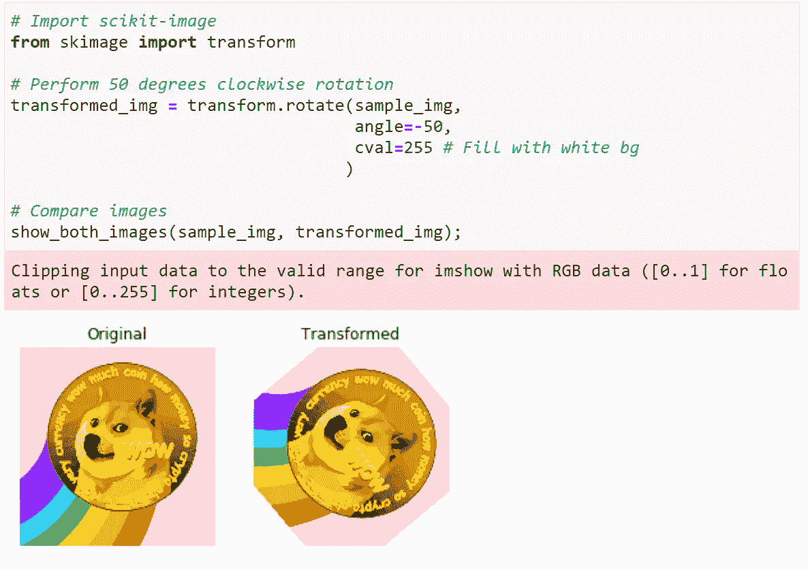
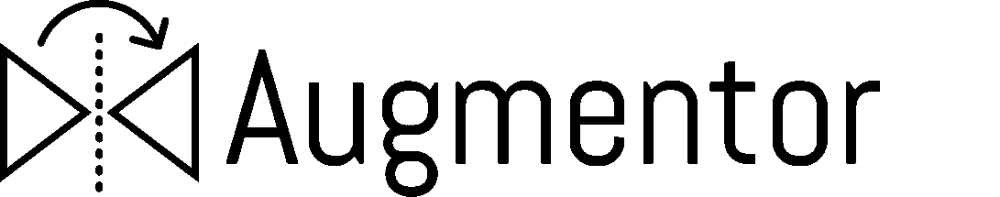
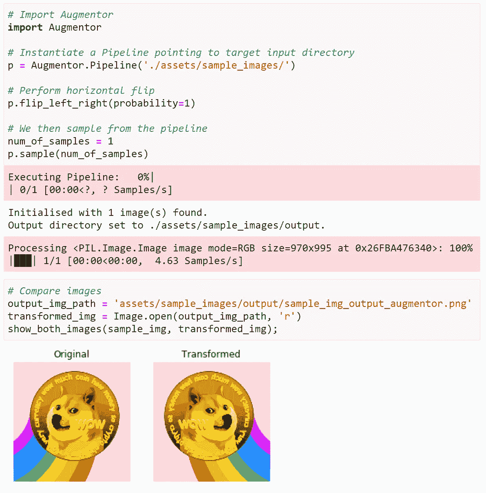
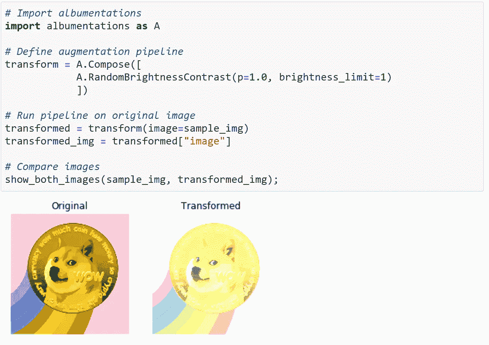
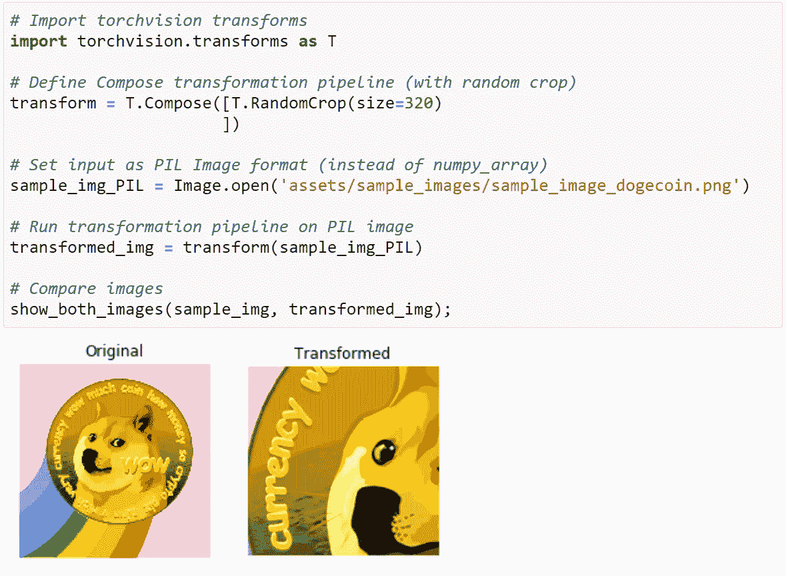
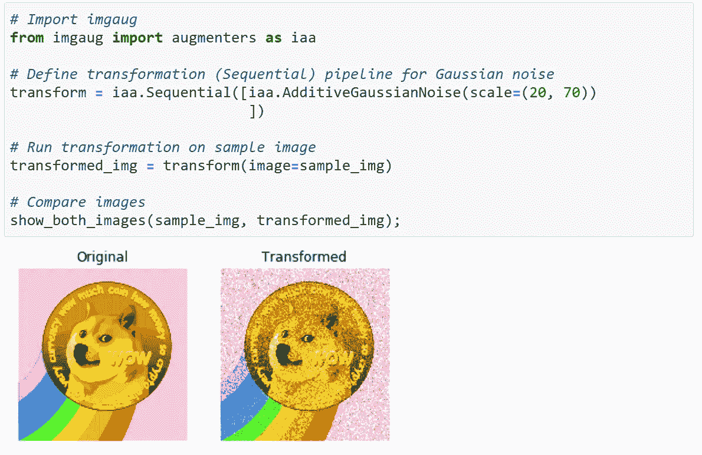
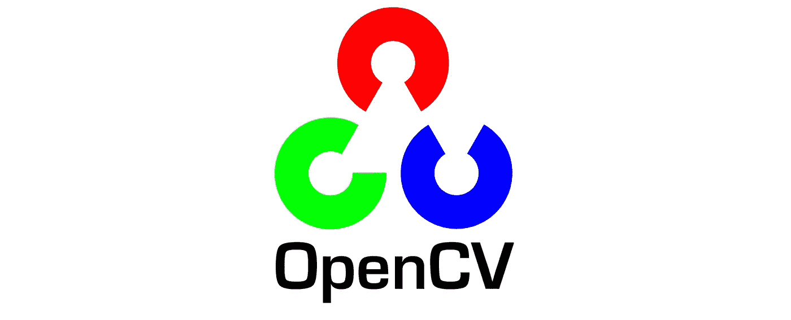
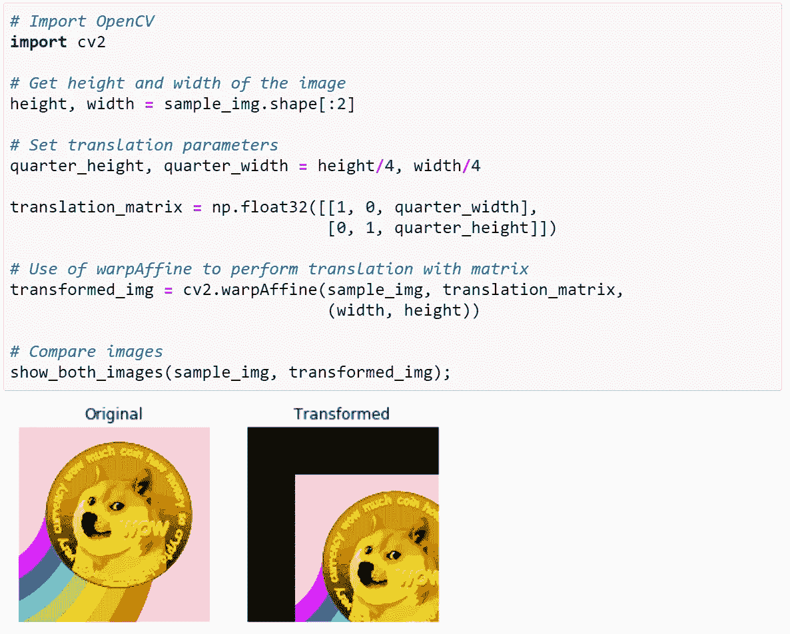

# 用于计算机视觉中图像增强的顶级 Python 库

> 原文：<https://towardsdatascience.com/top-python-libraries-for-image-augmentation-in-computer-vision-2566bed0533e?source=collection_archive---------0----------------------->

## 为您的下一个计算机视觉项目提供最好的增强库(以及示例代码)

Amy Shamblen 在 [Unsplash](https://unsplash.com?utm_source=medium&utm_medium=referral) 上的照片

像计算机视觉这样的深度学习任务高度依赖于大量的图像来进行训练。

虽然像[迁移学习](https://cs231n.github.io/transfer-learning/)这样的技术已经减少了所需的数据量，但是良好的模型性能仍然需要足够**质量**、**数量**和**种类**的数据集。

在本文中，我们来看看最流行和最强大的 Python 库，它们可以显著提升您的影像数据集。

# 内容

> ***(1)***[*关于图像增强*](#4824)***(2)***[*用于图像增强的包*](#1bc4)***(3)***[*示例实现代码*](#7e2e) ***(4)***

# 关于图像增强

图像增强的目标是通过生成原始图像的修改副本来人为增加训练图像数据集的大小。

一些标准的图像增强技术包括:

*   **顺时针或逆时针旋转**图像给定角度
*   **垂直或水平翻转**图像
*   **亮度**通过增加或减少图像亮度进行调整
*   **噪声**通过应用模糊效果(例如，高斯模糊)进行添加
*   **缩放**图像向内或向外进行不同程度的缩放

根据使用情况，可以使用更复杂的技术，如颜色量化、直方图均衡化和粗略剔除。

在麻省理工学院许可下使用的来自 [imgaug](https://imgaug.readthedocs.io/en/latest/) 的单一图像|图像的各种放大示例

# 图像增强包

理解了图像增强背后的动机后，让我们来看看让我们将这些概念付诸行动的软件包。

以下套餐是根据 GitHub repo 星数递增来排列的★。请注意，这些星级仅反映受欢迎程度，不应将**而非**视为质量的精确衡量标准。

在我看来，这些库都非常有能力执行增强来满足我们的大部分需求。说完了，我们开始吧。

## (6) [scikit-image](https://scikit-image.org/)

★*4.4K***[*GitHub*](https://github.com/scikit-image/scikit-image)*星辰***

****

**在[许可下使用的图像](https://github.com/scikit-image/scikit-image/blob/main/LICENSE.txt)**

**[scikit-image](https://scikit-image.org/) 是一个开源库，包含一系列易于使用的图像处理算法。它建立在 [scipy.ndimage](https://docs.scipy.org/doc/scipy/reference/ndimage.html) 之上，旨在成为科学图像分析和图像处理的参考库。**

**高质量的代码是由活跃的志愿者社区编写和同行评审的。**

****

**作者在 **scikit-image** | Image 中实现**旋转**的示例代码**

## **(5) [增强器](https://augmentor.readthedocs.io/en/master/)**

**★*4.5K*[*GitHub*](https://github.com/mdbloice/Augmentor)*星辰***

****

**根据麻省理工学院[许可](https://github.com/mdbloice/Augmentor/blob/master/LICENSE.md)使用图像**

**[Augmentor](https://augmentor.readthedocs.io/en/master/) 是 Python 中用于机器学习的图像增强库。它的目标是成为一个独立于平台和框架的独立库，允许对增强进行方便和细粒度的控制。**

**它最终允许用户对他们的图像数据集执行最相关和真实世界的增强技术。**

****

****增强器**中**水平翻转**的示例代码实现|图片由作者提供**

## **(4) [白蛋白](https://albumentations.ai/)**

**★*8.4K*[*GitHub*](https://github.com/albumentations-team/albumentations)*星辰***

****

**在 MIT [许可](https://github.com/albumentations-team/albumentations/blob/master/LICENSE)下使用的图像**

**[albuminations](https://albumentations.ai/)是一个 Python 库，用于快速灵活的图像增强。它有效地为不同的计算机视觉任务实现各种图像变换，包括对象分类和检测。**

**它还能够与流行的深度学习框架集成，如 [PyTorch](https://pytorch.org/) 和 [Keras](https://keras.io/) 。**

****

**作者在**相册** |图片中**随机亮度调整**的示例代码实现**

## **火炬接力**

**★*9.5K*[*GitHub*](https://github.com/pytorch/vision)*星辰***

****

**在 [BSD 许可](https://github.com/pytorch/vision/blob/master/LICENSE)下使用的图像**

**Torchvision 包是 PyTorch 项目的一部分，py torch 项目是一个流行的开源 Python 机器学习框架。它由许多样本数据集、模型架构和计算机视觉的典型图像转换组成。**

**由脸书人工智能团队开发，这个包有意地与 PyTorch 分开，以保持它的精简和轻量级，同时仍然与 PyTorch 无缝地工作。**

****

****火炬视觉**中**随机裁剪**的示例代码实现|图片由作者提供**

## **(2) [伊姆高格](https://imgaug.readthedocs.io/en/latest/)**

**★*11.5k*[*GitHub*](https://github.com/aleju/imgaug)*星辰***

**[imgaug](https://imgaug.readthedocs.io/en/latest/) 是一个用于机器学习实验中图像增强的库。它支持各种增强技术，允许用户以随机顺序或在多个 CPU 核心上轻松组合和执行它们。**

**它有一个简单而强大的随机界面，可以增加图像，地标，边界框，热图和分割图。**

****

**作者在 **imgaug** |图片中**高斯噪声添加**的示例代码实现**

## **(1) [OpenCV](https://opencv.org/)**

**★*55.8k*[*GitHub*](https://github.com/opencv/opencv)*星辰***

****

**[OpenCV](https://github.com/opencv/opencv) 图片用于[维基共享资源](https://commons.wikimedia.org/wiki/File:OpenCV_Logo_with_text.png) | Adi Shavit，公共领域**

**OpenCV (开源计算机视觉)可能是最著名的用于计算机视觉任务的开源库。**

**它专注于图像处理、视频捕捉和分析(包括人脸检测和对象检测等功能)，还有助于为计算机视觉应用提供一个通用的基础架构。**

****

****OpenCV** 中**翻译**的示例代码实现|图片由作者提供**

# **示例实现代码**

**要访问上面显示的库的示例 Python starter 代码，请随意查看 GitHub repo[***中的 Jupyter 笔记本。***](https://github.com/kennethleungty/Image-Augmentation-Libraries/)**

****

**照片由[摄影师](https://unsplash.com/@ffstop?utm_source=medium&utm_medium=referral)在 [Unsplash](https://unsplash.com?utm_source=medium&utm_medium=referral) 上拍摄**

# **包装它**

**图像增强是一种丰富训练数据集以提高计算机视觉算法性能的工具技术。列出的 Python 工具使得在实践中实现这些扩充变得很容易。**

**以下是所涉及的库的概述:**

> ***scikit-image
> *augment
> *albumations
> *torch vision
> *imgaug
> *OpenCV********

*****我的偏好曾经是 Torchvision(因为我倾向于在我的项目中使用 PyTorch)，但后来我切换到了 **imgaug** ，因为有更多可用的增强选项。*****

*****在所有的增强中，确保**增强图像看起来逼真并反映实际环境**是至关重要的。*****

*****否则，看起来不真实的图像会让你的深度学习模型学习到看起来与实际不同的东西，这反过来会对模型准确性产生负面影响。*****

## *****在你走之前*****

*****欢迎您**加入我的数据科学学习之旅！**关注此[媒体页面](https://kennethleungty.medium.com/)以了解更多数据科学内容，或者在 [LinkedIn](https://www.linkedin.com/in/kennethleungty/) 上联系我。享受充实你的图像的乐趣吧！*****

***** [## 使用 OpenCV 和 TesseractOCR 进行俄罗斯车牌检测

### 检测，识别和提取汽车牌照号码与计算机视觉的力量(一步一步…

towardsdatascience.com](/russian-car-plate-detection-with-opencv-and-tesseractocr-dce3d3f9ff5c)  [## 用字符错误率(CER)和单词错误率(WER)评估 OCR 输出质量

### 测量光学字符识别输出质量的关键概念、示例和 Python 实现

towardsdatascience.com](/evaluating-ocr-output-quality-with-character-error-rate-cer-and-word-error-rate-wer-853175297510)  [## 利用 fast.ai v2 对酒精饮料图像进行分类

### 使用 fast.ai v2 和 Google Colab 来提供令人陶醉的数据和 dram 混合

towardsdatascience.com](/classifying-images-of-alcoholic-beverages-with-fast-ai-34c4560b5543)*****