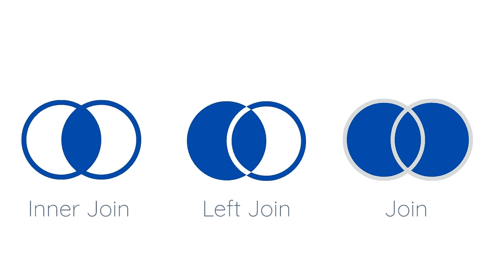

# 应对每一个 SQL 面试问题的顶级技巧

> 原文：<https://towardsdatascience.com/top-skills-to-ace-every-sql-interview-question-33356b08845a?source=collection_archive---------7----------------------->

## 理解并练习连接、聚合函数和子查询是你在编码面试中成功的关键


[船员](https://unsplash.com/@crew?utm_source=unsplash&utm_medium=referral&utm_content=creditCopyText)在 [Unsplash](https://unsplash.com/s/photos/woman-coding?utm_source=unsplash&utm_medium=referral&utm_content=creditCopyText) 上拍照

在任何面向数据的职位的面试中，几乎都有 SQL 部分。无论你面试的是分析师、工程人员还是数据科学人员，SQL 总是会悄悄进入流程的编码部分。

一旦你掌握了一些关键概念，通过大量的练习，你就可以回答任何问题。从这些概念的基础开始，逐步解决更困难的问题。

要想在 SQL 面试中取得成功，以下是你必须彻底了解的 3 个关键概念:

# 连接

你不会发现一个不涉及连接的问题。了解常规连接、内部连接和左连接之间的区别。当你能够区分这些并在正确的场景中使用它们时，你将会是黄金。



(图片由作者提供)

**当您只希望两个表中都有值时，可以使用内部连接**。它将比较您正在联接的任何列中的值，以便只有在这些列中具有匹配值的行才会出现在结果表中。

比方说，你想找目前正在影院上映的恐怖电影。ScaryMovies 表包含了影院中所有的恐怖电影。NowPlaying 表包含影院中当前播放的所有电影。

```
SELECT
   ScaryMovies.name
FROM NowPlaying
INNER JOIN ScaryMovies 
ON NowPlaying.movie_id = ScaryMovies.movie_id
```

使用内部联接来联接这些表将只选择当前正在影院上映的电影和恐怖电影表中的电影(或者两个表之间的重叠部分)。

**左连接**用于当您想要连接的第一个表中的值以及第二个表中的匹配值时。我喜欢问自己，我实际上想要最终表中的什么数据？如果我要查找一个表中的所有数据加上另一个表中的一列，那么我通常使用左连接。原始数据与第一个表非常相似，只是多了几列。

请记住，当您使用左连接时，如果第一个表和第二个表中没有匹配项，那么您从第一个表中提取的列将只是 null。

让我们再用一次现在播放的桌子。这个表只包含一个 movieId 来区分它是什么电影。关于每部电影的所有其他信息，如名称、类型和分级，都在 MovieDetails 表中。我们希望找到当前正在上映的所有电影的详细信息。

```
SELECT
   NowPlaying.movie_id,
   Movies.name,
   Movies.type,
   Movies.rating
FROM NowPlaying
LEFT JOIN Movies 
ON NowPlaying.movie_id = Movies.movie_id
```

这里，我们只需要 NowPlaying 表中关于电影的电影细节，以及我们可以从 movies 表中利用的一些进一步的细节。使用左连接将导致 NowPlaying 表中的所有 movieIds 出现在结果表中，如果 Movies 表中存在名称、类型和分级，也会出现在结果表中。如果左边的 movie_id 在右边不存在，那么该行的 name、type 和 rating 列将为 null。

最后是**加入**，这是最基本的。您还会看到这被称为完全外部连接，但最简单的方法是在代码中编写连接。当您需要两个表中的所有值时，可以使用这种方法。这在 id 或日期列中查找连续值时特别有用。

例如:假设您想查找连续播放两天的所有电影。

```
SELECT
   DISTINCT a.name
FROM Movies a 
JOIN Movies b 
ON a.play_date + 1 = b.play_date 
```

在这里，我连接相同的表，但是基于 play_date 连接它们，以便只有连续播放 2 天的电影才会被填充到表中。连续两天没放的电影不会加入。

# 聚合函数

就像连接一样，你会发现在几乎每个面试问题中都需要使用某种类型的聚合函数。这些都是不言自明的，但是这里的关键是知道如何正确地使用 GROUP BY 函数。

**MIN()** 和 **MAX()** 正是它们听起来的样子。它们会给出一个组(或整个表)中指定列的最小值或最大值。如果没有指定 GROUP BY 函数，那么这些函数肯定只返回一个值。

```
SELECT
   Name,
   MAX(Revenue) AS Max_revenue
FROM MOVIES
GROUP BY Genre 
```

这将返回每个电影类型中收入最高的电影，显示其名称和收入金额。

**COUNT()** 计算在函数中指定的任何条件下出现的行数。请记住，这与 **SUM()** 不同，后者实际上将您指定的列中的值相加。

```
SELECT
   Name,
   SUM(Revenue) AS Total_revenue,
   COUNT(*) AS Times_played 
FROM Movies
GROUP BY Name
```

让我们使用这个示例代码来看看 SUM()和 COUNT()之间的区别。这里，SUM(Revenue)函数将把每部电影获得的所有收入加在一起(注意 GROUP BY Name 函数)。相反，COUNT(*)将简单地计算每个电影名称的行数。您也可以执行 COUNT(Revenue)并获得相同的结果，但是计算所有行比计算收入更有意义。

**AVG()** 在计算某一组的平均列时，会让你的生活轻松很多。它基本上与 SUM(Revenue)/COUNT(Revenue)做同样的事情，因为平均值就是总和除以计数。

```
SELECT 
   date_played,
   AVG(revenue)
FROM Movies
GROUP BY date_played
```

这将为您提供该影院在开放和播放电影的每个日期的所有电影之间的平均收入。

# 子查询

这一条可能是最需要练习的。很多时候，公司会要求您解决一个问题，而这个问题很容易用多个表来解决，只需要一个子查询。

实践这一点的一个好方法是首先用最简单的方法解决一个问题，也许是用多个表。一旦得到正确答案，尝试重构代码，这样就可以使用一个子查询而不是多个表来解决问题。

让我们来看看这到底是什么样子:

原件:

```
WITH MarchMovies AS (
   SELECT 
      movie,
      genre,
      date_played
   FROM Movies
   WHERE date_played BETWEEN '03-01-2018' AND '03-31-2018'
),MayMovies AS (
   SELECT
      movie,
      genre,
      date_played
   FROM Movies
   WHERE date_played BETWEEN '05-01-2018' AND '05-31-2018'
)SELECT
   MayMovies.movie
FROM MayMovies 
INNER JOIN MarchMovies
ON MayMovies.movie = MarchMovies.movie
```

在这里，我们找到了三月播放的所有电影和五月播放的所有电影，并使用内部连接将它们连接到电影标题上，从而只获得两个月播放的电影。

使用一个子查询:

```
SELECT
   movie
FROM Movies
WHERE movie IN (SELECT movie FROM Movies WHERE date_played BETWEEN      '03-01-2018' AND '03-31-2018')
AND date_played BETWEEN '05-01-2018' AND '05-31-2018'
```

在这里，我们使用运算符中的 WHERE 和[找到了三月份播放的所有电影标题。如果该电影标题出现在为三月电影创建的临时表中，并在五月播放，则它将出现在输出表中。](https://www.w3schools.com/sql/sql_in.asp)

# 结论

一旦你理解了这三个基本概念，接下来就是实践了。每天至少花 15 分钟尝试新问题。如果你想不出一个，看看解决方案，第二天再试一次。 [LeetCode](https://leetcode.com/problemset/database/) 和 [HackerRank](https://www.hackerrank.com/) 提供了大量利用所有这些技能的问题。你没有理由不通过 SQL 面试！

练习，练习，练习！