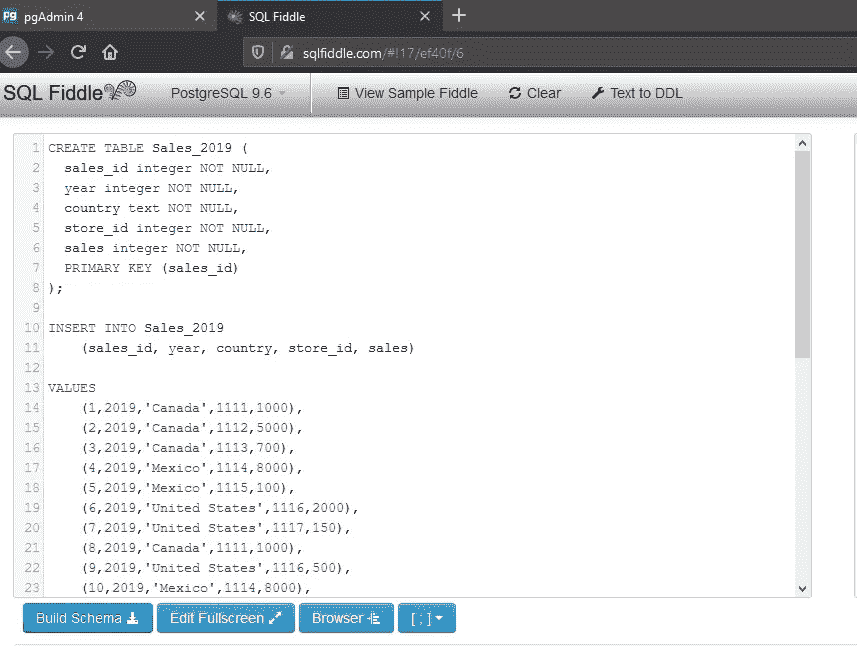

# 热门 SQL 面试问题

> 原文：<https://towardsdatascience.com/top-sql-interview-questions-4e9ed6830f76?source=collection_archive---------34----------------------->


来源: [Unsplash](https://unsplash.com/photos/W3Jl3jREpDY)

这里有十几个最常见的 SQL 面试问题，你会在数据专业人员的面试中看到。我强烈建议你尝试回答这些问题，并为每个问题写下预期的问题，然后在文章结尾将你的答案与我的进行比较。为了回答这些问题，我创建了一个假数据集和一个模式来运行查询。数据库模式就在问题的下面。那会让你开始。完成问题后，您可以滚动数据表查看答案。

# 问题

1.  确定表格中重复项的数量。
2.  查找两列的所有唯一组合。
3.  计算列中非空条目的数量。
4.  什么时候使用分组还是不同？举个例子。
5.  为什么使用 coalesce vs. case 语句？
6.  什么时候你会选择左连接而不是内连接？举个例子。
7.  在什么情况下子查询是个坏主意？
8.  为什么临时表是个好主意还是坏主意？
9.  工会什么时候有用？举个例子。
10.  如何使用连接进行筛选？举个例子。
11.  何时使用 having vs. where？举个例子。
12.  常用表表达式如何帮助分析师？举个例子。

**本文未涉及的其他话题:**
Sum。日期时间操作。字符串格式。子串。窗口功能类似于秩和行。滞后和领先。理解索引。累计总数。最大和最小。

# 数据库模式设置

您可以使用下面的 SQL 代码在 [SQLFiddle](http://sqlfiddle.com/) 设置模式，或者转到这个直接[链接](http://sqlfiddle.com/#!9/eb18a/7)来运行 MySQL 中的代码，或者转到这个直接[链接](http://sqlfiddle.com/#!17/ef40f/6)来运行 PostgreSQL。除了下面的代码，还有两个表直观地表示了 2019_Sales 和 Store_Info 表。在表格下方，您会找到解决方案部分。

**注意**:该模式在 MySQL 中有效，但可能在其他 SQL 数据库中无效。其他 SQL 数据库管理系统可能对表名和双引号与单引号的使用有更严格的规则。

```
CREATE TABLE 2019_Sales (
  sales_id INT NOT NULL,
  year INT NOT NULL,
  country VARCHAR(40) NOT NULL,
  store_id INT NOT NULL,
  sales INT NOT NULL,
  PRIMARY KEY (sales_id)
);

INSERT INTO 2019_Sales 
    (sales_id, year, country, store_id, sales) 
VALUES 
    (1,2019,"Canada",1111,1000),
	(2,2019,"Canada",1112,5000),
	(3,2019,"Canada",1113,700),
	(4,2019,"Mexico",1114,8000),
	(5,2019,"Mexico",1115,100),
	(6,2019,"United States",1116,2000),
	(7,2019,"United States",1117,150),
	(8,2019,"Canada",1111,1000),
	(9,2019,"United States",1116,500),
	(10,2019,"Mexico",1114,8000),
	(11,2019,"Mexico",1115,500),
    (12,2019,"Mexico",1115,500);

CREATE TABLE Store_Info (
  store_id INT NOT NULL,
  store_name VARCHAR(40) NOT NULL,
  size INT,
  PRIMARY KEY (store_id)
);

INSERT INTO Store_Info 
    (store_id, store_name, size)

VALUES
	(1111,"Red Store",1000),
	(1112,"Blue Store",3000),
	(1113,"Green Store",2000),
	(1114,"Pink Store",NULL),
	(1115,"Yellow Store",NULL),
	(1116,"Brown Store",500),
	(1117,"Black Store",1000);
```



SQLFiddle 的屏幕截图—作者提供的图片

# 2019 _ 销售表

# 商店信息表

# ********解决方案在此之下* * * * * * * *

# 解决方法

## 问题 1:确定表中重复项的数量

这可以有两种不同的解释。查找包括比较中所有列的重复项的数量，或者查找列子集的重复项的数量。如果有一个主键，那么*应该*不可能有一整行是重复的，但是它们仍然会发生。下面是我的代码，用于查找该表中仅包含{"year "，" country"}的子集中的重复项数量。

```
/* Year and Country combination duplicates */
SELECT year, country, COUNT(*)
FROM 2019_Sales
GROUP BY year, country
HAVING COUNT(*)>1
```

## 问题 2:找出两列的所有唯一组合

```
/* Find all unique combinations of two columns*/
SELECT DISTINCT country, store_id
FROM 2019_Sales
```

## 问题 3:计算一列中非空条目的数量

```
/* Count the number of non-null entries in a column*/
SELECT COUNT(size)
FROM Store_Info
```

## 问题 4:什么时候使用 group-by 和 distinct？

分组依据是一种类似于 Excel 中数据透视表的技术。当值在一列中出现多次时，这对于汇总或聚合信息很有用。例如，我们可以在 2019_Sales 表上使用 group-by 按国家汇总销售额。

```
/* Aggregate sales by country using group-by*/
SELECT country, sum(sales)
FROM 2019_Sales
GROUP BY country
```

当您需要一组唯一的记录或一组唯一的记录的计数时,“distinct”字段非常有用。在问题 2 中，我们找到了两列之间所有组合的唯一集合的计数。

## 问题 5:为什么使用 coalesce vs. case 语句？

大多数编程语言中都有 Case 语句。在有大量条件语句的情况下，它们很有用。与写一堆 if/then 语句相比，它们是一种更有条理、更容易解释的方法。一个常见的例子是分配[顺序排名。联合语句是 case 语句的简写。因为它们需要较少的代码，所以对于非程序员来说，它们不如 case 语句那样易读。](https://www.yourdictionary.com/ordinal-rank)

当程序员希望减少代码或者当用户定期访问查询时，最好使用 Coalesce 语句。因为它更难解释，所以您不希望不经常使用的用户通读多行合并语句。

另一方面，case 语句因为易读性更适合不经常使用的用户。这个特性也使得 case 语句更容易调试 SQL 语句。

## 问题 6:什么时候你会选择左连接而不是内连接？

当您有一个要与不完整数据集合并的主数据集时，左连接是很常见的。我们的目标是添加一些新信息，而不是覆盖原始数据集中的任何内容。在下面的示例中，我们使用左连接将 Store_Info 表添加到 2019_Sales 表中。因为 store_id 1117 没有 Store_Info 记录，所以内部连接会在连接的表中忽略该记录。如果您运行下面的“Inner Join”代码并将其与“Left Join”输出进行比较，就会看到这一点。

```
/* Left join two tables - Includes Store_ID 1117*/
SELECT 2019_Sales.sales_id, 2019_Sales.year, 2019_Sales.country, 2019_Sales.store_id, 2019_Sales.sales, Store_Info.store_id, Store_Info.store_name, Store_Info.size
FROM 2019_Sales
LEFT JOIN Store_Info ON 2019_Sales.store_id=Store_Info.store_id;/* Inner join two tables - Doesnt include Store_ID 1117*/
SELECT 2019_Sales.sales_id, 2019_Sales.year, 2019_Sales.country, 2019_Sales.store_id, 2019_Sales.sales, Store_Info.store_id, Store_Info.store_name, Store_Info.size
FROM 2019_Sales
INNER JOIN Store_Info ON 2019_Sales.store_id=Store_Info.store_id;
```

## 问题 7:在什么情况下子查询是个坏主意？

[子查询](https://www.essentialsql.com/introduction-to-subqueries/)或嵌套查询，通常用于一些计算或条件逻辑，提供在查询的主要部分使用的数据。一些子查询被称为相关子查询。当子查询包含主查询中的列时，就会出现这种情况。因为相关子查询依赖于主查询，所以它们不能独立运行。因此，它们更难调试。常见问题包括对表或别名的不正确引用([来源](https://codingsight.com/the-easy-guide-on-how-to-use-subqueries-in-sql-server/))。

## 问题 8:为什么临时表是个好主意还是坏主意？

在批处理或流程中处理数据时，如果需要存储和查看中间结果，临时表非常有用。这将有助于调试或检查过程是否按预期运行。然而，在存储过程中使用临时表会导致负面影响，比如多次重新编译、使用事务日志和并发开销([来源](https://www.linkedin.com/pulse/sql-server-temporary-tables-performance-impact-hamid-j-fard/))。这会导致负面的性能影响。

## 问题 9:工会什么时候有用？

联合对于组合列或数据集很有用；然而，它们并不像连接那样将它们组合在一起，而是像字符串的串联。将一个记录集合追加到另一个记录集合中。虽然联接基于特定的 id 进行匹配，但是联合只是将一个部分添加到另一个部分的末尾。在下面的示例中，我们可以通过使用 union 合并两个表中的 store_id 列来确认我们拥有所有的 store _ id。union 函数会对数据集进行重复数据删除，而 union all 不会。

```
/* Combine all store_ids from both tables into one column*/
SELECT store_id FROM 2019_Sales
UNION
SELECT store_id FROM Store_Info
ORDER BY store_id;
```

* **注意**:Python 的 Pandas 库中类似的函数是 [concat( )](https://pandas.pydata.org/pandas-docs/stable/reference/api/pandas.concat.html) 。

## 问题 10:如何使用连接进行筛选？

[自连接](https://www.w3schools.com/sql/sql_join_self.asp)是指一个表与自身连接。这些函数对于筛选单个表中的记录非常有用。在下面的情况中，我们可以在同一个国家中找到所有的 store _ ids 对。输出为每对产生两行，因为在这种情况下顺序很重要。

```
/* Find all pairs of store_ids in the same country*/
SELECT A.store_id AS Store_ID1, B.store_id AS Store_ID2, A.country AS Country
FROM 2019_Sales A, 2019_Sales B
WHERE A.store_id <> B.store_id
AND A.Country = B.Country
ORDER BY A.Country;
```

## 问题 11:何时使用 having vs. where？

Where 和 having 语句都用于筛选查询结果；但是，它们出现在脚本顺序的不同位置。这种排序是有目的的，因为“where”语句筛选非聚合列。“Having”语句用于筛选聚合列或 group by 子句中包含的列。请参见下面的示例，我们希望根据每个国家的总和进行筛选。因为这是一个聚合，所以我们不能使用 where 子句。此查询的输出不包括美国的销售总额 2650，它小于 2800。

```
-- Using the having clauses
SELECT country, sum(sales)
FROM 2019_Sales
GROUP BY country
HAVING sum(sales) > 2800
```

**注意**:很多数据库管理系统不支持 having 子句中的别名用法。

## 问题 12:常用表表达式如何帮助分析师？

公用表表达式(CTE)本质上是定义一个只为一个查询而存在的临时表。CTE 在主查询之前声明。它们类似于子查询，比复杂查询更具可读性。cte 开头附有一个“WITH”语句。它们为复杂的查询提供了额外的灵活性，包括在 CTE 中为字段命名以及在后面的表达式中使用它们的能力。例如，您可以对一个聚合进行聚合。盗梦空间？！在下面的代码中，我在一个查询中取一个总和的平均值。

```
-- Using CTEs and the WITH statement
WITH sum_store_id_sale AS
(
  SELECT store_id, country, SUM(sales) AS sum_sales
  FROM Sales_2019
  Group By store_id, country
 )
 SELECT AVG(sum_sales) AS avg_sales
 FROM sum_store_id_sale;
```

这段代码的输出是 sum_sales 列的平均值，它得到了 store _ ids 的销售额总和。因此，输出为 3921.43。

**注意**:上面的代码没有在 MySQL 的 SQLfiddle 中运行。我在 PostgreSQL 中重建了模式。这需要将 2019_Sales 表的名称更改为 Sales_2019，并将所有双引号替换为单引号，以满足 PostgreSQL 的规则。

# 反馈

这些问题有很大的难度。有些是初级水平，而有些则处理更复杂的主题，如临时表或子查询。比较了你的答案后，你的和我的有什么不同？对于不同的答案，我会深入探究。我们对这个问题有不同的解释吗？是我的解释遗漏了什么，还是你的解释不完整？在面试中，理想的候选人能够以清晰、简洁的方式解释最复杂的 SQL 主题。

~ [数据通才](https://twitter.com/datageneralist)

**PS** :这里列出了一些额外的 SQL 资源[。](https://thedatageneralist.com/resources/)