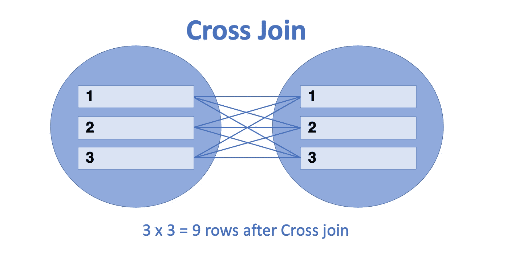

# 顶级 SQL 面试测试问题和技巧(第 1 部分)

> 原文：<https://towardsdatascience.com/top-sql-interview-test-questions-techniques-part-1-971bdccc745c?source=collection_archive---------3----------------------->

## 数据科学家招聘流程中一些最常见的 SQL 测试问题的解决方案和解释！


丹尼尔·伊德里在 [Unsplash](https://unsplash.com/s/photos/coding?utm_source=unsplash&utm_medium=referral&utm_content=creditCopyText) 上的照片

点击这里查看第二部[！](/top-sql-interview-test-questions-techniques-part-2-ffccccf776b4)

# **简介**

如果你申请的是数据科学、商业分析或任何与数据相关的领域的职位，你很有可能会被要求参加包含 SQL 组件的编码测试。该测试通常在 Codility 或 HackerRank 等平台上进行，通常是对申请数据导向角色的候选人进行初步筛选。

尽管在这些测试平台上有许多可能的场景和案例，但是在这些 SQL 测试中还是会重复出现某些任务。这些任务并不总是以完全相同的格式出现，有时是最终解决方案的中间步骤的一部分。不，我说的不是像“显示最大值”或“计算不同值的数量”这样的基本查询。例如，我们正在谈论你将在中等难度的 LeetCode 上找到的那种任务。

在我看来，你可以花上几个小时甚至几天的时间来尝试 LeetCode 和 HackerRank 上所有不同的挑战，但最终这些挑战并不能代表这类招聘测试中的实际测试问题。更多的时候，测试任务是面向实际的商业应用的；进行足够多的测试，你很快就会注意到某些任务的重复。

这篇文章的目标正是概述这些任务并提出解决方案，以便您可以更好地准备这些测试。在这篇文章的第一部分，我将分享两种非常常见的任务:

1.  **选择每个类别的前 N 个值**
2.  **选择满足条件的连续行数最少的行**

**注意** : *根据您使用的 SQL 版本，可以使用的子句和函数之间可能会有一些差异，但一般来说应该不会有太多差异。有太多的细微差别需要讨论，所以如果你对任何功能不确定，只需做简单的搜索，通常会有人找到答案！*

# 准确性和效率

一般来说，评估 SQL 解决方案有两个关键方法:准确性和效率。在下面的例子中，我主要关注准确性，以展示 SQL 中某些技术或函数的用法和应用。然而，我也认识到效率在 SQL 中非常重要，尤其是在查询大量数据时。在我的解决方案中，我确保在给定基础-中级 SQL 学习者的假定知识的情况下实现非常合理的效率水平，并尽最大努力提供尽可能减少冗余的解决方案。如果你想了解更多关于效率的知识，可以考虑看看这个[网站](https://www.freelancer.com/articles/web-development/how-to-make-your-sql-queries-faster)或者这本[书](https://www.amazon.com/Performance-Explained-Everything-Developers-about/dp/3950307826?tag=)来了解更多。

事不宜迟，我们来深入提问吧！

# **Q1:选出每个类别的前 N 名**

对于这种类型的问题，您需要选择包含某个类别中前 N 个值的行。

**任务**:提取学校每个班级的**前 2 名考试成绩的姓名和班级，先按班级排序，再按分数排序。如果有任何平局，使用较低的学生 id 来打破平局。**

**分数**数据集包含学校所有学生的分数。每个学生都有一个唯一的 **student_id** ，这是主键。**班级**数据集包含学校中所有学生的班级。这里的外键是 **student_id** ，它匹配来自 **scores** 的主键。类似地， **names** 数据集包含所有以 **student_id** 作为外键的学生的姓名。

**注意**:一个**外键**是一个表中的一个字段，它引用了另一个表中的一个**主键**。

```
**scores**| student_id | scores |
+------------+--------+
| 1          | 90     |
| 2          | 83     |
| 3          | 79     |
| 4          | 97     |
| 5          | 90     |
| 6          | 92     |
| 7          | 94     |
...**classes**| student_id | class |
+------------+--------+
| 1          | A     |
| 2          | B     |
| 3          | A     | 
| 4          | B     |
| 5          | D     |
| 6          | B     |
| 7          | A     |
...**names**| student_id |   name   |
+------------+----------+
| 1          | James    |
| 2          | Michael  |
| 3          | Valarie  | 
| 4          | Jessie   |
| 5          | Douglas  |
| 6          | Shin     |
| 7          | Joanne   |
...
```

因此，预期的结果应该是这样的:

```
**EXPECTED RESULT:**| class | name   | score |
+-------+--------+-------+
| A     | Joanne | 94    |
| A     | James  | 90    |
| B     | Jessie | 97    |
| B     | Shin   | 92    |
... 
```

**解决方案**

```
WITH class_ranking AS (
SELECT
    c.class, n.name, s.score,
    ROW_NUMBER() OVER (PARTITION BY c.class ORDER BY s.score DESC, s.student_id) AS rank
FROM scores s
JOIN classes c ON s.student_id = c.student_id
JOIN names n ON s.student_id = c.student_id 
)
SELECT class, name, score
FROM class_ranking
WHERE rank <= 2
ORDER BY class ASC, score DESC;
```

这项任务的难点在于，不是为整个数据集而是为每个类别选择最高分。如果任务是针对整个数据集的，我们可以只使用组合 **ORDER BY** 和 **LIMIT** 来获得最高分。

为了帮助我们以高效和简洁的方式解决这个任务，我们可以使用**公共表表达式(CTE)** 来创建一个临时结果，该结果可以被类似于 **SELECT** 和 **INSERT** 、 **UPDATE** 或 **DELETE** 的子句引用。

首先，我们使用分数、班级和姓名之间的一个**连接**来获得一个完整的数据集，其中每一行都包含每个人的所有相关数据。然后，除了选择这三个数据点之外，我们使用 **PARTITION BY** 子句根据 **c.class** 划分结果集，并根据 **ORDER BY 之后的字段从 1 开始分配一个 **ROW_NUMER()** 。**在这种情况下，在 c 类的每个**分区**中，我们首先按照 **s.score** 在 **DESC** 中进行排序，将每个类中的最高分排序为 1，第二高的排序为 2，以此类推。此外，我们使用 **s.student_id** 作为排序依据的辅助字段，从而实现任务的目标，即**使用较低的 student_id 消除联系**。

有关如何使用子句的**分区的更多详细信息，请点击此处链接查看。**

接下来，我们利用 CTE 将这个划分的排名存储为一个临时结果集，称为 **class_ranking。**一般来说，CTE 的用法如下:

```
WITH temp_table AS (
    SELECT ...
)
SELECT _ FROM temp_table
```

你也可以用一个 cte 链来解决问题。这在解决方案需要对中间 CTE 进行连续处理以获得实际结果的最终 CTE 的情况下非常有用。格式如下所示:

```
WITH temp_table AS (
    SELECT ...
),WITH temp_table_2 AS (
    SELECT ...
),SELECT _ FROM temp_table_2
```

*关于使用多个 cte 的示例，敬请关注未来的帖子！*

对于这个问题，CTE **class_ranking** 基本上是原始三重连接的扩展，增加了一个字段 **rank** 来表示每个分区或类中每个学生的等级。

有了这个 CTE，我们就可以选择相关的字段 **class、name、score** 并使用 **WHERE** 子句对 **rank ≤ 2、**的行进行子集化，从而有效地给出每个类的前 2 名分数，其平局被较低的 student_id 打破。我们在最终解决方案中省略了**等级**，因为这不是必需的。我们也按类别 ASC 进行排序，首先按字母顺序对类别进行评分，以获得想要的排序，分数较高的排在最上面。

**变体:ROW_NUMBER()的替代方法**

在这个特定的任务中，使用 student_id 来打破平局，这可以通过为每个分区分配 ROW_NUMBER()并首先按分数然后按 student_id 排序来简单地实现。这将确保只有一个学生排名 1，一个学生排名 2。

但是，如果问题指定:让 s1 和 s2 是每个班级取得的前 2 名成绩，会怎么样呢？如果有一个以上的学生获得了 s1 和/或一个以上的学生获得了 s2，只要他们获得了前两个分数中的一个，就包括所有的名字。

实际上，这意味着修改后的结果集可能类似于:

```
**MODIFIED RESULT:**| class | name   | score |
+-------+--------+-------+
| A     | Joanne | 94    |
| A     | James  | 90    |
| A     | Caleb  | 90    |
| B     | Jessie | 97    |
| B     | Shin   | 92    |
...
```

为了说明这种变化，我们只需将 **ROW_NUMBER()** 窗口函数更改为 **DENSE_RANK()** 。假设 James 的 student_id 比 Caleb 小，ROW_NUMBER()会将 rank=2 分配给 James，将 rank=3 分配给 Caleb。但是，DENSE_RANK()会将 rank=2 分配给 James 和 Caleb。此外，DENSE_RANK()和 RANK()之间的差异也值得注意——DENSE _ RANK()是“密集的”,因为它不会在相同的排名后跳过排名，但 RANK()会。因此，Caleb 之后的下一个最高分在 DENSE_rank()下将被排序为 rank=3，但在 RANK()下将被排序为 rank=4。根据应用程序的情况，应该知道这些窗口应用程序之间的差异。

对于那些想知道什么是**窗口函数**以及它与其他函数如**聚合函数的关系的人来说，** PostgreSQL 提供了一个很好的解释 **:**

> 一个 ***窗口函数*** 对一组与当前行有某种关系的表格行执行计算。这与聚合函数可以完成的计算类型相当。但是与常规的**聚合函数**不同，窗口函数的使用不会导致行被组合成一个输出行——这些行保持它们各自的身份。在后台，窗口函数能够访问的不仅仅是查询结果的当前行。

如果您的 SQL 方言不支持 **ROW_NUMBER()** 函数或 PARTITION BY 子句，我们可以在一个**相关子查询**中使用**等价连接**和**非等价连接**逻辑的组合来获得想要的结果:

```
SELECT c.class, n.name, s.score
FROM scores s
JOIN classes c ON s.student_id = c.student_id
JOIN names n ON s.student_id = n.student_it
WHERE
(
    SELECT COUNT(DISTINCT s.score)
    FROM scores s2 JOIN classes c2 ON s2.student_id = c2.student_id
    WHERE s2.score > s.score
        AND c2.class = c.class) < 2
```

一个**等价连接**是一个根据列中匹配值连接表的连接。**非等价连接**是一个条件不等于的连接。

**子查询**是嵌套在另一个查询中的查询。**相关子查询**是使用外部查询中的值的子查询。

在这种情况下，子查询使用外部查询中的 **s.score** 和 **c.class** 与来自同一个表 **scores** 的值进行比较，但现在使用**别名 s2，**并计算比原始表 **scores s** 中的每一行都大的分数的数量。条件是选择具有少于 2 个对应匹配的那些，因为最高分数将具有 0 个匹配，第二高分数将具有 1 个匹配。

仅此而已！进入下一个问题…

# Q2:条件连续选择

**选择满足条件的连续行数最少的行**

SQL 访谈中的一个常见任务是选择不仅满足特定标准，而且满足最少数量的行的行，通常按日期排序。这里我们将看一个例子，它解释了在给定我们要寻找的连续行之间的关系的情况下，我们如何使用**交叉连接**来过滤这种情况。

表格**病例**包含每个日期的新 COVID 病例数。

**任务**:显示包含连续 3 天或以上的 100 例以上的行。

```
**cases**+------+------------+-----------+
| id   |    date    |   new     |
+------+------------+-----------+
| 1    | 2021-01-01 | 20        |
| 2    | 2021-01-02 | 149       |
| 3    | 2021-01-03 | 150       |
| 4    | 2021-01-04 | 99        |
| 5    | 2021-01-05 | 145       |
| 6    | 2021-01-06 | 200       |
| 7    | 2021-01-07 | 199       |
| 8    | 2021-01-08 | 188       |
| 9    | 2021-01-09 | 88        |
+------+------------+-----------+
...
```

预期的结果将类似于:

```
**EXPECTED RESULT**+------+------------+-----------+
| id   |    date    |    new    |
+------+------------+-----------+
| 5    | 2021-01-05 | 145       |
| 6    | 2021-01-06 | 200       |
| 7    | 2021-01-07 | 199       |
| 8    | 2021-01-08 | 188       |
+------+------------+-----------+ 
```

**解决方案**

```
WITH cases_over_hundred AS (
  SELECT * FROM cases WHERE new > 100
)SELECT DISTINCT c1.* 
FROM cases_over_hundred as c1,
FROM cases_over_hundred as c3,
FROM cases_over_hundred as c2,
WHERE (c1.id = c2.id - 1 AND c1.id = c3.id - 2) 
  OR (c1.id = c2.id + 1 AND c1.id = c3.id - 1) 
  OR (c1.id = c2.id + 2 AND c1.id = c3.id + 1)
ORDER BY c1.id;
```

为了提高效率，我们首先创建一个 CTE 来选择超过 100 个案例的行。我们称这种 CTE 案例超过 100 例。

接下来，我们使用一个**条件交叉连接**来查找所有连续 3 天或以上超过 100 个案例的行。交叉联接，也称为笛卡尔积，其中一个表中的每一行都与另一个表中的每一行相结合。



作者图片

在本例中，我们交叉连接三个表，因为我们想要比较三个日期的不同组合的日期，以检查它们是否连续。但是，我们将使用条件来确保只联接属于以下三个类别之一的日期，而不是完全交叉联接:

*   c1 日期比 c2 日期早一天，比 c3 日期早两天
*   c1 日期比 c2 日期晚一天，比 c3 日期早一天
*   c1 日期比 c2 日期晚两天，比 c3 日期晚一天

**注意**:对于这些条件中的任何一个，用 c3 替换 c2 都无关紧要，因为这里我们使用的是交叉连接，所以无论如何都要考虑所有的排列

这三种可能性分别由以下三个条件捕获:

```
WHERE (c1.id = c2.id - 1 AND c1.id = c3.id - 2) 
  OR (c1.id = c2.id + 1 AND c1.id = c3.id - 1) 
  OR (c1.id = c2.id + 2 AND c1.id = c3.id + 1)
```

通过这种条件交叉连接，我们成功地选择了所有的日期组合，这样，当排列正确时，行中的所有三个日期都是连续的，并且它们都有大于等于 100 的事例。

最后，我们需要使用**选择(DISTINCT (c1。*))** 删除所有重复。对于每个子集化的行，由于有条件的交叉连接，将会有两个重复，因此我们需要做的只是从 c1 中选择不同的日期值，以获得连续 3 天或更多天超过 100 个案例的日期序列。

**替代方案**

事实上，还有另一种方法可以解决这个问题，那就是使用**窗口函数**(再次)！对于这种情况，我们可以使用窗口函数 **LAG()** 和 **LEAD()** 。正如您可能已经预料到的， **LAG()** 允许我们获得给定字段的先前值，其中顺序由另一个字段决定。在这种情况下，我们根据 **id** 的顺序得到 **new** 的前几个值。同样， **LEAD()** 返回引用中当前行前面的 us 值。

标准语法如下:

```
LAG(return_value ,offset [,default])  
OVER ([PARTITION BY partition_expression, ... ]
       ORDER BY sort_expression [ASC | DESC], ... )
```

这个语法与我们在问题 1 中使用的非常相似，使用 ROW_NUMBER()窗口函数。

对于这个问题，我们首先使用 LAG()和 LEAD()窗口函数构造一个 CTE，其中包含每行日期前后 1、2 天的值。随后，对于连续三天超过 100 个案例的条件得到满足的行，我们引用此 CTE 和条件。'

```
WITH interval_cases AS (
    SELECT *,
    LAG(new, 2) OVER (ORDER BY id) AS before_2,
    LAG(new, 1) OVER (ORDER BY id) AS before_1,
    LEAD(new, 1) OVER (ORDER BY id) AS after_1,
    LEAD(new, 2) OVER (ORDER BY id) AS after_2
FROM cases
)
SELECT id, date, new
FROM cases
WHERE new > 100
AND ((before_2 > 100 AND before_1 > 100)
     OR (before_1 > 100 AND after_1 > 100)
     OR (after_1 > 100 AND after_2 > 100))
ORDER BY id;
```

让我们来看看查询逻辑:

首先，CTE interval_cases 将为每一行生成一个如下所示的结果集:

```
+----+------------+-----+----------+----------+---------+---------+
| id |    date    | new | before_2 | before_1 | after_1 | after_2 |
+----+------------+-----+----------+----------+---------+---------+
| 5  | 2021-01-05 | 145 | 150      | 99       | 200     | 199     |
...
```

随后，我们筛选出那些 **new** 大于 100 并且属于连续三天都大于 300 的行。这可能以三种方式之一发生，这就是为什么伴随新的> 100 条件有三种可选条件。这将得到与上一个解决方案相同的结果。

# 结论

我希望这两个问题在演示如何处理 SQL 编码测试中最常见的问题时有用。如果你喜欢我分享的内容，请给我一个掌声并分享这篇文章！

如果有足够的兴趣，我还会在第 2 部分提出更多问题，如果您对如何解决这些问题有任何意见或建议(特别是从效率的角度)，请随时联系或发表评论！

更新:点击这里查看第二部[！](/top-sql-interview-test-questions-techniques-part-2-ffccccf776b4)