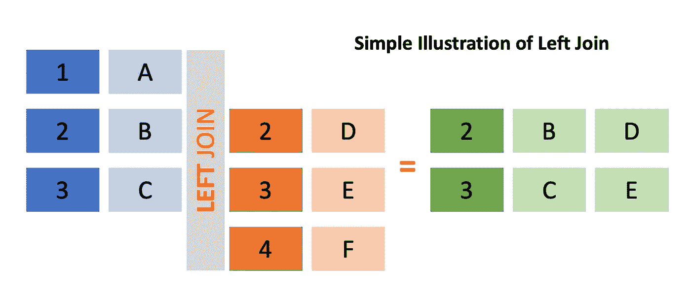

# 顶级 SQL 面试测试问题和技巧(第 2 部分)

> 原文：<https://towardsdatascience.com/top-sql-interview-test-questions-techniques-part-2-ffccccf776b4?source=collection_archive---------16----------------------->

## 在数据科学家招聘过程中，您将会发现一些最常见的 SQL 测试问题的更多解决方案和解释！


卡斯珀·鲁宾在 unsplash 上的图片

点击这里查看第一部分[！](/top-sql-interview-test-questions-techniques-part-1-971bdccc745c)

**简介**

在 SQL 面试问题的第 2 部分中，我们将了解如何计算变量随时间的移动平均值。这被认为是数据科学家/分析师角色的 SQL 测试中可能遇到的最难的问题之一，但这是介绍窗口函数的扩展概念以及使用它们可能产生的可能性的一种非常好的方式！

感谢 StrataScratch 为这个[问题](https://platform.stratascratch.com/coding-question?id=10314&python=)提供灵感！如果你想在准备面试时获得一系列问题，那就去看看吧！

也请查看我的本系列第 1 部分中关于 SQL 编码测试的其他问题！

**表格**

```
**transaction**+---------+--------------------+----------+----------+
|user_id  |created_at          |item_id   |item_count|
+---------+--------------------+----------+----------+
|000001   |2020-01-01 02:03:04 |23        |20        |
|000002   |2020-01-01 03:11:22 |41        |30        |
|000002   |2020-01-02 05:01:23 |64        |5         |
...**item_details**+---------+-----------------+--------+
|item_id  |item_mame        |price   |
+---------+-----------------+--------+
|23       |Toilet Paper     |0.90    |
|41       |Hairband         |0.30    |
|64       |Hand Soap        |2.20    |
...
```

**交易**包含每笔交易的一行，包含用户标识、交易日期时间、项目标识和项目计数(购买数量)。用户、他们的购买金额和购买日期。退货时将显示负的 item_count。

**item_details** 包含每个项目的 item_id、item_name 和价格。

**任务:收入滚动平均**

> 在给定的名为**交易**和**项目 _ 详细信息**的表格中，找出采购总收入的三个月滚动平均值。不要包括由负 item_count 表示的退货。输出收入的月份和 3 个月的滚动平均值，从最早的月份到最晚的月份排序。
> 
> 3 个月滚动平均是通过计算当月和前两个月所有用户购买的平均总收入来定义的。前两个月不会是真正的 3 个月滚动平均值，因为我们没有去年的数据。

**预期产出**

```
+-----------+---------------+
|month      |avg_revenue    |
+-----------+---------------+
|2020-01    |82910          |
|2020-02    |91840          |
|2020-03    |63702          |
|2020-04    |74839          |
...
```

**任务 1 解决方案**

```
SELECT t2.month,
       AVG(t2.monthly_revenue) OVER (ORDER BY 
           t2.month ROWS BETWEEN 2 PRECEDING AND CURRENT ROW) 
           AS avg_revenueFROM
    (SELECT to_char(created_at::date, 'YYYY-MM') AS month,
          sum(purchase_amt) AS monthly_revenue FROM
         (SELECT transaction.created_at,
                 item_count * item_price AS purchase_amt
          FROM transactions
          LEFT JOIN item_details ON transactions.item_id =                       item_details.item_id) t1 WHERE purchase_amt > 0
     GROUP BY month
     ORDER BY month) t2GROUP BY month
ORDER BY month ASC
```

为了解决这一任务，我们将以循序渐进的方式接近目标，最终获得收入的滚动平均值。自然，第一步是计算每笔交易的总花费。为此，我们必须在**事务**和**项目详细信息**之间进行左连接。请注意，我们只需要一个左连接，因为我们只希望获得包含事务的行。很可能会有一些商品出现在 **item_details** 中，但我们却没有与之交易。



作者原创图片

本质上，left join 返回左表中的所有行，同时返回右表中的所有匹配行，这是基于在 **ON** 子句之后出现的匹配条件。通过左连接表，我们使用子查询获得表 **t1** 的中间结果，其中包含每笔交易的 **created_at** date 和**purchase _ amount**，后者是 **item_count** 和 **item_price** 的乘积。

当顺序求解时，它有助于将中间结果可视化，如下所示:

```
**t1**+--------------------+--------------+
|created_at          |purchase_amt  |
+--------------------+--------------+
|2020-01-01 02:03:04 |18.0          |
|2020-01-01 03:11:22 |9.0           |
|2020-01-02 05:01:23 |11.0          | 
...
```

下一步是合计每个月的所有 purchase_amt。为此，我们需要根据月份对所有的 **created_at** 值进行分类。有很多方法可以做到这一点，但是对于我们当前的解决方案，我们将使用 **::** 作为转换语法。这里，我们使用下面的代码行提取月份，并将其转换为格式为“YYYY-MM”的 *VARCHAR* 数据类型，如下所述。

```
to_char(created_at::date, 'YYYY-MM') AS month
```

**::** 用于将值转换为特定类型，在本例中是日期类型。我们这样做的原因是为了确保在使用 **to_char** 创建‘YYYY-MM’*VARCHAR*数据类型之前，我们正在处理一个日期类型。类似地，我们可以使用 **CAST()** 来实现同样的事情:

```
CAST(created_at AS date) AS month
```

有了这个**月**别名，我们就可以根据月实现一个**组，同时还可以过滤 purchase_amt > 0，这样我们就可以排除项目。(回想一下，负 item_count 表示返回的项目不应包含在我们的表格中)。附带的聚合函数将对每个月的所有采购金额进行 **SUM()** ，以获得**月度收入**，这构成了临时结果 **t2** 的基础。**

最后，我们要计算月收入的三个月移动平均值，使用当月和过去两个月的收入。为了做到这一点，我们可以应用 **AVG(** )聚合函数来计算三行连续数据的平均收入**。要了解更多关于**条款的**的信息，我推荐在这里查看详细的文档**

为了指定我们希望聚合三行数据，我们使用以下子句:

**ORDER BY <变量>前一行< n >和当前行**之间的行

在这里，<variable>是我们想要用来决定在引用行之前和之后标记行的顺序。<n>用于确定当前行之前**的行数，我们希望将其视为窗口的一部分。出于其他目的，如果我们关心的是引用行之后的行，我们可能还想在**之后使用**。为了简洁起见，请注意以下两者是等效的:**</n></variable>

```
**ROWS BETWEEN <n> PRECEDING AND CURRENT ROW**============= is the same as ============**ROWS <n> PRECEDING**
```

有兴趣的也可以根据问题用**无界**代替整数< n >。如你所料，使用 **UNBOUNDED** 基本上意味着一个扩展的窗口，例如，当我们关心查找运行总数时，这是很有用的。

现在，让我们仔细看看这个子句的每个组成部分。这里，**行**指定我们将根据它们的行顺序来考虑观察值。另一种规范是使用 **RANGE** 来代替，它本质上看起来是相同的行，但也是具有匹配值的行。要了解更多细节和示例，请查看这个[链接](https://stevestedman.com/2013/04/rows-and-range-preceding-and-following/)。对于我们目前的目的，我们使用行是因为我们不关心值的范围，而只关心每一行之前的两行月收入值，因此我们只能对一组三行进行平均。

此外，您可以在按排序的**之前包含按**变量<变量>划分的**，以便为由<变量>指定的每个唯一类别执行这些计算。关于如何使用 partition 子句的例子，请查看我以前的文章[！](/top-sql-interview-test-questions-techniques-part-1-971bdccc745c)**

```
SELECT t2.month,
       AVG(t2.monthly_revenue) OVER (ORDER BY 
           t2.month ROWS BETWEEN 2 PRECEDING AND CURRENT ROW) 
           AS avg_revenueFROM (...) t2GROUP BY month
ORDER BY month ASC
```

最后，我们可以包含 GROUP BY 子句来指定我们希望基于月份执行聚合函数。但是，这里需要注意的是，您可以省略这个组，实际上仍然可以获得聚合值。

将所有这些放在一起，我们可以应用每个月及其前两行的月收入平均值来获得 3 个月的移动平均值。我们在最后通过应用**命令，以确保我们按顺序得到报告的月份。**

**语法差异 CTE vs 子查询:真的有差异吗？**

对于那些读过我之前的[文章](/top-sql-interview-test-questions-techniques-part-1-971bdccc745c)的人来说，你可能已经注意到在这个解决方案中，我使用了子查询，而不是公共表表达式(CTE)。

总的来说，使用 cte 的优势在于封装，这意味着我不必每次使用它时都声明子查询，我可以只定义一次并多次引用它。

然而，这是否意味着我使用 CTE 执行 SQL 查询会更有效呢？看起来似乎是这样，但实际上使用 CTE 并不一定意味着 CTE 只执行一次。事实上，如果多次引用该查询，就有可能多次执行该查询。实际上，查询优化器最终决定如何以最有效的方式解释 CTE。

**结论**

我希望这篇文章已经教会了您一些关于使用 SQL 查询的可能性的新知识。请继续关注第 3 部分，如果您喜欢这篇文章，请鼓掌！如果你对如何解决这个问题有什么想说的，请随意评论！

点击这里查看第 1 部分[！](/top-sql-interview-test-questions-techniques-part-1-971bdccc745c)