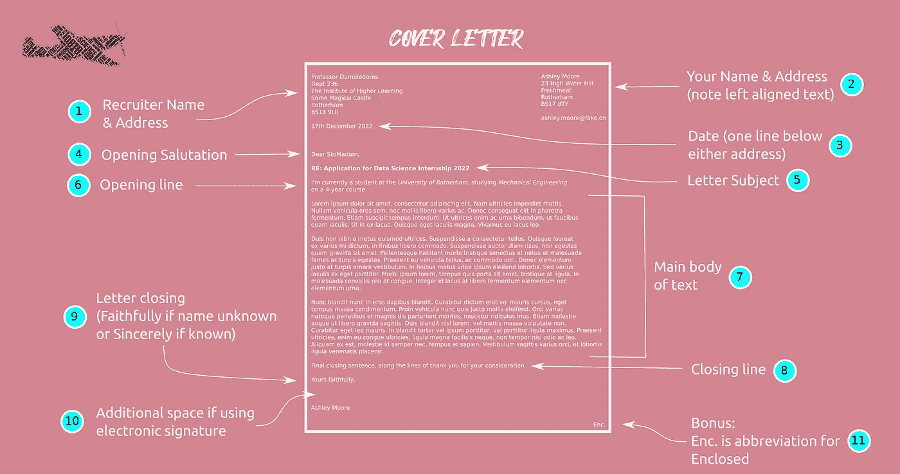
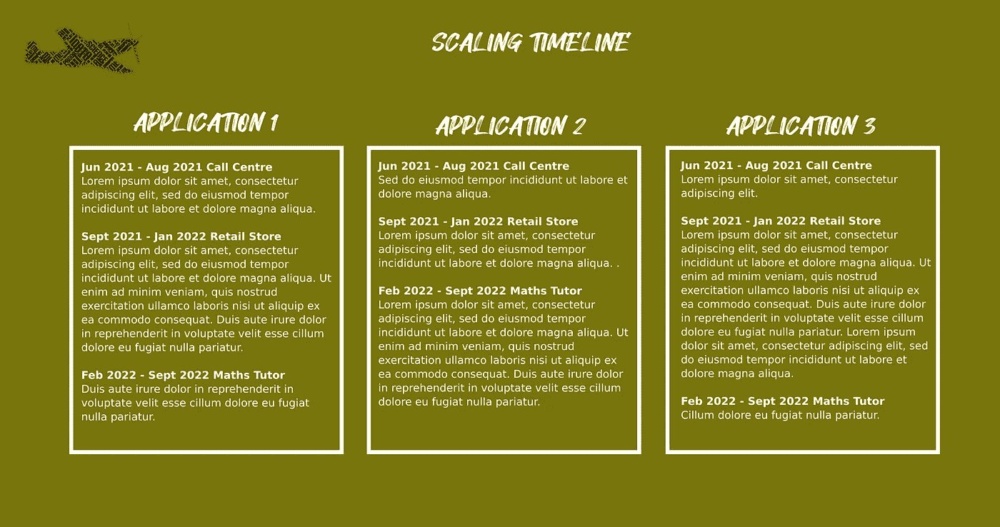
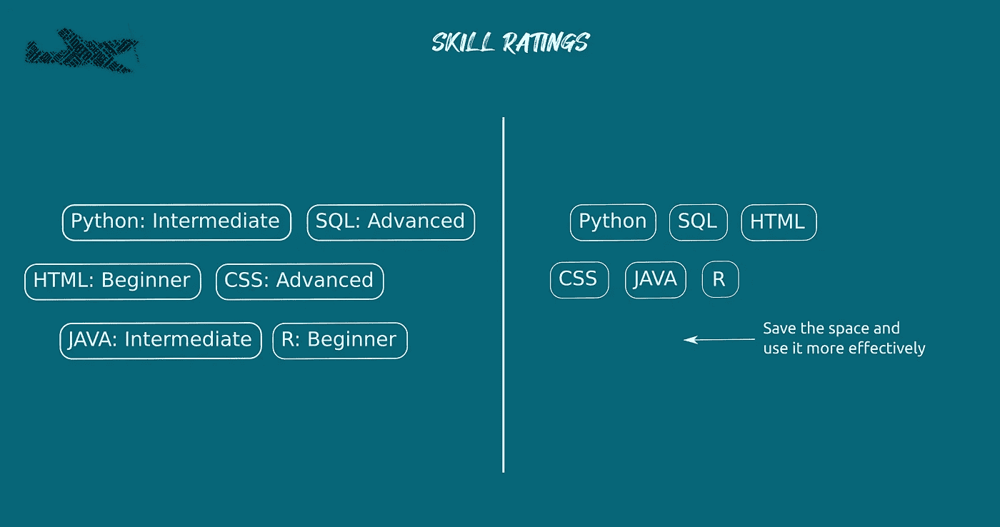
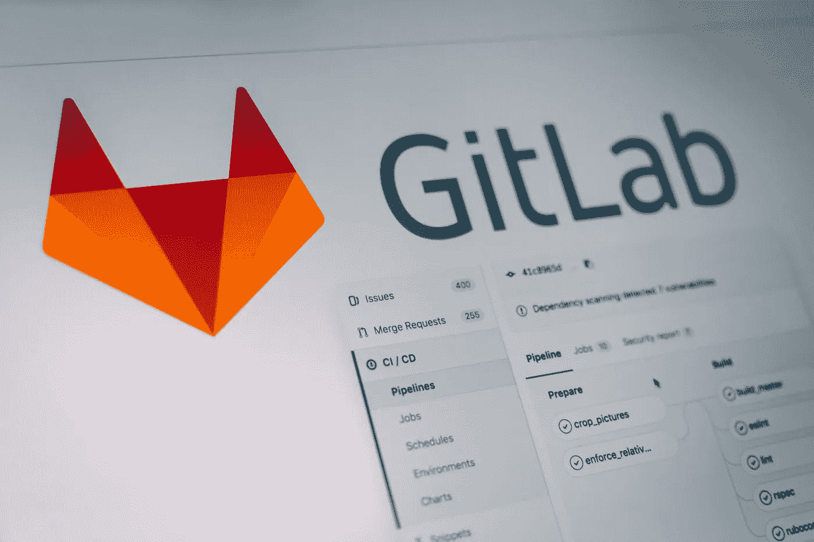

# 申请数据科学实习的顶级技巧

> 原文：<https://towardsdatascience.com/top-tips-for-applying-for-data-science-internships-8eb676a77e58?source=collection_archive---------28----------------------->

## 审查 100 多份实习生申请的经验教训

安妮·斯普拉特在 [Unsplash](https://unsplash.com/?utm_source=unsplash&utm_medium=referral&utm_content=creditCopyText) 上的照片

# 范围

从 100 多份数据科学实习生申请中总结经验教训，其中大多数候选人都没有被选中参加面试。这篇文章的重点是什么和如何沟通，而不是获得什么技术技能。

# 内容

*   介绍
*   阅读实习生广告的重要性
*   附信
*   简历/履历
*   人的能力发展
*   摘要

数据科学指南作者[阿什拉夫·米亚](https://medium.com/u/2f820034da8c?source=post_page-----8eb676a77e58--------------------------------) |图片作者

# 介绍

本指南包含关于申请流程的建议，即提交申请、求职信和/或*简历* (CV)/ *简历*用于*数据科学*实习。它是基于 100 多份申请，从超过 92%的没有得到面试机会的申请人和 97%的没有得到职位的申请人身上吸取了经验教训。

虽然有一些关于如何申请科技公司或初创公司的数据科学实习的文章，但它们并没有解决一些更“传统”业务的具体问题，因为数据科学职位向人力资源【人力资源】*财务*甚至制造*公司的专门部门开放。*

鉴于*数据科学*的准入门槛较低，大多数申请人很难评估他们的能力及其适合性，因为他们未能**有效沟通**或未能展示他们对自我发展的承诺。

我们还需要考虑到文化和国家的差异。例如，在英国，我们传统上没有*简历*，而是有 CVs ( *简历*)，这在拉丁语中是“人生历程”的意思；这些差异在本网站中进行了说明:

 [## 简历与履历:有什么区别？

### 简历(CV)在拉丁语中是“生命历程”的意思相比之下，resume 是法语中“总结”的意思简历和履历表…

icc.ucdavis.edu](https://icc.ucdavis.edu/materials/resume/resumecv) 

对于自荐信的长度(1 页、2 页或更多页)以及需求和目的也有不同的期望。

这些建议是基于提交简历和写求职信的，这与典型的申请表格中要求的内容相同，因此适用于大多数情况。

# 读，读，读！

…职位安排/实习细节！大量的努力都花在了撰写植入广告上，包括技术技能类型、个人技能和任何预期的经验。申请流程通常是一份电子表格、一份简历或一份*附函*和简历的组合。大多数招聘人员会很乐意回答任何问题，而不是猜测是否有页数限制，所以不要害怕直接问他们。

# 附信

由[凯特·马凯特](https://unsplash.com/@katemacate?utm_source=unsplash&utm_medium=referral&utm_content=creditCopyText)在 [Unsplash](https://unsplash.com/s/photos/letter?utm_source=unsplash&utm_medium=referral&utm_content=creditCopyText) 上拍摄的照片

## 什么是求职信？

一封*求职信*的主要目的是陈述**为什么**你适合这个角色，应该用来让招聘人员容易理解你申请的关键要素，以及**你**如何满足招聘广告中规定的要求。它还应包括以下细节:

*   您的姓名和联系方式(地址、电话和电子邮件)
*   通信日期
*   你申请的职位
*   个性化内容(见下文)

包括这些细节的主要原因是接收申请(如人力资源)和管理行政的人不太可能是评估申请的人。因此，我们需要使应用程序在组织中运行时尽可能地不受人为错误的影响。

你的联系方式是必需的，因为一旦你的简历被放到公司的共享硬盘上，你就很容易把信放错位置，自然你希望招聘人员联系你。同样，雇主可能有多个职位需要填补，这样可以帮助他们对你的申请进行分类。

## 信函结构和格式

虽然信的内容很重要，但这种格式是一种简单的方法，可以展示你在简历中提到的那些先进的“办公室技能”，从而给未来的雇主留下深刻印象😏)并有助于展示你的专业沟通技巧。请记住，对于大多数公司来说，*数据科学家*被期望与业务的其余部分进行有效的沟通，他们不太可能说 *Slack* (或者你选择的基于聊天的沟通)。事实上，那些未能恰当地格式化文档，却自称是高级“办公软件”用户的人，很可能会遭受信誉打击。

格式化一封信要传达很多信息，然而，80-90%的申请人**没能通过**让未来的雇主更容易，因为格式不合适，所以这是你的申请脱颖而出的一个简单方法。

以下示例针对英国，但显示了主要元素:

求职信的结构和格式由 [Ashraf Miah](https://medium.com/u/2f820034da8c?source=post_page-----8eb676a77e58--------------------------------) |图片由作者提供

上图展示了构成*求职信*的 11 个关键要素:

1.  左手边应该以招聘人员的名字(如果知道的话)和该组织的完整地址开始。
2.  右侧应包含您的全名、地址和首选联系方式(如电话和/或电子邮件地址)；后者，如果你通过电子邮件发送你的申请。注意文本是左对齐的——这可以在任何使用带有不可见边框的表格的文字处理软件中实现(或 [python-docx](https://python-docx.readthedocs.io/en/latest/) 😃).
3.  信的日期应该在两个地址(你的或公司的)之下一行。这三项在很大程度上是国家特有的，所以值得找出你申请的地方的标准。
4.  开头的称呼或问候应该基于你是否知道招聘者的名字。“亲爱的先生/女士”有点老套但被接受，但根据行业不同有时“亲爱的招聘团队”也是被接受的。请注意，第 9 项取决于您在此处陈述的内容。
5.  主题行应该是粗体和/或下划线的组合，其功能与电子邮件的主题行相同。在这种情况下，它应该清楚地说明你申请的是一个*数据科学*实习生职位。
6.  开头一行是简单的一句话，简洁地抓住了信的意图。对于大多数申请大学的实习生来说，类似于“我目前正在罗瑟勒姆大学攻读四年制机械工程硕士学位”。
7.  正文的内容将在下一节讨论。
8.  结束语是强调信函目的的一句话，在这种情况下，这是你希望招聘人员考虑的实习申请。
9.  在信的结尾，如果信不是写给某个特定的名字，通常用“你忠实的”,如果是写给某个特定的名字，则用“你真诚的”。同样，这是特定于国家和行业的。
10.  对于电子邮件提交或电子申请，不需要添加扫描签名，但有些人会这样做。
11.  由于*附信*伴随着简历或履历表，通常的做法是通过放置“Enc”来提醒读者有相当于附件或*的附信*在页脚。

这些项目适用于大多数角色，而不仅仅是那些在*数据科学*的角色。对于每一个项目，它不仅是一个交流内容(这一点很重要)的机会，也是一个展示办公软件技能的机会，一个了解专业环境中所期望的能力的机会，同时也传达了一定程度的尊重，即你遵守了既定的协议。

## 求职信内容

如果实习或安置广告是考题，那么*求职信*就是你的答案。这是一个挑战，如何做到简洁，同时传达出你的申请中最积极的方面。内容(比如简历)应该根据每个未来雇主和角色进行调整。当然，对于大多数英国申请来说，一页纸(A4 或美国信纸大小)就足够了。如果你选择写得更多，那么你需要确保增加的长度对你的应用程序有不成比例的影响。我当然会建议坚持使用一页纸。

简历和*附信*应被同时考虑，以尽量减少重复内容。简历将规定某些事实，但受到结构的限制，其中一些事实必须在*求职信*中重复，但总的来说，有更多的自由来说明你的情况。

对于您需要提供的内容，没有通用答案；你必须看看广告，并尝试解决具体问题。概括地说，它应该传达三件事:

1.  你对这个角色的热情
2.  你的经验、技能和其他适合该职位的衡量标准
3.  你以人为本的关键技能

当然，你应该突出你申请中的积极因素(“推销自己”)，但这并不意味着捏造事实或不诚实。对于招聘人员来说，最糟糕的事情莫过于邀请一个人去面试，却发现申请的很多内容都被夸大了。例如，假设你在团队中工作得不好，然后指出你有上进心，可以独自有效地工作——这突出了你申请的积极方面。

通过`git`库(例如 *Github* )或类似 *Kaggle* 的东西引用在线*数据科学*简介的趋势也在增长。这既有积极的影响，也有消极的影响。如果您选择共享您的个人资料，请确保有一些最近的内容。我去过很多 GitHub 的简介，要么没有数据科学的内容，要么不容易理解，要么已经超过六个月没有更新了。这些会对您的应用程序产生负面影响。

同样，一个维护良好、易于遵循的存储库或配置文件，加上代码和良好的注释，可以对您的应用程序产生非常好的影响。与*求职信*、*在线简介*和*简历*的心态是一样的:你必须充分利用你申请的每一厘米/像素/英寸！

## 基础知识

很难低估在提交之前没有经过拼写检查、校对或其他检查的申请数量。如果有人说他们擅长注意细节，然后犯了简单的拼写或语法错误，这可能会有很大的破坏性。

这同样适用于“狂野”字体选择或非常小的字体大小；大多数教育机构通常会为报告或论文写作设定一个基本标准，这个标准在这里同样适用，或者使用*谷歌*进行明智的选择。

## 求职信反馈

在这篇文章的开头，我总结了从大量申请人身上学到的经验教训，这些人在申请过程中没有获得面试机会(> 92%)。总的来说，这些申请人无法交流为什么他们的候选资格值得邀请他们参加面试。

很少有信件的格式恰当，因此易于阅读。绝大多数人将简历中的内容复制到求职信中，而没有将其放入该职位的背景中。或者换句话说，这封信不是专门针对这种应用的。一些候选人充满了令人不快的奉承(“你是世界上最好的公司”)，一些人努力突出他们申请中的任何积极因素，一些人不幸误解了公司的工作。

成功的候选人(总体而言)遵循了上述提示。

# 简历/履历

安妮·斯普拉特在 [Unsplash](https://unsplash.com/s/photos/documents?utm_source=unsplash&utm_medium=referral&utm_content=creditCopyText) 上拍摄的照片

## 什么是简历？

术语*简历*，在拉丁语中的意思是“生命的历程”，根据地理位置的不同有不同的含义。在美国，它有一个与*简历*不同的特殊结构。在英国，除了学术角色和申请之外，简历和简历的目的和内容非常相似。所以如果你在网上看这些差异，请记住这一点。

出于我们的目的，简历包含个人的一些事实，如姓名、联系方式、简要教育背景、工作经历、兴趣、爱好和推荐人(尽管现在经常根据要求提供)。虽然结构是固定的，但是内容的级别可以并且应该根据应用程序而变化。

以下建议是基于许多不成功的实习申请，并被总结为一系列该做和不该做的事情。

## 提供完整的时间表

许多候选人在简历中省略了某些时间段，要么是因为他们在做他们认为不相关的工作，要么是为了掩盖全职工作。后者是由于一些申请实习的候选人已经完成了学业。

你可能会认为空白让你看起来很神秘，但招聘人员可以很容易地想象你在监狱里！更好的方法是提供完整的时间表，但根据角色调整内容。

通过 [Ashraf Miah](https://medium.com/u/2f820034da8c?source=post_page-----8eb676a77e58--------------------------------) 缩放给定应用的 CV 内容|图片由作者提供

上图显示提供了一个完整的时间表，但是针对正在制作的角色或应用程序对内容进行了调整或缩放。应该可以从每个角色中突出或提取一些东西，例如关于*健康和安全*或处理财务或与不同客户交谈的经验。不一定都是关于 *Python* 或者 *R* 的。

## 避免技能评级

避免自我评价|作者图片

技能丸是展示编程知识的一种流行趋势，但是*初级* / *中级* / *高级*之类的自我评分并不能增加多少价值。我有超过 10 年的统计绘图经验，并且有将近一半的时间是使用`seaborn`的，我不认为自己是这个库的一个“*高级*”用户。这样的评级对不同的人有不同的意义。不如把空间省下来，更有效地用在别的地方。

## 避免不完整的课程

图片由来自[皮克斯拜](https://pixabay.com/?utm_source=link-attribution&utm_medium=referral&utm_campaign=image&utm_content=3087585)的[扬·瓦塞克](https://pixabay.com/users/jeshoots-com-264599/?utm_source=link-attribution&utm_medium=referral&utm_campaign=image&utm_content=3087585)拍摄

另一个趋势是宣传哪些*额外的*课程目前正在*进行*通常在 *Python* 、 *R、数据科学*和/或*机器学习。*虽然一方面很高兴看到这种主动性，但另一方面也有一种趋势，即课程没有完成，或者引用他们从课程中学到的东西或他们如何应用这些东西。这通常会在面试中暴露出来；请记住，你在简历中陈述的一切都可以构成一个问题的基础，因此需要得到证实，否则，它将影响你的可信度。

## 提供实际学习的证据

迈克尔·里维拉·🇵🇭在 [Unsplash](https://unsplash.com/s/photos/pokemon?utm_source=unsplash&utm_medium=referral&utm_content=creditCopyText) 上拍摄的照片

完成一门关于*机器学习*的课程和理解*机器学习*是不一样的，所有课程都是如此。可悲的是，许多大学生仍然没有意识到这个事实。

更好的测试是当候选人将他们的知识应用到最初课程没有涉及的领域。这可能是使用来自 *Kaggle* 的替代数据集，如 [*口袋妖怪数据集*](https://www.kaggle.com/rounakbanik/pokemon) 或在他们感兴趣的领域应用相同的技术。这显示了主动性、兴趣和热情。

如果你能举出的所有例子都是大学或教育机构课程的一部分，那么你不太可能与其他候选人竞争。

## 展示计算技能

图片来自 [Pixabay](https://pixabay.com/?utm_source=link-attribution&utm_medium=referral&utm_campaign=image&utm_content=4980917) 的 [planet_fox](https://pixabay.com/users/planet_fox-4691618/?utm_source=link-attribution&utm_medium=referral&utm_campaign=image&utm_content=4980917)

许多候选人对他们的数据科学技能没有激发太多的信心，因为很明显他们缺乏基本的计算机知识。这可以通过了解一些相关技术来解决，例如基本网络、web 技术等等。这可以简单到使用一个*虚拟机*或者安装一个技术栈。相比之下，拥有和管理*物联网*(物联网)类型设备，如 *Raspberry Pis* 的候选人表现出很高的可信度，因为他们知道收集、存储和传输数据需要什么。

许多候选人不确定他们能否在自己的笔记本电脑上安装数据科学环境🙈。这并没有激发他们对整体技能的信心。

## 只分享在线档案，如果它增加了价值

[Pankaj Patel](https://unsplash.com/@pankajpatel?utm_source=unsplash&utm_medium=referral&utm_content=creditCopyText) 在 [Unsplash](https://unsplash.com/s/photos/github?utm_source=unsplash&utm_medium=referral&utm_content=creditCopyText) 上拍摄的照片

共享 *GitHub* 个人资料是很常见的做法，我的意思是公共库几乎是一种身份的象征。许多是作为大学课程的一部分创建的，因此在 CVs 上共享。如前所述，如果你选择分享在线个人资料，那么它必须通过突出你的技能，展示良好的实践和/或课外活动来增加价值。

如果概要文件是空的、过时的、损坏的、混乱的或者展示了坏习惯，那么它将损害你的应用程序。

## 个人生产力

照片由 [sporlab](https://unsplash.com/@sporlab?utm_source=unsplash&utm_medium=referral&utm_content=creditCopyText) 在 [Unsplash](https://unsplash.com/s/photos/running?utm_source=unsplash&utm_medium=referral&utm_content=creditCopyText) 上拍摄

许多简历列出了爱好和兴趣，但没有规定候选人如何保持个人生产力或照顾他们的心理健康。专业人士的一个标志或特征是，他们通过定期休息来管理时间，以保持个人生产力和/或通过锻炼(如散步、跑步或体育运动)来保持健康和精神健康。骄傲地宣称自己有能力连续坐在电脑前 10 个小时，表明自己不够成熟。

由于疫情仍然影响着世界各地的许多公司，大多数简历都没有提到候选人如何应对远程学习。在讨论大学课程或以前的就业时，这些方面很容易交织在一起。

## CV 反馈

关注了从未被邀请参加面试的候选人身上学到的经验教训后，积极的方面是什么？

绝大多数人拥有上面列出的大部分(但不是全部)要点。最佳应用展示了自我发展和将他们的知识应用于个人项目的例子。这些很容易阅读，理解和联系。

# 人的能力发展

其他学科如*航空*或*机械工程*需要获得专业知识和设施，这些只能在专业公司或大学获得。这些领域的“进入壁垒”很高，即花费大量资金在国内复制是不可能的。

*数据科学*另一方面可以接近免费或者至少*低成本*。例如，对于*空气动力学*来说，人们需要查阅专业教科书，但是对于最新的发现，付费订阅科学期刊服务每年可能要花费 2000-4000 英镑。相比之下，许多关于[数据操作](https://github.com/wesm/pydata-book)和[机器学习](https://github.com/amueller/introduction_to_ml_with_python)的关键教科书都是免费的 *Jupyter 笔记本*。网上有很多关于 Python 和 R 语言的资源。关于*机器学习*的大部分(如果不是全部)关键论文也可以通过 [arxiv](https://arxiv.org/) 免费下载。

与其他领域不同，用于数据科学的大多数工具都是免费的，而且大部分都是开源的。鉴于入学门槛较低，人们的期望是，候选人将花一些自己的时间，用自己的学习来补充大学课程。这种自我发展和学以致用的愿望可能是数据科学实习生追求的最重要的品质。

# 摘要

从超过 100 份数据科学领域的实习生申请中获得的经验已经被提炼为他们的核心元素。虽然不是每个人都会结合使用*求职信*和 CV/简历，但是关键的原则已经被强调出来，即使一个人如何格式化一封信也可能传达关于候选人的有用信息。

如果你有任何进一步的建议，甚至对比经验，那么请在评论中分享。

## 属性

所有`gists`、笔记本、终端演员表均为作者所有。所有的艺术作品都明确基于 [CC0、公共领域](https://creativecommons.org/share-your-work/public-domain/cc0/)许可或 [SIL OFL](https://scripts.sil.org/cms/scripts/page.php?item_id=OFL_web) 的资产，因此不侵权。主题灵感来自并基于我最喜欢的`vim`主题:[grubbox](https://github.com/morhetz/gruvbox)。