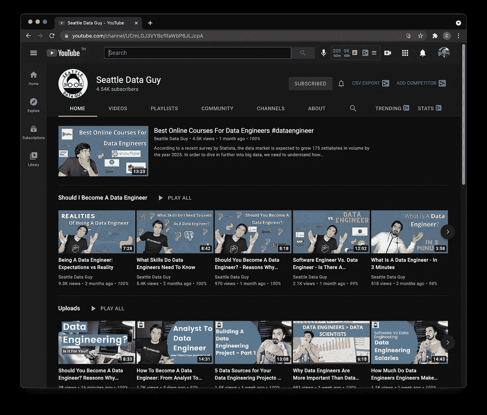

# 数据面试准备的热门 YouTube 渠道

> 原文：<https://towardsdatascience.com/top-youtube-channels-for-data-interview-prep-b9485f297f30?source=collection_archive---------28----------------------->

由 [envato elements](https://1.envato.market/c/2346717/628379/4662) 的 [alexacrib](https://elements.envato.com/user/alexacrib) 使用图像创建(经许可)。

## 学习资源

## 获得数据科学家、数据分析师或数据工程师的工作

无论是作为数据科学家、数据分析师还是数据工程师，你都在为数据面试做准备吗？YouTube 是一个很好的起点，因为它有大量免费的教育内容可以帮助你踏上数据之旅。伴随着巨大的丰富，也带来了从成百上千的渠道中选择渠道的巨大负担。我已经探索了整个 YouTube 空间，并整理了一个顶级 YouTube 频道列表，我认为这些频道是你在准备成为数据专业人员时可以考虑的很好的起点。

尽管本文中提到的大多数 YouTube 内容创作者都是我的朋友，但他们在 YouTube 领域非常出名，因为他们通过提供职业建议和数据面试准备方面的信息内容为观众带来了价值，这是本文的重点。

# 肯·吉

Ken Jee 目前是 Scouts Consulting Group 的数据科学主管，他将数据科学应用于体育分析。他还是惠普和英伟达的数据科学大使。他拥有从初创公司到财富 100 强企业的数据科学工作经验。Ken 在他的 YouTube 频道上分享了他的经验，以帮助其他人进入数据科学和体育分析领域。值得注意的是，Ken 启动了 66 天数据计划，该计划有助于养成学习数据科学的习惯，同时也促进了一致性和问责制的发展。

## YouTube 频道

*   主频道([肯吉](https://www.youtube.com/channel/UCiT9RITQ9PW6BhXK0y2jaeg)):[https://www.youtube.com/channel/UCiT9RITQ9PW6BhXK0y2jaeg](https://www.youtube.com/channel/UCiT9RITQ9PW6BhXK0y2jaeg)
*   第二频道([肯最近的邻居](https://www.youtube.com/channel/UCpEJMMRoTIHJ8vG8q_EwqCg)):
    [https://www.youtube.com/channel/UCpEJMMRoTIHJ8vG8q_EwqCg](https://www.youtube.com/channel/UCpEJMMRoTIHJ8vG8q_EwqCg)

## 播放列表

*   [面试](https://www.youtube.com/watch?v=tnpV1etgcxs&list=PL2zq7klxX5ATSm5sTdY4JrDSzp72V5-hV)
*   [数据科学简历综述](https://www.youtube.com/watch?v=Ft4GVkQQtgk&list=PL2zq7klxX5AQU-VdQ2_EM4E3VY5KDs7M8)
*   [构建数据科学组合](https://www.youtube.com/watch?v=1aXk2RViq3c&list=PL2zq7klxX5AQ3Dkl7113VO9t1rm3e4FLA)

# 克里斯·纳伊克

Krish 是首席数据科学家，也是 iNeuron 的联合创始人。他在机器学习、深度学习和数据科学的各个方面都有丰富的知识，是一位多产的教育家，在 YouTube 上创建了 1000 多个教育视频。除了下面提到的与数据面试准备相关的播放列表之外，Krish 还创建了一个其他视频播放列表的大集合，这些视频教授与数据科学和数据工程相关的各种尖端工具和软件。

## YouTube 频道

*   https://www.youtube.com/user/krishnaik06/

## 播放列表

*   [最佳数据科学面试问题](https://www.youtube.com/watch?v=0djtjjy12fI&list=PLZoTAELRMXVNQszMgcC_0VwIZ8ATa-lPy)
*   [数据科学面试问题](https://www.youtube.com/watch?v=KlJe9h438_w&list=PLZoTAELRMXVPkl7oRvzyNnyj1HS4wt2K-)
*   [现场虚拟模拟面试环节](https://www.youtube.com/watch?v=sjq1OhMzSSU&list=PLZoTAELRMXVOPCn3cd7Czzytk9N3CbyIl)
*   [机器学习面试问题](https://www.youtube.com/watch?v=mlumJPFvooQ&list=PLZoTAELRMXVM0zN0cgJrfT6TK2ypCpQdY)
*   [现场虚拟面试](https://www.youtube.com/watch?v=FGjYeKSfLr4&list=PLZoTAELRMXVN4ypDZ4Qd0nfWR_I7xl368)
*   [成功转型故事](https://www.youtube.com/watch?v=eGltLHfGszU&list=PLZoTAELRMXVO5zRjBApoMgM5rc5KEzjJX)

# 代码基础

codebasics YouTube 频道是由曾在英伟达和彭博工作过的软件工程师达瓦尔·帕特尔创办的。Dhaval 非常热衷于教学，这可以从他广泛收集的各种主题的教程中看出，如编程、数据科学、数据分析人工智能、机器学习等。

## YouTube 频道

*   [https://www.youtube.com/channel/UCh9nVJoWXmFb7sLApWGcLPQ](https://www.youtube.com/channel/UCh9nVJoWXmFb7sLApWGcLPQ)

## 播放列表

*   [职业指导](https://www.youtube.com/watch?v=-JhV-FRQwQQ&list=PLeo1K3hjS3uvxzKyaUqdkYgUKU0Nnffso)
*   [面试技巧和准备](https://www.youtube.com/watch?v=K_oJLQx2ySY&list=PLeo1K3hjS3utOmKEwVWC1paw1hP0oMAEP)
*   [与数据分析师的对话](https://www.youtube.com/watch?v=34-RThWWRHM&list=PLeo1K3hjS3uuyEyWt297a27KdEz6s6ABu)
*   [与数据科学家的对话](https://www.youtube.com/watch?v=Wv5uQKDNOmM&list=PLeo1K3hjS3utJq1Apv0T4jJgDeD3mWqNE)

# 黄婷婷

Tina 目前在一家 FANG 公司工作，担任数据科学家。她的本科培训是药理学，她向数据科学的过渡始于她在宾夕法尼亚大学获得的计算机和信息技术硕士学位。在她的 YouTube 频道上，她提供 SQL 教程视频、职业建议以及关于如何进入数据科学以及如何编码的实用建议。她还有一个现场的“跟我学”环节，在课间休息时，她会学习并主持一个问答环节。

## YouTube 频道

*   【https://www.youtube.com/channel/UC2UXDak6o7rBm23k3Vv5dww 

## 播放列表

*   [如何获得你的第一份数据科学工作](https://www.youtube.com/watch?v=2goqyY5XBeI&list=PLVD3APpfd1tt1XPlGIwKr3apHsFc8yPOq)
*   [职业](https://www.youtube.com/watch?v=AID4juOgYpk&list=PLVD3APpfd1tv7CVfiv1NYdrlhXd5SU0wv)

# 分析师亚历克斯

亚历克斯·弗雷伯格是一名数据分析师，他在 YouTube 频道上分享了他的经验，以帮助新人获得成为数据分析师的知识和技能。他提供从初学者到中级和高级的所有难度级别的 SQL 教程。他还分享了准备简历的技巧，通过回答一些面试问题来帮助你准备面试，并主持问答环节来回答任何与进入数据分析领域有关的问题。

## YouTube 频道

*   [https://www.youtube.com/channel/UC7cs8q-gJRlGwj4A8OmCmXg](https://www.youtube.com/channel/UC7cs8q-gJRlGwj4A8OmCmXg)

## 播放列表

*   [数据分析师面试问题](https://www.youtube.com/watch?v=fweZQqB0nwQ&list=PLUaB-1hjhk8HT06GYlgmi494El50gzlYq)
*   [数据分析师简历](https://www.youtube.com/watch?v=4rfr6A3lO-Y&list=PLUaB-1hjhk8GcHqTCT3dNCa52xSDP_VEY)
*   [数据分析师 Q & A](https://www.youtube.com/watch?v=LJtFgnHGAos&list=PLUaB-1hjhk8FA2oZEtdceo-TfVMYvpdWP)
*   [分析师 Alex 展示](https://www.youtube.com/watch?v=-Inc1be4zSg&list=PLUaB-1hjhk8GmBL-AtxMST9PXEOX4LEK-) — Alex 对数据分析各种主题的观点和提示

# 数据科学杰伊

Jay Feng 在硅谷做了 5 年的数据科学家，然后开始了 Interview Query，帮助有抱负的数据科学家准备面试。他的频道谈论全栈数据科学、数据科学面试技巧以及如何获得梦想中的数据科学工作。他也是一位多产的媒体和采访查询博主(他写的一篇有趣的报告是[2021 年数据科学采访报告](https://blog.interviewquery.com/blog-data-science-interview-report/))。

## YouTube 频道

*   【https://www.youtube.com/channel/UCcQx1UnmorvmSEZef4X7-6g 

## 播放列表

*   [职业建议和忠告](https://www.youtube.com/watch?v=7v_Szio9r3E&list=PLXXms4piUg2jxWdFegSAaO25C00Zhyks3)
*   [数据科学面试指南](https://www.youtube.com/watch?v=sdBWA9MvgYI&list=PLXXms4piUg2iAUV3KNCbyFBjYHBeZPiZW)
*   [模拟面试](https://www.youtube.com/watch?v=12Ry6kGPQVs&list=PLXXms4piUg2gZXEEQRxXzkbPxVqLKsxaT)
*   [数据流播客](https://www.youtube.com/watch?v=fg6VT9CGT2E&list=PLXXms4piUg2jzMkLT-TOU96zCHZqBl2H-)

# 斯特拉斯克拉特的内特

Nate 在数据科学领域有 10 年的经验，他的频道面向有抱负的数据专业人士。在他的 YouTube 频道上，他涵盖了与招聘、面试准备、职业建议和技巧以及提升你的技术技能相关的话题。Nate 是 StrataScratch 平台的创始人，该平台有 500 多个来自真实公司的数据科学问题，用于编写面试准备或提升你的技术技能。

## YouTube 频道

*   [https://www.youtube.com/channel/UCW8Ews7tdKKkBT6GdtQaXvQ](https://www.youtube.com/channel/UCW8Ews7tdKKkBT6GdtQaXvQ)

## 播放列表

*   [用 SQL 解决数据科学面试问题](https://www.youtube.com/watch?v=2iE3JgNTwVU&list=PLv6MQO1Zzdmq5w4YkdkWyW8AaWatSQ0kX)
*   [数据科学面试技巧](https://www.youtube.com/watch?v=RgKMbpEylWA&list=PLv6MQO1ZzdmpDYL3eZRs0Z_PqqYGn2iGR)

# 如何获得一份分析工作

John David 是 YouTube 频道*How to Get a Analytics Job*的主持人，他提供 Tableau 和 Power BI 教程，并分享他的经验、面试技巧和讲座，以帮助指导你成为数据分析师。

## YouTube 频道

*   https://www.youtube.com/channel/UC7T_528unh2ZgnVcx1sl7oA

## 播放列表

*   [分析讲座](https://www.youtube.com/watch?v=Uuk-Tx7aDWw&list=PLBvzkZLydYX1egx34wNFUesAywZ9mjsqx)(面试技巧)
*   [分析职业战术周四](https://www.youtube.com/watch?v=kBmJJ-DTxmc&list=PLBvzkZLydYX0RY49VAVbDwEeqdF-dDoMW)
*   [如何获得分析工作播客](https://www.youtube.com/watch?v=3GK4O94Yg08&list=PLBvzkZLydYX0D28bbnfRCV6M4zMQrhXsd)

# 数据面试专家

Emma Ding 是 Airbnb 的数据科学家/数据工程师。在业余时间，她在 YouTube 上制作教育视频，并在 Medium 上写博客，帮助有抱负的数据专业人士获得他们梦想中的数据科学/数据工程工作。Emma 提供了大量的教育视频，涵盖了可以帮助破解数据科学采访的重要主题，这也是她 YouTube 频道上的播放列表。她很擅长将困难的话题分解成容易理解的部分。

## YouTube 频道

*   [https://www.youtube.com/channel/UCAWsBMQY4KSuOuGODki-l7A](https://www.youtube.com/channel/UCAWsBMQY4KSuOuGODki-l7A)

## 播放列表

*   [A/B 测试](https://www.youtube.com/watch?v=VuKIN9S8Ivs&list=PLY1Fi4XflWSvgsaD9eXng6N5kxcMtcxGK)
*   [机器学习](https://www.youtube.com/watch?v=P-mM9396Dn8&list=PLY1Fi4XflWSsLoOQr-Ee2R4qRFejtCFRh)
*   [与数据科学家的真实对话](https://www.youtube.com/watch?v=ltPGqjQ-Brc&list=PLY1Fi4XflWSt8XLi8pSFjXz4XYW2qdwMh)
*   [真实数据科学面试问答](https://www.youtube.com/watch?v=JCNsI0TtNGw&list=PLY1Fi4XflWSvtu963rZpfH6WeX54vSrDW)
*   [破解数据科学面试](https://www.youtube.com/watch?v=X8u6kr4fxXc&list=PLY1Fi4XflWStFs6tLQ3Gey2Aaq_U4-Xnc)
*   [如何获得自己的第一份数据科学工作？](https://www.youtube.com/watch?v=OD1Ajq3ULTk&list=PLY1Fi4XflWStBUbL_0ATpV03HSlK3yHa3)

# 西雅图数据公司的人

Benjamin 是一家 FANG 公司的数据工程师，因其 YouTube 频道和媒体博客“西雅图数据人”而闻名。在他的 YouTube 频道上，他收集了大量视频，分享了成为数据工程师的教育视频以及面试技巧和诀窍。他还策划了一个关于数据科学和数据工程面试技巧的视频播放列表。

## YouTube 频道

*   [https://www.youtube.com/c/SeattleDataGuy/](https://www.youtube.com/c/SeattleDataGuy/)

## 播放列表

*   [我应该成为一名数据工程师吗](https://www.youtube.com/watch?v=6RiA_Qur2yo&list=PLXRKPZRrlvE5DEOn2LsCMld8F0TsFc_Dh)
*   [数据科学与工程面试技巧](https://www.youtube.com/watch?v=4Z6lxfglvUU&list=PLXRKPZRrlvE6zMnEpuMjRhnhmz-4hbVRr)

# 霍马理工大学

张克帆·马(又名霍马理工大学)是一名杰出的优步用户，他曾是一名数据科学家，后来转型为软件工程师。霍马有讲故事的天赋，从他的视频中可以看出，他既能以娱乐的方式提供教育内容。他的 8 个视频播放列表(下面提供了链接)包括关于什么是数据科学的介绍性视频、数据科学面试问题的类型、获得数据科学工作的提示、生活中的一天是什么样子，以及关于数据科学和数据工程的比较视频。

## YouTube 频道

*   [https://www.youtube.com/channel/UCV0qA-eDDICsRR9rPcnG7tw](https://www.youtube.com/channel/UCV0qA-eDDICsRR9rPcnG7tw)

## 播放列表

*   [数据科学分析视频](https://www.youtube.com/watch?v=xC-c7E5PK0Y&list=PL0BAwa0pBqg6dr_DfCL3DmeSLtFoAq7UR)

# 数据教授

好吧，一个不要脸的塞我自己的内容。我白天是生物信息学副教授，晚上是 YouTube 内容创建者和媒体博客作者，在那里我创建关于数据科学和生物信息学教程的教育内容。除此之外，我还回顾了数据工具和资源以及数据专业人士的播客，了解他们进入数据科学以及为数据科学职业生涯做准备的提示和技巧。近期内容包括如何使用 GitHub 页面免费创建数据科学作品集网站。

## YouTube 频道

*   主频道([数据教授](https://youtube.com/dataprofessor)):https://youtube.com/dataprofessor
*   第二频道([编码教授](https://youtube.com/codingprofessor)):[https://youtube.com/codingprofessor](https://youtube.com/dataprofessor)

## 播放列表

*   [数据科学工具箱](https://www.youtube.com/watch?v=vCBeGLpvoYM&list=PLtqF5YXg7GLkskjS9D2PSIwKV6HUuWkXo)
*   [数据科学播客](https://www.youtube.com/watch?v=4qZINLzwYyk&list=PLtqF5YXg7GLl4ZHzda2PKFTwECmMC6ndo)
*   [数据科学实习](https://www.youtube.com/watch?v=kzooaiCsz5k&list=PLtqF5YXg7GLlJjIM8EhbDhMHtSYcPnVvH)

# 结论

我希望这些精选的 YouTube 频道列表对你的数据面试准备有所帮助。有抱负的数据专业人士可以从浏览霍马理工大学关于面试问题类型的介绍视频开始。接下来，通过浏览涵盖数据科学面试主题的视频播放列表，继续学习基础知识(查看来自 StrataScratch 的 Data Interview Pro、Data Science Jay 和 Nate 的播放列表)。然后，还建议进行一些模拟面试(如数据科学杰伊和克里斯·纳伊克),以掌握实际面试中的情况。祝您的数据之旅好运！

## ✉️ [订阅我的邮件列表，获取我在数据科学方面的最佳更新(偶尔还有免费赠品)!](http://newsletter.dataprofessor.org/)

# 关于我

我是泰国一所研究型大学的生物信息学副教授和数据挖掘和生物医学信息学负责人。在我下班后的时间里，我是一名 YouTuber(又名[数据教授](http://bit.ly/dataprofessor/))制作关于数据科学的在线视频。在我做的所有教程视频里，我也分享 GitHub 上的 Jupyter 笔记本([数据教授 GitHub page](https://github.com/dataprofessor/) )。

<https://www.youtube.com/dataprofessor>  

# 在社交网络上与我联系

YouTube:[【http://YouTube . com/data proper/](http://youtube.com/dataprofessor/)
网站:[【http://data proper . org/](https://www.youtube.com/redirect?redir_token=w4MajL6v6Oi_kOAZNbMprRRJrvJ8MTU5MjI5NjQzN0AxNTkyMjEwMDM3&q=http%3A%2F%2Fdataprofessor.org%2F&event=video_description&v=ZZ4B0QUHuNc)【正在建设】
LinkedIn:[【https://www . LinkedIn . com/company/data proper/](https://www.linkedin.com/company/dataprofessor/)