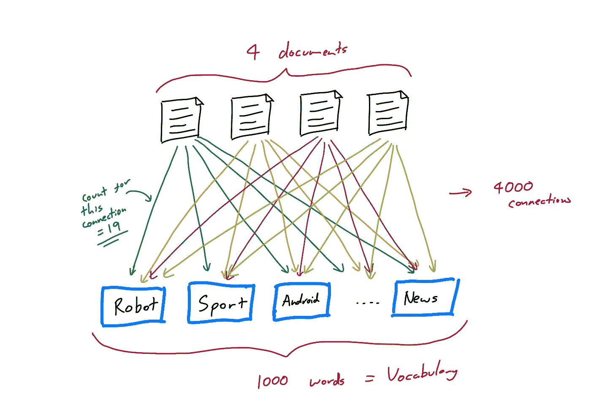
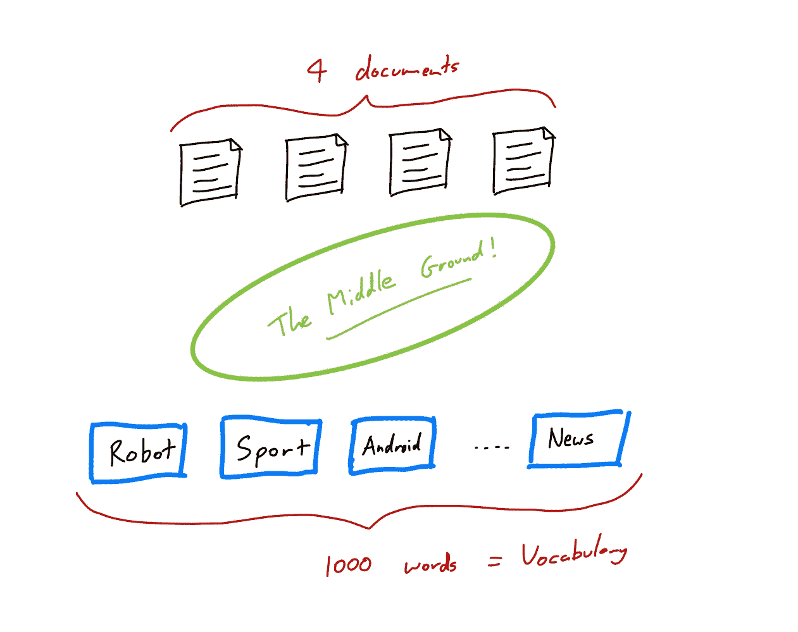
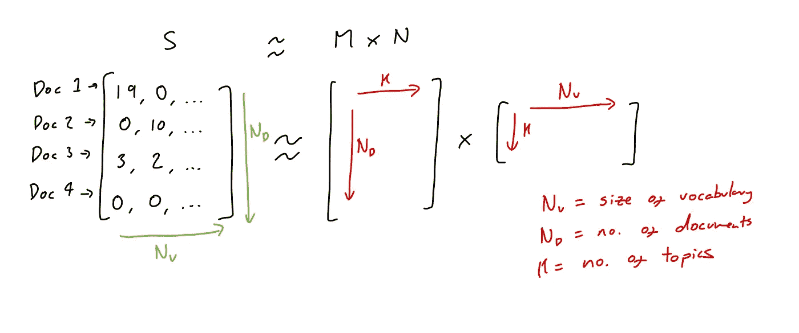
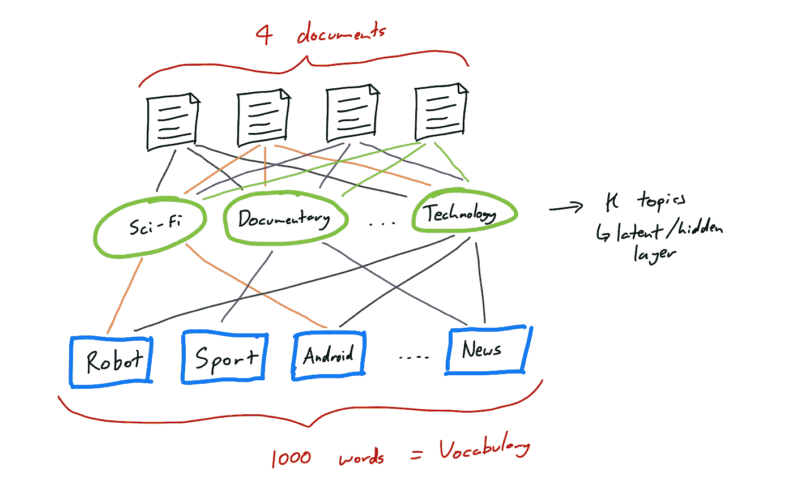
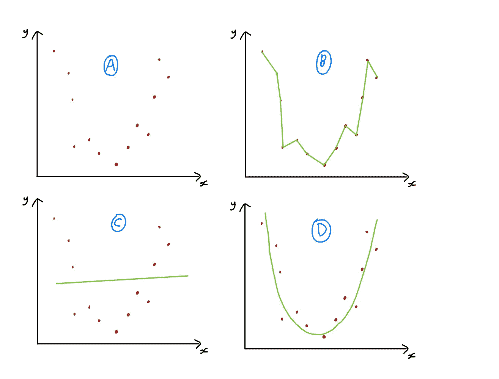

# 基于主题模型的推荐系统

> 原文：<https://towardsdatascience.com/topic-model-based-recommendation-systems-a02d198408b7?source=collection_archive---------12----------------------->

约书亚·阿拉贡在 [Unsplash](https://unsplash.com?utm_source=medium&utm_medium=referral) 上拍摄的照片

## 对基于主题模型的推荐系统中涉及的直觉(和非常低级的数学)的一个非常快速和(希望)容易跟随的介绍。

*看看我的* [*GitHub*](https://github.com/jamie-mcg/recipe-recommender) *基于主题建模的简单推荐系统。*

在当今世界，有时我们会被永无止境的决策所困扰。无论是周五晚上的电影还是让人们在 NYE 派对上继续跳舞的下一首歌。

那么推荐系统实际上是如何工作的呢？在这篇文章中，我将解释一种使用潜在狄利克雷分配(LDA)的基于主题建模的方法。

## 主题建模

在我们讨论如何为主题建模之前，我们需要首先了解主题实际上是什么。

由[大卫·普帕扎](https://unsplash.com/@dav420?utm_source=medium&utm_medium=referral)在 [Unsplash](https://unsplash.com?utm_source=medium&utm_medium=referral) 上拍摄的照片

这不是一个直观的想法，所以我们将根据单词集合来描述它。

如果我们有一个从数据库中随机选择的文档集合，我们可以想象这些文档中包含的一些单词可能在语义上相似，或者与相同的区域相关。

例如，如果这些文档是电影评论的集合。我们可以想象，我们也许能够根据评论中包含的单词来形成正面和负面的评论组。或者，我们可能希望形成与科幻、喜剧、爱情等相关的文档集合。

因此，当我们开始将这个文档集合重新组织成许多更小的集合时。与此同时，我们开始看到有许多层的可能性。其中每种可能性都是一个主题选择。

你可能会问这样一个问题，我们如何让计算机把这些文件组织成主题，我们如何知道它会选择什么主题？为了回答这个问题，我们要在稍微深一点的层次上思考…

## 不太普遍的想法

在这篇文章中，我将描述如何让计算机执行主题建模的一个选项。然而，在野外还有许多其他的算法、方法和方法论。

回到我们的文档集，坚持查看其中包含的单词的方法，我们可以建立一个包含数据库中所有独特单词的词汇表。

假设我们在 4 个文档中有 1000 个不同的唯一单词，我们希望根据每个文档中包含的单词来描述每个文档的特征(以及每个单词的数量)。

尼斯·姆舒蒂在 [Unsplash](https://unsplash.com?utm_source=medium&utm_medium=referral) 上的照片

所以现在我们可以想象，对于每个文档，我们有一个维数为 1000 的向量(每个唯一的单词有一个维数)。并且在每个向量中的每个位置，存在该位置对应的单词在文档中出现的次数的计数。

比如向量中的第一个位置对应的是词汇表中的第一个单词，我们会说是“机器人”。第一个文档是一个关于《终结者 23》的影评(或者我们现在的数字……)，所以“机器人”这个词被提到了 19 次。因此，在对应于第一个文档的向量的第一个位置，我们有(19，…)。

显示文档和词汇之间联系的图表。

第二个位置对应于单词“Sport ”,在终结者评论中被零次提及，给出了(19，0，…)等等…

第二个文档恰好是一部网球纪录片的评论，因此对于这个文档，我们有向量(0，10，…)，因为“机器人”被提到了 0 次。

## 话题太多？

是的，太多了。我同意，你的电脑也会同意。

显示传说中的“中间地带”的图表。

目前，我们已经为词汇表中的每个单词定义了一个“主题”。这显然是不理想的，也不会给我们提供许多明确分开的主题，供我们以后讨论。

下一步是找到一个中间地带，我们的每个评论都属于一个更广泛的主题，这个主题是由词汇表中的一些单词定义的。

## 潜在狄利克雷分配

我们现在希望通过在词汇表中的单个单词之间引入一个隐藏的主题层来减少来自每个文档的连接数量。

这正是我们要使用潜在狄利克雷分配(LDA)的目的。

LDA 要求我们定义所需数量的主题。这就是我们所说的超参数(在算法运行之前定义的参数)。

在现实世界中，我们可以想象扫描许多主题来寻找最佳结果(恰当地称为超参数扫描)。

假设我们正在寻找 10 个主题。这意味着我们希望在之前的连接之间添加一个包含 10 个节点的隐藏层。将文档和单词联系起来，记住我们的大向量(19，0，…)和(0，10，…)。

从数学上和计算上来说，这是我们非常希望的，因为我们可以用大小为 10 的新向量(或者您选择的任何主题)来替换这些描述每个文档的巨大向量。

为了描述 LDA 试图达到的目标，最简单的方法是看下面的矩阵公式…

LDA 试图实现的目标的矩阵公式。

所以在我们最初对文档的完美描述中，我们有矩阵 s。这个矩阵是我们能拥有的所有文档中最完整的图片。没有信息丢失，因为每个单词都有自己的主题，如果我们忽略单词的顺序，我们可以完美地重建每个文档。

但是，有些信息太细了。比如“机器人”和“安卓”，我们其实并不需要单独的话题。这些可以组合成一个更粗糙的“科幻”或任何你想命名的话题。

在这种情况下，我们可以看到我们牺牲了一些信息。因此，如果我们要重新创建文档，不能保证我们会得到单词“Robot ”,因为我们只有来自同一主题的类似单词被提及的信息。

图表显示了 LDA 的最终目标，单词连接到主题，主题再连接到文档。

这就是矩阵 M 和 N 正在做的。潜在维度 K 是我们隐藏的话题层(即 10 个话题)。并且给定这个维度 K，LDA 正在学习矩阵 M 和 N，试图最好地重建矩阵 s

你不一定要懂这里的数学才能知道发生了什么，要点是:

*   LDA 基于提供给它的文档创建粗粒度的主题。
*   由于 LDA 模型这样做，我们丢失了关于单个文档的特定信息。

如果你考虑如何将影评分成 10 个主题，这将有望开始变得有意义。想象一下，如果我让你总结一个你创造的话题。你不可能背出每个文档的每个单词，但是你可能能够给出几个描述整个主题的最常用的单词。因此，你丢失了信息。

## 我们为什么要丢失信息？

丢失信息听起来可能是一件坏事，但它实际上有助于机器学习模型在数据中找到他们否则会错过的模式。

诀窍是不要丢失有用的信息，在某些情况下，这些信息可以通过算法来学习，或者必须通过超参数来控制(对于具有主题数量的 LDA)。

让我们看一个例子…假设我们有一组嘈杂的数据点，粗略地描述了一个二次函数(图 A)。

丢失信息是件好事的例子。基本上是在不同的背景下过度适应和欠适应。

在图 B 中，我们试图保留描述数据点的所有信息，但是这样做对吗？大概不是，我们的模型太具体，没有真正抓住大势。

在 C 区，我们失去了太多的信息。这个模型对数据来说太简单了。

在图 D 中，我们对数据进行了很好的描述。我们找到了一个好的超参数，能够丢掉不太有用的信息，保留重要的部分。

这听起来可能很熟悉，因为它正是在 NLP 和主题建模的上下文中对欠拟合和过拟合数据的描述。

## 返回主题…

显示 LDA 最终目标的图表。

希望这短暂的插曲是有用的。如果没有，很抱歉，但我们现在又回到正轨了！

因此，我们有 LDA 模型，它将所有这些文档分类到主题分布中。请注意，这些不是硬集群主题，它们是分发版。因此，如果我们的 10 个主题中有 3 个是科幻、纪录片和技术，我们可以对一部关于宇航员的纪录片进行电影评论，其分布为(0.2，0.4，0.3，…)。

在上图中，这对应于文档和主题之间的顶层连接。

这些分布实际上被称为嵌入。因为我们已经将有关文档的信息嵌入到可用的数学格式中。

以我们之前的嵌入为例，a = (0.2，0.4，0.3，…)。现在，如果我们有另外两个嵌入了 b = (0.1，0.5，0.2，…)和 c = (0.8，0，0.1，…)的文档。是 b 还是 c 更类似于嵌入 a？

有几种方法可以回答这个问题，但是我们将选择简单的(并且非常有效的)余弦相似度。你可能还记得学校或大学的数学课。这基本上计算了两个嵌入之间的距离，如果它们离得更近，它们就更相似。

在这种情况下，a 和 b 比 a 和 c 更相似，所以如果我们问计算机，在给定 a 的情况下，它会推荐 b 和 c 中的哪一个。

这就是我们如何使用主题建模来创建推荐。

## 围捕

我们已经看了什么是主题，然后看了 LDA 算法给了我们什么，最后我们如何使用这些数学对象来产生推荐。

基于相似性的主题建模中推荐的关键点是我们评估每个文档的编码信息有多相似。正如我们所讨论的，这些建议可能完全糟糕，这取决于我们的主题是如何被发现和分布的(来自前面粗略解释的情节 B 或情节 C)。或者他们可能很棒，并击中了最佳点(情节 D)。

需要注意的另一点是，虽然我们可以控制主题的数量，但我们对这些主题的内容控制较少。这是由数据决定的，我们可以通过删除不重要的词来处理这些数据。但是，如果我们的数据库中没有科幻电影评论的代表性样本，那么这个话题就可能不存在。

数据是一切的另一个原因…

这是一个真正的短期和低层次的见解，如何这些类型的算法可以用来提供建议。有很多更广泛的描述，所以我鼓励你去阅读。

如果你感兴趣，我的 [GitHub](https://github.com/jamie-mcg/recipe-recommender) 上有一个工作推荐系统代码。

## 参考

[1]d .布莱等人。艾尔。，潜在的狄利克雷分配(2003)