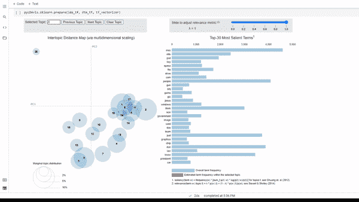
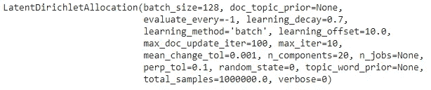
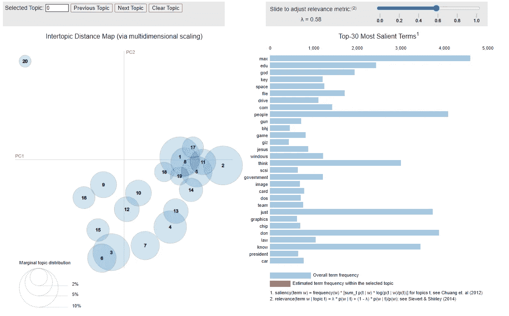

# 使用 pyLDAvis 的主题模型可视化

> 原文：<https://towardsdatascience.com/topic-model-visualization-using-pyldavis-fecd7c18fbf6?source=collection_archive---------7----------------------->

创建交互式主题模型可视化



来源:[作者](https://www.linkedin.com/in/himanshusharmads/)

主题建模是机器学习的一部分，其中自动模型分析文本数据，并从数据集或文档组合中创建词的聚类。它致力于找出文本中的主题，并找出与这些主题相关的单词之间的隐藏模式。

通过使用主题建模，我们可以创建相关文档的集群，例如，它可以在招聘行业中用于创建具有相似技能集的工作和求职者的集群。有几种方法可以从模型中获得主题，但在本文中，我们将讨论 LDA-潜在 Dirichlet 分配。

LDA 使用矩阵分解技术，它假设 a 是主题的混合，并回溯计算哪些主题创建了这些文档。重要的是，在这篇文章中，我们将创建可视化，我们可以分析由 LDA 创建的集群。

pyLDAvis 是一个开源 python 库，它帮助分析和创建由 LDA 创建的集群的高度交互式可视化。在本文中，我们将看到如何使用 LDA 和 pyLDAvis 来创建主题建模集群可视化。

让我们开始吧…

# 安装所需的库

本文将主要关注 pyLDAvis 的可视化，为了安装它，我们将使用 pip 安装，下面给出的命令将执行安装。

```
pip install pyldavis
```

# 导入所需的库

在本文中，我们将从使用来自 sklearn 的预定义数据集创建模型开始。为了完成所有这些步骤，我们需要导入所有需要的库。

```
from __future__ import print_function
import pyLDAvis
import pyLDAvis.sklearn
pyLDAvis.enable_notebook()from sklearn.datasets import fetch_20newsgroups
from sklearn.feature_extraction.text import CountVectorizer, TfidfVectorizer
from sklearn.decomposition import LatentDirichletAllocation
```

因为这篇文章的主要焦点是创建可视化，你可以[查看这个链接](https://scikit-learn.org/stable/modules/generated/sklearn.decomposition.LatentDirichletAllocation.html)来更好地理解如何创建主题模型。

# 加载数据集

现在，我们将加载已经导入的数据集。新闻组是一个文本数据集，因此它将对本文和理解使用 LDA 的集群结构有所帮助。

```
newsgroups = fetch_20newsgroups(remove=('headers', 'footers', 'quotes'))
docs_raw = newsgroups.data
print(len(docs_raw))
```

在这里，我们将看到数据集包含 11314 行数据。接下来，我们将应用计数矢量器、TFID 等。，并创建我们将可视化的模型。

# 预处理数据

```
tf_vectorizer = CountVectorizer(strip_accents = 'unicode',
                                stop_words = 'english',
                                lowercase = True,
                                token_pattern = r'\b[a-zA-Z]{3,}\b',
                                max_df = 0.5, 
                                min_df = 10)
dtm_tf = tf_vectorizer.fit_transform(docs_raw)tfidf_vectorizer = TfidfVectorizer(**tf_vectorizer.get_params())
dtm_tfidf = tfidf_vectorizer.fit_transform(docs_raw)
```

# 创建模型

在这一步中，我们将创建当前数据集的主题模型，以便我们可以使用 pyLDAvis 对其进行可视化。

```
# for TF DTM
lda_tf = LatentDirichletAllocation(n_components=20, random_state=0)
lda_tf.fit(dtm_tf)
# for TFIDF DTM
lda_tfidf = LatentDirichletAllocation(n_components=20, random_state=0)
lda_tfidf.fit(dtm_tfidf)
```



模型(来源:作者)

# 创建可视化

这是最后一步，我们将创建主题集群的可视化。pyLDAvis 最大的优点是易于使用，并且只用一行代码就可以创建可视化。

```
pyLDAvis.sklearn.prepare(lda_tf, dtm_tf, tf_vectorizer)
```



集群可视化(来源:[作者](https://www.linkedin.com/in/himanshusharmads/)

看看下面的视频，它展示了 pyLDAvis 是如何创造出具有交互性和视觉吸引力的可视化效果的。

来源:[作者](https://www.linkedin.com/in/himanshusharmads/)

类似地，你也可以为 TF-IDF 矢量器等创建可视化。试试这个，让我知道你的评论或者你在评论区遇到的任何困难。

这篇文章是与[皮尤什·英加尔](https://medium.com/u/40808d551f5a?source=post_page-----fecd7c18fbf6--------------------------------)合作的。

# 在你走之前

***感谢*** *的阅读！如果你想与我取得联系，请随时通过 hmix13@gmail.com 联系我或我的* [***LinkedIn 个人资料***](http://www.linkedin.com/in/himanshusharmads) *。可以查看我的*[***Github***](https://github.com/hmix13)**简介针对不同的数据科学项目和包教程。还有，随意探索* [***我的简介***](https://medium.com/@hmix13) *，阅读我写过的与数据科学相关的不同文章。**