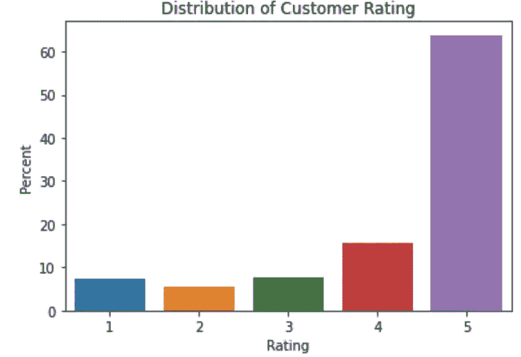

# 面向小型企业的主题建模分析

> 原文：<https://towardsdatascience.com/topic-modeling-analysis-for-small-businesses-73ba23474261?source=collection_archive---------29----------------------->


Pennslyvania doyles town alto Monte 的意大利市场(使用经业主批准的图片)。

# 介绍

机器学习正在小企业食品行业发展，并已显示出为提高企业生产率提供了成果。今天的分析源于我的调查的第一部分，包括对位于宾夕法尼亚州费城附近的[阿尔托蒙特的意大利市场](https://altomontes.com/)的在线评论。使用自然语言处理帮助这家规模虽小但呈指数级增长的食品行业企业更深入地了解了客户对 Altomonte 及其运营的看法。

# **自然语言处理**

自然语言处理是机器学习的一个领域，旨在揭示文本数据中隐藏的意义和情感。如果你想了解更多，Dan Juurafsky 和 James H. Martin 有一本免费的教科书,它很好地深入研究了 NLP 的理论和过程。在这次分析中主要使用的技术是 [**主题模型分析**](https://dl.acm.org/doi/abs/10.1145/1964858.1964870?casa_token=rnfXx41QP28AAAAA:-IdKIGdLfsum3jzHh9TYmULn3XZx22d3EJ7J_B_sOd9uwZ1nW60R19fABvfFMM67Z0r2MqBLRA) 。主题建模分析是自然语言处理中的一种无监督的机器学习技术，可以揭示文本语料库的潜在意义。主题建模分析可以用于小型企业的评论，以帮助揭示客户对企业的集体看法和感受，从而使企业更好地塑造其声誉。

# 分析

分析过程中使用的各种软件包列表:

```
import pandas as pd
import numpy as np
import nltk
from nltk import FreqDist, PorterStemmer
from nltk.corpus import stopwords
stop_words = stopwords.words('english')
import re
import matplotlib.pyplot as plt
import seaborn as sns
from nltk.tokenize import word_tokenize,sent_tokenize
from wordcloud import WordCloud
from gensim import corpora
import gensim
import spacy
from gensim.models.coherencemodel import CoherenceModel
from gensim.models import LdaMulticore
from gensim import models
import pprint
import tqdm
```

# 资料组

使用的数据集是一个语料库，其中包含从 Yelp、猫途鹰和谷歌评论中收集的关于 Altomonte 意大利市场的评论。这些评论可以追溯到 10 年前。有些评论甚至可以追溯到更早以前；然而，我觉得 10 年后的任何评论都不太适用于 Altomonte，因为过去 10 年该公司的业务增长迅猛。这些评论被清理并分类到一个熊猫数据框中。数据框的列是“月”、“年”、“回顾”、“评级”和“平台”。


图:数据帧中前 5 个条目的示例。

**数据集统计**

在深入主题建模分析之前，提取了关于数据集的各种统计数据。

```
print("Average Rating for All Online Reviews :" ,df['Rating'].mean())
```

所有评论的平均评分为 **4.23** 分(满分 5 分)。

```
print("Number of each Rating for all of the reviews")
df['Rating'].value_counts()
```

按评级分列的审查细目如下:


图:按评级分列的评论数量



图:评级在全部语料库中所占的百分比

**词频**

提取单词的频率，看看是否可以从语料库中最频繁出现的单词中获得任何意义。

```
# function to plot most frequent terms
def frequent_words(x, terms = 20):
    totalwords = ' '.join([text for text in x])
    totalwords = totalwords.split()fdist = FreqDist(allwords)
    words_df = pd.DataFrame({'word':list(fdist.keys()), 'count':list(fdist.values())})# selecting top 20 most frequent words
    d = words_df.nlargest(columns="count", n = terms) 
    plt.figure(figsize=(20,5))
    ax = sns.barplot(data=d, x= "word", y = "count")
    ax.set(ylabel = 'Count')
    plt.show()
```

首先，创建一个函数，找出 20 个最常用的单词，并将它们的频率绘制成条形图。然后，删除所有不需要的符号、数字和字符。

```
# remove unwanted characters, numbers and symbols
df['Review'] = df['Review'].str.replace("[^a-zA-Z#]", " ")
```

最后，从数据集中删除停用词，并对整个数据集进行小写规范化。

```
def remove_stopwords(onl_rev):
    new_review = " ".join([i for i in onl_rev if i not in stop_words])
    return new_review# remove short words (length < 3)
df['Review'] = df['Review'].apply(lambda x: ' '.join([w for w in x.split() if len(w)>2]))# remove stopwords from the text
Reviews = [remove_stopwords(r.split()) for r in df['Review']]# make entire text lowercase
Reviews = [r.lower() for r in Reviews]
```

**词汇化**

在评论被清理之后，数据集被词条化。 [**词汇化**](https://nlp.stanford.edu/IR-book/html/htmledition/stemming-and-lemmatization-1.html) 就是把一个词分解到它的基础的过程。

```
nlp =spacy.load('en_core_web_sm',disable=['parser','ner'])
def lemmatization(texts, tags=['NOUN', 'ADJ']): # filter noun and adjective
        output = []
        for sent in texts:
                doc = nlp(" ".join(sent)) 
                output.append([token.lemma_ for token in doc if token.pos_ in tags])
        return output
```

然后将该函数应用于数据集。

```
Lem_reviews = lemmatization(tokenized_Reviews)
print(Lem_reviews[1])
```


图:词汇化函数的输出

**标记化**

记号化是将语料库和句子分解成单独的“记号”的过程这里，我们想把句子分开，这样我们就可以单独检查语料库中的每个单词。

```
#Tokenization
tokenized_Reviews = pd.Series(Reviews).apply(lambda x: x.split())
print(tokenized_Reviews[1])
```


图:Altomonte 评论数据集的符号化输出示例

**最终清洁**

```
reviews_cleaned = []
for i in range(len(Lem_reviews)):
    reviews_cleaned.append(' '.join(Lem_reviews[i]))df['Reviews'] = reviews_cleanedfrequent_words(df['Reviews'], 20)
```

对数据集进行最后一次清理，并绘制词频。


图:20 个最常见的单词

此外，一个单词云是由最常用的单词组成的

```
full_text = ' '.join(df['Review'])
cloud_no_stopword = WordCloud(background_color='white', stopwords=stop_words).generate(full_text)
plt.imshow(cloud_no_stopword, interpolation='bilinear')
plt.axis('off')
plt.show()
```


图:最常用的 20 个单词

词频表中出现频率最高的五个词是**食物、意大利菜、好、棒极了、**和**三明治。**从词频中，我们可以获得一些洞察力，并得出结论:顾客认为 **Altomonte 的意大利市场是一个不错的，甚至是很棒的意大利市场，供应各种三明治**(在费城，我们称之为三明治三明治！强烈推荐顺道买一个！).

虽然词频可以为客户在评论企业时使用的词提供很好的洞察力，但将词频与主题建模分析相结合可以帮助创建客户对企业的真实感受和观点的具体结论。

# 主题建模分析

对于主题建模分析，我使用了 Genism Python 包中的[线性狄利克雷分配模型](https://en.wikipedia.org/wiki/Latent_Dirichlet_allocation)。LDA 模型试图揭示评论集的潜在主题，这些主题在顶级分析中可能不明显。

首先，创建一个词条化评论的字典。

```
overall_dictionary = corpora.Dictionary(Lem_reviews)#Converting reviews into a Document Term Matrix
overall_doctermtx = [overall_dictionary.doc2bow(review) for review in Lem_reviews]
```

决定你要代表多少个话题的语料库，取决于话题的**连贯性评分**。一个[连贯性分数](/evaluate-topic-model-in-python-latent-dirichlet-allocation-lda-7d57484bb5d0#:~:text=But%20before%20that%E2%80%A6-,What%20is%20topic%20coherence%3F,are%20artifacts%20of%20statistical%20inference.)是主题的质量以及当它们被组合在一起时的相关程度。

```
def compute_c_values(dictionary, corpus, texts, limit, start=2, step=1):
    """
    Compute c_v coherence for various number of topicsParameters:
    ----------
    dictionary : Gensim dictionary
    corpus : Gensim corpus
    texts : List of input texts
    limit : Max num of topicsReturns:
    -------
    model_list : List of LDA topic models
    coherence_values : Coherence values corresponding to the LDA model with respective number of topics
    """
    coherence_values = []
    model_list = []
    for num_topics in range(start, limit, step):
        model=LDA(corpus=corpus, id2word=dictionary, num_topics=num_topics,)
        model_list.append(model)
        coherencemodel = CoherenceModel(model=model, texts=texts, dictionary=dictionary, coherence='c_v')
        coherence_values.append(coherencemodel.get_coherence())return model_list, coherence_values
```


图:前 10 个一致性分数

上面的函数将计算语料库的一致性分数。对于这个语料库， **7 个主题**被观察到具有最高的连贯性分数. 400。然后使用 7 个主题进行主题模型分析，以提取数据集中的潜在主题。

```
LDA = gensim.models.ldamodel.LdaModel
LDA_overall_Model = LDA(corpus=overall_doctermtx, id2word=overall_dictionary, num_topics=7)
LDA_overall_Model.print_topics( num_topics=7,num_words=5)
```

7 个主题中的每一个都提取了 5 个最重要的单词。如下所示，LDA 模型对单词的重要性进行了分级评分。


图:阿洛蒙特在线评论的潜在话题

现在，我们可以将代表 Altomonte 在线评论数据集的 7 个主题归为一类。这些主题是(按以上顺序排列):

1.  美味的意大利披萨
2.  各种新鲜食物
3.  多种三明治选择
4.  各式各样的意大利食物
5.  意大利商品/美食/等的好去处。
6.  美味的三明治
7.  高品质的意大利食物

我们做到了！这些话题有助于解释顾客对 Altomonte 意大利市场的看法！阿尔托蒙特可以被称为一个独特的食品店，有各种各样的比萨饼、三明治和食物。无论您是去商店购买食材在家制作食谱，还是在室内热吧、三明治柜台或披萨柜台随便吃点东西，您都会非常享受您的 Alomonte 意大利市场之旅并享受美食！这个话题很有意义，因为 Altomonte's 除了新鲜制作的意大利食品外，还提供各种其他产品。最近，R&D 部门不知疲倦地在商店里扩展产品线。这些评论的潜在含义表明，客户已经注意到了这种业务扩张，因此 Altomonte 的领导团队应该继续扩大其产品线。

# **结论**

主题建模分析用于表明食品行业的小企业可以更深入地了解客户对他们提供的商品和服务的看法。对 Altomonte's 来说，顾客对该公司提供的食物、比萨饼、三明治和独特的选择有一种渴望。此外，企业主不断努力扩大商店中商品和服务的种类，这一点并没有被顾客所忽视，而且正在引起消费者的注意。这一知识有助于 Altomonte's 继续开发和投资用于增加商店产品和顾客体验的流程，同时继续为大费城地区的人们服务。感谢您的阅读！

**来源**

1.  Gé ron，A.: *用 Scikit-Learn 和 TensorFlow 实践机器学习:构建智能系统的概念、工具和技术*。加利福尼亚州塞瓦斯托波尔奥莱利媒体公司(2017 年)。
2.  瓦西里耶夫尤利。*用 Python 和 Spacy 进行自然语言处理:实用介绍*。旧金山:不上浆，2020。打印。
3.  图片的使用得到了 Altomonte 的意大利市场公司的批准。
4.  [https://www . analyticsvidhya . com/blog/2018/10/mining-online-reviews-topic-modeling-LDA/](https://www.analyticsvidhya.com/blog/2018/10/mining-online-reviews-topic-modeling-lda/)
5.  [https://realpython.com/sentiment-analysis-python/](https://realpython.com/sentiment-analysis-python/)
6.  [https://Neptune . ai/blog/pyl Davis-topic-modeling-exploration-tool-that-every-NLP-data-scientist-should-know](https://neptune.ai/blog/pyldavis-topic-modelling-exploration-tool-that-every-nlp-data-scientist-should-know)
7.  [https://towards data science . com/evaluate-topic-model-in-python-latent-Dirichlet-allocation-LDA-7d 57484 bb5d 0](/evaluate-topic-model-in-python-latent-dirichlet-allocation-lda-7d57484bb5d0)
8.  [https://IQ . open genus . org/Topic-modeling-techniques/#:~:text = Topic % 20 modeling % 20 can % 20 be % 20 used % 20 in % 20 graph % 20 based，time % 20 and % 20 helps % 20 students % 20 get % 20 their % 20 results % 20 fast](https://iq.opengenus.org/topic-modelling-techniques/#:~:text=Topic%20modeling%20can%20be%20used%20in%20graph%20based,time%20and%20helps%20students%20get%20their%20results%20quickly)。