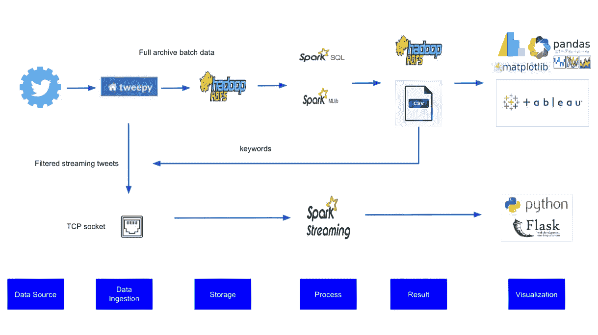

# 基于 Spark 的 Twitter 数据主题建模和情感分析

> 原文：<https://towardsdatascience.com/topic-modeling-and-sentiment-analysis-on-twitter-data-using-spark-a145bfcc433?source=collection_archive---------13----------------------->

## 某个地区的 twitter 用户关注什么，他们对某些问题的反应是什么？

亚历山大·沙托夫在 [Unsplash](https://unsplash.com/) 上拍摄的照片

# 介绍

这是与队友一山、小静、贾尼斯和兰吉特完成的学校项目总结。Twitter 情绪分析是一个面向大数据分析新手的 hello world 项目。

在这个项目中，我们想知道新加坡用户在 twitter 上关注什么，以及人们对某个话题的反应。为了回答这个问题，我们使用 Spark SQL、Spark MLlib 和 Spark streaming 等 Spark 库设计了两条 twitter 数据分析管道。

# **建筑**

作者图片

## 管道 1:批处理和主题建模

在这一部分中，我们使用 tweepy 从完整的归档 API 中提取 tweets 并保存到 hdfs 中。然后，我们调用 Spark SQL 和 Spark MLlib 来处理 tweets 以进行主题建模，并用 matplotlib 或 tableau 保存结果以进行可视化。

## 管道 2:流处理和情感分析

在这一部分中，我们使用 tweepy 和主题建模中的关键字来过滤流媒体 tweets。我们还在 tweepy 和 Spark 之间创建了一个 TCP 套接字。TCP 套接字会将 tweets 发送到 Spark 流进行处理。然后，结果将被发送到使用 Flask 构建的仪表板。

# 批处理和主题建模

## 步骤 1:从 twitter API 批量获取推文

Twitter 刚刚将 API 从 1.0 版升级到 2.0 版。要使用 2.0 版 API，我们需要使用 tweepy v4.0 版，该版本目前仍处于 Github 的开发阶段。使用 twitter 的原生 API 也可以。要使用完整的存档 API，我们需要有一个学术帐户。我们为这个学校项目申请了一个学术帐户，该帐户每月授予我们 1000 万条推文配额和更多的查询 API。

我们为完整的存档推文设定了一些标准。推文的位置应该是新加坡，语言英语和转发被排除在外。可以调整返回的开始时间和结束时间以及其他字段，在本例中，时间设置为 2021 年 4 月。

对于 4 月份发布的推文，我们能够提取出大约 4.8 万条符合标准的推文。

## 第二步:批处理

在这一步中，我们需要在建模之前做一些预处理。我们探索了 tweets 的 json 结构。嵌套 json 结构被简化为每行一个记录，每列一个属性。展平后，执行一些常见的预处理步骤，如去除非文本、标记化、词条化和去除停用词。

## 步骤 3:使用网格搜索的主题建模

在文本清洗和标记化之后，我们使用 LDA 进行主题建模。由于我们不确定主题的最佳数量，我们使用网格搜索来确定。通过简单的肘法，我们发现 4 月推文中有 6 个话题。

## 步骤 4:基于主题创建条形图竞赛

在主题建模之后，我们可以为每条推文分配主题，并将推文分配给一个主导主题。我们汇总了每天每个主题下的推文数量。然后我们用柱状图 race 包演示了四月份话题的动态变化。

作者提供的视频

# 流处理和情感分析

# 步骤 1:过滤后的 tweets 流并发送到 TCP 套接字

从第一个管道，我们决定把重点放在缅甸政变的话题。我们使用缅甸作为流数据的关键字。在这一部分中，我们还创建了一个 TCP 套接字来接收流数据。这些数据最终会被火花流消耗掉。

## 第二步:使用 Spark 流进行推特情感分析

在这一部分中，我们使用 spark 流来处理实时数据。Spark streaming 是一个较老的 API，它使用最小批量方法。我们需要定义将流数据转换为离散流(名为 d stream)的批处理间隔。我们将批处理间隔定义为 2 秒。我们会根据文本-blob 包中的情绪极性将每条推文定义为积极、中立或消极。然后，我们统计了每个类别下的推文数量。我们还统计了最常用的词和标签，并显示了过去一周推文的地理位置。我们使用过去一周的推文而不是实时推文进行地理定位的原因是，只有 1-2%的推文带有地理标签。

## 第三步:烧瓶仪表板

在这一部分，我们使用 MVC(模型-视图-控制器)框架来设计仪表板。我们定义了如何在模板的每个部分显示数据。

# 实时仪表板

作者提供的视频