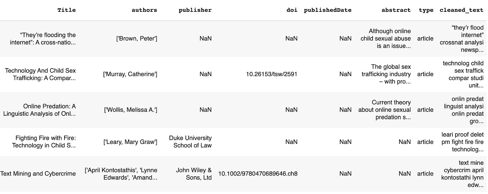
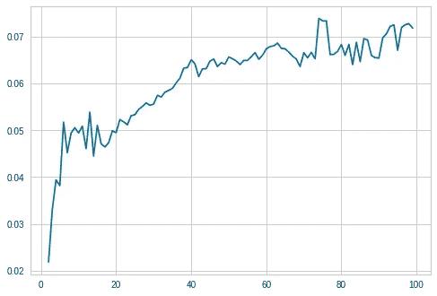
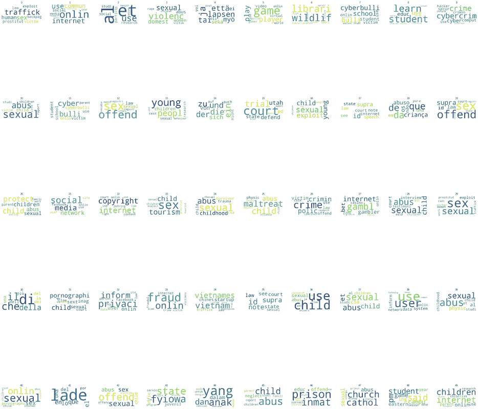
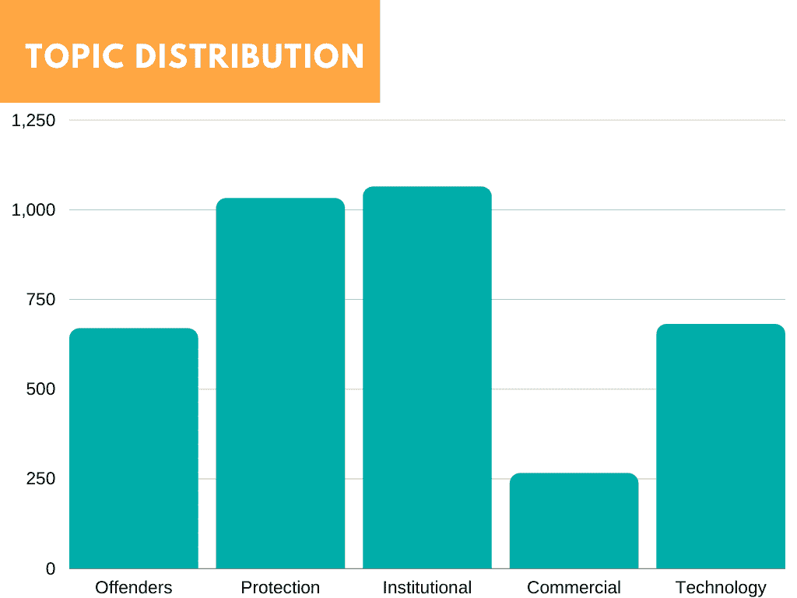
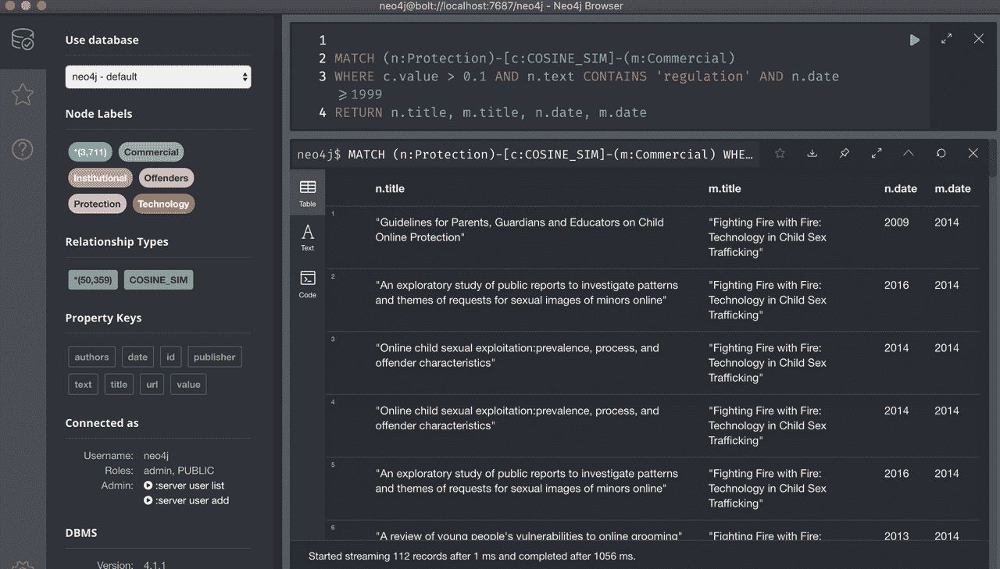

# 在线性虐待材料科学文献的主题建模(CSAM)

> 原文：<https://towardsdatascience.com/topic-modeling-of-scientific-literature-on-online-sexual-abuse-materials-csam-749a3e42250b?source=collection_archive---------40----------------------->

## 使用 TF-IDF、Louvain 聚类和 D3.js 的网络图可视化

我最近与[救助儿童会](https://www.savethechildren.net/)合作参加了 [Omdena AI 挑战赛](https://omdena.com/projects/children-violence/)，这是一个领先的儿童人道主义组织，使用自然语言处理(NLP)技术探索针对儿童的在线性暴力问题。


照片由[若昂·赞诺](https://unsplash.com/@jtzanno?utm_source=unsplash&utm_medium=referral&utm_content=creditCopyText)在 [Unsplash](/s/photos/scientific-literature?utm_source=unsplash&utm_medium=referral&utm_content=creditCopyText) 上拍摄

# 主题建模

主题建模是一种无监督的机器学习文本分析技术，能够检测文档集合中的单词和短语模式。然后，检测到的模式用于将文档聚类到特定主题中。它是一种常用的文本挖掘工具，用于发现文本数据中的语义结构。

简单地说，关于特定主题的文档或多或少会包含特定于该主题的某些单词。

该任务的目标是收集科学文章的文本数据，应用主题建模将文档聚类成单独的主题，然后使用图形网络创建该聚类的可视化。

# 数据收集

在进行任何分析之前，首先执行的任务之一是收集关于 CSAM 的数据。文章收集自多个资源库，包括[核心](https://core.ac.uk/)、[理念](https://www.worldcat.org/)、[研究门户](https://www.researchgate.net/directory/publications)、[开放获取期刊目录](https://doaj.org/)和[世界猫](https://www.worldcat.org/)。在本文中，我们将重点关注从 CORE 收集的文章。

数据是通过 API 收集的。为了发出请求，我们向 CORE 注册了一个帐户，并收到了一个 API 密钥。我们需要 API 键和搜索词来提出请求。使用的搜索词—

```
#query = "((internet OR online OR technology OR chatroom OR chat) AND (minor OR child OR underage OR children OR teenager) AND (abuse OR exploitation OR grooming OR predation) AND (sex OR sexual OR carnal)) OR (internet OR online OR technology OR chatroom OR chat) AND (predators OR offenders) AND (sex OR sexual OR carnal) OR (child sexual abuse material OR CSAM)"#query = "(internet OR online OR technology OR chatroom OR chat) AND (predators OR offenders) AND (sex OR sexual OR carnal)"#query = "(child sexual abuse material OR CSAM)"
```

收集数据的 Python 代码—

核心提取代码

核心数据帧

# 数据清理和预处理

与任何类型的数据分析一样，我们必须首先清理数据。对数据的直观检查显示存在重复的行。基于包括标题、摘要和 DOI 在内的许多列，删除了重复的内容。对这些问题进行了单独和组合研究。

```
core_df = core_df.drop_duplicates(subset=['Title'])
```

我们使用了 clean text library，这是一个 python 包，它结合了许多清理步骤，包括删除标点、数字和多余的空格，以及将文本改为小写。

通过检查某些关键词是否出现在摘要和/或文本栏中来过滤数据。

关键词过滤

然而，这种手动过滤方法导致了许多相关文章的丢失。最终采取了不同的方法。稍后将详细介绍。

在预处理步骤之后，我们在数据帧中有 35K 行—



已清理的文本—按作者排序的图像

# TF-IDF 矢量化

在自然语言处理中，文本必须首先被转换成机器能够理解的东西。转换成数字使我们能够对它们进行数学运算。有许多文本矢量化的方法，在本文中，我们将探讨 TF-IDF 矢量化。

TF-IDF 代表词频逆文档频率。这是一种技术，我们给语料库或数据集中的词分配一个重要性分数。重要性的分配基于两个标准——

**词频** —这被定义为单词在文档中出现的频率除以单词的数量。

**逆文档频率**—一个词在语料库中的稀有或常见程度。这可以通过取文档总数与包含该单词的文档数之比的对数来计算。我们通过取这两项的乘积来计算 TF-IDF 分数。术语越高，单词越重要。

TF-IDF 矢量器

参数值 *max_features* 为 10000 是指要考虑的顶级特性的最大数量。ngram_range 指定我们正在考虑一元模型和二元模型。矢量器的输出是一个 35000x10000 的稀疏矩阵，其中 35K 表示文章的数量，10000 表示 max_features。

# 降维

这是通过将数据集中的特征的维数从高维空间减少到低维空间来进行的数据转换，使得低维表示仍然保留数据的一些相对有意义的属性。

我们遇到了一些问题，在内存上拟合 K-Means 聚类的数据。我们选择使用潜在语义分析(LSA)或截断奇异值分解(在 SKlearn 上)进行降维。

与任何降维技术一样，为了决定要选择的组件数量，我们检查了不同数量的组件，并选择了具有最高解释比率的组件。

降维

我们选择了一些 2800 的成分，其解释方差比为 0.89。

# k 均值聚类

K-Means 是一种流行的无监督学习聚类技术，用于将数据点分组到非重叠的子组中。集群被定义为与集群内的其他对象比与集群外的对象更相似的对象组。

类似地，我们对 2-80 范围内的多个聚类数运行 K-Means，并计算每个聚类数的轮廓得分。选择得分最高的聚类。

k 均值聚类



剪影分数图-作者提供的图像

我们选择 72 作为最佳聚类的初始数量。

去掉无关的话题

在对集群进行人工检查时，我们注意到一些集群被认为需要移除。我们注意到与领域无关的文档集群，以及不同语言的集群。聚类是过滤掉不相关文章的好方法。

词云



文字云可视化——作者图片

上面的单词云显示了第一次实现聚类时每个片段中最重要的单词。例如，我们注意到，Cluster-ID 4、10、14、18 和 44 不是英语。

# 网络图


艾莉娜·格鲁布尼亚克在 [Unsplash](/s/photos/network?utm_source=unsplash&utm_medium=referral&utm_content=creditCopyText) 上的照片

网络图是显示实体间相互联系的一种方式。这个子任务的目标是可视化地表示不同文章之间的关系。为了实现这一点，我们选择突出两种类型的关系，文章所属的不同主题，以及文章之间相似性的数字度量。我们决定采用两种不同的技术来实现这一点—

## 余弦相似性

这是对文档之间相似程度的一种度量。它用于测量在多维空间中投影的两个向量之间的角度的余弦。这就告诉我们这些矢量是指向相同的方向。

衡量文档间相似性的另一种常用方法是计算它们共有的字数。这种方法有一个问题，然而，文档越大，不管主题是什么，它们之间的共同点就越多。余弦相似性在这里起作用，因为它捕捉的是向量的方向，而不是大小。

## 鲁文聚类

用于社区检测的 Louvain 聚类是一种无监督的机器学习技术，用于理解和检测大型复杂网络中的社区。

Louvain 集群实现

## 主题

从卢万，我们得到 5 个不同的社区。对社区的人工检查表明—

*   制度、政治(立法)和社会话语
*   在线儿童保护—漏洞
*   技术视角
*   罪犯分析
*   商业视角与贩运



主题分布-按作者分类的图片

## 形象化

随着余弦相似性的计算和 Louvain 聚类的实现，我们现在有了创建网络图所需要的东西。如上所述，网络图显示了实体之间的连接，实体可以由节点(或顶点)表示，节点之间的连接由链接(边)表示。

余弦相似性输出是介于 0 和 1 之间的数字，分别代表无关系到完美关系的范围。文档越相似，链接就越强。节点可以基于文章最认同的主题来着色。

可视化是使用 D3.js 创建的，托管在 Netlify 的免费 Github 托管服务上(如果第一次没有正确加载，请刷新页面)，可以在这里找到。

网络图实现

将鼠标悬停在节点上可查看文章和其他链接文章的标题。可以拖动节点以获得更好的可视性。为了获得更好的可视性，我们为链接强度设置了一个阈值，这意味着低于 0.3 的链接应该从可视化中排除。

此外，为了防止节点偏离可视屏幕区域太远，我们设置了一个边框，这就是可视化周围的方形边框形状。

报纸文章也做了类似的分析，可以在[这里](https://blissful-blackwell-f90fcb.netlify.app/tasks/task-7_data_visualization/graphnetwork/plot/news_graph)找到。

# 未来的工作

许多不同的领域可能需要改进。TF-IDF 有许多限制——对于大型词汇表来说计算量很大，并且不能捕获单词的语义。例如，困惑和迷惑在意思上是相似的，但是 TF-IDF 可能没有抓住这一点。

更高级的方法包括单词嵌入、word2vec 和 doc2vec(针对文档而非单词)。

例如，一种更先进的测量文档相似性的方法是使用来自变压器的**双向编码器表示(BERT)** 使用变压器，一种基于注意力的模型来学习单词嵌入。

一个可能的应用是创建一个搜索功能，在与特定文章相似的某个范围内查询特定主题内的文章。这可以借助于能够以图形结构存储数据的图形数据库来实现。图形网络的直观结构允许人们进行复杂的查询，而这在关系数据库中是不可能的。



Neo4j 数据库—图片由作者提供

此时加载的特定数据非常简单，只有一些节点、属性，并且只定义了一个关系(余弦相似性)。然而，由于图形数据库的灵活性，将来或在需要时，可以添加更多的节点和标签，以及定义更多的关系。这些关系可以使用机器学习以及其他非 ML 方法来导出。

[Neo4j](https://neo4j.com/) 还允许安装第三方插件，包括 data science/ML 插件，允许在数据库中实现和应用机器学习算法，包括 Louvain 聚类和社区检测。

# 参考

Nasar Z，Jaffry S W，Malik M K (2018)从科学文章中提取信息:一项调查[http://faculty . pucit . edu . PK/swjaffrey/RPR/scientimetrics 18 Information mining . pdf](http://faculty.pucit.edu.pk/swjaffry/rpr/Scientometrics18InformationMining.pdf)

Stecanella R (2017)文本矢量化初学者指南[https://monkey learn . com/blog/初学者指南-文本-矢量化/](https://monkeylearn.com/blog/beginners-guide-text-vectorization/)

范德马腾，劳伦斯；邮政局长，埃里克；范·登·赫里克，贾普(2009)维数约减:一个比较评论[https://members . loria . fr/moberger/enseignment/AVR/Exposes/TR _ dimensionereductie . pdf](https://members.loria.fr/moberger/Enseignement/AVR/Exposes/TR_Dimensiereductie.pdf)

Pantola P (2018)自然语言处理:文本数据矢量化[https://medium . com/@ paritosh _ 30025/Natural-Language-Processing-Text-Data-矢量化-af2520529cf7](https://medium.com/@paritosh_30025/natural-language-processing-text-data-vectorization-af2520529cf7)

普拉巴卡兰(2019)余弦相似性——理解数学及其工作原理[https://www.machinelearningplus.com/nlp/cosine-similarity/](https://www.machinelearningplus.com/nlp/cosine-similarity/)

博斯托克 M (2017)力定向图[https://observablehq.com/@d3/force-directed-graph](https://observablehq.com/@d3/force-directed-graph)

Raghunathan D (2020) NLP in Python-矢量化[https://towardsdatascience . com/NLP-in-Python-矢量化-a2b4fc1a339e](/nlp-in-python-vectorizing-a2b4fc1a339e)

Jayaswal V (2020)文本矢量化:词频—逆文档频率(tfi df)[https://towardsdatascience . com/Text-Vectorization-Term-Frequency-Inverse-Document-Frequency-tfi df-5a 3f 9604 da6d](/text-vectorization-term-frequency-inverse-document-frequency-tfidf-5a3f9604da6d)

巴赫 T (2020)用变形金刚寻找相似文档[https://www . codegram . com/blog/Finding-similar-documents-with-transformers/](https://www.codegram.com/blog/finding-similar-documents-with-transformers/)

Borad A (2020) NLP 文本预处理:文本矢量化【https://www.einfochips.com/blog/nlp-text-vectorization/ 