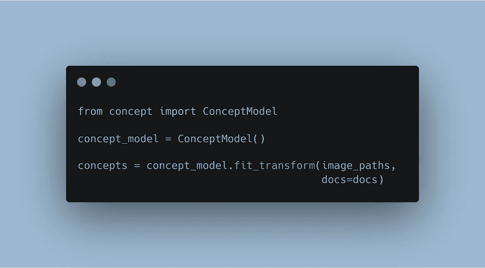
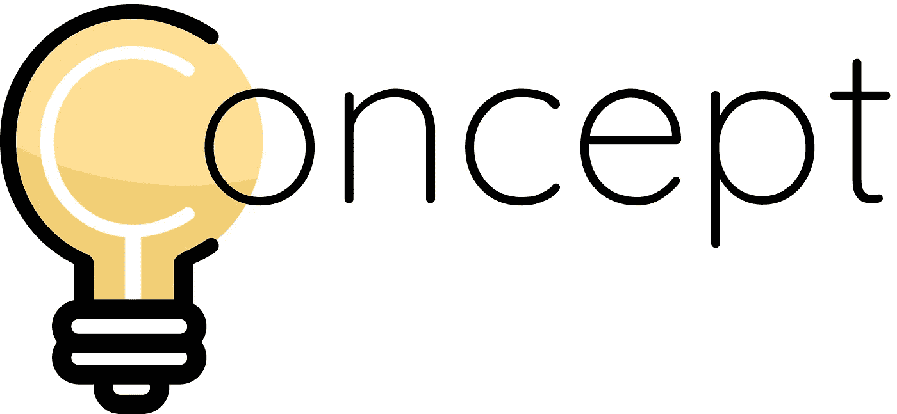
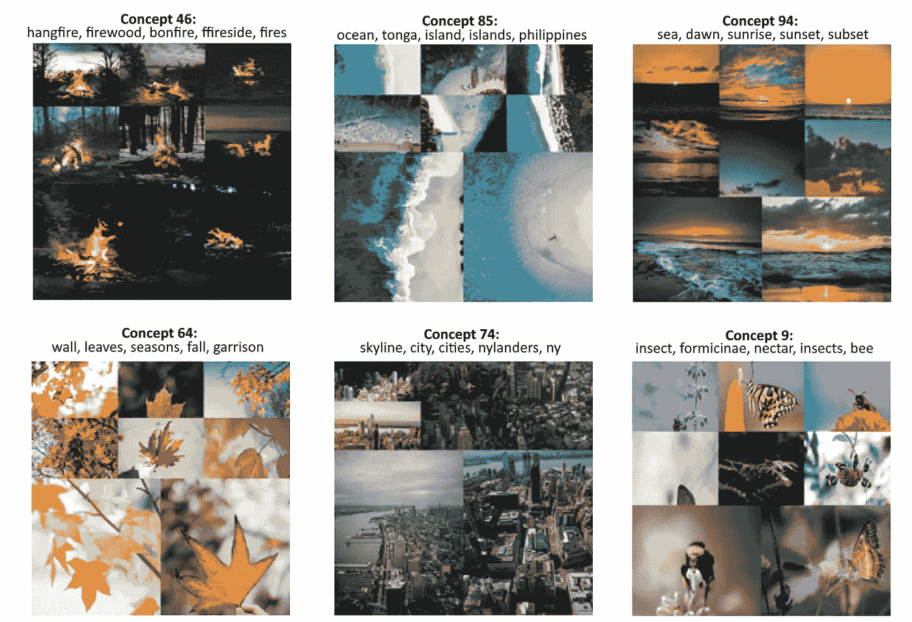
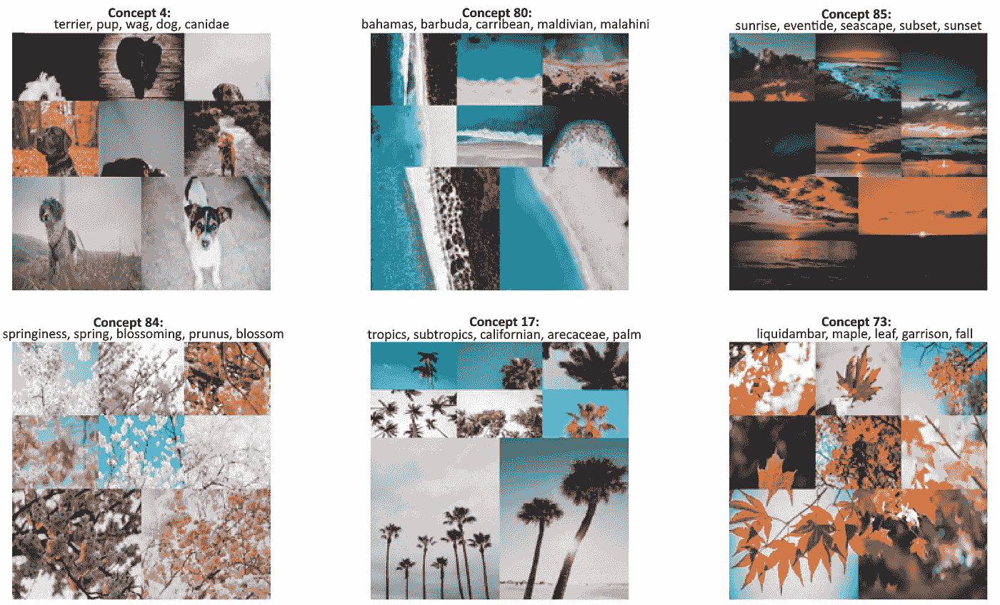
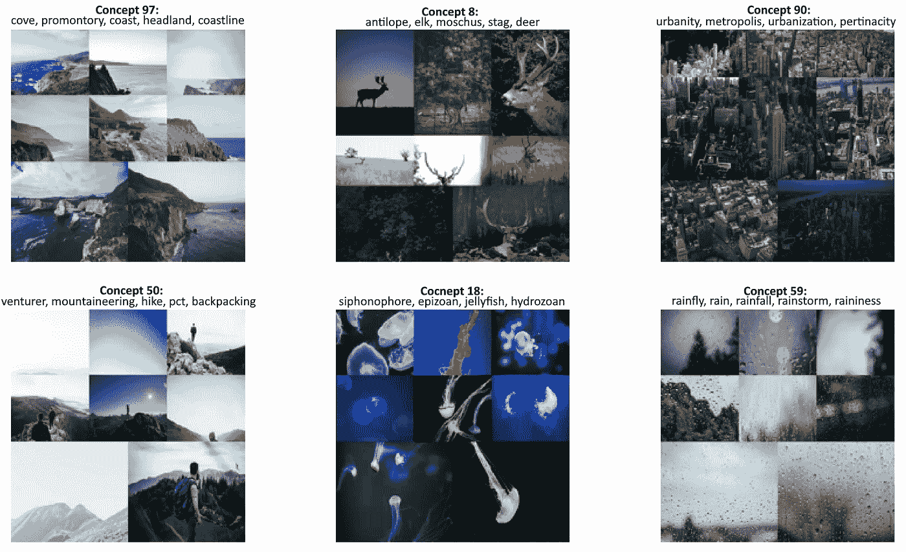
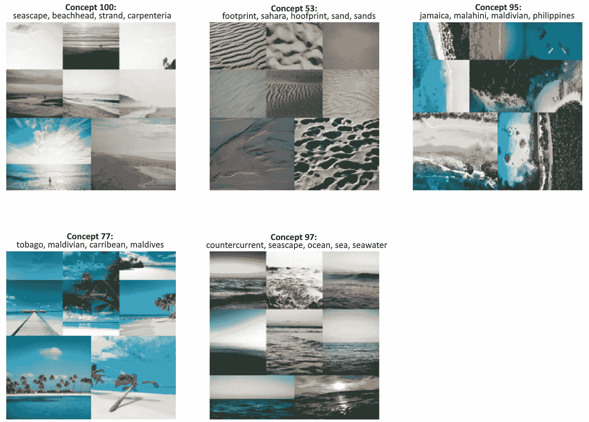
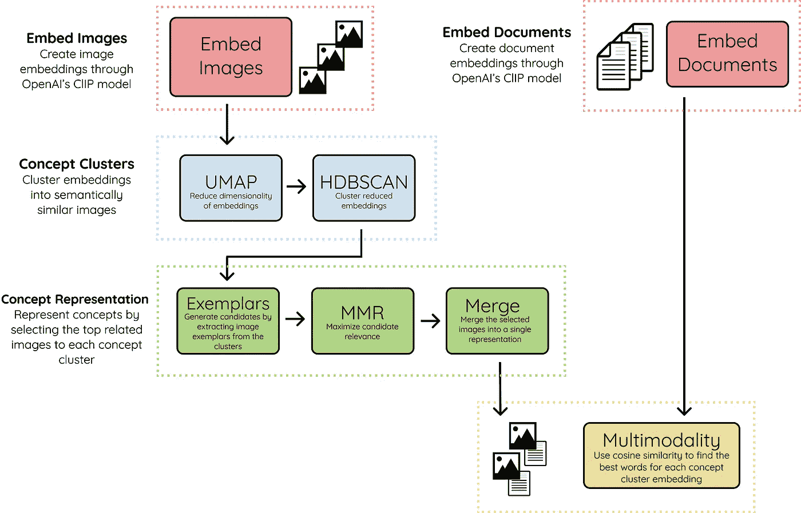

# 图像上的主题建模？为什么不呢？！

> 原文：<https://towardsdatascience.com/topic-modeling-on-images-why-not-aad331d03246?source=collection_archive---------15----------------------->

## 但是让我们称之为概念建模吧！

主题建模是一组技术的集合，允许用户在大量数据中发现主题，不受监督。当试图对那些文档的内容建模和执行 EDA 时，这可能是非常有利的。

不久前，我创建了一个名为 [BERTopic](https://github.com/MaartenGr/BERTopic) 的主题建模技术，它利用 BERT 嵌入和基于类的 TF-IDF 来创建密集的集群，从而允许轻松解释主题。

过了一段时间，我开始思考它在其他领域的应用，比如计算机视觉。如果我们可以在图像上应用主题建模，那该有多酷？



在图像和文本上执行主题建模所需要做的就是。图片由作者提供。

花了一段时间，但经过一些实验，我想出了解决办法， [**概念**](https://github.com/MaartenGr/concept) ！

[Concept](https://github.com/MaartenGr/Concept) 是一个同时在*图像*和*文本*上引入主题建模概念的包。然而，由于主题通常指的是书面或口头的话，它不能完全概括分组图像的含义。相反，我们将这些分组的图像和文本称为**概念**。



[概念的标志](https://github.com/MaartenGr/Concept)。图片由作者提供。

因此，概念包执行**概念建模**，这是一种用于发现出现在图像和相应文档集合中的抽象*概念*的统计模型。

> 概念建模是主题建模对图像和文本的概括

为了让您有个概念，下面的概念是通过概念建模检索的:



通过概念建模产生的多模态概念。图片由作者提供。

你可能已经注意到了，我们可以通过它们的文本表示和视觉表示来解释这些概念。然而，概念建模的真正优势可以通过组合这些表示来发现。

> 概念建模允许概念的多模态表示

一幅图像比一千个字更能说明问题。但是如果我们给图像添加文字呢？这两种沟通方式的协同作用可以丰富对一个概念的解释和理解。

<https://colab.research.google.com/drive/1XHwQPT2itZXu1HayvGoj60-xAXxg9mqe?usp=sharing>  

在本文中，我将介绍使用[概念](https://github.com/MaartenGr/Concept)创建您自己的概念模型的步骤。你可以跟随上面链接中的 Google Colab 笔记本。

# 步骤 1:安装概念

我们可以通过 [PyPI](https://pypi.org/project/concept/) 轻松安装 Concept:

```
pip install concept
```

# 步骤 2:准备图像

为了执行概念建模，我们需要大量的图像进行聚类。我们将从 [Unsplash](https://unsplash.com/) 下载 25，000 张图片，因为它们已经由[句子-变形金刚](https://www.sbert.net/examples/applications/image-search/README.html)包准备好了。

准备好图像后，我们已经可以在没有任何文本的情况下在概念中使用它们了。但是，不会创建任何文本表示。所以下一步是准备我们的文件。

# 第三步:准备文本

这个概念有趣的一面是任何文本都可以输入到模型中。理想情况下，我们希望给它输入与手边图像最相关的文本。我们通常对在我们的图像中能找到什么有一些了解。

然而，情况可能并不总是如此。因此，出于演示目的，我们将向模型输入英语词典中的一组名词:

在上面的例子中，我们采用 50.000 个随机名词有两个原因。首先，没有必要在英语词典中找到所有的名词，因为我们可以假设 50.000 应该代表足够的实体。第二，这稍微加快了计算速度，因为我们需要从更少的单词中提取嵌入。

在实践中，如果你有你知道的与图像相关的文本数据，使用它们而不是名词！

# 第四步:训练模型

接下来就是训练模型了！像往常一样，我们保持相对简单。只需将每个图像的路径和我们选择的名词输入到模型中:

`concepts`变量包含每个图像的预测概念。

概念的底层模型是 Openai 的[剪辑](https://github.com/openai/CLIP)，它是一个训练了大量图像和文本对的神经网络。这意味着该模型在生成嵌入时受益于使用 GPU。

最后，运行`concept_model.frequency`来查看包含概念频率的数据帧。

**注**:使用`Concept(embedding_model="clip-ViT-B-32-multilingual-v1")`选择支持 50 多种语言的机型！

## 预训练图像嵌入

对于那些想要尝试这个演示但没有 GPU 的人，我们可以从句子变形金刚网站加载预训练的图像嵌入:

然后，我们将预训练的嵌入添加到模型中，并对其进行训练:

# 第五步:形象化概念

现在有趣的事情，可视化的概念！

如前所述，由此产生的概念是多模型的，即自然的视觉和文本。我们需要找到一种方法在一个概览中同时表现这两者。

要做到这一点，我们需要一些最能代表每个概念的图片，然后找出最能代表这些图片的名词。

实际上，创建可视化非常简单:



九个最常见的概念被可视化。图片由作者提供。

我们数据集中的许多图片都与自然有关。然而，如果我们看得更远一点，我们可以看到更有趣的概念:



更频繁的概念。注意概念的多样性。图片由作者提供。

上面的结果给出了一个很好的例子，说明如何在概念建模中直观地思考概念。我们不仅可以通过一系列图像看到视觉表现，而且文字表现有助于我们进一步理解在这些概念中可以发现什么。

# 步骤 6:搜索概念

我们可以通过嵌入搜索词并找到最能代表它们的聚类嵌入来快速搜索特定的概念。例如，让我们搜索术语`**beach**` ，看看我们能找到什么。为此，我们只需运行以下命令:

每个元组包含两个值，第一个是概念簇，第二个是与搜索词的相似度。返回前 5 个相似主题。

现在，让我们将这些概念形象化，看看搜索功能的效果如何:



“海滩”一词的搜索结果。图片由作者提供。

正如我们所看到的，产生的概念与我们的搜索词非常相似！该模型的多模态特性允许我们轻松地搜索概念和图像。

# 步骤 7:算法概述

对于那些对概念的基础感兴趣的人来说，下面是用于创建结果概念的方法的抽象概述:



[概念](https://github.com/MaartenGr/Concept)的算法概述。图片由作者提供。

## 1.嵌入图像和文档

我们首先使用 OpenAI 的剪辑模型将图像和文档嵌入到同一个向量空间中。这使我们能够在图像和文本之间进行比较。文档可以是单词、短语、句子等。你觉得最好的代表概念群。

## 2.概念集群

使用 UMAP + HDBSCAN，我们可以对图像嵌入进行聚类，以创建视觉上和语义上彼此相似的聚类。我们将集群称为概念，因为它们代表了多模态的性质。

## 3.概念表征

为了直观地表示概念簇，我们将与每个概念最相关的图像称为样本。根据概念聚类的大小，每个聚类的样本数可能超过数百个，因此需要一个过滤器。

我们使用 MMR 来选择与概念嵌入最相关的图像，但是彼此之间仍然有足够的差异。这样，我们可以尽可能多地展示这个概念。然后，所选图像被组合成单个图像，以创建单个视觉表示。

## 4.多模态

最后，我们将文本嵌入与创建的概念簇嵌入进行比较。使用余弦相似性，我们选择彼此最相关的嵌入。这将多模态引入到概念表示中。

**注意**:还有一个选项是使用 c-TF-IDF 来提取使用`concept_model = ConceptModel(ctfidf=True)`的文本表示

# 感谢您的阅读！

如果你和我一样，对人工智能、数据科学或心理学充满热情，请随时在 [**LinkedIn**](https://www.linkedin.com/in/mgrootendorst/) 上添加我，或者在 [**Twitter**](https://twitter.com/MaartenGr) 上关注我。

您可以在下面找到 Concept 及其文档:

<https://github.com/MaartenGr/Concept>  <https://maartengr.github.io/Concept/> 