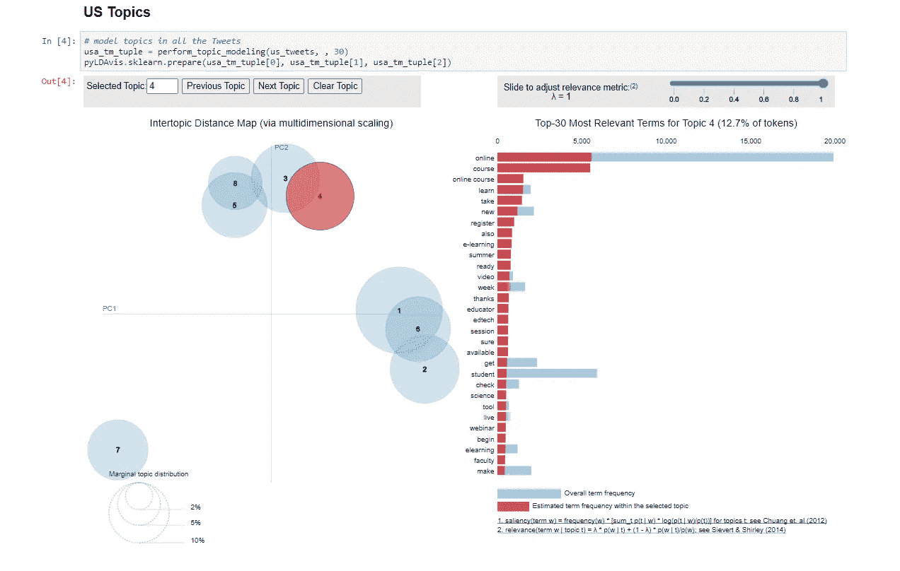

# 使用 LDA 的主题建模

> 原文：<https://towardsdatascience.com/topic-modeling-using-lda-59586a20dbfa?source=collection_archive---------38----------------------->

## 快速获取 30，000 多条推文的要点！


简·安东宁·科拉尔在 [Unsplash](https://unsplash.com?utm_source=medium&utm_medium=referral) 上拍摄的照片

在我的[最新项目](https://github.com/lspope/capstone)中，我探索了这样一个问题，“在新冠肺炎·疫情期间，美国公众对 K-12 学习的看法如何？”。

使用从 Twitter、自然语言处理和监督机器学习收集的数据，我创建了一个文本分类器来预测推文对这个话题的情绪。

太棒了。我能够根据积极、消极或中性的情绪对推文进行分类。但是 Twitter 用户在这些推文中实际上在谈论什么呢？如果我们只关注情绪，有没有什么模式或趋势我们可能会错过？在一种特定的情绪下，某些话题会出现得更频繁吗？在这些推文的内容中，我们还有很多可以探索的地方。

考虑到这一点，我决定执行主题建模来补充情感分类器。我的观点是，主题建模是对基于频率的“词云”方法的改进，以理解文本语料库中的内容。

不要误会我；我喜欢漂亮的文字云来展示时髦的图形。然而，由于我的文本(或者我应该说 Tweet)语料库如此之大(~30，000 条 Tweet)并且如此多样(美国范围内以及在 COVID 疫情期间 K-12 学习的广泛主题)，主题建模无疑是正确的选择。为了使主题建模更加有效，我利用了奇妙的交互式可视化工具 [pyLDAvis](https://github.com/bmabey/pyLDAvis) 。

以下是我将推文分成不同主题并进行探索性数据分析的步骤。

*   文本处理
*   主题建模
*   交互式可视化

**文本处理**

在使用[LatentDirichletAllocation](https://scikit-learn.org/stable/modules/generated/sklearn.decomposition.LatentDirichletAllocation.html)(LDA)执行主题建模之前，我需要应用一些文本处理。当我训练文本分类器识别情感时，标点符号和大写字母实际上对分类器是有用的，所以在训练分类器之前，我只对语料库进行了非常轻微的文本处理。对于主题建模，标准化语料库文本实际上是**必要的**。下面是我应用的文本处理:

*   将 Tweet 文本改为小写( [*nltk*](https://www.nltk.org/) *的 *TweetTokenizer 处理此*)*
*   删除 RT (Retweets)和# (hashtag 符号)(*使用正则表达式*)
*   移除 URL(*使用正则表达式*
*   从文本中删除[停用词](https://en.wikipedia.org/wiki/Stop_word)和标点符号。
*   对所有单词执行[词汇化](https://dictionary.cambridge.org/us/dictionary/english/lemmatization)(使用 [*nltk*](https://www.nltk.org/) 中的*词汇词汇化)*

所有的文本处理都发生在**clean _ tokenize _ lemma tize _ tweet**函数中。

```
sw_and_punct = stopwords.words(‘english’) + list(string.punctuation)# TweetTokenizer will put all text in the tweet to lowercase, strip out usernames/handles and reduce reated chars in words
tweet_tokenizer = TweetTokenizer(preserve_case=False,     strip_handles=True, reduce_len=True)lemmatizer = WordNetLemmatizer()def clean_tokenize_lemmatize_tweet(tweet):
     #remove urls
     tweet = re.sub(r’http\S+|www\S+|https\S+’, ‘’, tweet, flags=re.MULTILINE)
     #remove RT 
     tweet = re.sub(r’^RT\s+’, ‘’, tweet)
     #remove the # symbol
     tweet = re.sub(‘#’, ‘’, tweet)
     #tokenize
     tokens = tweet_tokenizer.tokenize(tweet)
     # remove stopwords and punctuation
     tokens = [token for token in tokens if token not in sw_and_punct]
    # remove tokens that are only 1 char in length
     tokens = [token for token in tokens if len(token)>1]
     #lemmatize
     lemmatized_tokens = [lemmatizer.lemmatize(token) for token in tokens]
     return lemmatized_tokens
```

**主题建模**

使用 sklearn 的 LatentDirichletAllocation 进行主题建模相当简单。首先，您需要通过创建文档术语矩阵(DTM)将语料库中的单词转换成数字。我用 sklearn 的[计数矢量器](https://scikit-learn.org/stable/modules/generated/sklearn.feature_extraction.text.CountVectorizer.html#sklearn.feature_extraction.text.CountVectorizer)创建了一个 DTM。查看下面的代码:

```
sample_corpus = ['This is the first sample document.',
                  'This document is the second sampledocument.',
                  'And this is the third one.',
                  'Is this the first document? I do think so!' ]my_cv = CountVectorizer(tokenizer=clean_tokenize_lemmatize_tweet)my_lda = LatentDirichletAllocation(n_components=5)

my_dtm = cv.fit_transform(sample_corpus)my_lda.fit(my_dtm) # may take a while with a large corpus ;)
```

**交互式数据可视化**

既然 LDA 已经施展了它的魔法，我们可以看看这些主题了。你可以把这些画出来；然而，使用 [pyLDAvis](https://github.com/bmabey/pyLDAvis) 来探索你的语料库主题要有趣得多！

```
import pyLDAvis.sklearn
pyLDAvis.enable_notebook()

pyLDAvis.sklearn.prepare(my_lda, my_dtm, my_cv)
```

只需这几行代码，您就能得到一个令人印象深刻、信息丰富的交互式可视化效果，如下图所示！



图片由作者提供

如果你想看看 pyLDAvis 的表现，[看看](https://nbviewer.jupyter.org/github/lspope/capstone/blob/main/code/demo_topic_viz.ipynb?flush_cache=false)我的“在 COVID 期间学习”推文中的一些话题。

**结论**

通过对语料库应用主题建模，并添加 pyLDAvis 包以提供交互式可视化，我们打开了深入研究来自美国各地 30，000 多条推文的主题之门！

如果您发现这很有帮助，我鼓励您在自己的工作中扩展这个例子。请随时提出改进建议，或者让我知道这对您是否有帮助。