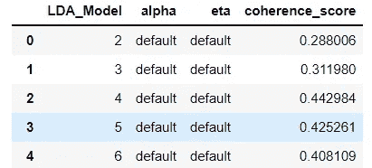
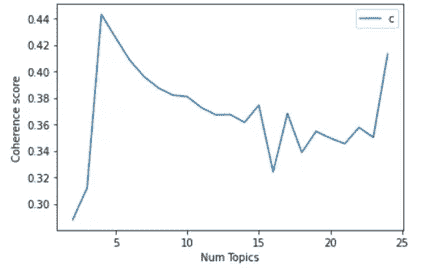
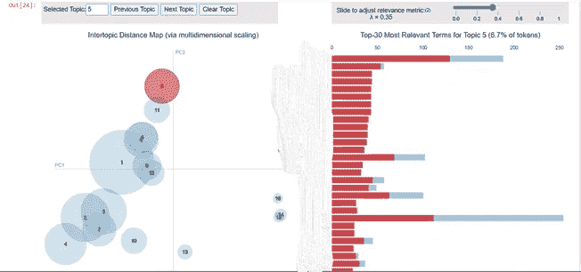
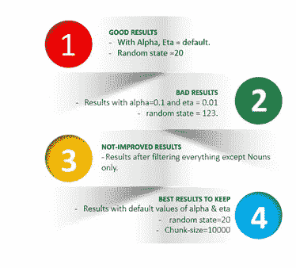

# 主题建模完全实用指南

> 原文：<https://towardsdatascience.com/topic-modelling-f51e5ebfb40a?source=collection_archive---------12----------------------->

## 使用 pyLDAvis 执行主题建模的完整指南


梅尔·普尔在 [Unsplash](https://unsplash.com?utm_source=medium&utm_medium=referral) 上的照片

**主题建模:** 这个 NLP 步骤的目的是理解输入数据中的主题，这些主题有助于分析文章或文档的上下文。该步骤还将进一步帮助使用在该步骤中跨每组相似文档生成的主题的数据标注需求。

这种无监督统计建模算法的主要目的是理解输入数据中的主题。

这一步真的很关键，也需要一定程度的数学理解。

用于执行主题建模的重要库有:Pandas、Gensim、pyLDAvis。

**用于生成主题的算法:LDA**

LDA(潜在狄利克雷分配)是一种生成统计模型，它允许一组观察值由未观察到的组来解释，这些组解释了为什么数据的某些部分是相似的。

*   它将文档视为一个单词集合或一个单词包。
*   LDA 假设文档由帮助确定主题的单词组成，然后通过将文档中的每个单词分配给不同的主题，将相似的文档映射到主题列表。

下面，我将讨论将数据输入 LDA 模型以生成文档主题的不同步骤。

**步骤 1:** 读取预处理后的数据集。

**步骤 2:** 读取 N-Grams

*   在这一步中，创建的函数将读取传递的文本文件并返回列表。
*   在同一步骤中，另一个函数将读取二元模型和三元模型，并返回 N_Grams 的列表

**步骤 3:** 生成组合 N_Grams

*   这一步将读取获得的 N_Grams，并使用' _ '返回组合的 N_Grams 列表。

**步骤 4:** 将组合的 N _ gram 映射到单独的 N _ gram

*   这一步将进行映射并返回字典。

**步骤 5:** 将 N_Grams 添加回数据集中每篇文章的文本中。

*   这一步将用组合的 N_Grams 替换文本中最初出现的 N_Grams。

例如:我已经为我的部落尝试了这么多种干粮。

**步骤 6:** 从输入文本中删除停用词。

*   这是至关重要的一步，因为这些词在定义主题时不起任何作用。

**第七步:**去掉标点符号。

*   我们实际上考虑了一些特殊字符(。,?！)对于我们未来的工作是有效的，但是主题建模步骤根本不需要标点符号。
*   记住！主题建模背后的思想是文档由主题组成，主题由单词组成。所以，没有必要在这里保留标点符号。

**步骤 8:** 标记化

*   将文本分解为标记列表，为主题模型创建字典和文档术语矩阵。
*   结果将是一个输入文本列表。

**步骤 9:** 根据 POS_Tags 过滤代币。

*   这个函数将使用 NLTK 标记对应于语料库中每个标记的部分语音。

**步骤 10:** 创建字典和文档术语矩阵

*   使用数据的符号化输入，并准备字典和文档术语矩阵。

**使用 LDA 的主题建模:** 主题建模是指识别最能描述一组文档的主题的任务。LDA 的目标是以某种方式将所有文档映射到主题，使得每个文档中的单词大部分被那些虚构的主题捕获。

**步骤-11:** 准备题目模型。

*   在不同 k 值上训练 LDA 模型
*   LDA 模型需要良好的内存和内核来加快训练速度。
*   因此，明智地选择块大小参数非常重要。
*   为了得到更好的结果，我已经运行这个模型 10 次了。
*   不要忘记保存所有的结果，因为有可能 10 个结果中的第一个是最好的。

**步骤-12:** 生成连贯性评分。

*   我已经为前 25 个 LDA 模型生成了一致性分数。
*   下面是 5 个 LDA 模型及其相应一致性分数的快照。



**可视化前 25 个 LDA 模型的一致性分数:**



*   因为从上面的视觉效果可以非常明显地看出，对于等于 4 的主题数量，一致性得分最高。

**LDA 模型结果:**

*   由于我不能真正展示主题和视觉效果，我突出了视觉效果的一些部分。
*   这是主题和主题 5 的关键字出现频率的可视化表示。



**LDA 模型的 4 个阶段:**

*   我花了一些时间对参数进行实验，得出了一些结果，我认为这些结果对将来超调 LDA 的参数非常有帮助，可以得到更好的结果。



请参考 [**完整代码**](https://colab.research.google.com/drive/1LxteCTYhwRNzJ9aCPn7sAqdj79KAm4-p?usp=sharing) 以便更好地理解。

## **主题建模的主要发现:**

*   从上面的实验和结果，我得出结论，没有名词过滤器的模型表现最好。
*   保持 alpha 和 eta 值等于默认值，以获得更好的结果。
*   我得到了 k=16 和没有过滤器的数据的最佳结果。
*   LDA 在小数据集上表现不佳。
*   由于内存/时间问题，LDA 几乎无法在大数据上运行。如果你有 64x 架构和 16 GB 或更大 RAM 容量的机器，它会运行得更好。
*   非常接近 0 的 lambda 值将显示对所选主题更具体的术语。这意味着我们将看到对特定主题“重要”但对整个语料库不一定“重要”的术语。
*   非常接近于 1 的λ值将显示那些在特定主题的术语的频率和来自语料库的术语的总频率之间具有最高比率的术语。
*   对于所提供的数据集，我使用 LDA 找到了 16 个独特的主题。
*   使用这个目标，我能够在每篇文章中找到覆盖文章大部分的最主要的主题。
*   我还看到了不同主题的文档数量，以及这些文档在同一主题中的相似程度。
*   结果真的令人印象深刻，因为主题是独特的和可分的。还包含了一组类似的文章，涵盖了每个独特的主题。

**挑战:**

*   LDA 的时间复杂度和不可发现的输出。

**得出结论，对 LDA 进行改进:**

*   经过一点研究，我发现 LDA 不适合小数据集。因为它是一种无监督的学习方法。我所说的小数据是指 100 篇文章或长度小于 50 个令牌的文章。因此，它可能无法很好地处理评论或评论数据。
*   用于创建字典& doc_term_matrix 的矢量化技术可能是不可发现输出的问题，需要重新考虑。我们应该在 word2vec()、doc2vec()和 doc2bow()技术之间进行试验。
*   而不是只在 LDA 中过滤名词。应该着手检查标记有不同 POS _ tags 的令牌。在我的例子中，POS_tags (CD，MD，POS，CJ，PRP，DT)已经被删除。
*   对于 POS_tags (VB，VBG，DT，PRP)，查看重要的标记，并在停用列表中提供其余不必要的标记。
*   我已经写了执行这个过滤的确切函数，它最终确实改善了结果。要查看那个函数，请参考[这里的**完整代码**](https://colab.research.google.com/drive/1LxteCTYhwRNzJ9aCPn7sAqdj79KAm4-p?usp=sharing) 。

为了改善结果，应该总是通过改变其参数值来进行实验。

希望这篇文章能对你有所帮助，解决大部分与 LDA 相关的问题。

感谢您的阅读。

所以，如果我的博客帖子对你有所帮助，而你此刻觉得很慷慨，请不要犹豫，请给我买杯咖啡。☕😍

[](https://www.buymeacoffee.com/techykajal)

是的，点击我。

```
And yes, buying me a coffee **(and lots of it if you are feeling extra generous)** goes a long way in ensuring that I keep producing content every day in the years to come.
```

您可以通过以下方式联系我:

1.  订阅我的 [**YouTube 频道**](https://www.youtube.com/channel/UCdwAaZMWiRmvIBIT96ApVjw) 视频内容即将上线 [**这里**](https://www.youtube.com/channel/UCdwAaZMWiRmvIBIT96ApVjw)
2.  跟我上 [**中**](https://medium.com/@TechyKajal)
3.  通过 [**LinkedIn**](http://www.linkedin.com/in/techykajal) 联系我
4.  跟随我的博客之旅:-[**https://kajalyadav.com/**](https://kajalyadav.com/)
5.  成为会员:[https://techykajal.medium.com/membershipT21](https://techykajal.medium.com/membership)

也可以看看我的其他博客:

</15-free-open-source-data-resources-for-your-next-data-science-project-6480edee9bc1>  </text-clustering-using-k-means-ec19768aae48> 