# 用 spaCy 和 Gensim 在 Python 中进行主题建模

> 原文：<https://towardsdatascience.com/topic-modelling-in-python-with-spacy-and-gensim-dc8f7748bdbf?source=collection_archive---------1----------------------->

## 关于无监督机器学习的主题建模的完整指南，发布在 GitHub 页面上

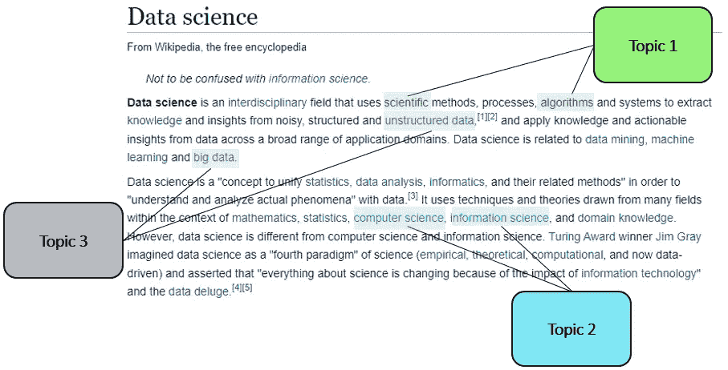

作者图片

# 介绍

黑客最近攻击了一家国际公司。他们复制了几千份文件，并把数据公布在黑暗网络上。该公司找到了我的雇主，问我们是否可以浏览这些数据，以评估文件中包含的信息类型。我的第一个想法是:主题建模。

主题建模是一种从大量文本中提取隐藏主题的技术。我将介绍的技术被归类为无监督的机器学习算法。该算法的名称是潜在的狄利克雷分配(LDA ),是 Python 的 Gensim 包的一部分。

LDA 是由 Blei 等人在 2003 年首先开发的。LDA 是一种类似于朴素贝叶斯的生成概率模型。它将主题表示为单词概率，并允许发现潜在的或隐藏的主题，因为它基于单词在相应文档中的共现来聚类单词。

# 该过程

使用市场上最先进的工具(即 PowerPoint)，我创建了下面的图像，描绘了整个过程。我将从收集文档开始这个过程(步骤 1)；之后，我将进行一些数据清理，并将所有文档分解成令牌(步骤 2)。从这些标记中，我可以构建一个字典，为每个标记提供一个惟一的 ID 号，然后可以使用这个 ID 号创建一个语料库或单词包来表示这些标记的频率(步骤 3)。我使用我的字典和语料库建立一个主题范围，并试图找到主题的最佳数量(步骤 4)。最后一步是找到每个文档中主题的分布(步骤 5)。

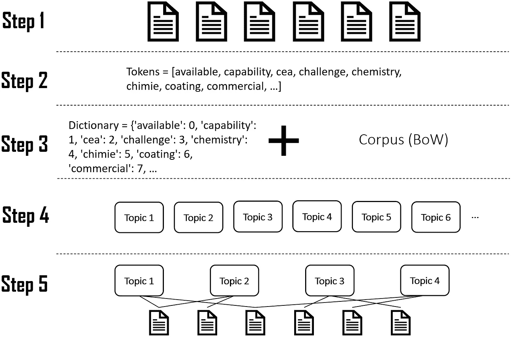

作者图片

在我们开始上面的可视化步骤之前，我将要求您浏览下面的代码，并确保所有的东西都已安装和导入。

```
!pip install pyLDAvis -qq
!pip install -qq -U gensim
!pip install spacy -qq
!pip install matplotlib -qq
!pip install seaborn -qq
!python -m spacy download en_core_web_md -qqimport pandas as pd
import matplotlib.pyplot as plt
import seaborn as sns
sns.set()
import spacy
import pyLDAvis.gensim_models
pyLDAvis.enable_notebook()# Visualise inside a notebook
import en_core_web_md
from gensim.corpora.dictionary import Dictionary
from gensim.models import LdaMulticore
from gensim.models import CoherenceModel
```

## 收集数据(步骤 1)

我将使用的数据包含 500 个不同报告的概述，包括它们的摘要。我已经在我的 GitHub 上提供了这些数据，所以请随意跟随或下载数据并编辑 URL。

```
reports = pd.read_csv('https://github.com/sg-tarek/Python/raw/main/cordis-h2020reports.gz')reports.head()
```

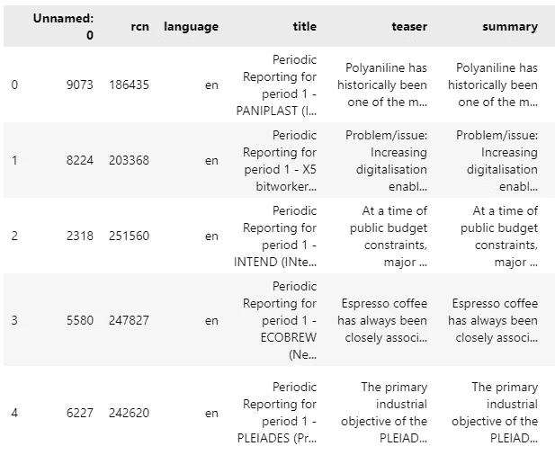

作者图片

上面的代码片段只显示了前六列，尽管数据总共包含十五列。

```
reports.info()
```

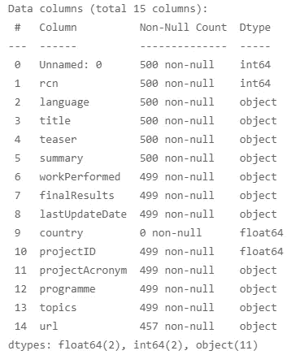

作者图片

## 预处理数据(步骤 2)

在自然语言处理领域，文本预处理是清理和准备文本数据的实践。我将使用一个名为 spaCy 的开源软件库来准备用于分析的数据，但是也可以使用其他库，比如 NLTK。

我之前告诉过你要导入并下载一个叫做“en_core_web_md”的东西，这是 spaCy 预先训练好的模型。这个模型，我称之为“nlp”，可以被认为是一个管道。当您对文本或单词调用“nlp”时，文本会通过一个处理管道运行，如下图所示。这意味着，如果文本没有被标记化，那么它将被标记化，然后，不同的组件(标记器、解析器、ner 等。)将被激活。将文本标记化意味着将字符串或文档转换成更小的块(标记)。

该模型经过专门的英语文本训练(注意模型名称中的“en”)，使其能够检测不同的英语单词。也支持其他语言模型。

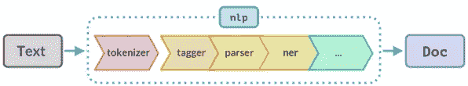

空间的[管道](https://spacy.io/usage/processing-pipelines)

管道中最有趣的组件是 tagger，它根据 SpaCy 的英语语言模型分配词性(POS)标签，以获得各种注释。词性标签(或词性标签)是分配给文本语料库中每个标记的特殊标签，用来表示标记的类型(是形容词吗？标点符号？一个动词？等等。)以及其他语法范畴，如时态、数(复数/单数)、符号等。词性标签用于语料库搜索和文本内分析工具和算法。

下面列出了一些 POS 标签:

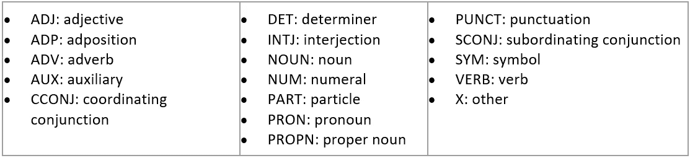

POS [标签](https://universaldependencies.org/u/pos/)

我们可以使用 POS 标签通过删除不需要的标签来预处理数据。假设我们想删除文本中的所有数字，我们可以指向一个特定的标签并删除它。

我将把重点放在“摘要”一栏上，在这里我将标记化、词汇化并删除停用词:

```
# Our spaCy model:
nlp = en_core_web_md.load()# Tags I want to remove from the text
removal= ['ADV','PRON','CCONJ','PUNCT','PART','DET','ADP','SPACE', 'NUM', 'SYM']tokens = []
for summary in nlp.pipe(reports['summary']):
   proj_tok = [token.lemma_.lower() for token in summary if token.pos_ not in removal and not token.is_stop and token.is_alpha]
   tokens.append(proj_tok)
```

扩展知识的注意事项:

*   您可能会注意到“is_alpha”和“is_stop”，它们是连接到特定令牌的属性；你可以在这里看完整名单:【https://spacy.io/api/token】T4
*   另一点是“nlp.pipe”，它专门用于将文本作为字符串序列进行处理。这比逐个处理文本要高效得多。如果你只是处理一个单一的文本，只需删除。管道延伸。来源:[https://spacy.io/usage/processing-pipelines](https://spacy.io/usage/processing-pipelines)

让我们通过创建一个新列来将令牌带回到报告中:

```
reports[‘tokens’] = tokens
reports[‘tokens’]
```

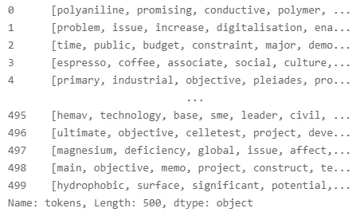

作者图片

## **创建词典和语料库(步骤 3)**

LDA 主题模型的两个主要输入是词典和语料库:

*   字典:字典的思想是给每个令牌一个惟一的 ID。
*   语料库:为每个令牌分配了惟一的 ID 后，语料库只包含每个 ID 及其频率(如果您想深入研究，那么可以搜索单词包(BoW ),它将向您介绍单词嵌入)。

```
# I will apply the Dictionary Object from Gensim, which maps each word to their unique ID:
dictionary = Dictionary(reports['tokens'])
```

您可以打印字典，它会告诉您找到了 8848 个唯一 ID。我们可以看看分配给令牌的一些 id:

```
print(dictionary.token2id){‘available’: 0, ‘capability’: 1, ‘cea’: 2, ‘challenge’: 3, ‘chemistry’: 4, ‘chimie’: 5, ‘coating’: 6, ‘commercial’: 7, ‘company’: 8, ‘compliant’: 9, ‘concentrated’: 10, ‘conductive’: 11, ‘conductivity’: 12, ‘cost’: 13, ‘demand’: 14, ‘design’: 15, ‘dispersion’: 16, ‘easily’: 17,…
```

我将过滤掉低频和高频词汇，并将词汇量限制在 1000 个单词以内:

```
dictionary.filter_extremes(no_below=5, no_above=0.5, keep_n=1000)
```

*   No_below:过滤掉出现在少于 5 个文档中的标记。
*   No_above:出现在超过 50%的总语料库中的标记也被默认移除。
*   Keep_n:我们限制自己使用前 1000 个最常用的令牌(默认值为 100.000)。如果您想全部保留，请设置为“无”。

我们现在准备使用上面的字典和 doc2bow 函数来构建语料库。函数 doc2bow()简单地计算每个不同单词的出现次数，将单词转换为其整数单词 id，并将结果作为稀疏向量返回:

```
corpus = [dictionary.doc2bow(doc) for doc in reports['tokens']]
```

## 模型构建(步骤 4)

下一步是在数据上训练无监督的机器学习模型。我选择使用 LdaMulticore，它使用所有的 CPU 内核来并行化和加速模型训练。如果出于某种原因，这对您不起作用，请尝试 gensim . models . LDA model . LDA model 类，它是一个等效的、但更简单的单核实现。

当将我们的语料库插入主题建模算法时，对语料库进行分析，以便找到每个主题中的单词分布和每个文档中的主题分布。

```
lda_model = LdaMulticore(corpus=corpus, id2word=dictionary, iterations=50, num_topics=10, workers = 4, passes=10)
```

作为输入，我给了模型我们以前的语料库和词典；此外，我选择在语料库上迭代 50 次来优化模型参数(这是默认值)。我选择主题的数量为 10 个，工人的数量为 4 个(通过按 ctr+shift+esc 键找到您的 PC 上的内核数量)。pass 是 10，这意味着模型将在训练期间通过语料库十次。

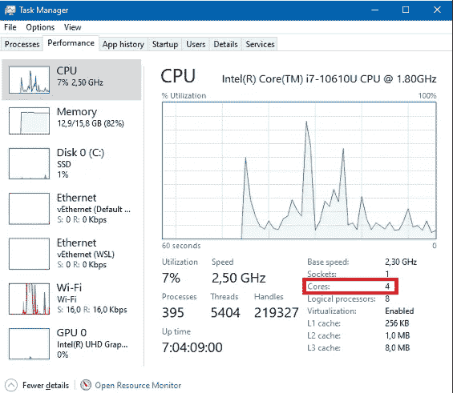

作者图片

## 话题的最佳数量是多少？

训练完模型后，下一步自然是评估它。在构建了主题之后，可以计算连贯性分数。分数衡量每个主题中的高分单词之间的语义相似程度。以这种方式，通过插入不同数量的主题，可以为每次迭代计算一致性分数。

已经引入了一系列算法来计算一致性分数(C_v、C_p、C_uci、C_umass、C_npmi、C_a、…)。使用 gensim 库使得为主题模型计算这些一致性度量变得相当简单。我个人选择实现 C_v 和 C_umass。C_v 的相干分数范围从 0(完全不相干)到 1(完全相干)。根据约翰·麦克里维的说法，高于 0.5 的值相当好(来源:做计算社会科学:约翰·麦克里维的实用介绍)。另一方面，C_umass 返回负值。

下面我简单地遍历不同数量的主题，并将一致性分数保存在一个列表中。后来，我用 seaborn 绘图。

*   使用 C_umass 计算一致性分数:

```
topics = []
score = []for i in range(1,20,1): lda_model = LdaMulticore(corpus=corpus, id2word=dictionary, iterations=10, num_topics=i, workers = 4, passes=10, random_state=100) cm = CoherenceModel(model=lda_model, corpus=corpus, dictionary=dictionary, coherence='u_mass') topics.append(i)
   score.append(cm.get_coherence())_=plt.plot(topics, score)
_=plt.xlabel('Number of Topics')
_=plt.ylabel('Coherence Score')
plt.show()
```

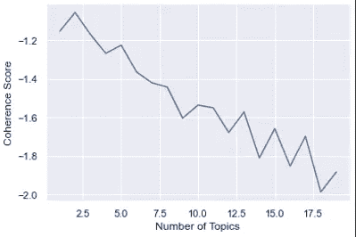

作者图片

*   使用 C_v 计算一致性分数:

```
topics = []
score = []for i in range(1,20,1): lda_model = LdaMulticore(corpus=corpus, id2word=dictionary, iterations=10, num_topics=i, workers = 4, passes=10, random_state=100) cm = CoherenceModel(model=lda_model, texts = reports['tokens'], corpus=corpus, dictionary=dictionary, coherence='c_v') topics.append(i)
   score.append(cm.get_coherence())_=plt.plot(topics, score)
_=plt.xlabel('Number of Topics')
_=plt.ylabel('Coherence Score')
plt.show()
```

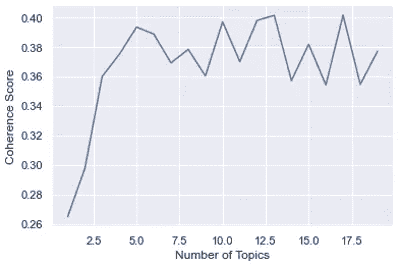

作者图片

当使用 C_umass 或 C_v 算法查看相干性时，最好的通常是最大值。看着图表，我选择了 5 个主题，虽然没有确定的答案。

```
lda_model = LdaMulticore(corpus=corpus, id2word=dictionary, iterations=100, num_topics=5, workers = 4, passes=100)
```

## 打印和可视化主题(步骤 5)

我们现在可以打印出五个主题和相关的单词:

```
lda_model.print_topics(-1)
```

*   [( **0** ，' 0.015* "基准"+ 0.013* "服务"+ 0.010* "研究"+ 0.010* "支持"+ 0.009* "欧洲"+ 0.009* "网络"+ 0.009* "社交"+ 0.009* "人"+ 0.008* "提供"+ 0.008* "平台"')，
*   ( **1** ，' 0.021* "疾病"+ 0.016* "病人"+ 0.015* "健康"+ 0.015* "临床"+ 0.012* "治疗"+ 0.012* "研究"+ 0.010* "药物"+ 0.010* "癌症"+ 0.009* "系统"+ 0.009* "护理"')，
*   ( **2** ，' 0.021* "系统"+ 0.015* "技术"+ 0.013* "市场"+ 0.013* "能量"+ 0.012* "高"+ 0.012* "成本"+ 0.010* "产品"+ 0.010* "流程"+ 0.009* "基础"+ 0.009* "解决方案"')，
*   ( **3** ，' 0.034* "细胞"+ 0.013* "学习"+ 0.013* "植物"+ 0.012* "新"+ 0.012* "了解"+ 0.010* "机制"+ 0.009* "过程"+ 0.009* "人"+ 0.008* "发展"+ 0.008* "目标"')，
*   ( **4** ，' 0.026* "研究"+ 0.024* "创新"+ 0.016* "中小企业"+ 0.015* "市场"+ 0.013* "新"+ 0.012* "业务"+ 0.011* "计划"+ 0.011* "合作伙伴"+ 0.011* "支持"+ 0.010* "发展" ')]

让我们来看看我们的第一份报告摘要:

```
reports['summary'][0]“Polyaniline has historically been one of the most promising conductive polymers from a cost/performance perspective, but processing issues have limited its uptake. Building upon seminal work on polyaniline performed at the CEA, RESCOLL (an independent research company based in France specialized in chemistry materials) has developed and patented a new electrically conductive polyaniline formulation under the trade name of PANIPLAST™….”
```

根据我们的 LDA 模型，上述文本属于主题 2 和主题 4。文章 87%属于话题 2(索引 1)，12%属于话题 4(索引 3)。

```
lda_model[corpus][0][(2, 0.870234), (4, 0.122931786)]
```

让我们想象一下主题和每个主题中的单词。就像我们在上面看到的一样，但是请注意，圆圈中的数字与上面“print_topics”中的数字不一致:

```
lda_display = pyLDAvis.gensim_models.prepare(lda_model, corpus, dictionary)
pyLDAvis.display(lda_display)
```

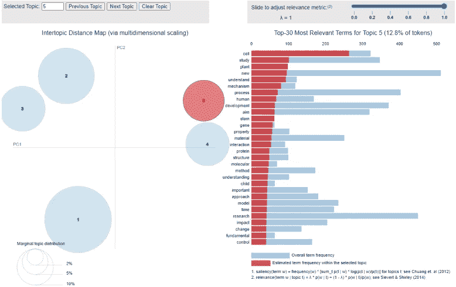

作者图片

上图用圆圈代表了我们的五个主题。它们是用一种叫做 PCA 的降维技术画出来的。目标是有一个距离，以避免重叠，并使每个圆都是独一无二的。当我将鼠标悬停在一个圆圈上时，右边会显示不同的单词，显示所选主题中的词频(蓝色)和估计词频(红色)。彼此越接近的话题越有关联。

## **向数据框架添加主题**

我们可以在数据框架中创建一个新的列，它包含每篇文章所属的最可能的主题。我们可以通过浏览每个摘要文本来添加最可能的主题:

```
reports['topic'] = [sorted(lda_model[corpus][text])[0][0] for text in range(len(reports['summary']))]
```

我们来统计一下每个话题出现的频率:

```
reports.topic.value_counts()
```

计数显示:

*   话题 1: 320
*   话题二:86
*   话题 3: 57
*   话题 4: 19
*   话题 5: 18

这与之前的视觉化非常一致。

## 完整的代码如下所示:

# 在 GitHub 页面上发布

我们可以通过上传到 GitHub 页面来分享我们的主题可视化。点击[此处](https://sg-tarek.github.io/Topic-Modelling/)查看我的话题并与之互动。

第一步是下载我们之前创建的 HTML 格式的可视化。由于 GitHub 页面将会寻找一个具有此名称的文件，因此保持名称为 index.html 是很重要的:

```
pyLDAvis.save_html(lda_display, ‘index.html’)
```

您需要编辑索引文件以使其正常工作。该文件包含大量的 HTML 代码，不管内容如何，复制下面的行并将其添加到您的文件中。注意，一些代码在顶部，而

```
<!DOCTYPE html> 
  <html lang="en">      
  <body>LDA CODE GOES HERE! </body>
  </html>
```

下一步是在 GitHub 上创建一个新的存储库，并对 repo 使用以下命名约定:

> ***<用户名>. github . io***

然后，将您的 index.html 文件放到 repo 中，并访问与 repo 同名的主题建模可视化: <username>.github.io</username>

我希望你像我喜欢写这篇文章一样喜欢它。如果你理解我的代码有任何困难，请留下评论。数据科学社区给了我很多，所以我总是乐于回馈。

请随时在 Linkedin[上与我联系，并在 Medium 上关注我以接收更多文章。](https://www.linkedin.com/in/tarekghanoum/)

## 进一步阅读的灵感

<https://medium.com/@soorajsubrahmannian/extracting-hidden-topics-in-a-corpus-55b2214fc17d>  

[https://aclanthology.org/D11-1024.pdf](https://aclanthology.org/D11-1024.pdf)