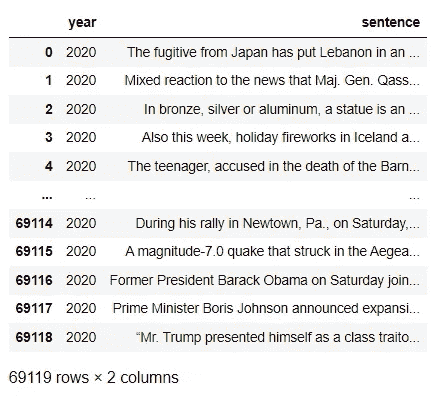
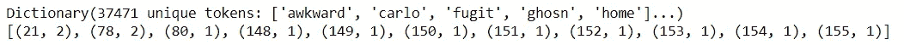
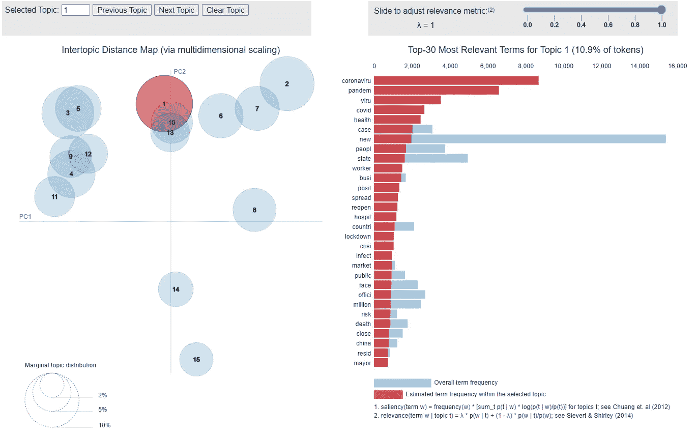

# 使用 Gensim，LDA 对 NYT 文章进行主题建模

> 原文：<https://towardsdatascience.com/topic-modelling-on-nyt-articles-using-gensim-lda-37caa2796cd9?source=collection_archive---------33----------------------->

[菠萝供应公司](https://unsplash.com/@pineapple?utm_source=medium&utm_medium=referral)在 [Unsplash](https://unsplash.com?utm_source=medium&utm_medium=referral) 上的照片

## NYT 文章主题建模指南，了解趋势

假设给你一个文本数据，要求你找出这个文本数据是关于什么的。快速浏览一下数据就可以了。现在想象一下，必须浏览大量的文本文档才能理解它的内容。乏味，对吗？在这种情况下，主题建模可以派上用场。

主题建模的其他有趣应用是索引研究论文，帮助研究人员跟踪研究趋势和识别要阅读的论文；推荐系统通过对产品评论的聚类和情感分析来匹配用户和新闻文章。

在本文中，我们将了解主题建模的本质，并使用名为 Gensim 的 python 库对 2020 年的《纽约时报》文章进行主题建模。

文章的流程如下:

1.  主题建模简介
2.  实现主题建模的要素
    a. Gensim，一个执行各种 NLP 任务的 python 库
    b. LDA，最流行的主题建模算法之一
3.  实现 LDA
    a .预处理数据
    b .创建字典和语料库
    c .执行 LDA
    d .可视化结果
4.  进一步增强

# 1.主题建模简介

主题建模允许我们理解高维文本数据，并通过给出每个主题的关键词来识别我们的文本数据的主要主题。这样提取的主题可以用于从文本数据中获得有意义的见解。主题也可以用于给下一个模型(可以是监督学习)额外的分析提升。

在深入研究这个过程之前，有几个术语需要了解。

*   **文档:**每个文本文件(我们案例研究中的文章)
*   **语料库:**所有文档的集合
*   **字典:**每个唯一单词到唯一索引的映射集合

> **假设**:每个文档都与语料库相关，没有文档是从语料库中孤立出来的

在执行任何自然语言处理任务时，我们必须在将数据提供给模型之前对文本数据进行预处理，因为预测和数据一样好。同样，在这里，我们首先预处理文本数据，然后对预处理的数据进行主题建模。在这个案例研究中，我们从模型中看到的两个结果是，

1.  每篇文章映射到一个独特的主题
2.  每个主题都有一组构成特定主题的关键字

**实现最佳效果的重点领域**如下:

1.  处理数据的**技术，以确保只有重要的信息进入模型，因为模型预测只与我们训练它的数据一样好。**
2.  **根据我们为每个模型获得的一组关键词来解释主题**的能力。

因此，选择正确的预处理方法和拥有领域知识来理解主题建模的结果是至关重要的。

# 2.实现主题建模的要素

## a.根西姆

Gensim 是一个令人惊叹的开源 python 库，用于无监督主题建模和自然语言处理。Gensim 设计用于处理大型文本集合。

## b.皱胃向左移

主题建模算法，例如我们在本文中将要使用的潜在狄利克雷分配(LDA ),是一组基于自然语言处理的模型，用于在巨大的文本语料库中检测潜在的主题。LDA 中的*潜伏*是指发现 ***隐藏的*** 主题，*狄利克雷*是 ***概率分布*** 用来理解一个关键字和主题是如何关联的。

LDA 使用每个文档中的主题概率和每个主题中的单词概率，将每个文档(在我们的例子中是新闻文章)分配给一个唯一的主题，并将每个主题分配给一组关键字。

## LDA 的内部

1.  选择主题数量(输入参数)
2.  LDA 将每个单词随机分配给一个主题号
3.  遍历每个文档计算以下两个概率:
    ***a .文档中的主题:*** 文档属于每个主题的概率
    ***b .主题中的单词:*** 对每个主题有贡献的单词的概率
4.  基于来自步骤 3 的概率分数，'*通过次数*'，一个输入参数，times，重新分配单词以产生主题号和具有主题号的文档。

Gensim 提供了一个函数 *LDAModel* ，该函数在很少或没有指令的情况下完成上述所有步骤。然而，我们可以调整各种参数来获得所需的输出。

# 3.实施 LDA

本案例研究中使用的数据集是 2020 年的[纽约时报文章数据](https://www.kaggle.com/tumanovalexander/nyt-articles-data?select=df_2020.csvhttps://www.kaggle.com/tumanovalexander/nyt-articles-data?select=df_2020.csv)。该数据集包含大约 *69k* 个数据点。

下图显示了数据的快照。

文章数据快照(图片由作者提供)

列' *year'* 可以忽略，因为我们只使用 2020 年的数据。列'*句子*'具有句子级别的文章数据。

我们将首先预处理*句子*列，然后将 Gensim 中的 LDA 模型应用于预处理后的数据。

## a.预处理数据

预处理文本数据不是一步到位的过程，因为它包含冗余和/或重复的单词，必须经过大量的清理。此外，这个过程有时取决于我们寻求的目标。

这个阶段包括删除对文本意义没有附加值的单词或字符**、**。让我们在下面逐一讨论:

*   **降低文本**的大小写是必要的，原因如下:
    单词“选举”、“选举”和“选举”都给句子增加了相同的值。降低所有单词的大小写有助于通过减少词汇的大小来减少维度。
*   删除任何标点符号将有助于处理像“万岁”和“万岁！”这样的词同理。
*   停用词是语言中经常出现的词，如“the”、“a”、“an”、“is”。我们可以在这里删除它们，因为它们不会为我们的分析提供任何有价值的信息。另外**删除停止字**减少了数据的维度。
*   在本案例研究中，当我们寻找构成主题的关键词时，数字不会增加任何价值。因此，我们正在从数据中删除数字。

我们可以使用 Gensim 执行上述所有操作。Gensim 提供了一个函数， ***preprocess_string，*** 提供了最广泛使用的文本数据预处理技术。该函数提供的默认技术(过滤器)如下:

1.  strip_tags()，
2.  strip _ 标点符号()，
3.  strip_multiple_whitespaces()，
4.  strip_numeric()，
5.  remove_stopwords()，
6.  strip_short()，
7.  stem_text()

使用下面的单行代码，我们可以使用默认过滤器对整个文本数据进行预处理。

## b.词典和语料库的创建

让我们创建一个字典和一个单词语料库包，作为输入传递给模型。

*   ***字典*** :收集所有独特的单词
*   ***bow_corpus*** :将整个语料库中的每个单词转换成单词包。单词包是通过使用唯一单词的字典将文档简单转换为向量，在字典中我们可以获得每个单词的频率。

字典和 bow_corpus 的快照(图片由作者提供)

## c.LDA 模型

我们把 ***字典*** 和 ***bow_corpus*** 传递给 Gensim 提供的 LDA 模型，由它做每个句子的主题建模。

下面是使用 LDA 执行主题建模的代码行。

## d.可视化结果

有许多方法可以用来可视化的结果，如 tSNE，文字云，条形图。我们将使用 ***pyLDAvis*** 来可视化我们的 LDA 模型，因为它是查看结果的最具交互性的工具之一。

下面是用于显示 LDA 模型结果的代码。

pyLDAvis 可视化主题，每个主题有前 30 个相关术语(图片由作者提供)

每个气泡代表一个主题。每个主题的大小显示了主题的受欢迎程度，各个主题的接近程度显示了主题之间的相似性。

正如我们所看到的，最常见的话题是电晕、病毒、疫情，我们知道这是 2020 年全球讨论最多的话题。

看到结果，我们可以断言，我们创建了一个非常好的模型，能够将主要新闻识别为最受欢迎的话题。

# 4.进一步增强

如前所述，模型性能高度依赖于预处理。我们可以使用领域知识和各种文本处理技术来改进预处理——比如词性标注，生成单词的二元/三元模型。

我们也可以从观想中看到，有几个主题彼此非常接近。当我们减少主题的数量时，这样相似的主题就会聚集到同一个主题中，这使得主题更具排他性。这可以根据我们的目标进行调整。

# 摘要

在这篇文章中，我们了解了主题建模是什么，为什么和如何。使用 python 库、Gensim 和 Gensim 的 LDA 对 2020 年的《纽约时报》文章进行预处理和主题建模。使用 pyLDAvis 生成结果的交互式可视化。该模型的性能与预先定义的参数是令人满意的。

感谢阅读！我也将在未来写更多初学者友好的帖子。请在[媒体](https://medium.com/@ramyavidiyala)上关注我，以便了解他们。我欢迎反馈，可以通过 Twitter [ramya_vidiyala](https://twitter.com/ramya_vidiyala) 和 LinkedIn [RamyaVidiyala](https://www.linkedin.com/in/ramya-vidiyala-308ba6139/) 联系我。快乐学习！