# 用变形金刚生成主题语言

> 原文：<https://towardsdatascience.com/topical-language-generation-with-transformers-69aac8ee774a?source=collection_archive---------18----------------------->

## 控制大型语言模型的生成能力是一项重要的任务，需要在现实世界中使用。

作者图片

[全文](https://arxiv.org/abs/2103.06434)

[代码](https://github.com/roholazandie/topical_language_generation)

基于大规模转换器的语言模型(LMs)在开放文本生成方面展示了令人印象深刻的能力。然而，控制生成的文本的属性，例如主题、风格和情感，是具有挑战性的，并且通常需要对模型架构进行重大改变，或者根据新的监督数据对模型进行重新训练和微调。

我们通过将预先训练的语言模型与主题建模信息相结合来引入主题语言生成(TLG)。我们使用贝叶斯概率公式来解决这个问题，主题概率作为先验，LM 概率作为似然，主题语言生成概率作为后验。在学习模型时，我们从用户提供的文档的自然结构中导出主题概率分布。此外，我们通过引入新的参数和函数来影响生成文本中主题特征的数量，从而扩展了我们的模型。这个特性将允许我们轻松地控制生成文本的主题属性。

## 语言建模和解码

自然语言处理中语言生成的应用可以分为两大类:定向语言生成和开放式语言生成。定向语言生成包括将输入转换为输出，如机器翻译、摘要等。这些方法需要输入和输出之间的一些语义对齐。另一方面，开放式语言生成在生成过程中有更多的自由，因为它不需要与任何输出保持一致。开放式语言生成在条件故事生成、对话系统和预测响应生成中具有应用。尽管与定向语言生成相比，在选择下一个标记时有更多的灵活性，但是控制所生成文本的顶级特征是需要解决的期望属性，并且仍然是一个具有挑战性的问题。

给定 m 个记号 x_1 的序列，..，x_m 为上下文，开放式语言生成问题可以表述为寻找具有 n 个标记的延续 x_{m+1}，…，x_{m+n}。换句话说，如果我们考虑整个上下文加上延续如下:

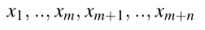

语言建模概率可以使用链式规则分解为:

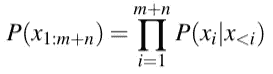

语言建模概率可以与*解码策略*一起使用，以生成用于语言生成的下一个令牌。寻找最佳延拓可以被公式化为:

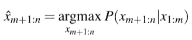

求解上述方程是不容易的，因此实际的解码策略使用近似来产生下一个记号。最著名和最广泛使用的解码策略是贪婪解码和波束搜索方法。贪婪解码在每个时间步长选择最高概率的记号，而波束搜索保持一组假设，然后随着它的通过更新假设中的记号，并解码更多的记号。这些方法非常适合于定向语言生成，但是它们受到重复、泛化和退化延续的困扰。

这两种方法都是确定性的，因为它们的算法中不包含任何随机选择。

另一方面，随机解码方法从依赖于模型的分布 q 中采样:

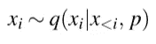

最简单的随机采样包括从顶部 k 个概率中进行采样，常数 k 的使用是有问题的，因为在一些情况下，下一个记号的概率分布是平坦的，这意味着有大量合理的下一个记号可供选择，但是在一些其他情况下，分布集中在少数记号中。为了解决这个问题，(Holtzmanet et al .(2020))提出了细胞核采样。在这种方法中，词汇的子集被定义为最小集合 V(p ),使得:

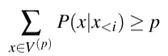

那么基于新词汇的结果分布应该被重新缩放以形成概率分布。在 Nucleus 采样下，似是而非的下一个记号的数量随着上下文和生成的记号而动态变化。在这项工作中，我们使用核采样作为基本解码技术，并提出了一种新的方法来考虑主题知识的令牌。

## 主题语言建模

给定 K 个主题的列表 t = {1…K}，为了控制语言模型的输出以遵循某个主题，在每个生成步骤，我们必须对以下概率分布进行建模:

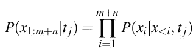

与之前的等式相比，唯一的区别是它以主题 t_j 为条件。为了创建等式 6 的右侧，我们更改了创建逻辑的网络的最后一层。

这里，我们采用 GPT 变压器架构。如果 S 是最后一层，我们使用 softmax 来获得最终概率:

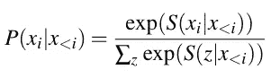

我们可以使用 P(x_i|x

*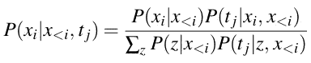*

*因为在主题建模中，文档被视为单词包，所以我们还可以假设每个标记的主题概率独立于先前生成的标记。基于这一假设，我们有:*

*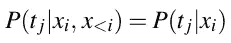*

*现在，假设我们有 P(t_j|x_i ),那么使用等式 10 我们可以证明主题语言模型的条件可以写成:*

*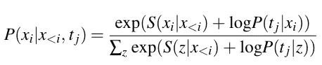*

*要获得完整的证明，请参考这篇论文。*

## *主题建模*

*主题建模算法自动从文本数据集合中提取主题。它们基于发现贯穿文档的主题的统计无监督模型。我们在主题建模中使用两种主要算法。*

*   *LDA(潜在狄利克雷分配):LDA 背后的基本思想是，在一个文档集合中，每个文档都有多个主题，每个主题都有一个概率分布。此外，每个主题在词汇上都有分布。例如，文档可以是关于“足球”、“新闻”和“美国”的主题，并且“足球”的主题可以包含包括“NFL”、“足球”、“团队”的单词，与其他单词相比，这些单词具有更高的概率。给定词汇为 V 的 M 个文档的集合，我们可以将主题的数量固定为 K。在 LDA 中，每个文档的主题和标记的主题的概率可以分别用矩阵形式θ_M×K 和φ_K×|V|来概括。学习之后，我们有了每个标记的主题分布，因此我们可以写:*

*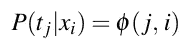*

*   *LSI(潜在语义索引):LSI 是将奇异值分解方法应用于单词-文档矩阵，行和列分别代表单词和文档。设 X_|V|×M 是记号-文档矩阵，使得 X_{i，j}是记号 I 在文档 j 中的出现，则奇异值分解可用于找到低秩近似:*

**

*分解之后，U 仍然有相同数量的行作为标记，但是有更少的列来表示通常被解释为“主题”的潜在空间。因此，归一化 U 给我们每个主题的每个标记的分数。我们可以使用这个分数来计算词汇表中每个标记 I 的主题 j 的概率:*

*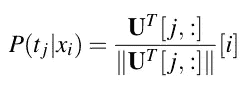*

## *可控生成方法*

*上面等式中的条件主题语言模型为我们提供了一个以特定主题为条件的令牌生成，但我们无法控制影响的大小。*

*1-添加话题参数和 logit 阈值:将 log(P(t_j|x_i))项直接添加到来自模型的实际 logit 中，在某些情况下会恶化生成文本的流畅性。我们提出两种方法来缓解这个问题。我们引入一个新的参数γ来控制主题分布的影响:*

*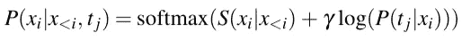*

*γ值越高，生成的主题文本越多，因为最终概率更多地取决于 log(P(t_j|x_i))而不是基本语言建模的 logit。*

*另一种方法是用阈值来削减主题的对数概率。S 的较低值对应于模型给出非常低概率的记号，我们不想改变它们，因为它引入了不想要的记号并降低了流畅性。在上面的等式中，对于所有大于阈值的 S 值，我们只保留 log(P(t_j|x_i))。*

*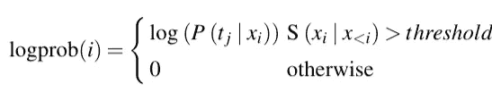*

*和 log prob，用于以下等式:*

*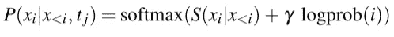*

*阈值的较低值与更多的主题文本生成相关，因为我们通过 log(P(t_j|x_i))从原始模型改变了更多的标记。*

*2-使用α-entmax 而不是 soft max:soft max 函数的问题是，它给了许多不必要和不可信的令牌非零的概率。softmax 函数是密集的，因为它与 exp 函数成比例，并且永远不会在输出中给出精确的零概率。相反，我们使用α-entmax 来创建更稀疏的概率，这些概率不容易退化文本。α-entmax 定义为*

*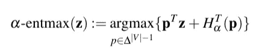*

*其中:| V | 1:= { p∈IR | V | 1，∑IPI = 1 }是概率单形，对于α≥1，HTα(p)是 Tsallis 熵，它定义熵族如下:*

*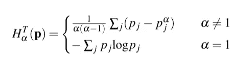*

*α-entmax 是 softmax 函数的广义形式。特别地，对于α=1，它精确地降低到 softmax 函数，并且随着α的增加，输出概率的稀疏度连续增加。这里，我们特别感兴趣的是α=2，它导致 sparsemax:*

*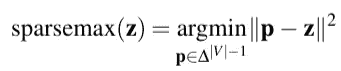*

*与 softmax 函数不同，sparsemax 可以分配零概率。*

*3-增加温度和重复惩罚参数:我们需要对基核采样做一些改变，以控制基分布平坦度，防止其产生重复字。我们将上述更改后的最终 logit 表示为 ui。给定温度、重复惩罚 r 和生成的标记列表 g，采样的最终概率分布为:*

*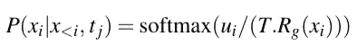*

*当 T→0 时，采样简化为贪婪采样；而如果 T→∞，则分布变得更平坦和更随机。受惩罚的采样不鼓励绘制已经生成的记号。*

## *具有不同主题的主题文本生成*

*TLG 的最大好处之一是它可以用于不同的语言模型，而无需对基础模型进行任何重新训练或微调，然而，要生成主题文本，我们需要从文本语料库中提取主题。为了训练主题模型，我们使用了 Alexa 主题聊天数据集。这个数据集包含从政治、音乐到体育的各种话题的对话和知识库。我们不使用数据集中主题的标签，而是使用我们的 LDA 和 LSI 主题模型自动提取它们。这种无监督的方法使我们能够灵活地处理任何原始文本语料库。*

*在这个实验中，使用了一个固定的中性提示来确保模型不受少数初始标记的限制。下表中的结果表明，从主题建模输出中选择主题后，该模型可以创建长的、连贯的和流畅的文本延续，而无需手动注入来自其他资源的额外知识或通过对标记数据集的训练。*

*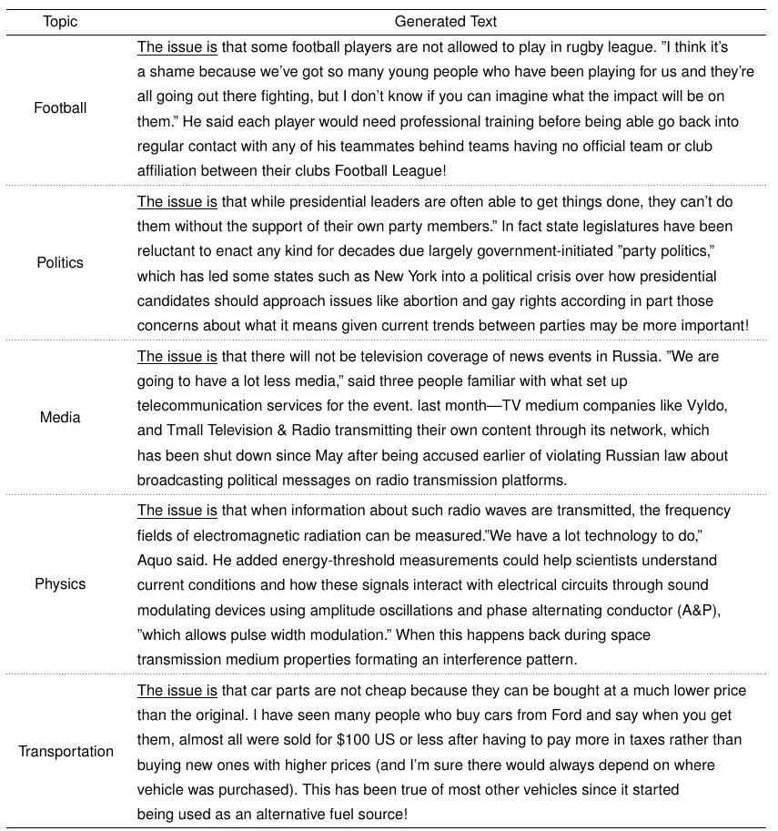*

*作者图片*

## *超参数对 TLG 的影响*

*在我们提出的方法中，我们可以使用γ和阈值作为旋钮参数来控制主题对语言生成过程的影响。更具体地说，基于等式 27，更高的伽马值将导致更多的主题结果。此外，较低的阈值与更多的主题语言生成相关。在极限中，如果我们设置γ=0，threshold=0TLG 就还原为没有任何主题的原始语言模型。但是，我们的实验表明，改变γ值比改变阈值对生成文本的流畅性危害更小。这是因为阈值化可以容易地切断与词汇表中的函数标记(如停用词)相关的概率，这损害了模型的流畅性。下图演示了在固定主题(足球)上使用不同的γ值和阈值进行语言生成。为了显示每个词汇在主题中所占的比重，我们使用了颜色编码，颜色越深，主题词越多。我们跳过了解码的最后阶段。这就是为什么可以看到来自字节对编码(BPE)标记化的单个标记。*

*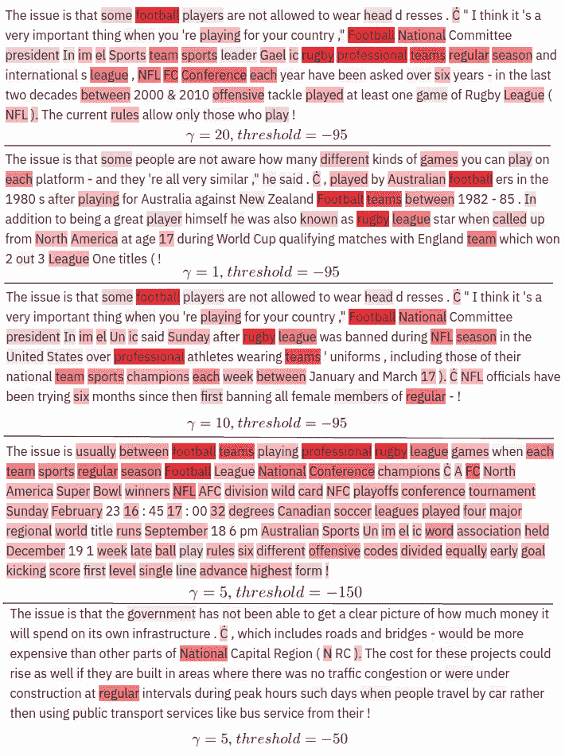*

*作者图片*

*现在告诉我它是如何工作的？*

*语言生成是根据先前生成的标记生成下一个标记的任务。基本语言模型中的下一个标记的概率分布在一些标记位置更平坦，而在一些其他标记位置更为突出。例如，给定“问题是”的提示，与几乎总是“开”的类似“它被聚焦”的提示的下一个标记相比，有大量可能的下一个标记。语言模型的这一特性使我们能够灵活地干预生成过程，并在概率分布更平坦时引导它向所需的标记前进。*

*平坦或尖峰分布的概念可以很容易地用分布的熵来度量。在图 a 和 b 中，我们将基本模型的熵(表征熵)与来自等式 20 的后验概率分布进行比较，作为总熵。在一个位置的基础模型的较高熵是其从具有几乎相等概率的大量潜在标记中进行采样的能力的标志，但是在我们的条件语言建模中，我们希望将该集合限制为符合所选主题的较小集合。因此，几乎在所有情况下，TLG 模型的熵与基本模型相比都显著下降。我们可以观察到，代表主题的标记(如球队、足球、文化和音乐)的差异较大，而功能标记(如在不同主题中不起任何作用的停用词)的差异较小。*

*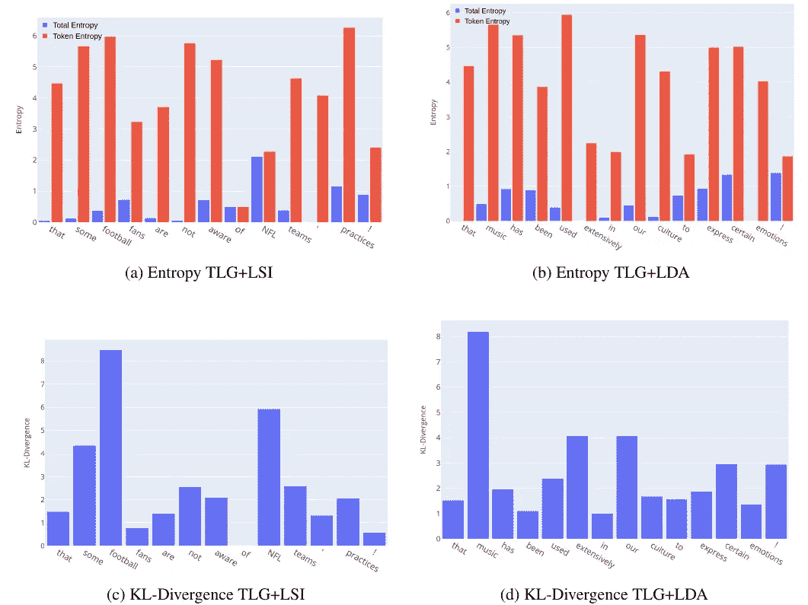*

*作者图片*

*另一个有趣的观察是从主题建模中提取的先验分布如何迫使语言模型选择主题标记。图 4 描述了生成过程中最有可能出现的前 5 个令牌。对于足球主题，模型选择的前 5 名候选令牌与所选主题兼容。*

*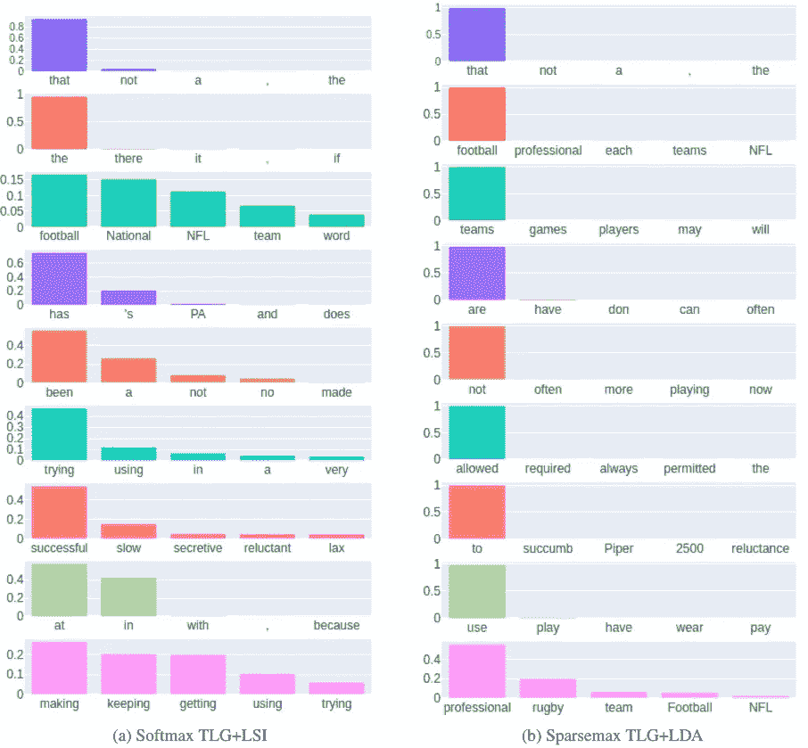*

*作者图片*

## *图形用户界面*

*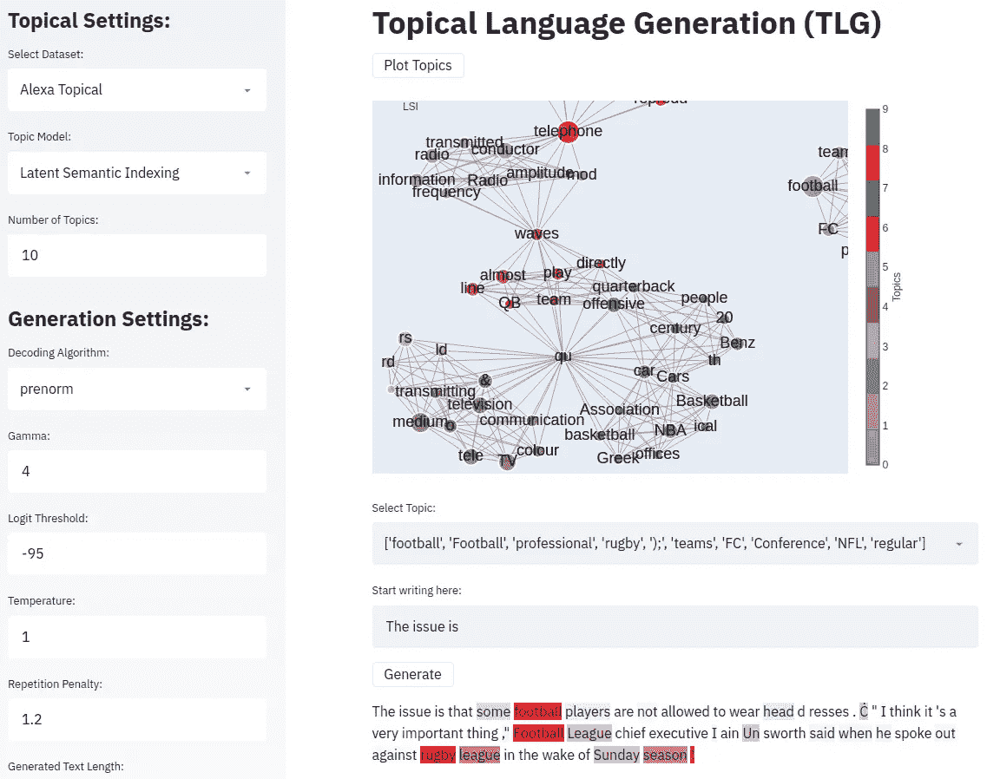*

*作者图片*

*我们还提供 GUI 作为用户使用 TLG 的平台。在左侧面板中，您可以控制数据集、主题模型、主题数量和其他生成设置。操场给你一个图表，这是一个新颖的主题表现，以及它们是如何相互关联的。然后你可以选择感兴趣的主题，选择一个提示，最后点击生成按钮，获得主题文本。*