# 专题图:全球变暖热图

> 原文：<https://towardsdatascience.com/topical-plots-global-warming-6b5fb80a0371?source=collection_archive---------39----------------------->

## 哪个图表能最好地传达信息

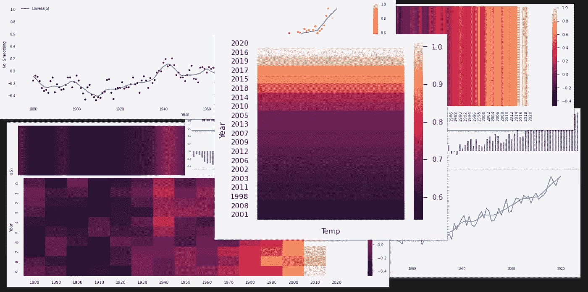

全球变暖的各种图表——作者图片

一摄氏度似乎不算多。慵懒的夏日午后，坐在阳光下，25 度和 26 度之间的差别几乎无法察觉。

但是地球是一个很大的地方，所以将它升温 1 度所需的能量是巨大的。这就是为什么随着全球气温上升，我们会看到更多的极端天气事件，这是由大气中增加的能量驱动的。

但是我们如何有效地传达正在发生的温度变化呢？

首先，我们需要一些数据，然后我们可以看看如何用图形表示它。我将描述下面的数据，然后建议一些可能合适的图—线图、散点图和热图。我不会将本文与用于生成本文中的情节的 Python 代码混为一谈，因为它并不真正相关，但是我会提供一个链接，您可以在那里下载它。

## 获取数据

HadCRUT 是一个追踪自 19 世纪后期以来气温变化的数据集。你可以根据[开放政府许可 v3](http://www.nationalarchives.gov.uk/doc/open-government-licence/version/3/) 从英国气象局哈德利中心[下载页面](https://www.metoffice.gov.uk/hadobs/hadcrut5/data/current/download.html)免费下载它的版本(也参见下面的参考部分)。

其他几个地方拥有这些数据，包括 IPCC、东安格利亚大学气候研究中心(CRU)和美国国家航空航天局(NASA)。

该数据集是一个时间序列，用于跟踪相对于 1961-1990 参考期的历史地表温度异常。也就是说，我们将 1961 年至 1990 年间的平均温度视为零度，并绘制出该范围内每年的正负变化。看起来是这样的:

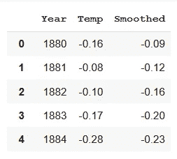

HadCRUT 数据的前几行—作者图片

*温度*列是每个年份与基数之间的实际差异，而*平滑*列是一个在多年范围内的 Lowess 平滑。您可以在下面的简单线形图中看到绘制的数据:

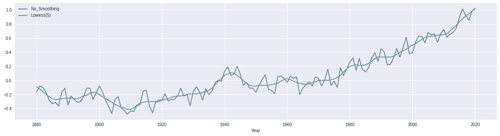

一个简单的折线图——作者图片

## 可视化气候数据

个别年份的变化差异很大，但平滑线显示的趋势明显是向上的，尤其是当我们越接近现在。

然而，简单的线形图并不是特别引人注目的可视化。

对于不平滑的数据，也许可以用散点图来更好地表示相同的数据。在下面的图中，我也对散点图上的点进行了着色，以对应温差——温度越高，颜色越暖(我使用了 matplotlib 色图，名为*inferno*——这似乎很合适)。

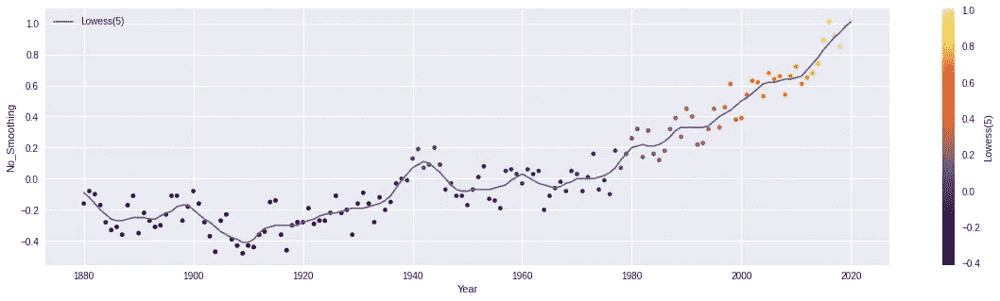

折线图和散点图——图片由作者提供

严格地说，在这个版本的图表中，颜色是多余的，因为它复制了 y 轴上的值。但也许这有助于强化气温正在上升的信息。

另一种使用颜色的方法是热图。你可以在下面看到平滑数据的热图。我认为这非常清楚地证明了近几十年来气温的上升。深色中有较浅的颜色，但颜色的整体变化是相当引人注目的。

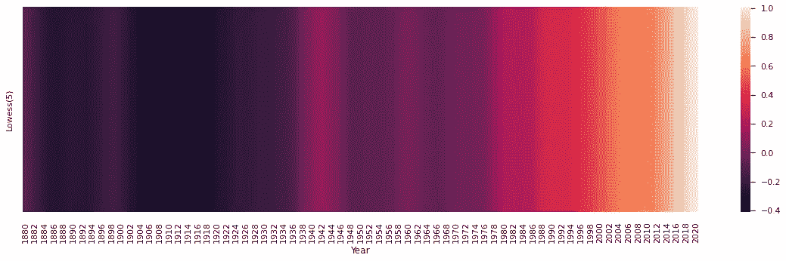

平滑数据的热图—作者提供的图像

非平滑数据更真实地反映了个别年份实际发生的情况。下一个热图是这些数据，你可以清楚地看到个别年份没有遵循趋势，但仍然欣赏整体模式。

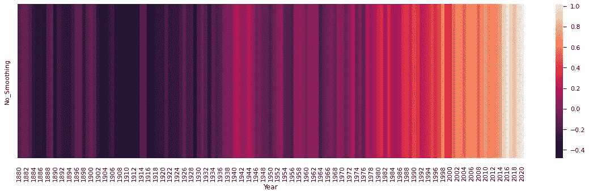

非平滑数据的热图—作者提供的图像

虽然最后这张图比前一张图显示了更多的细节，但当它们都被挤在一个轴上时，很难看到单独的一年。

我们可以试着通过重新格式化数据让它更清晰。在这里，我创建了一个二维数组，每一列代表一个十年。

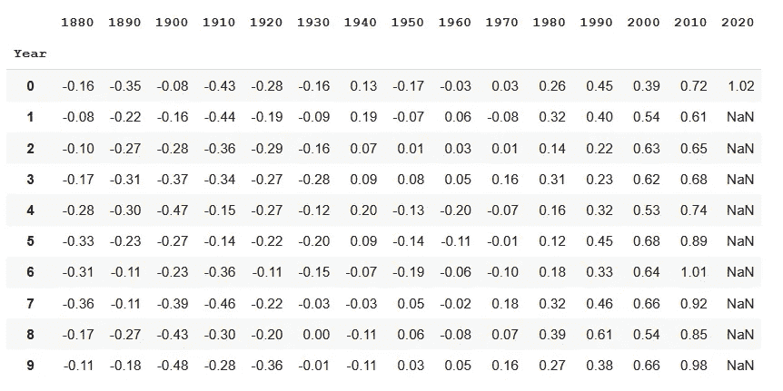

二维数组形式的数据—作者提供的图像

现在我们可以绘制另一个热图，这将使我们更容易地看到各个年份(1964 年看起来有点冷)。

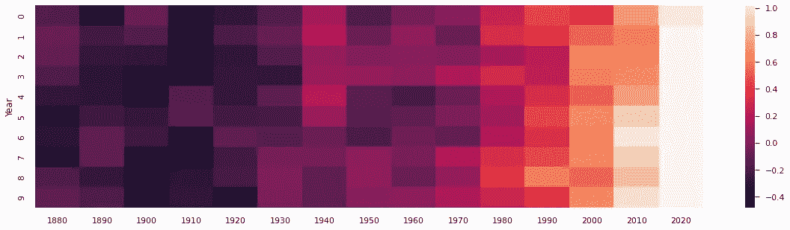

二维热图形式的数据—作者提供的图片

有点不幸的是，最后一列只有一个条目——不美观——但重新格式化为其他维度的矩形会破坏自然的 10 年格式。除此之外，随着更多数据的公布，这些空白空间将被填满。

## 前 10 名

查看数据的另一种方式是关注年份，并根据温度对它们进行排序。如果我们这样做，我们会得到一个这样的表(显示了前 10 个条目)。

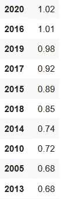

十大最热年份——作者图片

在这里，我们可以清楚地看到，表中最热的年份是最近几年。事实上，前 20 名中有 19 名是 2000 年代的，剩下一名是 1998 年的。

热图也是可视化这些数据的一种便捷方式。这是前二十名。

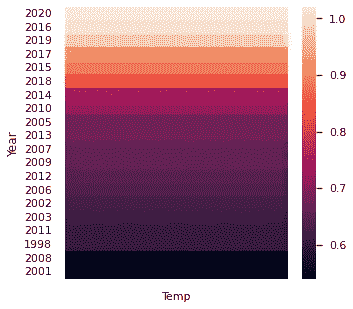

前二十个最热的年份——作者图片

从 1880 年开始的整个地图太大了，不能在这里插入，但是我认为看到每一年的数据是非常有趣的，所以我在文章的最后加入了图表。

一如既往，感谢阅读。这里没有使用火箭科学，但我希望你已经发现我对数据的漫游，以及它可能是如何表示的，很有趣。

## 参考

使用观测估计集合量化全球和区域温度变化的不确定性:HadCRUT4 数据集，科林·p·莫里斯，约翰·j·肯尼迪，尼克·a·雷纳和菲尔·d·琼斯

要获得创建这些图表和下载数据的代码，请访问我的 [Github 页面](https://alanjones2.github.io/Alan-Jones-article-code/)。

如果你想知道我什么时候发表新文章，请考虑在这里注册一个电子邮件提醒。

如果你不是一个媒体订阅者，那就注册吧，这样你就可以每月花 5 美元阅读尽可能多的文章。在这里注册我会赚一小笔佣金。

如果你对熊猫有兴趣，我的介绍在这里:

[https://towards data science . com/plotting-with-pandas-an-introduction-to-data-visualization-8bd 7c 0831650](/plotting-with-pandas-an-introduction-to-data-visualization-8bd7c0831650)

## 按温度排序的 141 年

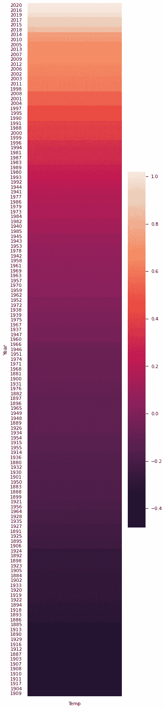

按温度排列的所有年份—按作者排列的图片