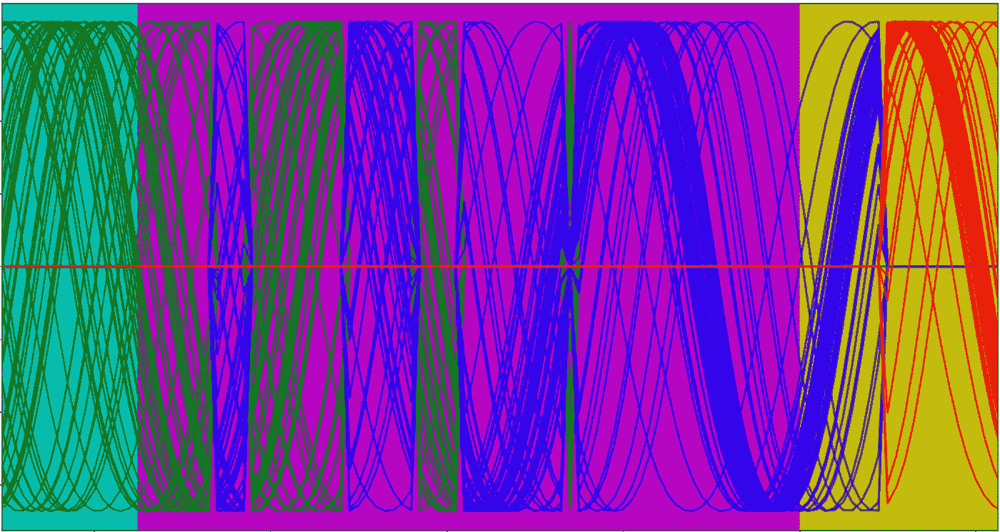
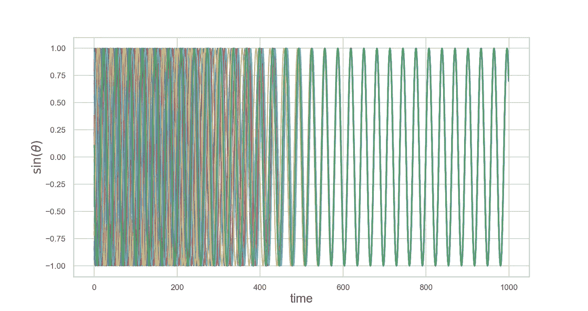
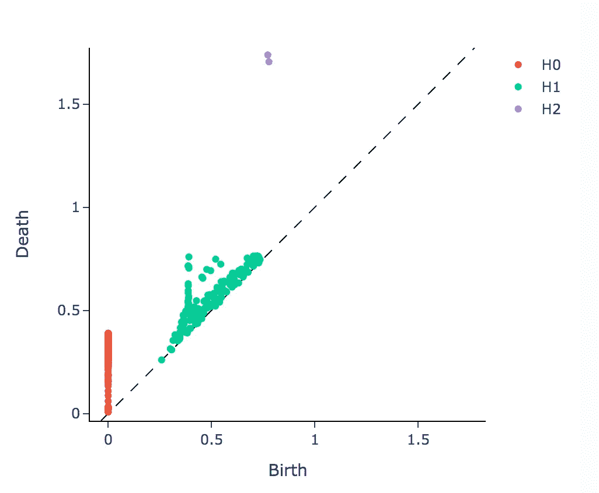
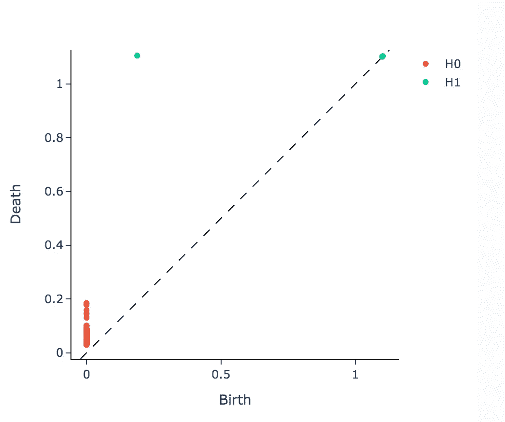
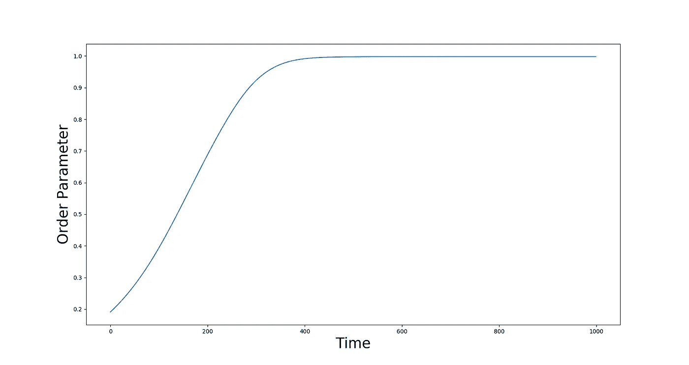
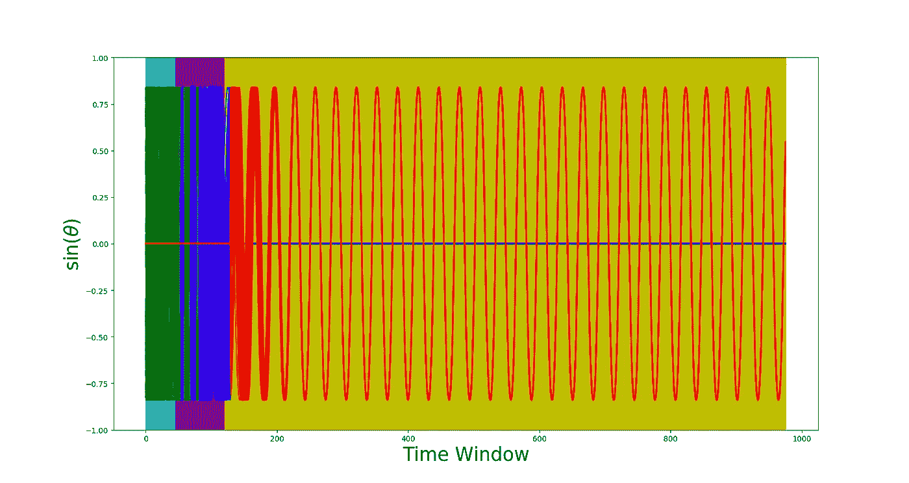
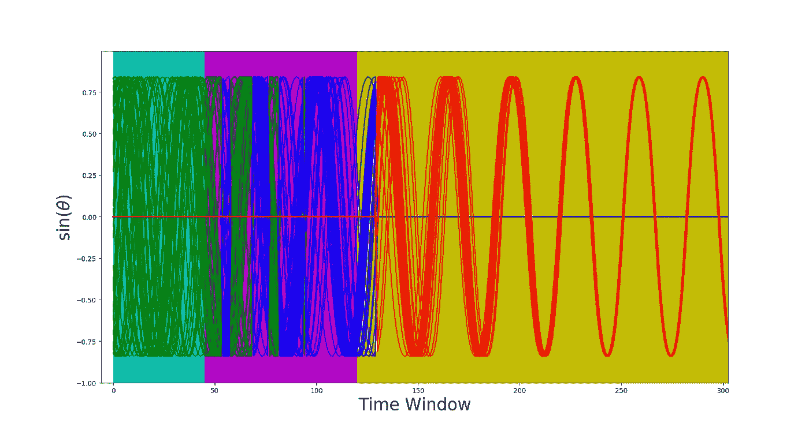

# 拓扑变化点检测

> 原文：<https://towardsdatascience.com/topological-change-point-detection-162c6e11d3ca?source=collection_archive---------15----------------------->

作者图片

## [思想和理论](https://towardsdatascience.com/tagged/thoughts-and-theory)

## 发现时间序列数据中的临界点

变点检测是时间序列分析中的一个重要课题，涵盖了广泛的应用领域，在这些应用领域中，需要检测以可测量的时间序列为特征的系统中与标称行为的显著差异。几个现实世界的系统包括太阳耀斑群、萤火虫闪光模式、神经尖峰脉冲序列、气候数据和金融指数等等。

发现时间序列的潜在结构有助于预测信号源数据产生过程中的突变。通常，统计分析用于变化点检测，以识别随机过程的概率分布何时显著影响时间序列特征的变化。在这里，我提出了一种方法，应用拓扑数据分析的方法来提取特征，并预测时间序列数据中可感知的结构变化的开始。

具体来说，本文将演示使用拓扑数据分析来预测时间序列中的变化点。时间序列是从经典的 Kuramoto 模型合成的，拓扑特征是从 Kuramoto 模型相位响应的动态持续图中提取的。然后，这些拓扑特征被用在梯度提升分类器流水线中，以顺序预测是否将到达系统变化点。这种方法适用于我们想要对复杂系统中可能导致灾难性的、不可逆转的影响的临界点的出现进行建模的情况。

在本文中，您将学习如何:

*   从 Kuramoto 系统生成时间序列
*   从时间序列中提取拓扑特征
*   建立机器学习管道，使用拓扑特征预测时间序列状态
*   评估模型的变点预测性能

**仓本模型**

Kuramoto 模型已经被广泛用于模拟大型弱耦合振荡器的行为。它可以描述出现在化学振荡器、神经元尖峰序列、火焰动力学和萤火虫闪光图案系统中的模式。Kuramoto 模型的定义特征是相位同步。同步是复杂网络系统中出现的一种现象，其中一大组几乎相同的组件开始同相振荡。这种同步的开始可以非常突然地发生，并且可以通过瞬时相位相干性来测量。在正常的、非耦合的系统行为和完全同步的状态之间有一个可检测的区域吗？下面的图 1 是使用 Kuramoto 模型[方程](https://en.wikipedia.org/wiki/Kuramoto_model)模拟 1000 个时间步长的全连接鄂尔多斯-Renyi 网络的 50 个节点系统的时间序列图。时间序列代表网络中每个节点相位的正弦值。

图一。50 节点鄂尔多斯-仁义网络的 Kuramoto 模型时间序列(图片由作者提供)。

定性地说，你可以看到不连贯的区域(t < 200), partial coherence (200 < t < 400) and complete synchronization (t > 400)。这表明从正常到部分(“开始”区域)的转变和完全同步可以从潜在的时间序列结构中检测到。

**变化点检测和拓扑数据分析**

*变化点检测*试图识别一个特定的时间点，此时底层数据源中的突然结构变化导致相关可观测时间序列的行为发生可检测的变化。在这里可以找到应用于变化点检测的传统方法的综述[。在本文中，我们将应用拓扑数据分析的方法来解决这个问题。](https://www.ncbi.nlm.nih.gov/pmc/articles/PMC5464762/#:~:text=Change%20point%20detection%20(CPD)%20is,well%20as%20change%20point%20detection.)

*应用于时间序列机器学习的拓扑数据分析*试图提取尽管存在噪声、离群值、缺失数据和尺度变化，但仍保留数据中潜在的全局时间结构的特征。在代数拓扑术语中，这被称为数据的“持久同源性”。简而言之，持续同源性通过计算数据中存在的连接成分、2D 环或更一般的 d 维“洞”的数量来量化数据的结构。查看[这篇](https://jacobbriones1.medium.com/what-is-topological-data-analysis-db7af6e27584)优秀的介绍性文章，获得对持续同源概念的直观解释。

通常，我们将同步行为与周期性规律相关联，将非同步行为与非周期性相关联。图 2 说明了当时间序列中存在周期性和非周期性结构时，持续同源性的差异。显然，H1 持续长度(绿色点距离虚线的距离)和 H2 的存在或不存在(紫色点)是可以在变化点预测中利用的可分离特征。

图二。周期性(顶部)和非周期性(底部)系统的持久性图。请注意绿点分布(H1)和 H2 存在(上)和不存在(下)的差异。这些特征可以用来检测周期性，周期性又可以用来检测我们的模型中同步的开始(图片来自 giotto-tda:一个用于机器学习和数据探索的拓扑数据分析工具包)。

通过在原始时间序列上的滑动窗口序列上计算一组持久性特征向量，数据集的持久性同源性可以被矢量化为特征向量，并以熟悉的方式用于机器学习管道中。我们将使用 [giotto-tda](https://giotto-ai.github.io/gtda-docs/0.4.0/library.html) ，一个无缝集成到 scikit-learn 的[监督机器学习](https://scikit-learn.org/stable/supervised_learning.html#supervised-learning)管道中的拓扑数据分析 python 库，来研究检测 Kuramoto 动态模型生成的时间序列中的变化点开始的能力。

**问题范围**

为了创建用于变化点检测的监督数据集，我们需要创建一组标签。对于上图 1 中时间序列数据的每个窗口，我们将通过平均每个节点与其邻居的相位相干性来计算全局顺序度量。下一张图显示了我们 50 节点网络的相干函数。

图 3。Kuromoto 模型的相干函数测量作为时间函数的网络的相位同步性(图片由作者提供)。

同样，我们可以看到一个以 t=200 附近的部分相干区域为特征的开始区域。准确地说，我们的任务将是在给定当前数据时间窗口的情况下，预测先行一步的状态。通过将图 3 中的相干函数量化为三类(分别为正常、开始和完全同步状态的 0、1 和 2 ),我们可以为我们的监督*分类*问题创建目标标签。我们在下面的窗口代码(第 2 段)的第 14–16 行中这样做。

# **管道**

数据处理流程非常简单。

1.  模拟数据:

*   创建一个 50 个节点的全连接鄂尔多斯-仁义网络。
*   模拟 Kuramoto 方程，得到所需的时间序列数据和一步到位的标签。

2.现在，使用 giotto-tda 滑动窗口转换器将数据和标签窗口化。这不仅对给定窗口大小和步距(平移每个窗口的量)的数据进行窗口处理，而且对标签进行重新采样，使得数据窗口`X_sw`对应于`labels`上相应窗口中的*最后*值`yr_one_step`。

3.接下来，我们提取特征向量来训练和测试我们的监督机器学习算法。为了计算时间序列的每个窗口段的持续同源性，我们最初使用皮尔逊相异度变换器来计算每个窗口的 2D 相异度矩阵，并将结果堆叠到 3D 对象中。然后，对于每个 2D 相异矩阵，计算 Vietoris-Rips 持久性，直到同源性为 2。最后，为每个结果持续性图计算振幅、持续性熵和每个同源维度的图点数，产生形状`(195200 x 9)`特征向量`X_tot`。每个持久图特征变换器计算的细节可以在[这里](https://giotto-ai.github.io/gtda-docs/0.4.0/modules/diagrams.html#features)找到。

4.我们管道的最后一步是训练和测试模型。我们将使用 scikit learn 的梯度增强分类器，尽管使用 SVM 和随机森林分类器可以获得类似的结果。

# **结果**

结果表明，使用拓扑数据分析的方法可以检测开始(部分同步)和完全同步变化点。在下面的图 4 和图 5 中，真实状态由背景色序列表示(品红色=正常，青色=发病，黄色=同步)。时间序列用预测的先行一步分类值进行颜色映射:绿色=正常，蓝色=开始，红色=同步。

图 3。改变点检测结果。真实状态由背景颜色序列指示(品红色=正常，青色=发病，黄色=同步)。时间序列本身以其分类值进行颜色映射:绿色=正常，蓝色=发病，红色=同步(图片由作者提供)。

从下面的放大图可以更容易地量化检测机的性能。很明显，对开始区域(洋红色)的检测较晚，然而，我们对完全同步状态(黄色)的检测稍早。

图 4。拓扑变化点检测结果的放大图。我们可以看到对开始区域的检测较晚，然而，我们对完全同步机制的检测稍早(图片由作者提供)。

# **最后的外卖**

那么拓扑变化点检测对现实世界的应用有什么用呢？由于我们是在给定当前时间窗口的情况下预测系统的先行一步状态，因此只要我们可以从可观测数据中测量动态时间序列，我们就可以表面上估计各种信号源(如气候、金融、机械或生物系统)的未来变化点。准确可靠地预测系统未来的变化点，可以让我们避免复杂系统中出现可能导致灾难性、不可逆转后果的临界点。

这里，我们合成了一个简单的互联节点网络，但是，由于它能够使用任何时间序列数据提取隐藏的结构信息，拓扑变点检测可以应用于涉及广泛变化的空间和时间尺度、数据类型和节点组成的系统，包括自然和人造系统。此外，所提出的算法可以实时在线执行，因为我们不需要整个时间序列，而只需要当前时间窗。