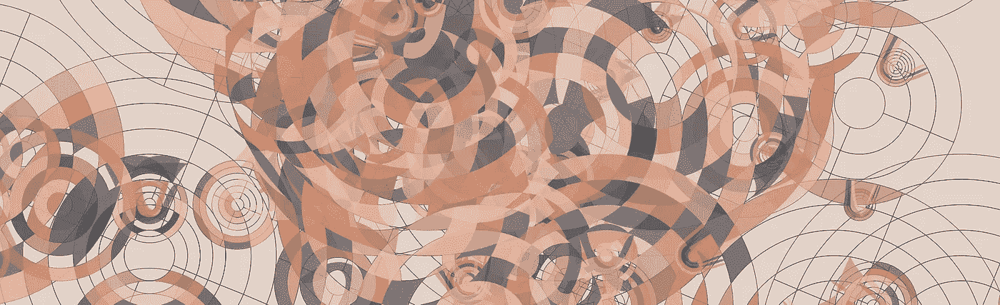
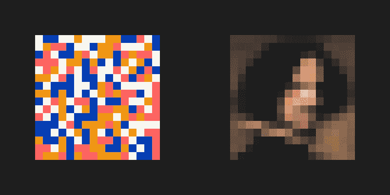
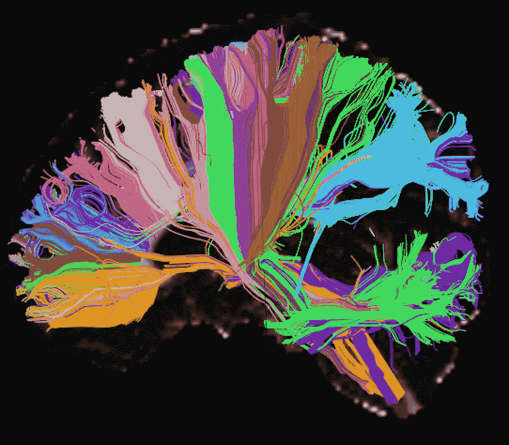

# 总认知空间

> 原文：<https://towardsdatascience.com/total-cognitive-space-4a571033af82?source=collection_archive---------18----------------------->

## [思想和理论](https://towardsdatascience.com/tagged/thoughts-and-theory)

## F *从 AI 到*组织变革，我们如何架构我们所做的塑造可及可能性的总空间。

作者的作品

一段时间以来，我越来越意识到，无论技术如何进步，人工智能系统(简称为 AIs)都不会像我们一样有良知，除非它们体现在完美模拟我们身体的物理容器中。即使那样也不行。

我想这没什么大不了的。但是，当我偶尔思考这个问题时，一些有趣的概念出现了，我觉得有必要写下它们，因为我相信这可能有助于思考组织模式以及它们如何面对我们在现代都必须应对的挑战。

有很多研究和广泛的商业兴趣，让人工智能预测人类在给定场景下的行为。我们将如何购买这个春季，我们什么时候会转换电话公司？我们更喜欢什么产品，怎样才能发现自己喜欢的新事物？寻找一个能够辨别我们行为的正确线索的人工系统，以及在更广泛的背景下，能够辨别事情发生的原因以便我们能够改善对它们的反应的系统，是一个重要的系统，并且值得退一步，尝试从更广阔的角度来看待这个问题。事情是这样的，当我们试图建立一个能理解事物一部分的系统时，他们需要能够在他们的整个可寻址认知空间所能容纳的范围内表现出那部分事物。我们正试图找到解决系统认知空间不足的问题的方法。

我所说的认知空间是什么？我举几个例子解释一下。以一个像素的图像为例，其中像素可以是黑色或白色。这个图像只知道两种可能的现实。一个人类观察者可能对仅仅是黑或白的图像有反应，并开始赋予它意义，每个人根据他们自己的经历、他们的情绪、反射等等。但是图像本身不能代表除了黑色或白色之外的任何东西。

*一个白色像素，一个黑色像素。话不多说。(图片由作者提供)*

如果我们把图像做得更复杂一点，例如由 16 像素乘 16 像素组成，每个像素可以是 4 种颜色中的一种，我们就有了一个可以代表更多事物的图像。如果这些像素有能力表现更多的颜色，它们可以不断扩大自己的表现空间。

*左图:一张 16x16 像素的图像，每个像素有 4 种可能的颜色。右图:同样大小的图像，但每个像素有更多的颜色；它现在可以渴望代表迭戈·委拉斯开兹。(图片由作者提供)*

这个例子是显而易见的，但它是同样的概念，适用于基本上每一个人，每一个机构，你在生活中做的每一项活动。所有存在的事物都是在一定的背景下发生的。与环境的关系极大地解释了我们所考虑的事物、实体或存在的成功。与语境的关系取决于事物、实体或存在所能代表的认知空间。

就人工智能而言，你们大多数人至少知道这些系统如何工作的基本知识。他们有一个模型，用于处理输入集合，并提供输出集合。例如，被设计和训练来评估消费者信用风险的模型包含关于设计者/建模者认为将有助于解释风险情景的某些变量的信息，例如个人的工资、他们是否累积了以前的债务、他们是否有还款历史等。模型的认知空间受限于它所拥有的变量，受限于这些变量中的数据深度，等等。以推荐歌曲为使命的系统可能具有关于你喜欢哪些其他歌曲、你的年龄、谁是你的朋友以及他们喜欢什么等信息。协调城市中交通灯的系统可以具有考虑交通状态、每条街道的流量、过去的预测、过去的结果、天气信息等的模型。这不像只有两种可能状态/两种可能表示的图像那样容易表示。但原理是一样的。交通系统有一个变量和组合的总数，它塑造了我称之为认知空间的东西:它能代表的情况的数量。如果一个巨大的怪物来自太空，降落在城市里并扰乱了交通，模型无法意识到这种情况，因为它甚至不知道这是可能的。不在它的认知空间内。它会选择它能从输入中看到的现实的最佳表现，愉快地忽略一个来自外太空的野兽正坐在市中心三个街区之外的事实。

# 我们自己的认知空间

我们呢？我们的认知空间也受到许多因素的影响和约束。我们仍然不太了解良心是什么，它来自哪里，我们的存在感是如何从我们的存在中产生的等等。有许多心智模型和意识理论，这是一个令人兴奋的研究领域，我试图去了解它。从流传的各种理论中，我看到了一些共同的特征。显然，这与各种感官输入的整合有关。它与试图理解我们周围正在发生的事情，选择与我们和我们的目标相关的输入有关。它与调和我们周围的东西和我们内心的东西有关:我们过去的经历，我们知道的，我们记得的，我们学到的和我们爱的。这与我们如何在大脑中将这些东西联系起来有关。所以它与感官输入以及我们处理这些输入的方式有关。此外，当暴露于这些输入时，我们大脑中的一些处理中心以某种方式做出反应，释放出某种神经递质，使我们有所感觉。情绪也是处理我们周围发生的一切的副产品，或者从我们试图收集的关于大脑如何工作的最基本的知识来看是这样。当我们考虑我们在认知空间中能够表现的情境总量(外部和内部)时，情绪是另一个需要考虑的变量(哦，它们基本上指导我们的行为，但这是另一篇文章的主题)。

我们大脑中的远距离连接。为了获得更多令人惊叹的视觉效果，更好的是，研究我们的大脑是如何内部连接的，请查看 [*人类连接体项目*](http://www.humanconnectomeproject.org/)*；图片由阿纳斯塔西娅·延迪基博士、MGH/哈佛大学博士维维安娜·西莱斯提供*

我们的大脑大约有 840-1000 亿个神经元(84.000-100.000 亿个神经元)，以及大约 100 万亿个突触(神经元之间的连接)。我们真的不知道不同类型的神经元是如何工作的，除了神经元和连接的数量之外，在理解这产生了多少种不同的激活模式组合时，可能还有更多变量在起作用。所有变量的可能组合是我们必须在我们的心智模型中表现的工具，无论是外在的还是内在的。它定义了人类总的可寻址认知空间。因此，无论我们的良知是什么，无论我们对自我的感觉是什么，它似乎都是由我们的大脑是如何构建的，我们拥有的连接，神经元，以及它们如何与世界互动等因素形成的。我们能够处理的总认知空间是有上限的。不完全是上限，而是一个给定的 N 维形状:它覆盖了一个由所有影响它的维度定义的空间，并且它有跨越所有这些维度的边界。 ***不一定涵盖所有有*的**。它涵盖了它能理解的内容。在这个认知空间中不可表现的事物会以对人有意义的方式被体验，但可能与现实无关(就像交通模型无法知道来自半人马座阿尔法星的某个哥斯拉正在离少校的房子几个街区远的地方享受星际间的乐趣)。这个总的认知空间决定了我们的适应能力。只要我们的认知空间允许我们理解它，我们就能对我们的环境做出反应。其他系统和活动也是如此。

# 你的人工智能有不同的“思维地图”

我希望你明白我所说的总认知空间的意思。那么，为什么我要费这么大的劲来解释这个想法呢？让我们回到本文的开头:人工智能不会像我们这样有良心，我说。无论我们的人工智能有多先进，就其构成而言，它们都不会像我们一样。它们没有我们的感官，如果我们为这些系统建立人工感官输入(摄像头来看，人工触摸传感器，人工鼻子等)。)，它们会用不同于我们处理的信号来表达现实。我们所能想到的最相似的生物也许会有一个与我们有很大重叠的认知空间，但仅此而已。不过，最有可能的是，这样的系统会有一个认知空间，与我们的认知空间有些重叠，但存在着我们无法理解的大片区域。我们所能希望的是，正确地识别重叠部分，并尝试将我们需要处理的其他实体的东西投射到重叠部分中。这让我想起了柏拉图洞穴的寓言。我们看不到现实，而是把绝对现实投射到我们的认知空间中。那些人工智能会经历不同的投射。

这为讨论和思考开辟了几个途径。

首先，它应该提醒我们对我们构建的系统有什么期望。或者说，不期待什么。那些系统能理解我们吗？很可能不是，因为他们存在于不同的认知空间，因此他们对情况的“理解”是不同的。从更实际的角度来说，如果你正在为人类构建推荐系统，不要忘记你的模型不能编码情感。因此它将是非常不完整的。你可以找到可能增强模型认知空间的变通方法，但是模型本质上不可能“理解”一种情绪，因此它不能正确地处理这种情绪。它还应该有助于从广泛的角度理解这样一个事实，即模拟一种情况需要不同的数据来源。你拥有的数据源越多(也就是说，你看待一种情况的方式越多)，模型的认知空间就越大，它的表现能力就越强。不仅仅是更多的观点:设计和构建在所有感官输入(包括内部状态)之间有意义的相互联系的系统，以及不同部分之间相互作用的可能性，是必不可少的。两个不同元素之间的每一个新的联系，都是拓展认知空间的新维度。

# 这发生在最好的家庭

很明显，这不仅仅发生在人类和人工智能之间。例如，这在不同的人类文化中都会发生。当一个人有神经问题，改变了神经元、连接、情绪、经验等的总组合时，就会发生这种情况。这产生了一种可能的对世界的理解，这种理解不同于任何“健康”的大脑。如果我们明白，这个总的认知空间不仅仅是由原材料限制或形成的，而是在给定的时间点上它们是如何烹饪的(例如，在我们的大脑中，它包括我们已经知道的东西，我们对这些东西的感觉，我们的信仰等等。)那么我们可以看到，认知空间及其状态的差异也是人类无休止冲突的根源。对我来说，当我们考虑实体之间的交互时，把所有这些都考虑进去是非常重要的。可能的互动发生在认知空间的重叠中。在那个交叉点之外，那个重叠部分，是每个实体都无法识别的东西。因此试图从非重叠空间中获得适当的交互结果是没有希望的，也是虚幻的。

这也意味着认知空间与我们不同的其他实体过于珍贵。他们能看到我们看不到的东西。任何试图探索和理解外界事物、我们经历的变化以及如何更好地行动的人，都应该有兴趣找到它们与其他认知空间的适当重叠。这是我看到未来人工智能最大潜力的地方。拥有与我们重叠的人工智能来试图解释他们看到的东西，但拥有与我们自己不同的能力，因此能够创造一种超越我们生物本性所允许的共享存在。试图建立模拟我们自身功能的系统，希望创造可以冒充人类的合成生物，对我来说似乎有点无聊。有很多人需要去了解和学习，为什么我要复制他们呢？更好的做法是建造能带来新事物的东西。

# 考虑更广泛的影响

在我看来，这个非常简单的想法对我们如何组织我们的活动有很多影响。既然认知空间是允许实体适应其环境的东西，为什么我们不考虑在例如我们建立的公司中重塑它。太多的公司不仅试图推进他们当前的产品和服务，还试图推进他们现有的内部组织(互联、政治、治理、动态等)。).随着环境的变化，他们会很好地尝试重塑他们的认知空间。例如，当前对拥有更加多样化的劳动力的兴趣是实现这一目标的最佳实践。促进员工队伍的多元化会给公司带来不同的经历、背景和情感，并有效地拓展认知空间。然而，还有更多事情要做。工作动力的多样性，流程的多样性。这可能会对优化产生反作用，但我认为只考虑优化而不是建立适应能力的时间已经过去了。不过，这是另一篇文章的主题。问题是，这将有助于公司扩大其影响和对其背景的理解。

它也适用于社会、政府和教育。这是一个普遍适用的简单想法。在以后的文章中，我想把这个想法更深入地扩展到组织是如何设计的及其含义。为什么分散经济对人类来说是个好主意。艺术如何扩展他们的认知空间，而这又如何扩展人类的认知空间。

总之，这只是一个简单的想法。我将很高兴知道你对它的想法，请随时联系我，给我你的反馈。谢谢你读到这里。

*(原载于*[*【https://www.iillucid.com】*](https://www.iillucid.com)*，作者网站为观点、艺术和随机灵感)*