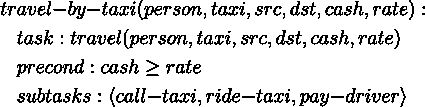

# 总订单向前分解:HTN 计划者

> 原文：<https://towardsdatascience.com/total-order-forward-decomposition-an-htn-planner-cebae7555fff?source=collection_archive---------23----------------------->

## 一种更广泛用于实际应用的人工智能规划算法，因为它与人类解决问题的思维方式相似

马库斯·温克勒在 [Unsplash](https://unsplash.com?utm_source=medium&utm_medium=referral) 上的照片

# 介绍

HTN 规划是解决人工智能规划问题的另一种方法。它类似于经典的条状规划器，它表示世界的状态，并执行将一种状态转换为另一种状态的动作。

然而，它在计划什么和如何计划方面是完全不同的。在传统的规划方法中，输入是一组目标，算法搜索实现目标的可能性。在 HTN 计划中，输入的是一个要执行的 ***任务*** 。

> 任务是给予计划者的一个高级抽象概念，用于计划者提出一组可操作的基本任务(或操作符)。

这个想法很简单，因为通常有不止一种方法来执行一项任务，这取决于特定时刻的环境。因此，如果我们赋予我们的计划者如何将抽象的任务分解成具体行动的知识，它将能够给我们解决方案。

“分解”过程是递归的，从一个抽象的任务到不太抽象的子任务，最后是具体的行动。

这种方法在实际应用中使用得更广泛，因为它的工作方式是我们人类所熟悉的。我们熟悉从一个大的抽象问题到更小的问题及其解决方案的分层解决问题。

## 我们将讨论什么

在本文中，我们将讨论 HTN 计划的概述，然后我们将重点放在它的简单版本，总订单计划。然后我们看看如何在 C++中实现全序算法。

# HTN 规划

状态、操作符、动作和状态转换的表示与前几篇文章中讨论的经典规划方法相同。

快速回顾如下:

状态是一组原子(详见一阶逻辑)。一个操作符是一个过渡函数，通常有三个组成部分:

*   名称(符号)
*   前提
*   效果

动作是操作符的实例化，在面向对象的编程中，你可以认为操作符是一个类，而动作是一个对象。状态转换是将一个动作应用到一个状态，将它转换到另一个状态。

状态转换(图片由作者提供)

假设 ***动作 1*** 和 ***动作 2*** 都适用于 ***状态 1*** ，应用它们会将 ***状态 1******状态 2*** 和 ***状态 3*** 转换成两种不同的状态。

## 任务、网络和方法

这种方法引入的新概念是任务、网络和方法。新的符号被引入，第一个叫做*任务符号*。运算符符号是一个任务符号。并且还有*非原语任务*的任务符号。它通常以下列形式书写:

任务表达式(作者图片)

例如，我们有一个操作员*呼叫出租车*，它有两个参数，*人*和*出租车*，它被写成:

任务表达式示例(图片由作者提供)

如果一个任务符号是一个操作符符号，那么这个任务就是本原的，否则就是非本原的。

第二个新符号是*方法符号*，表示方法的名称。方法是用于非原始任务的。

如果原语任务可以直接执行转换状态，非原语任务就不行。它们用于将抽象任务分解成抽象程度较低的任务或原始任务，或者两者的组合。

简单旅行领域的任务分解示例(图片由作者提供)

从这个例子中，我们可以看到有两种方法来执行一个旅行任务，要么乘出租车，要么步行。我们可以根据世界的现状，如距离、我们的钱数等，选择最佳的方法。

方法具有以下组件:

*   名称(方法符号)
    例如，*乘出租车出行*。
*   任务(任务符号)
    例如，*旅行，*它能解决的一个任务。
*   前提条件
    了解该方法在当前世界形势下是否相关。
*   网络
    我们将在下面进一步讨论的任务网络(或子任务)。

与运算符的表达式相同，可以写成如下形式:

方法表达式(图片由作者提供)

现在我们来看看什么是任务网络。任务网络是一个 ADG(无环有向图):

任务网(图片由作者提供)

其中*是一组节点， ***E*** 是一组边。每个节点代表一个任务，边代表部分排序。如果所有节点都是完全有序的，我们可以用一系列任务来代替这个网络。*

**

*任务序列(图片由作者提供)*

*如果序列中的所有任务都是原始的，那么我们只要用行动代替任务就有了计划。*

## *方法示例*

*让我们来看一个简单的方法示例，它使用上一节中的图片所示的简单旅行域。以下是乘出租车旅行的样子:*

**

*方法示例(图片由作者提供)*

*此方法可用于旅行任务，如果适用，将把任务分解成三个基本任务(操作符)，依次是呼叫出租车、乘坐出租车和付费司机。*

## *规划问题和解决方案*

*本办法中的规划领域包括:*

*   *状态*
*   *一组运算符*
*   *一套方法*

*规划问题由以下几部分组成:*

*   *初态*
*   *初始任务网络*
*   *一组运算符*
*   *一套方法*

*解决方案计划是能够完成初始任务网络的一系列行动。解决方案计划是将初始任务网络分解成可操作的基本任务(操作符)的结果。*

## *总订单计划*

*在本文中，我们着重理解全订单计划，其中的任务网络不是一个图，而是一系列任务。这是 HTN 规划的简单版本。*

*算法如下:*

*TFD 算法(作者代码)*

*全阶向前分解(TFD)算法是一种递归算法。在上面的*伪代码*中，我们可以看到算法是从检查一个任务是原语还是非原语开始的。*

*对于原始任务，从一组适用的动作中选择一个动作。然后，就像在经典的规划方法中一样，所选择的动作被应用到当前状态来转换它。然后从任务网络中移除该任务，并且算法继续。*

*对于非原始任务，从一组相关的方法中选择一种方法。然后使用所选方法分解任务，并用任务网络中的新任务替换当前任务。状态**T3s**保持不变。*

# *C++中的 TFD 实现*

*为了测试这个算法，我基于 Dana Nau 的实现用 C++17 编写了它，它是用 Python 编写的，如下所示:*

 ** 

## *规划领域*

*我们需要的第一件事是表示由状态、一组操作符、一组方法组成的规划域，我们还需要表示任务。*

*我们需要使所有这些通用，以便我们可以编写规划领域，而不必修改算法。*

*规划领域(作者代码)*

*所以我们把我们的状态和任务包装在 ***structs*** 中，在函数包装器中定义操作符和方法的格式。*

## *规划问题*

*我们可以将规划问题表示为一个封装了规划域、初始状态和任务网络的类。*

## *TFD 类别*

*主类 TFD 如下所示:*

*TFD 类(作者代码)*

*它需要的只是一个规划问题对象，那么我们只需要调用 TryToPlan 来获得解决方案，如果有的话。*

## *实现我们的领域*

*为了实现我们的领域，我们需要用 C++编写以下代码:*

*   *State
    将它包装在上面的 State 类中*
*   *经营者*
*   *方法*

*关于详细的例子，您可以在 Github 上的我的资源库中找到它们(参见下面摘要部分的链接)。*

# *摘要*

*与经典的规划方法相比，分层任务网络——HTN 是一种更广泛使用的人工智能规划方法，因为它与我们思考解决问题的方式相似。这使得实现和分析变得相对容易。*

*其中一个最简单的版本是全序向前分解(TFD ),它使用一系列子任务来代替任务网络的无环有向图。*

*它通过递归地将抽象任务分解成抽象程度较低的最终具体任务，或者可以由 AI 代理直接使用的动作，来解决规划问题。*

*我已经用 C++写了代码，包括算法的一般实现和一些例子。如果你有兴趣，可以在这里探索一下:*

*<https://github.com/debbynirwan/tfd_cpp> *