# 环法Á瓜斯克拉拉什自行车赛的数据分析

> 原文：<https://towardsdatascience.com/tour-de-%C3%A1guas-claras-cdb6c132b4ce?source=collection_archive---------27----------------------->


Francisco Aceldo 在 [Unsplash](https://unsplash.com/collections/1215780/bike?utm_source=unsplash&utm_medium=referral&utm_content=creditCopyText) 上拍摄的照片

也许这条路上没有像巴黎、卡尔卡松和图尔这样迷人的地方。也许它只是欧洲参考值的一小部分，比如说不到 1%。也许我是一个非常*10 ⁰业余自行车运动员。也许，事实上，从*环法*开始，我只是借用了*环法*这几个字。然而，我的环法自行车赛不是假的，是一次在我家附近骑行的很好的记录

我邀请你来看看记录速度、时间和高度的应用程序如何激发良好的数据分析，与数学、物理甚至公共政策进行很好的对话。请带上你的自行车跟我来。

# 关于我的旅行的一些话

Á·瓜斯·克拉拉是我家附近的名字。它是巴西首都巴西利亚所在的联邦区(DF)的一部分。DF 位于*中部*平原，一个统治我国中部大片地区的高原。

**比较部分城市海拔**

高海拔的特征与自行车旅行的数据分析相关，因为很容易看出，即使旅行发生在高原上，一些海拔变化也高于一些城市的平均海拔。这正是下图中呈现的要点。

不过在图前，一点点的 **R** 代码。请给我来点啤酒。

```
detalhe_percurso %>%
  ggplot(aes(x= as.POSIXct(time_posix_millisecond/1000, origin = "1970-01-01"), y= altitude_meter)) +
  geom_area(fill = "#976C42") + *#cor do solo de Brasília durante a seca*
  geom_hline(yintercept = destaque[-c(3:5)], linetype = 5, alpha = 0.5 ) +
  scale_y_continuous(breaks = c(seq(0,1200,300), destaque[-c(3:5)]))+
  theme_light() +
  theme(
    *#panel.background  = element_rect(fill="#696969"),*
    panel.grid = element_blank()
  ) +
  annotate("text",
           x=hora_inicial,
           y= altitude_fortaleza,
           hjust = -0.1,
           vjust= -0.1,
           label= paste0("Fortaleza ",altitude_fortaleza,"m"))+
  annotate("text",
           x=hora_inicial,
           y= altitude_ny,
           hjust = -5,
           vjust= -0.1,
           label= paste0("NY ",altitude_ny,"m"))+
  annotate("text",
           x=hora_inicial,
           y= altitude_guaramiranga,
           hjust = -0.1,
           vjust= -0.1,
           label= "Guaramiranga")+
  annotate("text",
           x=hora_inicial,
           y= altitude_paris,
           hjust = -6,
           vjust= -0.1,
           label= paste0("Paris ",altitude_paris,"m"))+
  annotate("text",
           x=hora_inicial,
           y= altitude_santiago,
           hjust = -0.1,
           vjust= -0.1,
           label= "Santiago del Chile") +
  labs(
    x= "Horário",
    y= "Altitude (m)"
  )
```

现在上面的代码产生的图像。

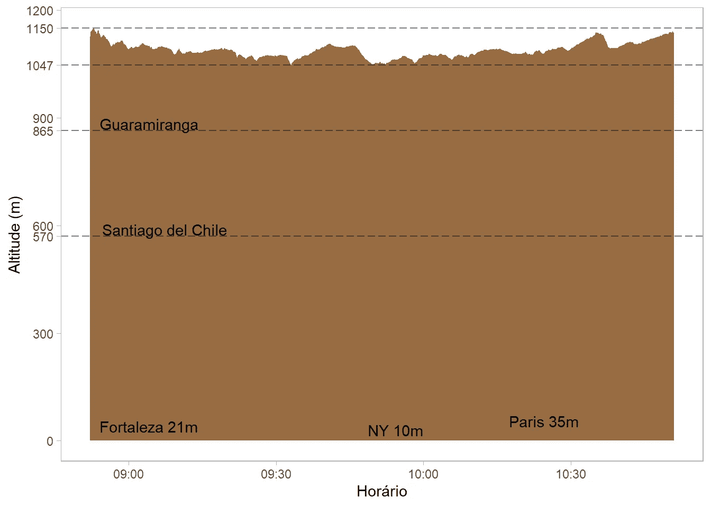

海拔和城市。作者图片

正如我们所看到的，我这次旅行的海拔高度从 1045 米到 1150 米不等。这些分数远高于安第斯山脉环绕的智利圣地亚哥，也略高于巴西塞阿拉州一个迷人的小镇 Guaramiranga。最后，同样清楚的是，分数的差异大于一些大城市的海拔，如福塔莱萨、纽约和巴黎，这些城市的平均海拔几乎与海平面持平。

所有这些海拔高度的变化都与下面在开放街道地图的帮助下描述的这条路径有关。让我们看看我是如何实现地图可视化的。

```
**library**(leaflet)
**library**(sp)*# define bounding box with longitude/latitude coordinates*spdf_geo <- g_total$datacoordinates(spdf_geo) <- ~ longitude_degree + latitude_degree
proj4string(spdf_geo) <- "+init=epsg:4326"bbox <- list(
  p1 = list(long = min(g_total$data$longitude_degree ), lat=  min(g_total$data$latitude_degree) ), 
  p2 = list(long = max(g_total$data$longitude_degree), lat=  max(g_total$data$latitude_degree)) 
)leaflet() %>%
  addTiles() %>%
  fitBounds(
    lng1 = bbox$p1$long, lat1 = bbox$p1$lat,
    lng2 = bbox$p2$long, lat2 = bbox$p2$lat,
  ) %>%
  addPolylines(data=coordinates(spdf_geo), color = "blue")
```

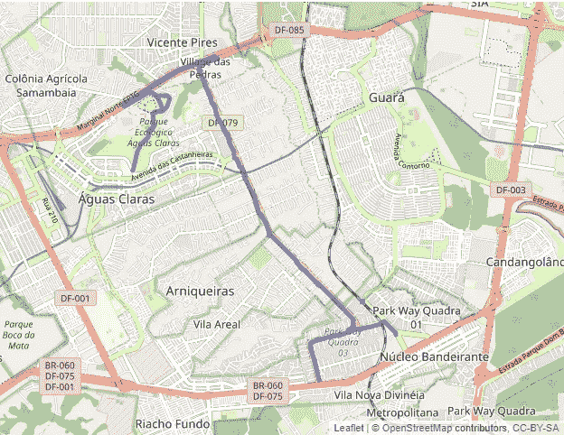

乘坐。作者图片

蓝色路径代表游乐设备电路。在那个阳光明媚的八月星期天，我一醒来，就花了一个小时五十分钟骑自行车完成了我计划的近 30 公里。这条路线包括生态公园，沿着 DF 最繁忙的道路之一的自行车道，一些美丽的树木，和往常一样，一只流浪狗咬我的腿的风险。

# 描述整个旅程

在整个行程中观察到的正负梯度意味着速度的巨大变化。毕竟，正如牛顿已经知道的那样，存在着万有引力，这是物理学的普遍定律，它总是存在，并且在某种程度上使得像这样的飞行成为一项困难的任务。下面是一段代码，用于在图像中显示速度是如何随自行车道上的海拔高度变化的。向下滚动一点，查看生成的图表。

```
g_total<-
patch_graph( c("2021-08-01 08:56:00", "2021-08-01 10:48:55"))g_total + geom_hline(yintercept = destaque[1:2], linetype = 5, alpha = 0.5 ) +
    scale_y_continuous(breaks = c(seq(0,1200,300), destaque[(1:2)]))
```

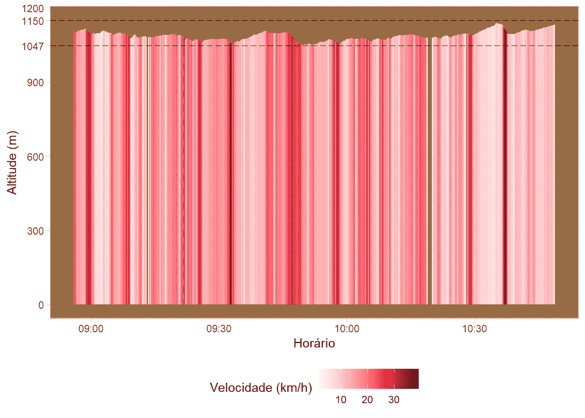

速度 x 高度(全程)。作者图片

颜色渐变显示了速度沿路线的变化。每条彩色垂直线代表 CycleDroid 应用程序每秒测量的速度。颜色越深，速度越高。

因为图表的刻度从零开始，所以高度变化看不清楚。这可能是一个好主意，查看速度图与缩放。相信我，对于我们这些骑自行车的人来说，下一张照片更好地展现了沿途山坡带来的情感。

```
g_total_zoom<-
  patch_graph( bottom_altitude =1000) +
  geom_hline(yintercept = destaque[1:2], linetype = 5, alpha = 0.5 ) 

g_total_zoom
```

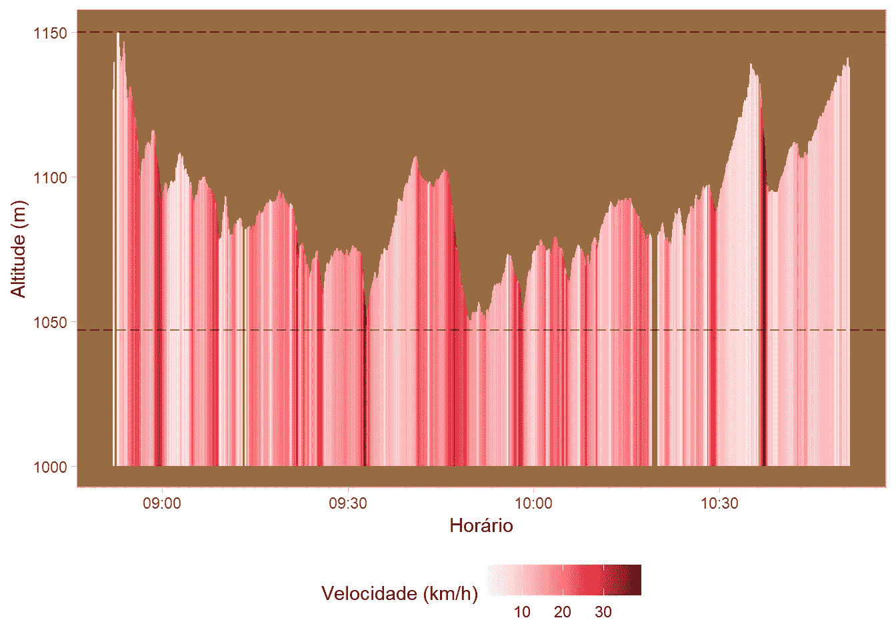

速度 x 高度(缩放整个行程)。作者图片

让我们来评论一下这张图表。正如我们所看到的，有许多起伏。因此，在计算出的 15.8 km/h 的平均速度附近有很大的变化。该图对于将整个路线分解成一些关键部分非常有用。对于这篇文章，我们选择了与最激进的倾向相关的两个部分，你可以阅读下面的几个段落。

该图表对于检测异常事件也很有用。这是在 10:00 到 10:30 之间中断的情况。那时，我不得不等待着安全地穿过一条没有人行横道的繁忙的马路。我花了宝贵的几秒钟。也许像这样的发现可以帮助政府改善城市交通和休闲的公共政策。

## 正弦、导数、统计和总结完整路径的物理

为了更好地描述这个过程，在我们的分析中增加一些元素是很重要的。这里我们有一个问题。该应用程序只给我们提供瞬时速度、高度和时间的数据。更深入的描述还需要累积距离、加速度和倾斜度。在这方面，第一项任务是使用给定的变量计算所有这些新变量。

我引用了物理学中的公式，并使用一些微积分和三角学的方法，计算了剩余的变量。下面的代码引用了两个函数，我在其中进行了计算。

```
rad2deg <- function(rad) {(rad * 180) / (pi)}complete_ride_data <- function(df_ride){
  df_ride$dif_altitude<- c(0,diff(df_ride$altitude_meter, lag=1))

  df_ride$dif_speed<- c(0,diff(df_ride$speed_meter_per_second, lag=1)) df_ride$dif_time<- c(0,diff(df_ride$time_posix_millisecond, lag=1))/1000  df_ride$aceleration<- c(0,df_ride$dif_speed[2:NROW(df_ride)] / df_ride$dif_time[2:NROW(df_ride)])

  df_ride$dist_percorrida<- c(0,df_ride$speed_meter_per_second[2:NROW(df_ride)] * df_ride$dif_time[2:NROW(df_ride)])    df_ride$dist_acumulada<- cumsum(df_ride$dist_percorrida) df_ride$inclinacao<- c(0,df_ride$dif_altitude[2:NROW(df_ride)]/df_ride$dist_percorrida[2:NROW(df_ride)])  df_ride$inclinacao_graus<- c(0, rad2deg(asin(df_ride$inclinacao[2:NROW(df_ride)])) )  
  df_ride
}
```

下面的代码使用函数 complete_ride_data，该函数又用作另一个函数的输入，该函数生成一个描述变量累积距离、速度、加速度和坡度变化的图形。

```
df_ride<- complete_ride_data(g_total_zoom$data )

graph_cinematic(df_ride)
```

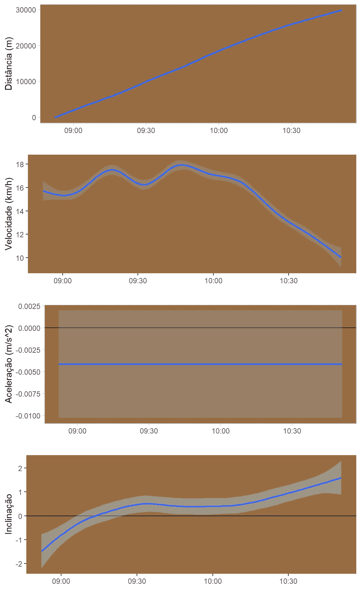

科学在行动(全程游览)。作者图片

对于上面显示的所有图表，我应用了一个基于黄土回归的 **R** 函数来平滑曲线的形状。实际上，计算值中有很多噪声，尤其是最后三条曲线。

正如我们所看到的，累积距离，乍一看，可以被认为是一条几乎是直线的整条路线。然而，仔细观察会发现沿曲线的斜率有一些小的变化。事实上，在最后几分钟，曲线与一个形状相关，在该形状中，累积距离的增加速率略低于行驶开始时观察到的速率。

第一条曲线中的这些小变化与第二张图中观察到的不那么小的变化有关。当应用黄土算法时，瞬时速度以几乎正弦形状的方式变化，直到它变成向下直线的点。对于整个路线，这种行为主要是自行车道负斜率的结果，该负斜率从 9:15 一直持续到最后一秒。这意味着负加速度最好地描述了整个乘坐过程。

对于乘坐的具体部分，图片是完全不同的。就在其中两个下面，我们可以感受到冒险和艰苦的工作。

# 让我们来看看旅程的一个特定部分

首先，让我们看看如何将从 09:15 之前的某个时刻开始到 10:00 之前的某个时刻结束的特定部分的高度和速度联系起来。

图表就在下面，但首先是一些代码。

```
g_trecho_1<-
  patch_graph(limits= c("2021-08-01 09:33:00","2021-08-01 09:48:00"), bottom_altitude =1000)
g_trecho_1
```

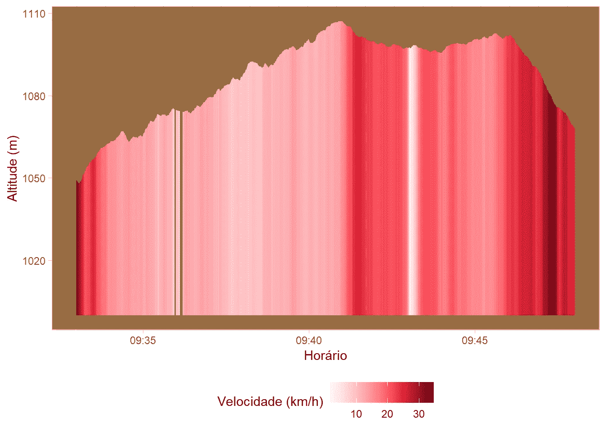

速度 x 高度(缩放第一部分)。作者图片

该图描述了一种情况，其中有一个正斜率和稳定下降的速度，然后我们可以看到某种平稳状态，速度以恒定值出现，变为零，并迅速恢复到之前的值。在平台的末端，有一个与高的正速度变化率相关的负斜率。这有点令人困惑，不是吗？也许这一段的地图会帮助我们确定到底发生了什么。但是正如你所知道的，首先是一些代码。

```
*# define bounding box with longitude/latitude coordinates*

spdf_geo <- g_trecho_1$data

lat_marker_1<- max(g_trecho_1$data$latitude_degree)
long_marker_1 <- g_trecho_1$data$longitude_degree[g_trecho_1$data$latitude_degree==lat_marker_1]

long_marker_2<- min(g_trecho_1$data$longitude_degree )
lat_marker_2 <- max(g_trecho_1$data$latitude_degree[g_trecho_1$data$longitude_degree==long_marker_2])

lat_marker_3<- min(g_trecho_1$data$latitude_degree)
long_marker_3 <- g_trecho_1$data$longitude_degree[g_trecho_1$data$latitude_degree==lat_marker_3]

long_marker_4<- max(g_trecho_1$data$longitude_degree )
lat_marker_4 <- g_trecho_1$data$latitude_degree[g_trecho_1$data$longitude_degree==long_marker_4]

coordinates(spdf_geo) <- ~ longitude_degree + latitude_degree
proj4string(spdf_geo) <- "+init=epsg:4326"

bbox <- list(
  p1 = list(long = min(g_trecho_1$data$longitude_degree ), lat=  min(g_trecho_1$data$latitude_degree) ), *#long -122.522, lat = 37.707*
  p2 = list(long = max(g_trecho_1$data$longitude_degree), lat=  max(g_trecho_1$data$latitude_degree)) *#long = -122.354, lat = 37.84*
)

leaflet() %>%
  addTiles() %>% 
  fitBounds(
    lng1 = bbox$p1$long, lat1 = bbox$p1$lat,
    lng2 = bbox$p2$long, lat2 = bbox$p2$lat,
  )  %>%
  addPolylines(data=coordinates(spdf_geo), color = "blue") %>%
  addMarkers(lng= long_marker_1, lat= lat_marker_1, label = "Início subida",
    labelOptions = labelOptions(noHide = T) ) %>%
  addMarkers(lng= long_marker_2, lat= lat_marker_2, label = "Fim subida",
    labelOptions = labelOptions(noHide = T) ) %>%
  addMarkers(lng= long_marker_3, lat= lat_marker_3, label = "Fim ciclovia",
    labelOptions = labelOptions(noHide = T) ) %>%
  addMarkers(lng= long_marker_4, lat= lat_marker_4, label = "Fim descida",
    labelOptions = labelOptions(noHide = T, direction = "right") )
```

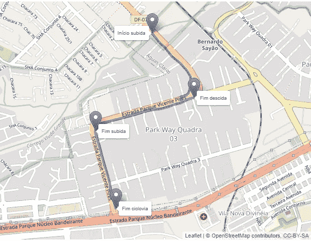

第一部分。作者图片

我们可以在地图上看到四个地标。从上到下，第一个标志表示一个长的正斜率的开始，在第三个标志处结束。最后一个地标代表自行车道的终点。在那一点上，我做了一个 U 型转弯，这解释了零速度。我回到第三个标记，然后下到第二个标记。我认为这张地图描述足以解释令人困惑的速度变化。

关于这段路程的一些统计数据:

*   总距离:4153 米
*   正坡距:1595 米
*   正斜率时间:6 分 38 秒
*   总时间:15 分钟
*   最大速度:34.7 公里/小时

**来自科学的更多帮助**

现在出现了四个图表，从运动学的角度描述了路径。

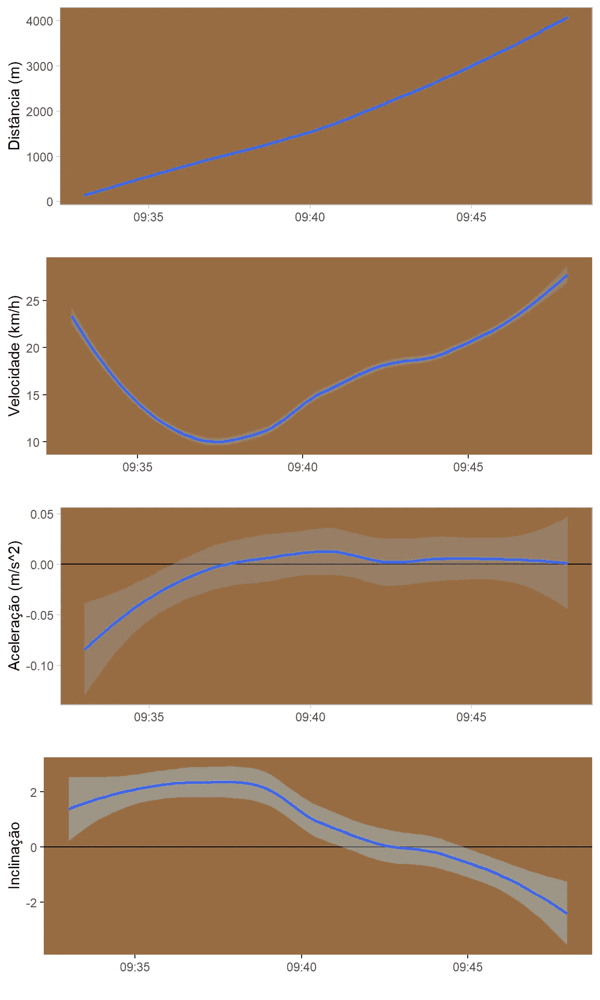

科学在行动(第一部分)。作者图片

正如所料，当我们专注于整个轨迹的一小部分时，科学告诉了我们另一个故事。对于第一张图，更容易看到斜率的变化(仍然很小)。其他图表也更加动态。你可以看到坡度的不同会影响加速度，进而增加或降低速度。例如，前四分钟与速度的降低有关，受到一个负的(虽然是增加的)加速度的影响，反过来，服从于坡度的轻微上升。

尝试这样做:查看速度达到最低值点以外的图表，然后将四个图表与地图描述相关联，以解释图表中表示的四个变量的行为。

# 旅行中最困难的部分

在旅程接近尾声时，我面对一个非常陡峭的正坡。我的精力几乎耗尽，但既然我在写这篇文章，我想我活下来了。让我们看看第一张图表。

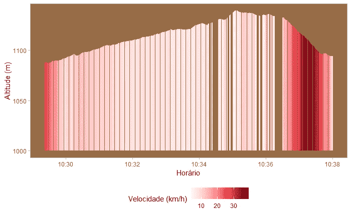

速度 x 高度(缩放第二部分)。作者图片

我们可以看到一个速度不断下降的正斜率，然后我们可以看到一些奇怪的测量结果，最后是高度的突然和持续下降，导致高速，然后是某种减速。我想地图会再次帮助我们更好地理解发生了什么。

**地图再次出现**

下面，我们可以看到与我们旅行的第二个特殊路段相关的地图。

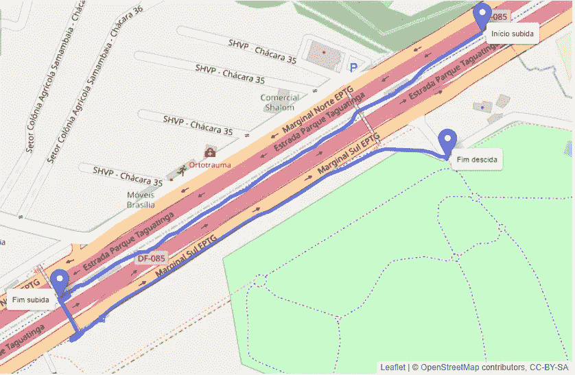

第二部分。作者图片

这条路很长，尽头是一座供行人和骑自行车的人通过的桥，然后是一个急转弯。这条轨迹解释了上面显示的速度和高度图。顺便说一下，过桥与我前面提到的奇怪的测量值有关。
还有现在的统计拉伸:

*   总距离:1696 米
*   上坡距离:855 米
*   上坡时间:5 分 42 秒
*   总时间:8 分 38 秒
*   最大速度:39.3 公里/小时

**毕达哥拉斯，牛顿&高斯帮助我们**

让我们更详细地看看幕后的物理过程。

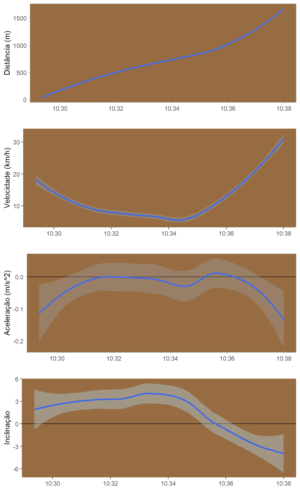

科学在行动(第二部分)。作者图片

在游乐设备的这一部分，更容易看到累积距离曲线的斜率变化。请注意，前几分钟与较小的变化率有关，然后这种行为发生逆转，因为我们可以看到这是斜率、加速度和速度变化的结果。花几分钟时间看看这四张图表，获得一些有趣的见解。

# 两个轮子上的科学

我相信这种分析的大部分可以通过一个好的应用程序来完成，该应用程序将我在这里计算的大部分数据汇集在一起，然后以漂亮的图形呈现出来。我在这里的目的是展示如何根据您的目标定制分析。这样做也是为了实践我们在课堂上学到的概念。换句话说，这篇文章收集了利用健康和可持续的实践中产生的数据创造性地进行科学研究的可能性:骑自行车穿过一个街区。此外，当在更大范围内进行分析时，像这样的数据可能会成为改善一些公共政策的良好起点。

# 代码和数据

我使用的大部分代码都在正文中有描述。尽管一些功能和配置变量没有示出。我的 [GitHub](https://github.com/fernandobarbalho/tourdeaguasclaras) 上有完整的代码和数据。