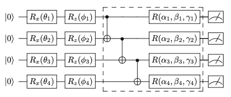

# 走向量子变压器

> 原文：<https://towardsdatascience.com/toward-a-quantum-transformer-a51566ed42c2?source=collection_archive---------13----------------------->

## Transformer 架构彻底改变了自然语言处理的世界。在通往理解圣杯的漫长道路上，与量子计算的结合可能会给它一个额外的推动力

近年来，在开创性的论文*中首次引入的一种称为 [*变压器*](https://en.wikipedia.org/wiki/Transformer_(machine_learning_model)) 的新颖神经网络架构*[arXiv:1706.03762](https://arxiv.org/abs/1706.03762)彻底改变了序列数据的分析，特别关注[自然语言处理](https://en.wikipedia.org/wiki/Natural_language_processing)任务，如[机器翻译](https://en.wikipedia.org/wiki/Machine_translation#:~:text=Machine%20translation%2C%20sometimes%20referred%20to,from%20one%20language%20to%20another.)或从人类提示开始生成文本[。Transformer 架构的推广将研究人员引向了各种领域的应用，如](https://transformer.huggingface.co/)[图像生成](https://arxiv.org/abs/1802.05751)(图像毕竟是一系列像素)。

然而，这种神奇的神经网络的主要问题是，令人震惊的参数规模(在 [OpenAI 的 GPT-3](https://en.wikipedia.org/wiki/GPT-3) 的情况下，数量级为数百*亿*)通常需要巨大规模的训练数据集(例如，[多种语言的完整维基百科语料库](https://www.kdnuggets.com/2017/11/building-wikipedia-text-corpus-nlp.html))和大规模的计算机网络来进行训练。GPT-3 的电费培训成本估计为 460 万美元，如果使用单个 GPU，将需要 350 多年。一些人认为这是整个人工智能领域变得越来越不民主的证据(这意味着一个小公司，更不用说一个人，根本无法与谷歌、微软和埃隆·马斯克的 OpenAI 等巨头竞争)，而另一些人承认这一进展类似于过去几十年科学领域发生的事情:谁能负担得起在地下室建造一个大型强子对撞机的克隆体来研究希格斯玻色子的属性？

最后，关于这些网络实际上学习什么，有一个微妙的、相当哲学的问题。这些机器只是复制人类文档中看到模式，还是对所说的内容有更广泛的理解？“如果你把一个金属球扔向窗户，你可能会打破它”这样的句子对任何有金属和玻璃经验的人来说都有明显的意义。对于只接触过书面文本、与物理世界没有联系的神经网络来说，情况可能并非如此。另一方面，*金属坚硬*和*玻璃易碎*之间的关联很可能在文本语料库中出现足够多的次数，使得这一点即使对于最笨的机器来说也相当明显。关于这一点更详细的分析可以在道格拉斯·霍夫施塔特在《大西洋月刊》上发表的一篇名为《谷歌翻译的浅薄》的著名文章中找到。

有没有一种方法可以缩小这些神经网络的规模，甚至给它们注入对人类语言的理解？

## 那么，少了什么？对量子的需求

2020 年初，一家名为剑桥量子计算的英国公司[宣布](https://cambridgequantum.com/foundational-scientific-papers-on-meaning-aware-quantum-natural-language-processing/)推出一种“意义感知”的量子自然语言处理(QNLP)模型，*即*一种能够将单词的语义信息与句子的句法结构拼接起来的数学理论。这个大胆的主张是基于这样的观察，即句法结构，如诺姆·乔姆斯基的[上下文无关文法](https://en.wikipedia.org/wiki/Context-free_grammar)或[分类组合分布(DisCoCat)](https://arxiv.org/abs/1811.03274) 可以在量子物理学的框架内公式化。虽然 NLP 的希尔伯特空间的概念乍一看似乎很牵强，但直观的解释如下:NLP-as-we-know-it 植根于 [*经典统计学*](https://www.sciencedirect.com/topics/mathematics/classical-statistic) (例如，单词嵌入是ℝ^d 空间中的向量)，但经典统计学本身有其自身的局限性。被称为[量子力学](https://en.wikipedia.org/wiki/Quantum_mechanics#:~:text=Quantum%20mechanics%20is%20a%20fundamental,technology%2C%20and%20quantum%20information%20science.)的物理学领域由[量子统计学](https://www.sciencedirect.com/topics/physics-and-astronomy/quantum-statistics)的数学描述，它通过用复数的矩阵来表示对象，从而扩展了经典统计学。最后，量子物理学和计算机科学交叉的研究领域被称为[量子计算](https://en.wikipedia.org/wiki/Quantum_computing#:~:text=Quantum%20computing%20is%20the%20use,are%20known%20as%20quantum%20computers.)。因此，即使我们没有声称单词是粒子，我们需要描述人类语言的统计数据与量子物理学的基本相同也是偶然发生的。足够幸运的是，我们也正在进入一个时代，能够基于<https://en.wikipedia.org/wiki/Qubit#:~:text=In%20quantum%20computing%2C%20a%20qubit,with%20a%20two%2Dstate%20device.>*量子位而不是数字信息位进行计算的初级且仍然相当嘈杂的设备正变得可以为更广泛的公众(包括小公司和个人)所用。因此，在 21 世纪 20 年代探索量子计算促进自然语言处理的可能性是有意义的。*

## *混合方法*

*传统上，计算是由计算处理单元(CPU)执行的，这些单元可以处理数字形式的数字，*即*，将它们表示为逻辑位串。在 2009 年，在论文《使用图形处理器 的大规模 [*深度无监督学习》中，作者认识到了并行计算对加速计算的重要性，特别强调了神经网络中出现的最常见的操作，矩阵乘法，可以以并行形式进行转换，因此与*](http://robotics.stanford.edu/~ang/papers/icml09-LargeScaleUnsupervisedDeepLearningGPU.pdf)*[图形处理单元(GPU)](https://en.wikipedia.org/wiki/Graphics_processing_unit)相关。然而，尽管 CPU 和 GPU 可以覆盖大量可能的计算，但有些仍然超出了它们的能力范围，或者至少不是以有效的方式，但如果计算是使用量子信息位(量子位)进行的，情况就不是这样了。这些问题中的一些例如在 [NP-hard](https://en.wikipedia.org/wiki/NP-hardness) 或 [NP-complete](https://en.wikipedia.org/wiki/NP-completeness) 问题的情况下出现。例如[旅行推销员问题](https://en.wikipedia.org/wiki/Travelling_salesman_problem)或[柯尼斯堡的七座桥](https://en.wikipedia.org/wiki/Seven_Bridges_of_K%C3%B6nigsberg)。这种优化问题可以用一种叫做量子退火器的设备来处理，比如由温哥华的 DWave 公司生产的那种。一类更普遍的问题可以用基于门的量子计算机来解决。事实上，人们已经注意到，在一些显著的情况下，如整数的[因式分解](https://en.wikipedia.org/wiki/Shor%27s_algorithm)，量子计算允许在更少的运算中找到结果，至少在量子位不受热噪声和其他与它们在物理系统*中的[实现相关的问题影响的理想世界中。为了更深入的解释，我参考了我之前在 CERN 的帖子](https://physics.stackexchange.com/questions/298518/how-are-quantum-qubits-implemented)[幽灵计算机](https://riccardo-disipio.medium.com/spooky-computers-at-cern-c08f8756444)。*

*很明显，量子计算机不会解决世界上的所有问题，但在 CPU 可能永远占用时间的情况下，量子计算机非常有效。在化学领域尤其如此，毫不奇怪，科学家们正试图[预测分子的属性](https://physicsworld.com/a/quantum-approach-reveals-faster-protein-folding/#:~:text=Thanks%20to%20a%20new%20quantum,folded%20into%20a%203D%20shape.)，例如每个原子在三维空间中的位置。因此，这个想法是在常规计算机上进行大部分计算，并使用量子设备来解决棘手的部分。这种混合方法与我们在过去十年中使用 GPU 所做的并没有太大的不同。很快，人们意识到人工智能的一些子领域可以受益于这种加速，因此引入了 [*量子机器学习*](https://www.nature.com/articles/nature23474) 。*

*在许多可能性中，最明显的一个是设计最简单的神经网络结构的量子等价物，并在更复杂的结构中的任何地方替换它。 [*感知器*](https://deepai.org/machine-learning-glossary-and-terms/perceptron#:~:text=A%20Perceptron%20is%20an%20algorithm,a%20single%2Dlayer%20neural%20network.) 也称为*线性层*或*密集层*，简单来说就是矩阵乘法后跟一个非线性“激活”函数。此外，它的作用还在于改变(通常减少)特征空间的维度，*例如*从 512 个元素的输入向量，获得 128 的输出。量子电路不能天真地那样做，因为量子比特的性质决定了它只能在复杂的空间中“旋转”。因此，这个想法是通过一组角度θ_1，…，θ_ *n* (其中 *n* =量子位的数量)来参数化这个旋转，这些角度必须在训练期间“学习”，并且最终用两个线性变换来“夹层”或者更技术地“修饰”量子层，这两个线性变换考虑了维度的变化，在我们的例子中:512 - > n - > 128。这种变换被称为 [*变分量子电路*](https://pennylane.ai/qml/glossary/variational_circuit.html) (VQC 或 QVC 取决于你问谁)。在我之前的文章 [*中，我给出了一个这种技术的实际例子，一个量子增强的 LSTM 层*](/a-quantum-enhanced-lstm-layer-38a8c135dbfa) 。*

**

*变分量子电路的例子摘自研究论文《用于深度强化学习的变分量子电路》*(*[*arXiv:1907.00397*](https://arxiv.org/pdf/1907.00397.pdf)*)。*单量子位门 R_x(θ)和 R_z(θ)代表沿 x 轴和 z 轴旋转给定的角度θ。CNOT 门用于纠缠每个量子位的量子态。最后，沿着 *z* 轴进行投影测量。这种体系结构可能特别适合于实用目的，但是对于解释概念来说足够简单。*

## *量子增强型变压器*

*正如在简介中提到的，Transformer 体系结构革新了顺序数据的分析，尤其是人类编写的文档。我在之前的帖子 [*中写了关于变形金刚的内容，请注意:忘记递归神经网络*](https://medium.com/swlh/attention-please-forget-about-recurrent-neural-networks-8d8c9047e117) ，但这里有一个简短的回顾。Transformers 是一种神经网络架构，它经过优化，可以在高度并行的设备上分析顺序数据，例如 GPU 和[TPU](https://en.wikipedia.org/wiki/Tensor_Processing_Unit)。与递归网络不同，变压器没有“记忆”，但仍然能够通过组合[位置相关嵌入](https://medium.com/nlp-trend-and-review-en/positional-embeddings-7b168da36605) ( *即*单词嵌入由另一组向量补充，该向量取决于单词在句子中的位置以及嵌入维度的索引)和[注意力](https://www.analyticsvidhya.com/blog/2019/11/comprehensive-guide-attention-mechanism-deep-learning/) ( *即*计算出输入的哪些部分与计算输出相关)。任何变压器的核心都有所谓的多头注意力。其思想是将三种不同的线性变换 *W_Q* 、 *W_K* 和 *W_V* 应用于输入序列的每个元素，以将每个单词嵌入转换为其他一些内部表示状态，称为*查询* ( *Q* )、*键* ( *K* )和*值* ( *V* )。这些状态然后被传递给计算注意力权重的函数，该函数被简单地定义为:*

**

*注意力公式*

*为了促进从经典到量子实数的变换，人们可以简单地用变分量子电路代替线性变换 *W_Q* 、 *W_K* 和 *W_V* 。*

*基于 Google 的[教程，这是 TensorFlow 2.0 中经典的多头注意力的样子:](https://www.tensorflow.org/tutorials/text/transformer)*

*要添加量子层，可以利用 Xanadu 的 [PennyLane](https://pennylane.ai/qml/) 量子机器学习库。有了这个框架，我们必须向执行量子计算(`_circuit`)的类添加一个函数，然后用一个`QNode`包装它，告诉 TensorFlow 如何用 [*参数移动规则*](https://pennylane.ai/qml/glossary/parameter_shift.html) 计算梯度。最后，我们创建一个`KerasLayer`来处理混合神经网络中的 I/O。使用 [PyTorch 接口](https://pennylane.readthedocs.io/en/stable/code/api/pennylane.qnn.TorchLayer.html)可以完成类似的程序。请注意，PennyLane 0.13.0 还没有实现广播，所以`KerasLayer`必须通过循环或列表理解应用于输入序列的每个元素。*

*编码部分到此为止！*

*训练这样一个网络需要*大量的*耐心。即使在经典情况下，也建议使用 GPU。在[的例子](https://github.com/rdisipio/qtransformer)中，我计划对 [IMDB 数据集](https://www.tensorflow.org/tutorials/keras/text_classification_with_hub)进行情感分析，在我的 MacBook Air 上训练一个二进制分类器*一个时期*需要大约 100 个小时！为了加快训练速度，我使用了 [PennyLane 插件](https://github.com/soudy/pennylane-qulacs)到 [*Qulacs* 库](https://github.com/qulacs/qulacs)，这是一个 VQC 模拟器，如果你有 GPU，它也会使用 GPU。另一种可能性是使用亚马逊的 [AWS Braket 后端](https://aws.amazon.com/about-aws/whats-new/2020/12/amazon-braket-now-supports-pennylane/)，但这可能是一种更昂贵的替代方案。如果你能找到更快的方法，请告诉我。需要说明的是， *Qulacs* 也可以通过`[OpenMP](https://www.openmp.org/)`在多核模式下运行(只需设置一个环境变量，*例如* `export OMP_NUM_THREADS=32`)。*

## *结论*

*在科幻系列*星际迷航*中，少校数据是一个机器人，他的 [*正电子大脑*](https://en.wikipedia.org/wiki/Positronic_brain) 让他拥有令人印象深刻的计算能力。这个虚构的大脑装置最初是由科幻作家[艾萨克·阿西莫夫](https://en.wikipedia.org/wiki/Isaac_Asimov)在小说 *I，机器人*中介绍的。它充当机器人的中央处理器(CPU)，并为它们提供人类可识别的意识形式。有人可能会说，由于量子计算机的诞生通常可以追溯到理查德·费曼用计算机模拟物理(1982 年)，艾萨克·阿西莫夫真正指的是量子处理单元(QPU)。众所周知，变形金刚能够完成句子和[写短文](https://transformer.huggingface.co/)，并且在某种程度上[能够以不可思议的能力与人类](/how-to-train-your-chatbot-with-simple-transformers-da25160859f4)(对话聊天机器人)进行对话。人们只能想象，如果量子增强版的变形金刚架构真的能够增加他们已经惊人的技能组合，会发生什么。*

*少校数据是虚构的 [*星际迷航*](https://en.wikipedia.org/wiki/Star_Trek) 系列中的一个人物，由演员布伦特·斯皮内演绎。虽然他的正电子大脑让他拥有令人印象深刻的计算能力，但理解幽默和其他人类情感往往超出了他的能力范围。*

*训练量子增强变压器的代码可以在我的 GitHub 库中找到:[https://github.com/rdisipio/qtransformer](https://github.com/rdisipio/qtransformer)*