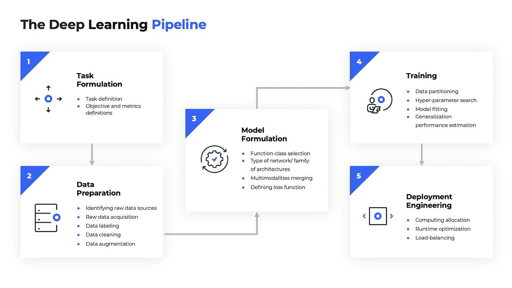
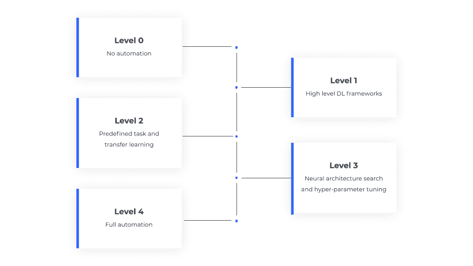

# 为深度学习定义 AutoML

> 原文：<https://towardsdatascience.com/toward-defining-automl-for-deep-learning-c257c3784b8c?source=collection_archive---------45----------------------->

## 深度学习背景下的 ML 管道的概述和分层定义

AutoML 在机器学习领域是一个相对较新且令人兴奋的概念。术语 AutoML 听起来很简单:在给定特定输入数据和任务的情况下，自动化构建机器学习生产模型的过程。但是，到目前为止，AutoML 还没有一个被广泛接受的定义，业界使用这个术语来指代许多不同的事物。

深度学习(DL)研究和实践中的最新方法简化了一些 ML 管道挑战，例如特征工程和选择。此外，DL 还增加了更多的超参数，如架构和训练制度的选择，并要求更多的标记训练数据，从而使 ML 管道变得复杂。

本文的目的是在 DL 的背景下提供 ML 管道的概述，并提出一个分级的定义，允许从业者和研究人员更精确地使用术语深度学习自动语言(DL-AutoML)。首先，让我们看看创建深度学习产生算法的主要步骤。

图 1:深度学习管道(图片由 [deci.ai](http://deci.ai/) 提供)

1.  任务制定——应用 ML 的第一个挑战是**定义我们想要完成的任务**和目标。例如，我们可能想要进行分类、回归、从数据库中检索等等。这一步还包括定义表示成功和失败的**指标和目标**。
2.  数据准备—该步骤从**识别原始数据源**和**原始数据采集**开始。然后继续进行**数据标记**的过程。一旦数据被标记，额外的**数据清理**步骤被应用以移除异常值和不正确的标签。进一步的准备可能包括平衡类(如果数据分布不平衡)、归一化、训练和测试分区的形成等等。**数据扩充**是另一个可以用来丰富数据集的步骤。最后，使用**数据质量分析**来验证 DL 流水线获得了可能的最佳输入。
3.  模型公式化——使用 DL 算法时，我们一般需要进行**函数类选择**。这一步包括选择**类型的神经网络/架构家族**(如 CNN、RNN、FC)和选择有效的**架构**(如 ResNet、MobileNet、EfficientNet 等)。此外，如果我们正在**处理多模态**，我们需要决定信息将如何从不同的模态传播到网络的更高部分。作为这一步的一部分，我们必须选择正确的**损失函数**，这个决定会极大地影响我们最终结果的质量。
4.  培训—这一步包括实际的培训阶段。它从**将数据**划分成测试、验证和训练集开始。接下来，我们应用**超参数搜索**来选择模型的最佳参数，包括学习速率、宽度、深度等等。在这一步的最后，我们**拟合模型**，然后监控其**在验证和测试数据上的泛化性能**。
5.  部署工程——给定一个训练有素的模型，我们的最终目标是将其集成到生产环境中。这包括**为加载和**预处理数据**分配计算资源**的过程，以及推理本身。在许多情况下，这一步还需要设计和实现**负载平衡**在为数据处理和推断执行的计算之间。在实时应用中，这一步应该包括推理运行时间的**优化，以调整现有硬件的各种参数，如批量大小、操作类型和内存使用。**
6.  性能监控——一旦我们的模型被部署到生产环境中，监控它的操作、利用率和性能是必不可少的。在许多应用中，这种监控的一个重要部分是对模型的**逐点不确定性**的在线评估，以及检测**分布变化**的能力。

概述了 DL 管道的基本组件之后，定义 DL-AutoML 的自动化级别就变得更加容易了。

**DL-AutoML 的主要目标是让深度学习对所有人开放**，从个人到小型创业公司和大公司。无障碍一词在这方面至关重要。理想情况下，DL-AutoML 管道应该(1)价格合理(2)不需要高水平的专业知识(3)可靠和准确。这种方法为我们提供了流水线中自动化级别的粗略划分。每个子步骤都将根据其所需的专业水平进行优先排序，前提是该步骤可以被一个强大的自动化解决方案所取代。

例如，为任务选择正确的架构超参数需要高水平的专业知识。然而，这一步可以用神经结构搜索(NAS)来代替，它可能提供一个健壮的解决方案；因此，它获得了自动化的高优先级。另一个例子是数据标记，它在大多数应用中并不昂贵，也不需要高水平的专业知识。也就是说，我们不知道有什么解决方案能够以一种足够健壮的方式来自动标记数据，以完成广泛的任务。本着这种精神，我们现在定义自动化的 DL-AutoML 层次，并为每个层次提供典型的例子。

图 2:DL-AutoML 级别(图片由[决策部](http://deci.ai/)提供)

## 0 级—深度学习管道的自动化、定制实施:

在很大程度上，这个自动化水平是历史性的，指的是深度学习时代的开始，在 Caffe、TensorFlow 和 PyTorch 等高级框架出现之前。当时，从业者需要自己实现深度学习管道，通常依赖于 C++等低级语言。在这个自动化级别，用户对他们的神经网络、优化器、损失函数、数据加载器等等进行编程。ML 管道中的其他元素，如数据处理、架构搜索和超参数调整都是根据人类的远见手动完成的。从头开始编写神经网络代码的过程容易出错，并且需要扎实的数学、编程和算法背景。这一级别所需的深刻掌握，以及深度学习的成功，导致了高级别库的出现，这是我们自动化水平的下一步。虽然是在熟悉的任务背景下，但这种自动化程度确实是“历史性的”。当我们看到现有框架中不支持的全新类型的网络和硬件(以及数据)时，0 级自动化是不可用的。

典型示例:假设我们想要实现一个二进制神经网络，其中每个权重和激活都是二进制的，即要么减一，要么减一。优势在于这种网络有可能使用更少的能量来运行。这种情况需要定制实现，最好使用非异或(Xnor)等逻辑门和填充计数操作。这种逻辑门和操作在神经网络中没有广泛使用，因此在 PyTorch、Tensorflow、Caffe 等高级框架中不可用。最有效的实现是用低级编程语言运行上述过程的定制程序。

## 级别 1 —高级 DL 框架

这是应用最广泛的自动化级别。用户不是使用低级编程语言，而是使用高级框架(例如，Caffe、TensorFlow、PyTorch 等)来实现 DL 模型和流水线。)，它从层次、连接性和优化方面抽象了神经网络和工作流。这种框架让用户可以灵活地编写定制网络、优化器、损失函数等，所有这些都可以在通用硬件设备(如 GPU)上高效运行。这些库大大降低了构建和部署可靠的 DL 模型所需的专业知识水平。今天，大多数 DL 开发人员依赖于这种程度的自动化。然而，这一水平仍然要求在编程和 DL 方面有足够的熟练程度，这通常要求在开发非标准模型的领域中至少有硕士(或同等)学位。

典型的例子——假设我们有一个传感器，它提供一种新的数据，不同于任何现有的数据。如果我们的目标是为这种新类型的数据生成预测，现成的解决方案通常是行不通的。对于高质量的预测，我们可能会决定使用新的架构甚至新的架构系列来构建定制的网络。为此，假设自定义网络使用一般操作，最佳解决方案将是使用高级框架对神经网络进行编程。

## 第 2 级—解决预定义的任务和迁移学习。

监督机器学习中有许多任务被认为已经解决。比如视觉背景下的分类、物体检测、情感分析、语义分割等等。在这个级别中，假设感兴趣的任务或类似的任务在过去已经被解决。因此，有可能使用预训练模型和迁移学习来实现类似任务的准确解决方案。在这种情况下，我们可以采用在级别 1 中描述的高级框架之一(例如 PyTorch)内编程的训练模型(例如，来自开放源代码库)。然后，收集新任务的一些标记数据，并通过对新数据的额外训练来“微调”训练的模型。在这一水平上操作仍然需要工程师预处理数据并正确地执行微调。然而，所需的专业水平是基本的，完全可以由非专家完成。这种自动化水平的限制是使用已知模型的限制。如果模型运行得不好，用户需要回到第 1 级，这需要如上所述的编程和 DL 方面的深入知识。

典型的例子——假设我们想在一系列图像中检测行人，并在图像中的每个人周围画一个边界框。这项任务在过去已经解决，YOLO 框架为此类任务提供了高度准确的结果。为了建立一个适合新数据的模型，我们所要做的就是采用一个预训练的 YOLO 模型，并使用数据集(如加州理工学院行人检测基准)对其进行微调。在大多数情况下，这种方法产生的结果在准确性方面是令人满意的。

## 第 3 级—具有神经架构搜索和超参数调整的 DL-AutoML

此级别的目标是使第 2 级中提到的预定义解决方案可用于更广泛的任务。在这里，用户定义他们的任务并提供带标签的数据。如果可能，数据预处理由预定义的算法自动完成。给定清理后的数据，基于数据输入的种类自动选择函数类。基于任务公式自动选择神经架构的类型。然后，最终的结构也由神经结构搜索(NAS)自动确定；这里，考虑并测试了许多可能的架构，以便为手头的任务选择最有效的架构(例如，实现最高的准确性)。建立架构后，需要执行一个额外的步骤来调整超参数。NAS 不是灵丹妙药，但它将提供一个不错的解决方案——前提是它具备减少搜索空间所需的先验知识。由于这一限制，有些任务 NAS 无法解决，这一事实符合“没有免费的午餐”定理。如果没有达到期望的精度，人类必须进行干预，以确定在数据、学习算法或问题的可学习性中是否存在问题。在大多数情况下，任何数据问题都可以通过提供附加数据来解决。但是，模型问题要求用户返回到第 1 级。

典型的例子——让我们假设给我们一个医学图像的分类任务。在这种情况下，没有现成的模型可以使用。然而，这种数据是在文献中分析的，因此我们对所需的体系结构系列有一些先验知识，对所需的网络体系结构的先验知识很少。利用这一点，我们可以使用 NAS 在大量候选网络中进行搜索，并自动返回一个有效的网络。还可以使用网格搜索，或者更好的贝叶斯优化，来优化模型的其他超参数。

## 第 4 级—完全自动化，任何给定任务的 DL-AutoML

在这个级别，整个深度学习管道都是自动进行的。用户交付任务公式和数据，并且存在可以定义该数据和任务所需的先验知识的元模型。尽管这种元模型还不存在，但我们相信如果我们要实现 DL-ML 管道的完全自动化，这种模型是必不可少的。让我们仔细看看为什么。最初，深度学习仅用于简单的架构，如全连接架构。然后，AlexNet 引入卷积神经网络(CNN)进行图像分类，取得了图像分类的最新成果。这些 CNN 取得了优于全连接网络的结果，因为它们编码了一些分析图像所需的先验知识。基于对这类数据的研究和高度理解，在 LSTM 的文本、CNN 的声音和 RNN 的时态数据中发现了类似的先验知识。

在 DL-AutoML 的第 4 层，特定数据和任务所需的先验知识由某种元模型编码。给定训练数据，该元模型能够发明手边任务所需的体系结构家族，并且能够提供关于体系结构超参数的先验知识。利用这一知识，可以应用 NAS 过程来自动找到问题的最佳模型。结论

DL-AutoML 的目标是简化深度学习的使用，并让每个人都可以使用 DL 的惊人能力。近年来，DL-AutoML 的某些自动化级别已被广泛使用，并由许多科技公司提供。

本文提供了术语 DL-AutoML 的分层定义。我们首先定义了将 DL 算法从想法变成产品所需的各个阶段。然后，我们使用这些步骤来定义 DL-AutoML 的不同自动化级别。我们相信这一领域将继续发展。最终，部署深度学习将在按下按钮后完成。要了解 Deci 在 DL-AutoML 领域的发展，请下载我们的[白皮书](https://deci.ai/download/)。

最初发布于:【https://deci.ai/ T3