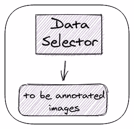
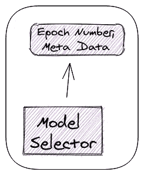
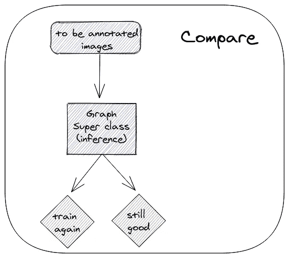
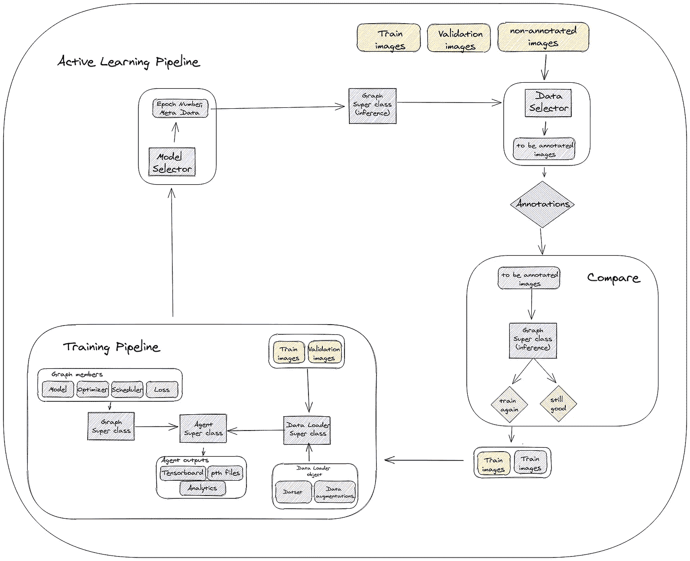

# 走向完全自动化的主动学习管道

> 原文：<https://towardsdatascience.com/towards-a-fully-automated-active-learning-pipeline-29b8f4eb7d73?source=collection_archive---------32----------------------->

## 用于主动学习的简单、模块化和通用架构

图片取自 [freepik](https://www.freepik.com/free-vector/plumber-service-concept_2869860.htm)

在我的[上一篇文章](/how-to-start-being-an-active-learner-8d311d68fb70)中，我简单介绍了主动学习的理论和方法。主动学习之旅的下一步是实施。在这篇文章中，我将分享我走向一个完整的自动化主动学习管道的旅程。

# 步骤 1——实施的动机

起初，像其他有动机的算法开发人员一样，我从实现所选择的主动学习方法开始。我没有考虑接下来的步骤和“大局”。一方面，它让我很快地实现了一个可行的(工程方面的)实现。另一方面，这使得接下来的步骤更加困难。在我的例子中，我有两个并行的后续步骤，这引出了三个不同的问题:

1.  我如何建立一个积极的学习管道？
2.  如何以模块化和通用的方式构建管道？
3.  如何将多个不同的任务合并到管道中？

# 步骤 2 —主动学习管道—半自动

我的第一个主动学习管道实现是半自动的。每个周期完全自动运行，但手动执行。为此，主要增加了数据选择器。

## **数据选择器**

数据选择器概括了主动学习的目的——以明智的方式选择下一个要注释的图像。其输入是一组当前未注释的数据，其输出是要注释的子集。

作者图片

数据选择器可以是附加的神经网络、经典算法、数据库查询或任何其他适合您的方法。

在每个周期，数据选择器基于前一周期的最佳模型。其输出集被添加到前一周期的训练集中(在对其进行注释之后)。

## 为什么半自动不够好？

除了手动执行每个周期的开销(这很耗时)之外，半自动流水线还需要监控。通过监控，我的意思是我们需要记住我们想要运行哪个周期，我们在哪里保存前一个周期的状态，手动选择前一个周期的推理模型，等等。这个过程很有可能出现错误、漏洞和混乱。理想情况下，我们需要全自动流水线，这是我们下一节的主题。

# 步骤 3 —模块化和通用的主动学习渠道

我有几种不同任务的模型。有一天，我发现自己一次又一次地从一个文件复制粘贴到另外四个不同的文件。此时，我认为有些事情需要改变，是时候进行标准化了。

培训管道组件是软件工程意义上最重要的组件。在您的培训管道中维护模块化和标准的架构，可以在您下次实施新网络时省去很多麻烦。

受[这个](https://github.com/moemen95/Pytorch-Project-Template/)模板的启发，我创建了自己的深度学习代码架构，有三个主要组件——数据加载器、图形和代理。

作者图片

**数据加载器—** 顾名思义，数据加载器封装了我们创建数据加载器对象所需的所有内容。

**图表—** 图表包含我们的网络模型和训练所需的其他组件，如优化器、调度器和损耗。

通过定义图，重用共享组件变得更加容易。例如，我有两个分割任务，使用相同的损失函数。我的图超类包含了 loss 函数实现，每个任务都实现为一个继承自图超类的图类。

**代理—** 代理是我们的培训班。每个特定的任务都继承自代理超类，并且必须实现 train 和 eval 方法。在代理超类中实现了一个通用的训练循环，从它继承的任何其他类都可以扩展它。

# 第 4 步—主动学习渠道—自动

回到主动学习管道，我们终于到了最后一步。为了创建一个完全自动化的管道，我们需要封闭循环。首先，每个周期需要加载前一个状态的状态，并保存其当前状态。其次，我们需要自动选择要使用的最佳推理模型。这是使用模型选择器模块完成的。

模型选择器 **—** 完成训练管道后，我们从训练循环的不同点保存了几个模型。模型选择器使用给定的标准选择最佳模型。

作者图片

该模型将在下一个周期中用作数据选择器模型(用于相关方法)以及新的生产模型。

# 额外步骤—比较模块

作者图片

我们是否总是想要为任何新选择的非注释批次重新训练我们的网络？大概不会。当我们注意到结果恶化时，我们希望重新训练我们的模型。为此，我们使用比较模块。

比较模块非常简单，工作方式如下:

1.  在数据选择器模块中传递新的带注释的图像。
2.  衡量结果的质量，并将其与您的关键绩效指标(KPI)进行比较。
3.  满足 KPI —无需重新培训。
4.  不符合 KPI —重新培训。

比较模块可以在开发阶段取消。在开发阶段，我们希望证明我们的主动学习方法是有效的。为此，我们使用一个已知的完全注释的数据集，并表明我们可以以一种明智的方式选择我们的下一个训练样本。更多细节，请看我之前的帖子。

 [## 如何开始成为一个主动的学习者？

### 计算机视觉主动学习简介

towardsdatascience.com](/how-to-start-being-an-active-learner-8d311d68fb70) 

# 终点线

是时候总结和概括整个架构了。在下面的方案中，您可以找到包含所有模块及其连接的自动化管道。

主动学习管道计划。图片作者。

# 我们做到了！

照片由 [Jo Jo](https://unsplash.com/@hanness?utm_source=medium&utm_medium=referral) 在 [Unsplash](https://unsplash.com?utm_source=medium&utm_medium=referral) 上拍摄

现在，我们都熟悉了创建一个良好的主动学习渠道的步骤。

对我来说，花了一些时间来组织我所有的现有代码，以适应这种管道架构。但是完成之后，添加新任务或更改我的数据选择器方法变得容易多了。

祝你好运！