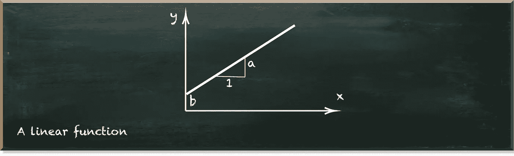
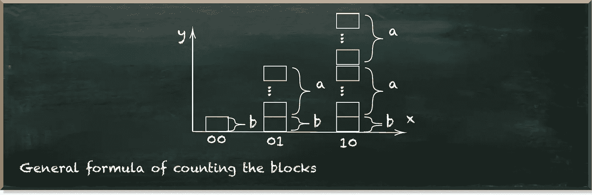
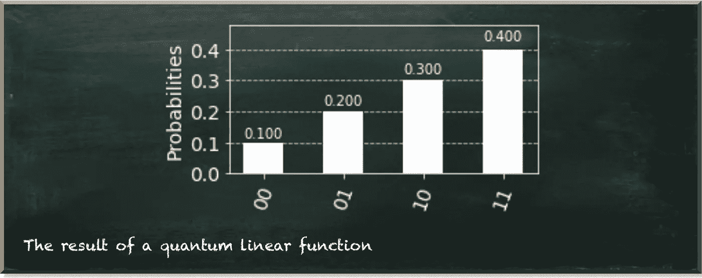
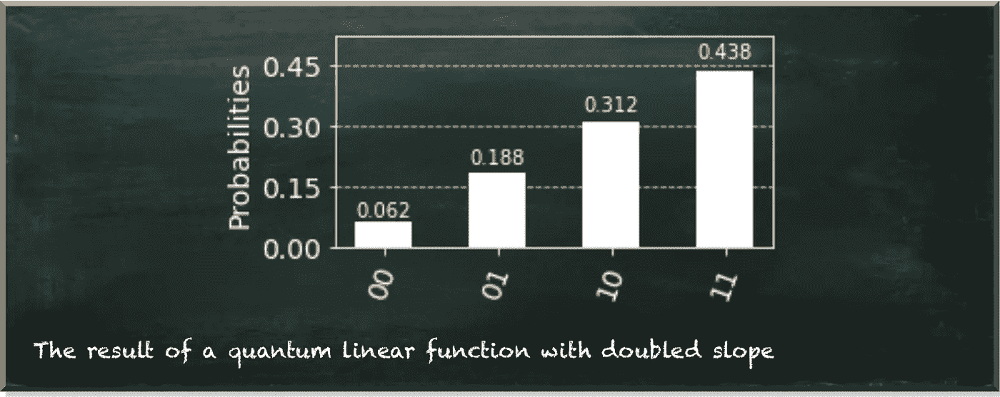
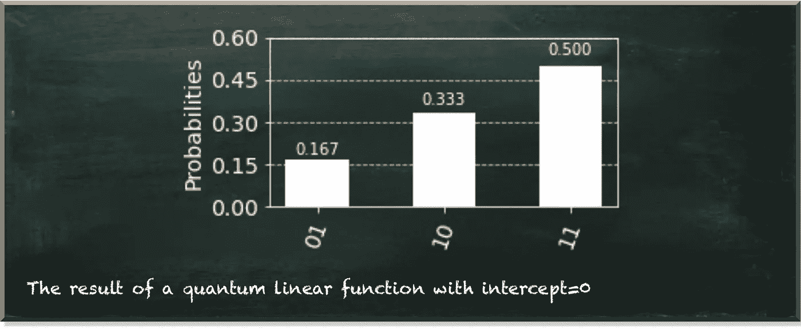
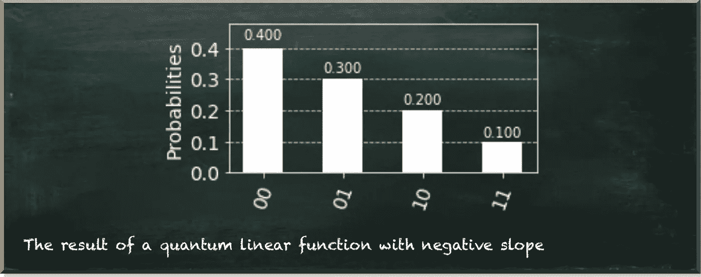

# 走向广义量子线性函数

> 原文：<https://towardsdatascience.com/towards-a-generalized-quantum-linear-function-f682d572ee19?source=collection_archive---------26----------------------->

## 了解量子数据科学的基本构建模块

量子机器学习要不要入门？看看 [**动手量子机器学习用 Python**](https://www.pyqml.com/page?ref=medium_towlin&dest=/) **。**

上周，[我们介绍了一种创建量子线性函数](/quantum-linear-function-c86985f6118f)的方法。我们将每个位置的值分成相等的块，并旋转量子位状态向量，以表示对应于块数的概率。

作者图片

然而，我们手动计算了所有的概率。因此，不清楚我们如何使用这种方法来创建其他线性函数。如果你还记得，线性函数的形式是 y=f(x)=ax+b。

从图形上看，a 表示图形的斜率。这是当 x 轴上的位置增加 1 时，图形中 y 的变化。$b$是截距，即图表与 y 轴相交的点。

作者图片

但是参数 a 和 b 没有出现在我们创建的代码中。因此，今天，我们推广我们的方法来解释这些参数。

因此，让我们简要回顾一下我们方法的步骤。

1.  根据上量子位的值分割状态，并计算块数。
2.  将上部量子位旋转 7/10，因为这是属于上部量子位为 1 的状态的块的分数。
3.  根据低位量子位的值拆分高位量子位为 1 的状态，并计算块数。
4.  将下部量子位旋转 4/7，因为这是属于下部量子位为 1 而上部量子位也为 1 的状态的块的分数。
5.  根据较低量子位的值拆分较高量子位为 0 的状态，并计算块数。
6.  将下部量子位旋转 2/3，因为这是属于上部量子位为 0 时下部量子位为 1 的状态的块的分数。

我们可以创建一个函数来代替手动计算块数，这个函数使用斜率(a)和截距(b)作为参数。

我们来看看前三个州的数字。

作者图片

每个状态都有代表 b(y 轴的截距)的块。第一个状态(00)没有更多的块，因为它位于 y 轴上(根据定义)。下面的状态(01)也有表示 a 的块—斜率。所以它有 a+b 块。第三个状态具有前一个状态的所有块加上另一个 a 块。所以，它有 2a+b 块。

因此，我们创建了一个为我们计算块数的函数。

这里，`SLOPE`代表 a，`INTERCEPT`代表 b，最后函数`count_blocks`以状态的位置为参数，返回对应状态的块数。

所以，让我们调整剩下的代码，用计数函数替换固定的数字。

我们之前概述的步骤都在这段代码中。当我们用所示的斜率和截距值运行该电路时，我们得到的分布与之前相同。

作者图片

我们现在有了这两个参数。所以让我们和他们玩一会儿。例如，让我们设置斜率=2，截距=1。

作者图片

我们看到图形的斜率增加了(从 0.1 增加到大约 0.125，细微的差别是舍入误差)。但是，与此同时，代表截距的状态 00 的值减小了。这是量子位标准化的直接结果。所有状态的总和必须是 1=100%。

让我们看看如果我们设置`INTERCEPT=0`会发生什么。在这种情况下，你可以为`SLOPE`选择任何正值。

作者图片

状态 00 的概率现在是 0。因此，它没有出现在图表中。绝对斜率现在是 0.167。这是我们用两个量子比特所能达到的绝对最大值。原因还是在于正常化。

让我们试试别的东西。负斜率怎么样？你唯一需要考虑的是概率不能是负数。因此，我们需要相应地设置截距。

如果设置`SLOPE=-1`和`INTERCEPT=4`，会得到如下结果。

作者图片

# 结论

一旦你对量子线性函数有了感觉，你会发现它非常有限。

*   它只对两个轴上的正值有效
*   最小和最大斜率是有限的
*   这是一个只有少量数据点的离散函数

虽然我们不能改变前两点，但我们肯定可以在第三点上努力。这是我们在下一篇文章中要做的。

您还可以看到，实际(绝对)斜率取决于`SLOPE`和`INTERCEPT`的值之间的关系，而不是它们的绝对值。当你习惯于经典的线性函数时，这可能有点违背直觉。

量子机器学习要不要入门？看看 [**动手用 Python**](https://www.pyqml.com/page?ref=medium_towlin&dest=/) **学习量子机器。**

在这里免费获得前三章。