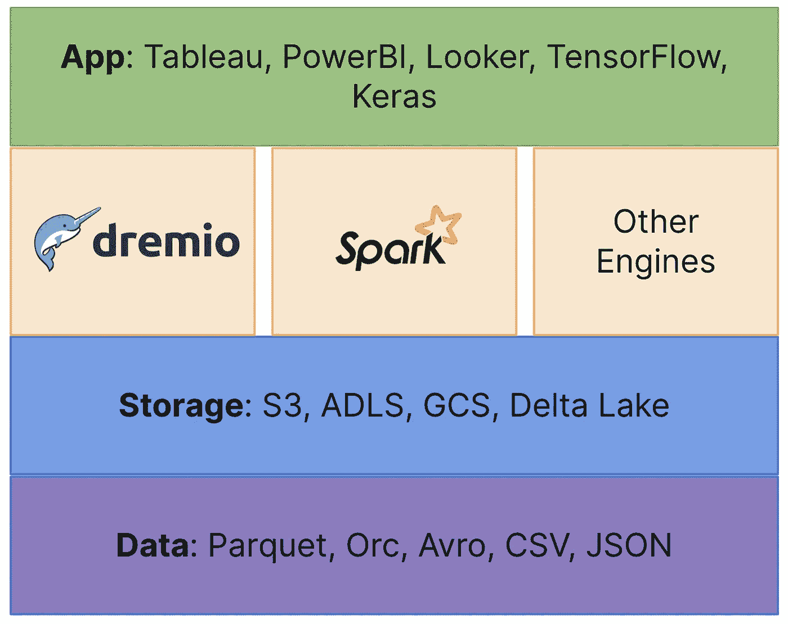

# 迈向现代数据平台

> 原文：<https://towardsdatascience.com/towards-a-modern-data-platform-93ab22fadb9a?source=collection_archive---------11----------------------->

## 开放、可扩展、快速且灵活

[斯蒂夫·约翰森](https://unsplash.com/@steve_j?utm_source=unsplash&utm_medium=referral&utm_content=creditCopyText)在 [Unsplash](https://unsplash.com/@steve_j?utm_source=unsplash&utm_medium=referral&utm_content=creditCopyText) 上拍照

这些年来，我目睹了数据基础架构领域的几次演变，或者更广泛地说，如何存储和使用数据。这个领域不仅发展迅速、引人入胜，而且是大多数公司都必须努力应对的问题。我们正在成为一个真正的数字物种，如果不是的话。我们所做的很多事情最终消耗了数据，并创造了更多的数据。这反过来导致为我们提供产品和服务的公司不得不以某种方式存储和使用这些数据。如果说[软件正在吞噬世界](https://a16z.com/2011/08/20/why-software-is-eating-the-world/)，那么数据就是它的燃料。

这篇文章提供了我对这一领域发展的观点，从传统的数据仓库到数据湖，最后是云对数据空间的影响。

让我们开始吧。

# Web 1.0 数据仓库

我的职业生涯始于 2000 年，当时如果您想要存储有意义的大小(和重要性)的数据，您可能会默认使用数据仓库，可能是 Oracle 的产品。数据仓库擅长以优化的性能存储和处理大量数据。数据仓库通过列存储、查询优化和常用表缓存等方法为结构化数据提供了强大的性能。仓库的基于表的模式支持 ACID 事务、记录级突变和粒度特权(在表和列级别)。数据仓库的典型用例过去是，现在仍然是报告和商业智能(BI)。

这个时代的数据仓库将作为运行在专用硬件上的软件交付。当我开始职业生涯时，您会在数据中心的装货区收到您的 Teradata 或 Oracle 数据库！除了软件与硬件的紧密耦合，这些数据仓库还将计算与存储紧密集成。最后，这些数据仓库以专有和优化的格式存储数据，这样做最终是为了获得良好的性能。

软件和硬件以及存储和计算的紧密结合有两个重要的含义。首先，很难快速且经济高效地扩展存储或计算。在这两种情况下，您都需要更多的硬件，通常是您必须直接从数据库供应商那里购买的定制硬件。第二，因为数据库最终以某种专有格式存储数据，所以您最终被供应商锁定。将数据转移到另一个数据库非常困难。那个时代的数据库在处理半结构化或非结构化数据时性能也很差，

# 房间里的大象:Hadoop

Apache Hadoop 是作为数据湖的第一个迭代引入的，以解决高成本和处理半结构化和非结构化数据的数据仓库挑战。Hadoop 在很大程度上是一种内部解决方案，但它以比数据仓库低得多的成本提供了一种开放式文件存储。低成本存储的前景让组织投入巨资将其数据从传统数据仓库迁移到 Hadoop 文件系统(HDFS)中。

然而，很明显，在 HDFS 转换、管理和分析数据并不容易，需要大量的工具，并且不容易提供交互式查询和 BI 等常见用例所需的性能。尽管文件存储的灵活性是一个优势，但缺乏数据管理功能(如事务和数据突变)阻碍了许多本地数据湖计划的成功。最终，我认为管理 Hadoop 环境的困难以及云对这一领域的重大影响最终导致了 Hadoop 的消亡。

# 然后出现了云

福斯托·加西亚-梅内德斯在 [Unsplash](https://unsplash.com/@faustogarmen?utm_source=unsplash&utm_medium=referral&utm_content=creditCopyText) 上的照片

云的兴起对传统的数据仓库和数据湖空间都有重大影响。在数据仓库方面，像 AWS 和 Azure 这样的公共云实现了计算和存储的分离，并承诺无限扩展两者。这导致了传统内部数据仓库的重组，并为根据数据量分别扩展存储和根据查询工作负载进行计算提供了更大的灵活性。

如今，现代云数据仓库，如雪花、AWS Redshift 和 Azure Synapse，提供了标准的数据管理功能，如事务、记录级突变和时间旅行，同时还将计算与存储层分离。然而，存储在这些数据库中的数据仍然是专有格式。

这些数据仓库与其前身非常相似，也要求数据库查询引擎处理的任何数据都存储在数据库中。这反过来又导致了冗长而繁琐的 ETL 过程，将数据从最初所在的位置移动到最终的数据仓库。

简而言之，这种新型数据库提供了独立扩展存储和计算的灵活性，但仍然没有解决供应商锁定问题，并且您仍然必须处理繁琐的 ETL 管道，这也导致了复制和移动数据的需要。

云对数据湖空间，尤其是 Hadoop 的影响是巨大的。像 S3 这样的产品提供了比 HDFS 更便宜、更易于管理和“无限”可扩展的替代品；Hadoop 的存储层。早期的云数据湖服务提供商，如 AWS EMR 和 Azure HDInsight，专注于将 Hadoop 堆栈引入云，提供基于云的开源计算引擎，如 Apache Spark、Hive 和 Presto。

虽然这些服务减少了在云中创建数据湖的工作量，但它们没有提供数据仓库和 BI 等常见用例所需的性能或数据管理功能。他们也缺乏事务支持，而这正是数据仓库擅长的。

然而，他们进一步扩展了将计算与存储分开的概念，将计算与数据分开。通过这种方式进一步分离架构，可以根据数据量和工作负载轻松扩展或缩小系统，同时保留传统数据湖架构中开放文件格式的灵活性。这还意味着我可以在同一个数据湖存储层(如 S3)中存储不同格式的数据，如拼花文件、CSV、JSON 等。

这一演变的不同之处在于，我可以根据数据类型和用例选择分析这些数据的处理引擎。这意味着即使我将 JSON 和 Parquet 文件存储在同一个存储层，我也不一定要对两者使用相同的处理引擎。

# 现代数据平台

现在，我认为我们正处于这个领域的另一次演变之中。其中，我们可以设计利用云优势的数据平台，即将计算与存储和数据分离，而不必牺牲性能或传统数据仓库(云或其他)的 ACID 保证。特别是，我看到正在出现的新平台提供了以下功能。

下图或四层蛋糕说明了构建满足上述标准的数据平台的一种方法。蛋糕的最底层是数据层，它基于开放的文件格式，如 Parquet、JSON、Orc 等。这些数据存储在基于云的文件系统中，如 S3、Azure Data Lake Storage 或 Databricks 的 Delta Lake。

作者图解

存储上面的层是引擎层。这些是处理存储在 S3 等地的数据的计算引擎。其中一些引擎，如 [Dremio](https://www.dremio.com/?gclid=CjwKCAjwqeWKBhBFEiwABo_XBq-o9EVVCJJ_EKFSycWOYUceWIe9hEo2LuVTKaIVF4t2E3FuEr0nsxoCoTUQAvD_BwE) 和 [Databricks](https://databricks.com/) ，能够以事务方式修改存储在存储层中的数据。Dremio 通过利用 [Apache Iceberg](https://iceberg.apache.org/) 来实现这一点，Apache Iceberg 支持存储层上的 DML(插入、更新、删除)操作、事务和时间旅行，例如 S3，它不一定支持这些语义。最后，最顶层是应用程序层，如传统的 BI 工具和机器学习框架。

这种架构有几个优点。首先，它利用了开放文件标准，从而消除了供应商锁定的风险。其次，它利用了云文件系统的可靠性、易用性和灵活性，可以随着数据的增长而扩展。文件系统的扩展取决于您的数据占用量，不一定与计算或其他资源相关。第三，它消除了复制或 ETL 数据的需要。数据存储在云文件系统中，由 Dremio 等引擎直接处理，从而节省了时间和金钱。第四，它允许计算与数据分离。你现在可以自由地使用许多引擎，而不像数据仓库，不仅仅局限于一个。引擎的选择可以基于数据格式和总体用例。例如，Spark 可能是机器学习用例的首选引擎，而 Dremio 可能用于 BI 用例。

最后，这种架构并不排除人们仍然使用数据仓库。您仍然可以提供像 Redshift of Snowflake 这样的云数据仓库，并让它处理存储在云数据湖中的数据。你可以鱼与熊掌兼得:)

*原载于 2021 年 10 月 3 日 https://karimfanous.substack.com**[*。*](https://karimfanous.substack.com/p/towards-a-modern-data-platform?justPublished=true)*