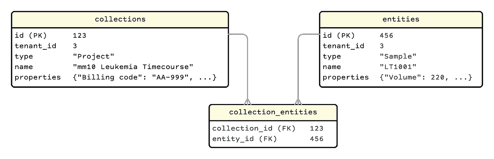
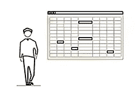

# 迈向现代 LIMS:动态表格、无代码数据库和无服务器验证

> 原文：<https://towardsdatascience.com/towards-a-modern-lims-dynamic-tables-no-code-databases-and-serverless-validations-8dea03416105?source=collection_archive---------10----------------------->

## 需要电子表格灵活性和数据库完整性的科学数据

插图由 [Shutterstock](http://shuttershock.com) 授权，用来自 [Algorithmia](https://demos.algorithmia.com/colorize-photos) 的 AI 着色

早在 2018 年，我的任务是为[威尔康乃尔医学](https://weill.cornell.edu/)的基因组测序核心设施实施实验室信息管理系统(LIMS)。LIMS 本质上是一个具有几个关键特性的数据库:

*   *动态表格*:测序是一个前沿领域，随着新的试剂盒和方法的开发，每个月修改列和表格并不罕见
*   *强打字*:长整型、浮点型、小数型、对舍入的控制和分配测量单位对于科学数据是必须的
*   *验证*:运行测序仪的成本很高——需要对值和依赖关系进行可靠的检查和交叉检查
*   *类似电子表格的用户界面*:电子表格在湿实验室中无处不在 web GUI 必须支持从桌面软件复制粘贴行和列

在调查该领域并与其他测序核心会面后，我们发现商业产品都是过时的闭源专有系统，难以扩展，并且需要大量工作来定制我们的工作流程。至于开源，当时唯一真正的竞争者是来自著名的桑格研究所的[sequence scape](https://github.com/sanger/sequencescape)——这是一个成熟的 Rails 应用程序，具有后台工作和大量的功能和挂钩，使其更容易扩展。缺点是它与他们特定的内部工作流程紧密相关。例如，添加新的自定义列或表需要编写代码、停止服务器和迁移模式，这不是我们每个月都想做的事情。我们还研究了 [AirTable](https://airtable.com/) ，但当时集成是有限的，它更侧重于营销/业务，例如，它不支持科学数据所需的测量类型和单位。

没过多久，制度性的 NIH 综合症就出现了，我们开始从零开始开发一个灵活的、可扩展的 LIMS，或者用今天的术语来说:一个无代码数据库。我们的目标是创建一个类似于旧的 MS Access 图形用户界面的东西，让任何人只需点击几下鼠标就可以构建一个全功能的数据库。我们工作过的其他核心也有类似的要求，因此保持系统尽可能通用、灵活和适应性很重要——它处理显微镜数据应该像处理测序数据一样容易，像处理泰国烹饪食谱一样容易。同样，它还应该支持多租户，以最小化我们的维护和系统管理员开销。

# 选择数据库:RDBMS vs 文档 vs 图形

文档数据库因其流动的数据模型而吸引人——每月从 UI 动态添加新的属性和集合轻而易举。然而这种好处也有坏处:没有结构化的模式，维护数据完整性就变得更加困难，正如[在 shippiable](http://blog.shippable.com/why-we-moved-from-nosql-mongodb-to-postgressql)发现的那样。图形数据库在提供具有关系完整性的结构化数据模型方面提供了两个世界的最佳选择，这种模型仍然非常灵活，但在 2018 年，社区中没有足够的支持使这成为一个可行的选择。例如，我们希望使用开源 BI 工具(如 Metabase、Apache Superset 等)来可视化我们的一些数据，而当时没有简单的方法将这些应用程序连接到 graph DB。所以我们选择了旧的可靠的 RDBMS，并选择了 PostgreSQL，主要是为了 JSONB 和模式支持(下面将详细介绍)。

# 带有 Postgres 的多租户动态表和列

**在 JSONB 中存储动态列**

我们首先想到的是尝试某种关系文档混合，其中公共基值(id、名称、修改时间等)存储在列中，而其他值都存储在单个 JSONB 列中。例如，一个集合可能是一个排序*项目*，而实体可能是那个项目的排序*样本*。一个*项目*可以有多个*样本*，一个*样本*可以有多个*项目*。

这种方法的优点是，外键可以用来加强高级关系的完整性(例如*项目*和*样本*)，而额外的定制属性和值可以被动态地添加或删除，而没有任何中断。Postgres 还提供了支持将 JSONB 键值扩展到原生列查询的函数，这允许从 DB 查询中隐式检查/合并丢失的键或值，而不是在应用程序逻辑中编写繁琐的手动检查。

我们发现的两个主要缺点是，查询很快变得非常复杂，并且一旦 JSONB 字段变大(> 5000 个字符)，它就无法伸缩——性能慢得令人无法忍受，尤其是当试图按 JSONB 值分组时。我们试着调优 [TOAST](https://hakibenita.com/sql-medium-text-performance) ，发现用 CTE 模式重构查询产生了很大的不同，但是在我们所有的优化之后，在一个只有 100K 记录的表中完成一个简单的 JSONB 值分组仍然需要 5 秒多。

**用 Postgres 模式隔离租户表**

Postgresql 中的*模式*不仅仅是数据模型，它还是一个名称空间特性，包含数据库对象，如表、列、索引等。这反过来允许属于不同租户的数据被隔离在单个数据库中。因此，如果我们要开发一个应用程序来动态构建数据库，为什么不使用 Postgres 来创建和修改专用模式中的表呢？

如果我们编写代码来直接创建和修改表，那么我们就不能再使用我们的 ORM(我们使用 Rails 的 Active Record ),让我们像穴居人一样为每个操作写出原始 SQL。每个表和列也有一大堆元数据(例如，大多数数字列也需要一个度量单位)，应用程序需要知道这些元数据的结构和值，然后才能做任何有用的事情。因此，除了丢失 ORM 之外，我们还需要实现一个元数据系统来跟踪表和列，这很快就让人感觉您正在创建数据库的副本。

**实体-属性-价值模型**

这是动态属性值的经典数据库(反)模式，最好的描述是 [*给你足够的绳子让你用*](https://softwareengineering.stackexchange.com/a/93137) 上吊。可以找到一些有利的观点，但是众所周知，除了最基本的应用程序之外，查询很快就会变得编写起来非常痛苦，执行起来非常缓慢，并且难以理解。

如果我们从 EAV 模型的数据库实现中抽象出来，转而在对象级别上考虑它，那么对于我们构建多个动态 RDBMS 的用例来说，它就变得更加合理了:

*   一个*实体*是一个 DB 行:一个有 ID 和类型或者*组成*的东西(比如一个项目或者一个样本)
*   每个*实体*都链接到一个或多个*属性*(列)，每个*属性*都有一个 *EntityAttributeValue* (列-行值)的实例——它也可以链接到另一个*实体*(外键)
*   其结果是，传统表格(如示例表格)的 EAV 等价物是所有*实体属性*的集合，其中链接的*实体*匹配特定的*组合*类型*(如示例)*

在数据库层面，这是一个典型的数字键和神秘值的 EAV 混乱，但有了我们的 ORM，我们可以更直观、更有效地工作。例如，我们可以强类型化属性(并包括度量单位)，所以在对象级别我们称之为*。val()* 但是在数据库级别，我们从匹配类型的列中进行选择(例如 *dec_val* 列，而不是 *txt_val* 或 *date_val* 列)并应用相应的单位转换函数。

我们实际上更进了一步，从 [Alfresco](https://www.alfresco.com/) 内容建模中借用了*方面*的概念，以便可以将常见的属性分组在一起——例如*可测量的*方面可能包括摩尔浓度、分子量、浓度等属性..有了这个特性，*实体*可以使用*方面*来建模一个生命周期或工作流，例如，在一个样本可以被排序之前，它必须有*可测量的*和*质量可控制的*方面。

**Postgres 将未登录的表作为缓存**

在 EAV 模型上使用对象更直观，也更容易操作，但是它不能解决选择查询速度慢的问题。我们还面临着与图形数据库相同的限制:我们不能使用期望关系数据结构的工具。

我们的解决方案是将数据从我们的 EAV 模型转移到 RDBMS 关系结构中，作为查询和外部工具的缓存。我们在 pure PL/pgSQL 中编写了一个函数，它为一个指定的表( *Composition* )选择所有的 EAV 数据，并将其转换为一个常规的表结构，包括 id、索引和外键。我们利用了 [*无日志表*](https://www.compose.com/articles/faster-performance-with-unlogged-tables-in-postgresql/) 的特性，因为数据是一次性的，稍加调整，我们可以在几秒钟内构建一个 50 万行的表。

这意味着:

*   选择查询被卸载到缓存表中
*   增量插入和更新在事务中有两个步骤:(1)从 ORM 中写入 entityspectattributevalue,这将触发(2)从自定义 DAL 中写入相应的缓存表
*   批量插入和更新只写入*entityspectattributevalues*，然后重建缓存表
*   对动态列或表的任何更改也会重建缓存表

EAV 模型中的每个实例都有一个 *tenant_id* ，用于将缓存表隔离为单独的 Postgres 模式，以便可以使用合理的名称(例如 *weill_cornell.samples* )访问它们，并分别保护它们。

这个解决方案为我们提供了在对象级构建多个独立数据库的所有优势，这些数据库的数据和元数据都在由 ORM 管理的静态表中，同时仍然支持高性能的常规选择查询和使用缓存表的外部工具。

# **无服务器验证**

验证是科学工作流程的支柱——如果我们不能在进行一项价值 1000 美元的实验之前交叉检查数值，那么我们还不如使用笔记本。我们首先尝试使用关系模型在应用程序中实现验证:每个*验证*链接到一个或多个可重用的*规则*，每个*规则*包含一个逻辑 Ruby 表达式字符串来评估值。随着验证变得更加高级，我们继续构建关系模型。例如，我们添加了关系来说明不同级别的验证，即*属性值*对*方面*对*实体*对*组合*。

几个星期后，我们所希望的可以从 UI 配置的可重用验证组件的良好库变成了一堆条件和异常。像 [AWS Lambda](https://aws.amazon.com/lambda/) 这样的无服务器、无状态计算非常适合这种离散的功能计算，所以我们开始将验证转移到无服务器云实施中，并且从未回头。现在，针对特定情况的验证更加具体，但这是由从无服务器 web 控制台即时复制、编辑和部署新验证的便利性所弥补的。

# **类似电子表格的用户界面**

我们希望找到一个网格 web UI 库，它可以动态地从 API 中发现数据模型，所以我们所要做的就是在服务器端编写接口，并将其插入。有很多商业产品可以处理静态预定义的数据库，但是没有一个可以从调用中读取模型并动态获取相应的列标题和值。GraphQL Jamstack，如 [Gridsome](https://gridsome.org/) 或 [Gatsby](https://www.gatsbyjs.com/) 看起来很适合这个应用程序，但我仍然没有找到一个包支持动态数据模型的带有分页、排序、过滤和列选择的**可写**网格(类似于 Google Sheets UI)。

下一个最好的事情是找到一个 UI 库，并自己编写支持逻辑。我们选定了 [Handsontable](https://github.com/handsontable/handsontable) ，这是一个令人印象深刻的全功能的类似电子表格的 Javascript 库，具有漂亮的 API、良好的文档和活跃的社区。唯一的问题是，当时没有将浏览器 MVC 接口到服务器端模型的模板或示例，所以我们开发了自己的 Javascript 模型和控制器来管理 Handsontable 视图并与我们的自定义 Rails REST API 对话。我们希望使用一个标准接口，但是 [restSQL](http://restsql.org) 和 [JSON/q](http://jsonq.org) 似乎没有得到很好的支持或者被放弃了，而 [PostgREST](https://github.com/PostgREST/postgrest) 对于直接数据库查询来说很棒，但是不太适合我们的定制 DAL。如果我们今天重新构建它，GraphQL 是显而易见的选择。

通常情况下，UI 很快成为最耗时和最昂贵的组件——它工作得很好，但它很复杂，难以扩展，维护起来也很麻烦。这使得它成为用现代 Jamstack 重写的头号竞争者，但是在投入了如此多的时间和一个小的开发团队之后，很难证明做出这个决定是正确的。

# **最终想法**

现在是 2021 年，整个领域已经有了很大的发展——从像 [Hasura](https://hasura.io/) 这样的应用程序可以在 Postgres 中动态构建 GraphQL 数据库，到用 [sorbet](https://sorbet.org/) 在 Rails 中进行类型检查，到 Handsontable 对 React、Angular 和 Vue 的全面支持。我很想听听您对 LIMS 或支持具有多租户数据模型的动态表的数据库的体验。

在 [Whitebrick](https://whitebrick.com) 我们目前正在开发 Airtable 的最佳开源替代方案，因此如果您正在寻找无代码数据库或现代、灵活的 LIMS 即服务，请联系我们。

***2022 年 5 月更新:*** 自从这篇文章首次发表以来，我们成功地使用 Hasura、GraphQL、Gatsby 和 Serverless 开发了一个工作测试版开源无代码数据库，但无法找到社区兴趣或商业支持来保持它的运行。我们已经将大量代码整合到我们自己的内部集成/CDR 平台中，它仍然是使用现代架构的可定制、可扩展 LIMS 的一个很好的起点。你可以在 GitHub 上找到[后端](https://github.com/whitebrick/whitebrick-cloud)和[前端](https://github.com/whitebrick/whitebrick-client)以及[我们的网站](https://hello.whitebrick.com/platform/documentation/repository/technical-guide/)上的一些基础文档。如果你有任何兴趣(和资源或预算)来恢复这个项目，请随时联系我们。