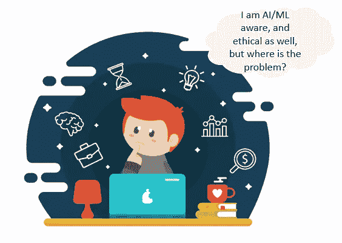
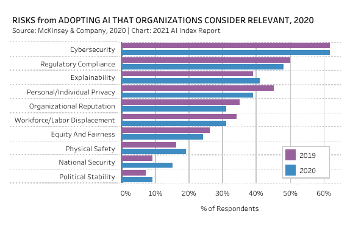
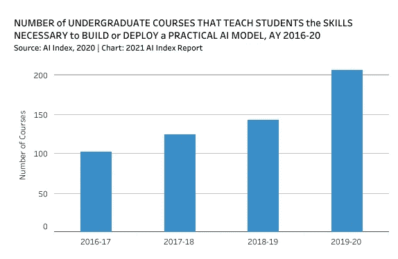
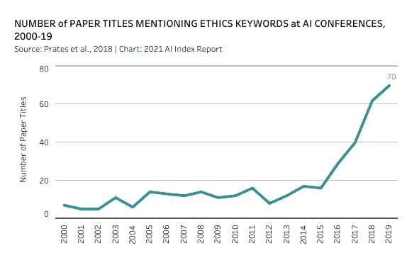

# 走向负责任和有道德的人工智能

> 原文：<https://towardsdatascience.com/towards-a-responsible-and-ethical-ai-ef93308b4e7e?source=collection_archive---------31----------------------->

## [人工智能校准和安全](https://towardsdatascience.com/tagged/ai-alignment-and-safety)

## 错不在技术，而在意图

由[格雷格·拉科齐](https://unsplash.com/@grakozy?utm_source=unsplash&utm_medium=referral&utm_content=creditCopyText)在 [Unsplash](https://unsplash.com/s/photos/a-beautiful-world?utm_source=unsplash&utm_medium=referral&utm_content=creditCopyText) 上拍摄的照片

负责任的人工智能、有道德的人工智能、对社会有益的人工智能——我相信你一定在某个时候听说过这些术语，不管你是不是数据科学家。

当我第一次听到这些术语时，斯蒂芬·霍金教授的警告在我耳边响起:

> "全人工智能的发展可能意味着人类的终结。"

在那里，我开始了理解人工智能基础的这个关键方面的旅程。我过去常常想知道如何将伦理与人工智能联系起来，人工智能只是一系列算法，而事实上，我们还不能在我们自己中间应用伦理行为。

来源:freepik 创建的商业矢量

根据斯坦福大学以人为中心的人工智能研究所[发布的人工智能指数报告](https://hai.stanford.edu)，网络安全和监管合规性是面向人工智能/人工智能的组织确定的首要风险之一。

来源:[https://aiindex.stanford.edu/report/](https://aiindex.stanford.edu/report/)

另一份报告揭示了人工智能如何引起本科生的兴趣。

来源:[https://aiindex.stanford.edu/report/](https://aiindex.stanford.edu/report/)

现在，让我们进入今天讨论的主题，人工智能中的伦理。在过去的五年里，在会议上发表的关于伦理的论文数量呈指数级增长，这充分说明了伦理的重要性。

资料来源:https://aiindex.stanford.edu/report/

**无所不在的人工智能:**

人工智能的应用几乎存在于我们生活的各个方面。当我们解锁手机时，看看我们的手机，神奇的事情马上就以面部识别的形式发生了。我们看到很多推荐反馈给我们，从新闻提要、视频、音乐、我们在电子商务网站上购买的产品，到我们在聊天或写电子邮件草稿时输入的单词的自动完成建议。

您不想键入任何查询—不要担心。有多个数字语音助手，Siri，Alexa，Ok 谷歌为您服务。

这些只是我们如何被无处不在的人工智能包围的一些例子。

人工智能似乎让我们的生活变得更容易了。的确如此。但就像硬币的两面一样，关于人工智能如何进入我们生活的观点需要从“另一面”不带偏见地看待。

让我们来看这个视频，我们将进一步讨论另一边是什么样子:

来源:youtube

忽略视频背后的品牌，分享一下如果你是 Felix 你的感受。当你做咖啡交易的时候，从你登上出租车到使用 GPS 告诉记录你的数据的组织你去了哪里，你遵循什么路线，你感到舒服吗？到此为止了吗？没有。

接下来要知道你遇到了谁，你们谈论了什么，你下一个可能的目的地是哪里，你应该买哪个品牌的小玩意，你的信仰是什么，你的家庭组成是什么，你的种族，文化，以及很多其他会让你不舒服的事情，就像费利克斯在视频结尾那样。

当我们认为应用程序要求我们**【允许访问】**为虚拟的无名小卒时，它被忽略了，但视频显示人们(阅读“盈利”公司)监视你，以赋予物理意义和存在，这令人生畏。

**到底是谁的错——技术还是商业？**

一些人认为过度批评利用人工智能盈利的企业也是不“道德”的。重点是不要批评任何人，特别是艾，毕竟，商业是为了获取利润，推动经济发展。

但是问题来了，我们同样关心我们的存在吗？空气污染、水污染、工业气体排放、垂死的海洋生物、公民权利等突出的问题需要同等的关注，如果不是更多的话。

> **只专注于经营企业可能会让人更快实现目标，但不会让任何人走得更远。最终，我们共同创造了一个需要我们所有人在可持续发展的环境中生存并爱护我们的地球的世界。**

我不会讨论道德人工智能的原则和支柱。我将把它留给专家。特别是，下面的链接对我发展对人工智能生态系统的理解和道德视野帮助很大。

<https://www.weforum.org/agenda/2021/06/ethical-principles-for-ai/>  <https://www.pewresearch.org/internet/2021/06/16/experts-doubt-ethical-ai-design-will-be-broadly-adopted-as-the-norm-within-the-next-decade/>  

看到这些组织戴上道德透镜并在这个方向上采取重大行动还有很长的路要走，令人痛心。

这种懈怠的原因之一也源于这样一个事实，即我们对这个伦理框架还不熟悉，在这个框架中有许多东西是我们不知道的。我们必须快速提问，并继续更新我们的道德规范，这本身就是一条更艰难的道路。

我们不知道什么是道德的，考虑以下问题:

*   在大人和小孩之间你会救谁？
*   谁的生命更重要——商业大亨还是每日赌注？注意重要性的定义本身是有问题的。

这些都是棘手的问题，我们甚至无法在自己之间达成共识，并期望机器以某种方式使用道德判断并为我们的决策服务。不管人工智能或人类有多道德，总会有人在另一边质疑他们的行为。所写的框架不是为了取悦每个人，而是为了更大的利益。

我们能做什么？

在家里嚼薯片时，指责他人并期望世界行为合乎道德更容易。当务之急是，我们都要在基层解决这个问题，并确保我们在数据科学家的职业中以最高的道德标准行事，拯救我们自己和整个世界，以免陷入灾难。

**终极问题**

我们会被 AI 淘汰吗？它困扰你吗？如果是，那么我们来看看在什么情况下会出现这种情况。

我们应该意识到，人工智能是一种本身并不邪恶的技术。就是把 AI 作为工具传递其险恶用心的人。如果一个人、一个社区、一个种族或者一个国家想要部署 AI 来伤害人类，他们可能会。

问题是我们想进化成什么样的人类？世界已经看够了疫情造成的痛苦和苦难。它不应该再有针对任何特定种族或社区的恐怖、操纵、侵犯隐私、伤害性评论。

我们都是一体的。让我们团结起来，把 AI 当成我们的盟友而不是竞争对手。