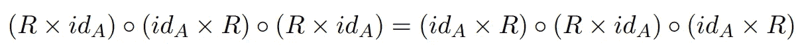
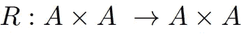
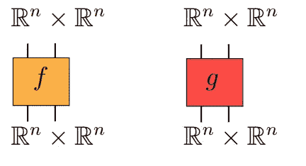
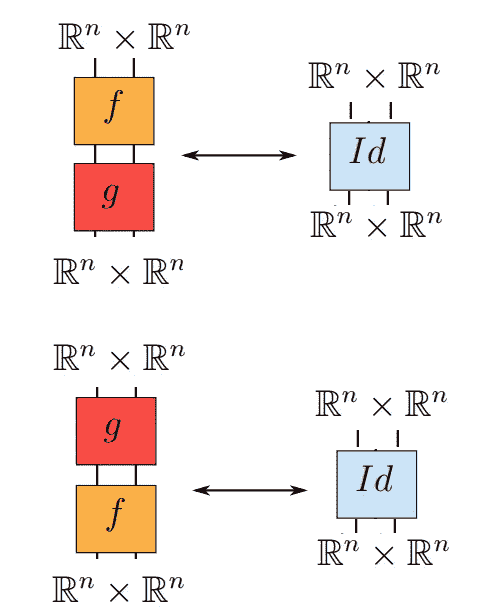
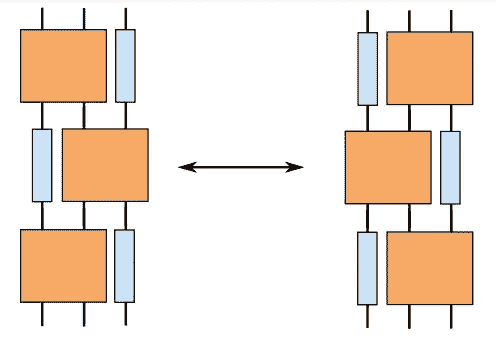
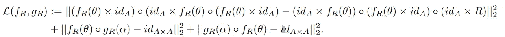
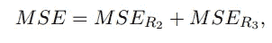
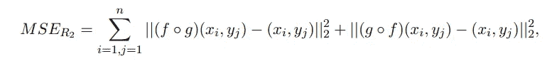
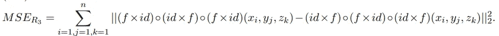
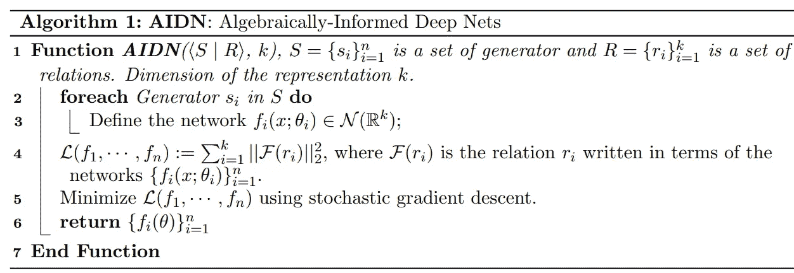

# 数学和物理定律的自动发现:代数信息深度网络(AIDN)

> 原文：<https://towardsdatascience.com/towards-automatic-discovery-of-mathematical-laws-from-observed-data-algebraically-informed-deep-68eb0482e4b7?source=collection_archive---------43----------------------->

## 使用深度学习发现任意代数方程组的解

莱纳斯·米米耶茨在 [Unsplash](https://unsplash.com?utm_source=medium&utm_medium=referral) 上的照片

深度学习和数学接口的中心问题之一是建立能够从观察到的数据中自动揭示潜在数学规律的学习系统。在过去的几年里，深度学习技术已经被用于求解许多类型的方程，包括偏微分方程[2]，非线性隐式方程组[3]和超越方程[5]。

在这篇文章中，我们朝着在解代数方程和深度学习之间建立桥梁的方向迈出了一步，并介绍了 *AIDN* ，*代数信息深度网络* [1]。给定一组满足一组约束或方程的未知函数，AIDN 是旨在使用深度学习解决该问题的通用算法。

为了解释 AIDN 算法的主要思想及其广泛的应用，我们从一个例子开始，

# 杨-巴克斯特方程

杨-巴克斯特方程是以下形式的方程:

杨-巴克斯特方程是数学物理中的中心方程，具有广泛的应用，包括量子场论和统计力学

其中函数

R 矩阵是满足杨-巴克斯特方程的可逆映射

是我们喜欢寻找的未知函数。对于本文，我们可以将*和*视为欧几里德域*的子集。*任何满足杨-巴克斯特方程的可逆函数 *R* 称为 *R 矩阵*。寻找上述方程的解具有非常长的历史，具有广泛的应用，包括量子场论、低维拓扑和统计力学，并且通常被认为是一个困难的问题。

# 深度学习拯救世界

我们现在解释 AIDN 算法在寻找上述杨-巴克斯特方程的解上的应用。为了求解杨-巴克斯特方程，AIDN 算法将寻找解 R 的问题实现为优化问题。首先我们把函数 R 写成一个深度神经网络。我们将把这个网络称为 *f_R* 或者简称为 *f* 。

因为我们要求 *f* 是可逆的，那么我们创建另一个网络 *g* ，我们将它训练成 *f* 的逆。理论上我们可以选择网络 *f* 是可逆的，但是在我们的论文中我们选择训练 *g* 使得它是 *f* 的逆。为了更直观地理解我们的解决方案，采用图形符号更容易。首先，我们用以下两个黑盒来表示网络 *f* 和 *g* :

函数 f 和 g 的图形表示。图形来源[1]。

给定这个符号，我们可以通过下面的图表表示两个函数 *f* 和 *g* 彼此相反的事实:

函数 f 的可逆性之一的图示图来源[1]。

这里，垂直连接意味着网络的组合。上图简单的说就是 *f* 后面跟着 *g* 和 *g* 后面跟着 *f* 就是身份图。

类似地，杨-巴克斯特方程可以通过以下图表表示:

杨-巴克斯特方程的图示。图表的

为了训练这两个网络，我们定义了以下目标:

上述损失函数基本上有两个目的:满足杨-巴克斯特方程以及强制函数 f 的可逆性。

更实际地说，为了训练 f，g，我们创建了一个辅助神经网络来帮助我们进行训练。具体来说，用损失函数训练辅助网络:

在哪里

和

其中{xi，易，子}表示从 A × A × A 均匀采样的点，其中 A⊂ R^n，一般为单位区间[0，1]。仅此而已！在训练函数 *f* 和 *g* 之后，假设存在解，则满足杨-巴克斯特方程(参见我们的 [repo](https://github.com/mhajij/Algebraically_Informed_Deep_Nets) 以获得关于实现的更多细节)。

# AIDN 算法的通用版本

我们为杨-巴克斯特方程所解释的思想可以推广应用于更大范围的问题。具体来说，给定具有 *n* 个变量的 *k* 个方程(或我们在论文中称之为*关系*)，然后 AIDN 通过创建一组 *n* 神经网络来训练这些网络，通过将方程转换为 MSE 损失函数来满足关系。详细情况如下:

AIDN 算法

# AIDN 用在哪里？

我们提出的算法是相当通用的，它可以应用于许多领域。我们只是触及了表面，并解释了它对杨-巴克斯特方程的适用性。今天，杨-巴克斯特方程被认为是应用于量子力学、代数几何和量子群的几个物理和数学领域的基石。理论上，如果给定足够的计算能力，AIDN 能够找到任何代数方程组的解，只要这种系统的解存在。在我们的论文[1]中，我们展示了许多其他的应用，包括寻找新的量子不变量。

# 局限性和**结论**

关于 AIDN 性能的一个重要注释是当具有许多生成器和关系时训练的难度。虽然诸如 SGD 的现代优化范例允许人们训练高维数据的模型，但是我们发现训练与具有许多生成器和关系以及高维数据的代数结构相关联的多个网络是困难的。这可以通过使用更好的超参数搜索和更合适的优化方案来解决。

虽然没有理论保证神经网络存在，但我们在实验中始终发现，在给定网络的足够表达能力和来自这些网络的域的足够样本点的情况下，AIDN 能够实现良好的结果并找到期望的函数。这一观察结果与理论深度学习[4]中关于深度网络损失情况的其他公开研究问题是一致的。

# 密码

在我们的 [repo](https://github.com/mhajij/Algebraically_Informed_Deep_Nets) 中详细给出了上述示例和许多其他示例的存储库。

# **参考文献**

[1] Hajij，Mustafa 等.“[代数信息深度网络](https://arxiv.org/abs/2012.01141) (AIDN):一种表示代数结构的深度学习方法。” *arXiv 预印本 arXiv:2012.01141* (2020)。

[2] Maziar Raissi、Paris Perdikaris 和 George Em Karniadakis。物理学通知深度学习(第一部分):非线性偏微分方程的数据驱动的解决方案。arXiv 预印本 arXiv:1711.10561，2017 年

[3]，，孟，，廖，和斯特凡诺·埃尔蒙。非线性方程求解:前馈计算的一种更快的替代方法。arXiv 预印本:2002.03629，2020

[4]拉维德·施瓦茨-齐夫和纳夫塔利·蒂什比。通过信息打开深度神经网络的黑匣子。arXiv 预印本 arXiv:1703.00810，2017

[5] SK Jeswal 和 Snehashish Chakraverty。用人工神经网络求解超越方程。应用软计算，73:562–571，2018