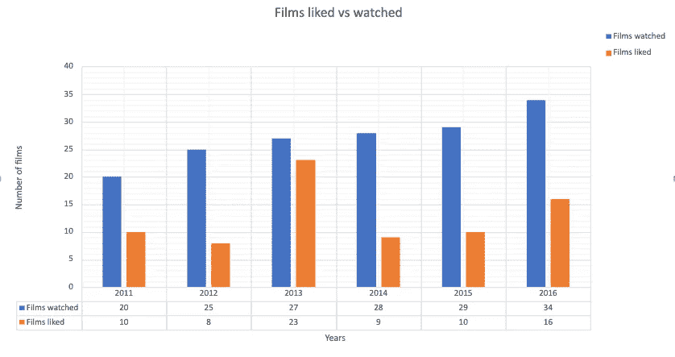
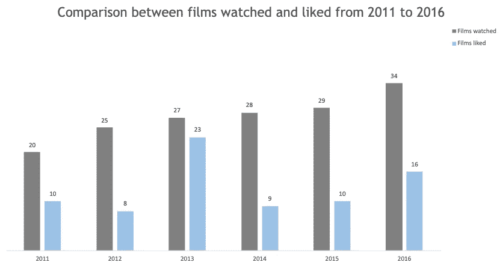
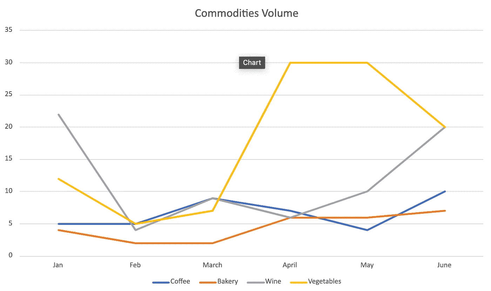
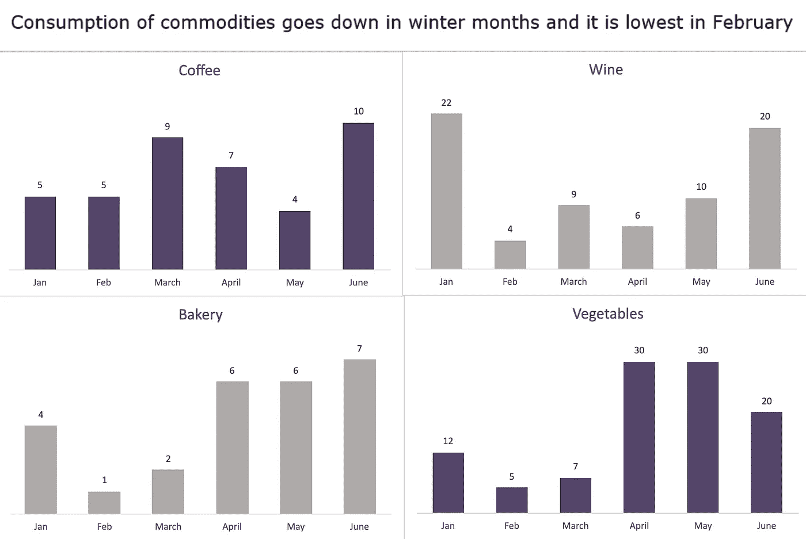
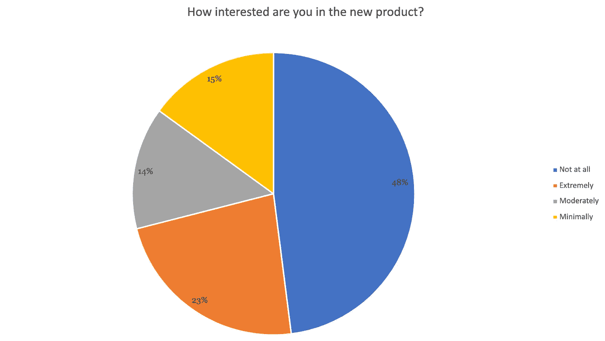
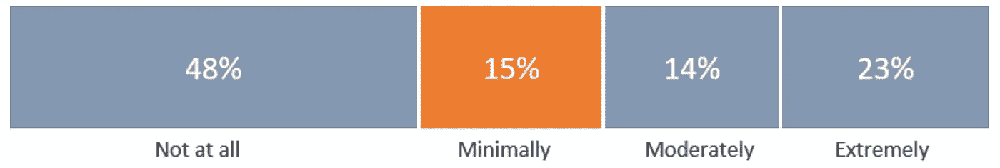

# 实现更好的数据可视化和图形

> 原文：<https://towardsdatascience.com/towards-better-data-visualizations-and-graphics-a19e11146808?source=collection_archive---------11----------------------->

## [实践教程](https://towardsdatascience.com/tagged/hands-on-tutorials)

## 创建基于数据的图形和视觉效果的设计原则

这是一个比喻。它是由查尔斯·约瑟夫·密纳德创作的，用来展示拿破仑在 1812-1813 年间的俄国战役。

俄罗斯战争中法国军队的继承人(来源:[维基百科](https://upload.wikimedia.org/wikipedia/commons/2/29/Minard.png)

现代信息科学家说，这是人类历史上制作的最好的统计图。米纳德的图表从多变量数据中讲述了一个丰富、连贯的故事，并描绘了军队的规模、在二维平面中的位置、运动方向、撤退期间各天的温度。这是使用可视化方式显示数据的最简洁的方式之一。

我们能创造我们自己的象征吗？

也许是的！

现代科技出版物有 25%的视觉信息，我们为日常商业活动创建的平台有大约 60%的视觉内容(图形、图表等)；它为图形的卓越化提供了坚实的基础。

# 为什么关注观想？

数据可视化是数据科学和机器学习的一个主要部分，因为人们必须在将数据放入模型之前探索数据，然后将结果传达给相关的利益相关者。

定量信息的视觉展示是爱德华·塔夫特的永恒经典，也是 20 世纪最好的非虚构书籍之一。它讲述了可视化图形的历史，图形优秀的规则，以及设计基于数据的图形时要遵循的基本规则。

作为一名数据科学家，我从 200 多页的知识中受益匪浅。

# 关键要点和走向更好的图表

1.  清除杂物——清除所有你不需要的东西。少即是多。
2.  没有饼状图——它们没有多大用处，因为人眼无法识别圆形切片的大小。当它们稍微相等时。
3.  不要每次都用视觉效果——如果你没有足够的数据，那就只用大数字或表格来显示信息。
4.  记住观众——观众不应该花太多时间来分析视觉效果。*数据应该从视觉本身脱颖而出。使用基本和原始的视觉线索，如颜色、形状、大小来引导注意力。*
5.  不要扭曲数据——这种通过扭曲数据来讲述你的故事的想法不是一个好的原则。让数据自己说话。

# 如何设计更好的图表？

这就是图形优秀的来源。

> 卓越的图形能在最短的时间最小的空间内给观众带来最多的想法。

您可以通过三种简单的机制在图表中实现这一点:

1.  没有图表垃圾——去掉奇怪的字体、纹理、阴影或任何会分散观众对视觉和数据中心思想的注意力的东西。
2.  没有无用的信息——图表的大部分应该用于显示数据。

简单来说，只展示必要的东西。

3.实质重于设计——你的图表应该引导用户思考它所提供的数据和实质，而不是迷失在图形/视觉背后的方法论中。*所以，诉诸人类理解和引导注意力的自然方式——从大到小，从暗到亮，从左到右，从上到下。*

T 创建视觉效果的另一个要点是意图——最初为什么要创建视觉效果？图表内容的设计方式应该通过传达结论来推动决策。

> 图表背后的驱动力不应该是使用某些工具、软件包或库，而是传达你从数据中得出的结论。

# 图表在运行

让我们看看这些原则如何应用到我们的工作中。

我为我在 2011 年到 2016 年间观看和喜欢的电影创建了一些虚拟数据。让我们创建一个同比对比图。

这是我在第一次迭代中想到的。

作者图片

让我们看看我们是否能在这方面有所改进。

似乎有很多图表垃圾。第一个是图表下面的表格，轴标签。有一个密集的背景网格，没有任何用途，因此是一次性的。

这里和那里的一点点变化，我们得到了比以前更好的视觉效果。

作者图片

它更干净、更清晰，并且能够描绘它想要的东西，而不会呈现任何不必要的信息。

## 再举一个例子

一个虚构的商店老板想要比较上半年各种商品的销售情况，他创建了以下内容。

作者图片

这个观点没有任何根本性的错误，但是没有任何突出的结论。这里的模式是什么？店主应该得出什么结论？

这是一种更好的观想方式吗？

作者图片

通过 4 种方式打破图表，观察到一个模式，这是关键的收获。

## 好，再来一个！

一家虚构的公司推出了一款新产品，营销团队对现有客户进行了调查。

作者图片

它告诉我们，大多数用户不感兴趣，但仅此而已，剩下的一半没有太多信息。

这可以而且应该通过对数据进行排序来弥补。

作者图片

这似乎是一个更好的信息视觉，因为读者可以很快了解谁对产品最不感兴趣，谁对产品最感兴趣。

# 让信息变得美丽

基于数据的图表的目标不是为了创造而创造视觉效果，而是为了传达结论以推动决策。

作者图片

如果你后退一步，思考图形的目的是什么，在设计时保持简单，并有一个故事要讲，视觉可以给你很大的帮助。