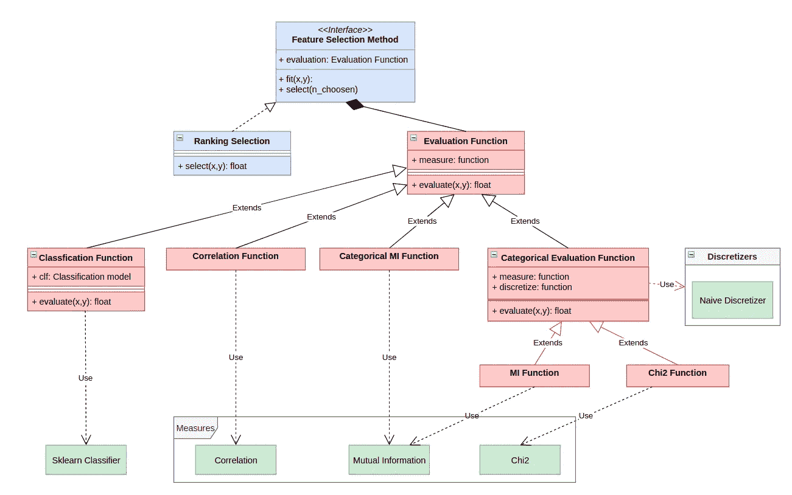
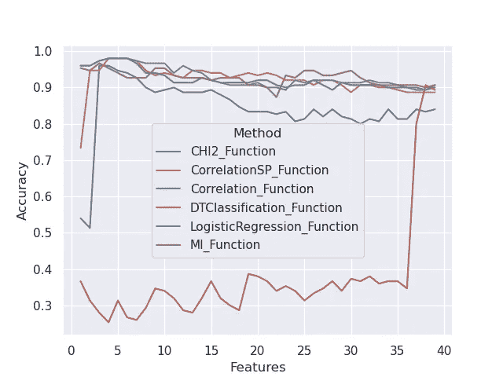

# 利用排序函数构建统一的特征选择框架

> 原文：<https://towardsdatascience.com/towards-building-a-unified-framework-for-feature-selection-with-ranking-functions-5605ef665f26?source=collection_archive---------38----------------------->

## [思想和理论](https://towardsdatascience.com/tagged/thoughts-and-theory)

## 一个代码来统治他们。一个代码实现所有这些，并在同一个框架中绑定它们。


由[大卫·皮斯诺伊](https://unsplash.com/@davidpisnoy?utm_source=medium&utm_medium=referral)在 [Unsplash](https://unsplash.com?utm_source=medium&utm_medium=referral) 上拍摄的照片

在任何数据相关项目的特征工程中，我们经常必须手动过滤我们将用于训练我们的模型的列；这种过滤通常依赖于我们对数据的洞察力，也依赖于许多可以帮助我们区分有价值的属性和冗余或无意义的属性的标准，这个过程被称为**特征选择**。

它们是选择属性的许多不同方式；我们今天看到的这个就是所谓的排名特征选择。这是最基本的方法。它用一个函数评估每个属性，对它们进行排序，并保留最好的属性。

虽然这种排序可以用各种方法来完成，但我们将探索这些方法的分类，看看这种分类如何帮助我们将它们组织成一个可靠的、可扩展的框架，并使用这个框架来测试和比较它们的行为。

# 特征选择排序方法

在特征选择中，我们可以根据 Dash】和 Liu 的分类，将属性的质量度量分为五类。

*   **距离度量**:量化属性和标签之间的相关性。
*   **信息度量:**这些信息理论度量在根据一个特征的值分割它们之后，对标签的熵感兴趣。
*   **一致性度量:**如果相同的值不与类的不同值相关联，则特征是一致的。
*   **依赖度量:**如果取一个特定值的概率不受另一个值的信息的影响，则称两个变量是独立的，因此这些度量通过量化类对属性的依赖来工作。
*   **分类措施:**这些措施耗时；他们在获取特定属性时评估分类质量。

当然，在介绍我将考虑的措施时，我将回到每一类。

# **受孕基线**

在定义我们的功能之前，我们需要设置一个清晰的、可伸缩的基线，以指导进一步的开发。

要使用它，我们需要隔离构建框架所需的不同组件；我提议的模型化基于三个关键概念:

*   **测度:**测度量化两个向量之间的关系；这种关系可以与依赖性、独立性或它们之间的相关性相关。特征选择排序方法
*   **评价函数:**评价函数通过使用度量来评价特征的重要性；对于互信息评估或相关性评估，评估可以被限制到单个测量，或者可以根据我们考虑的分类器调整到分类测量的不同测量。
*   **特征选择函数:**特征选择函数获取整个数据集，并通过对数据集的特征进行排序并取百分比或通过进行增量选择来执行特征选择，我们将在后面看到。

现在，让我们列举每一类组件的主要功能，因为这将为我们提供我们必须放在架构顶部的内容:

*   **度量:**函数可以对度量进行建模，因为它不需要对数据进行预处理；它只是计算一个值，这个值将被高层组件解释和使用。
*   **评估函数:**这里我们可能有一个预处理，因为我们必须考虑到一些评估函数需要分类特征，然后这类组件将根据它们对离散化函数的需要分成两类，其中一部分，每个评估函数的主要用途是评估关于该类的特征的重要性。
*   **特性选择功能:**这将是一个抽象接口，为最终用户提供对“选择”方法的访问，该方法选择给定数量的特性，并且将由许多子类实现，这取决于您想要用于选择的方法。

我们现在要做的就是从上到下开发我们的架构，并将其与我们的度量联系起来；这给了我下面的架构。



作者图片

# 可靠性测试

为了评估我们的框架的可靠性，特别是当添加一个新的度量时，我们必须考虑在每次添加一个评估函数时运行一个完整性测试；这个测试必须尽可能的通用，为了做到这一点，我们将采用一个约定，从现在开始每个评估函数类的名字中都必须包含“函数”这个词。

通过这样做，我们可以精心制作一个简单的测试，运行如下:对于它在文件“evaluation_functions.py”中找到的每个评估函数类，它将尝试对随机数据集的特征进行排序，以验证所有的评估函数都编写得很好。

当然，这很简单，只要我们有一种方法来检查脚本并动态实例化包含类的对象，我们可以通过使用 inspect 模块来完成。

```
from inspect import getmembers, isclass
from sklearn.datasets import make_classification
from core.Feature_Selection import Evaluation_Function
from core.Feature_Selection.Ranking_Function import Ranking_Selection
X,y = make_classification(n_samples=1000, n_features=10, n_classes=2)
for i, j in (getmembers(Evaluation_Function, isclass)):
    if("Function" in i and not "CAT" in i):
        print("Testing: ",i, end=" ")
        EF = j()
        R = Ranking_Selection(j())
        c = R.fit(X, y)
        print("✓")
```

这几行代码将创建一个包含 10 个特征和 1000 个样本的数据集，get_member 方法将检查 Evaluation_Function 脚本，对于其中每个名称中带有“Function”的类，我们将执行一个排名选择，并在完成后打印一个勾号。

# 使用的措施

使用框架的主要优势是它的广泛性，但是现在，我链接了以下函数；我不会深入每项措施的细节；我将只精确地描述他们的类以及他们如何评估特性:

*   [**皮尔逊相关系数**](https://numpy.org/doc/stable/reference/generated/numpy.corrcoef.html) (来自 NumPy)是一种距离测度，可以通过计算两个变量的协方差之比来得到。
*   [**基于信号的相关性**](https://numpy.org/doc/stable/reference/generated/numpy.correlate.html) (来自 NumPy)这是在 NumPy 中实现的另一种相关性度量。
*   [**互信息**](https://scikit-learn.org/stable/modules/generated/sklearn.feature_selection.mutual_info_classif.html) (来自 Scikit-learn)这是一种信息度量，通过测量类中熵的减少来评估属性，如果我们相对于他的值分割它。
*   [**Chi2 独立性检验**](https://scikit-learn.org/stable/modules/generated/sklearn.feature_selection.chi2.html) (来自 Scikit-learn)两个变量是独立的如果*P(X = X；Y=y) = P(X=x)。P(Y=y)* ，通过对属性和类之间的假设进行 Chi2 检验，我们可以量化它的重要性。
*   **分类度量**:作为一种分类度量，为了评估每个属性，我用局限于这个特定属性的数据集训练了一个分类器，然后测量它的准确性；因为分类器是作为一个参数给出的，所以我用决策树分类器尝试了这个方法，然后我还添加了一个逻辑回归分类器。

请记住，这篇博客的重点不是实现这些方法，所以我采取了已经实现的质量措施。

# 特性试验

每当我们实现一个新的评估功能时，我们不仅仅关心它是否符合框架。我们也要评估它的效率；

所以在完整性测试之后，我们将设计两个简单的性能测试；第一项测试包括以下内容:

*   我们创建一个虚拟数据集，其中包含 *k* 个相关特征。
*   我们用整个数据集训练一个分类器，并评估它的准确性。
*   对于每个函数，我们选择 *k* 个特征，用局限于所选特征的数据集训练分类器，并用 k 倍验证评估分类器的准确性。

第二个非常相似，但我们不是生成完全随机的数据集，而是获取 iris 数据集，并向其中添加随机采样的列。

每个测试做 10 次，并且测量每个评估函数的时间。

对于具有 20 个属性和仅 5 个信息属性的第一个测试，我们在 SVM 分类器上获得了以下结果:

```
base :  0.8974500000000001   Time:  0.0
CHI2_Function :  0.52885   Time:  0.017551565170288087
CorrelationSP_Function :  0.7693999999999999   Time:  0.00019888877868652345
Correlation_Function :  0.8606   Time:  0.0020094394683837892
DTClassification_Function :  0.6241   Time:  0.09251418113708496
MI_Function :  0.89475   Time:  0.1389768123626709
```

基数表示通过保留所有属性获得的精度。我们可以注意到，通过减少 80%的属性数量，我们保持了几乎相同的互信息性能；我们还注意到 CHI2 函数几乎没有用，但这可能是因为它被我使用的简单二进制化改变了，它只是简单地将数据范围划分为等间距的间隔。

让我们考虑另一个具有完全随机数据集的示例，这次我们将采用 200 个特征(仅 2000 个样本)和 50 个信息性特征，我们获得以下结果:

```
base :  0.7943999999999999   Time:  0.0
CHI2_Function :  0.46049999999999996   Time:  0.171110200881958
Correlation_Function :  0.8112499999999998   Time:  0.019919610023498534
DTClassification_Function :  0.60955   Time:  0.9978075504302979
MI_Function :  0.8505000000000001   Time:  1.4385223627090453
```

同样，我们可以看到互信息保留了非常相关的属性，以至于它甚至击败了所有变量的分类。

现在让我们看看第二个测试，

```
base :  0.9086666666666667   Time:  0.0
CHI2_Function :  0.946   Time:  0.01797773838043213
CorrelationSP_Function :  0.9740000000000001   Time:  0.00014123916625976562
Correlation_Function :  0.9693333333333334   Time:  0.0030328035354614258
DTClassification_Function :  0.3539999999999999   Time:  0.020097732543945312
MI_Function :  0.9493333333333334   Time:  0.091739821434021
```

这一次，作为分类度量一部分的所有度量都比基本度量表现得更好，这证实了排名度量的效率与数据集的结构密切相关。

# 比较排名方法的更可靠的方法

因为排序方法的主要优点是它们不耗费时间，所以我们可以生成排序，然后评估通过从排序的顶部到底部连续添加特征而获得的子集。

我们通过使用 Seaborn 和添加了无用列的数据集 IRIS 获得了下面的图。



作者图片

这证实了:

*   决策树分类不是此数据集的有效分级方法。
*   有用特征的数量似乎是 4，因为所有的排序方法对于大约 4 个特征给出了它们更高的性能。

# 结论:

因为一个排序方法并不(通常)耗费时间，如果我们有一个可靠的框架，我们可以使用许多排序方法来更好地洞察我们的特性质量。

这个框架还允许我们尝试新的评估功能或新的选择机制，我鼓励你通过分叉我的 GitHub [repo](https://github.com/MoohShadox/LOF) 来这样做。

# 开放式问题:

这个框架提出了一个新的问题:我们能利用我们有许多特性排名的事实吗？我对答案有一点想法；保持联系，早日发现:)

如果你想讨论这个话题，欢迎通过邮件(ouaguenouni.hachemi@gmail.com 或 LinkedIn 加入我的讨论。