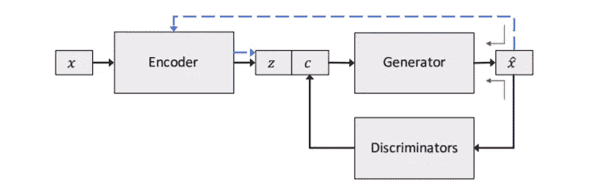
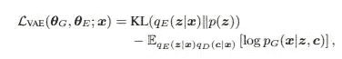
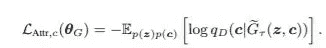
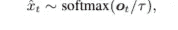
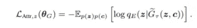
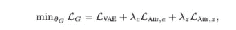
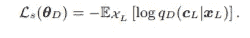
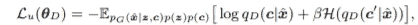
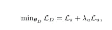
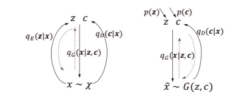

# 文本的可控生成:综述

> 原文：<https://towardsdatascience.com/towards-controlled-generation-of-text-a-summary-7f4c954c1fad?source=collection_archive---------9----------------------->

## 对研究论文的通俗易懂的解释

[斯科特·格雷厄姆](https://unsplash.com/@homajob?utm_source=medium&utm_medium=referral)在 [Unsplash](https://unsplash.com?utm_source=medium&utm_medium=referral) 上拍照

在这篇文章中，我将总结一篇在自然语言处理领域有影响力的论文,《走向文本的受控生成》[1]。这篇论文于 2017 年在 ICML 会议上发表，在撰写本文时被引用了 800 多次。

***先决条件*** —神经网络、自动编码器、变分自动编码器(VAE)。

***目标—*** 本文的目标是生成逼真的句子，句子的属性是可以控制的。一个例子是生成具有积极/快乐情绪的句子。我们不仅要生成语法正确、逼真的句子，还要根据某些属性(用户自定义)来控制生成的句子。例如——情绪、时态等。).本文提出了实现这一目标的模型和训练过程，以及在训练模型时应对离散文本数据的**不可微性**的思想。

实现受控文本生成背后的关键思想是学习输入文本的一个复杂的潜在表示。该模型有一个自动编码器/变分自动编码器(VAE ),它从输入的低维表示(通常称为潜在代码)重建输入句子。通常，VAE[3]优于普通的自动编码器，因为潜在表示是平滑的、连续的，并且在 VAE 的情况下可以被采样。

解开潜在表征意味着将所学习的潜在表征分成不同的成分，其中潜在表征的每个成分存储关于特定属性的信息，并且可以用于在重构的句子中控制该属性。主要的挑战是设计一个模型和训练机制，可以有效地学习一个解开的潜在表征。如果潜在代码被解开，对潜在代码的某些组成部分的修改会导致所生成的句子的某种改变，从而给我们提供受控的文本生成能力。

> 关于文本生成和受控文本生成的历史详情，请参考原始论文[1]或其他调查文章[4]的相关工作([https://github.com/ChenChengKuan/awesome-text-generation](https://github.com/ChenChengKuan/awesome-text-generation))。在这篇文章中，我将把重点放在模型和它的细节上，以及上面提到的问题是如何解决的。

在下一节中，让我们更详细地讨论这个模型。下图是该模型的示意图。

受控文本生成模型[1]。来源[链接](https://arxiv.org/pdf/1703.00955.pdf)

该模型由编码器和生成器组成。编码器和发生器与自动编码器/VAE 架构完全相同。生成器在重构输入句子时充当解码器，但也用于生成最终的输出句子，因此被称为生成器。

自动编码器/VAE 的潜在代码是非结构化的。潜在代码可以被采样(在 VAE 的情况下)，并且生成器采用这个采样的潜在代码来生成新的句子。然而，生成的句子的属性在正常的 VAE 中不能被控制。

在该模型中，潜在代码被分成两个部分 z 和 c。从概念上讲，部分“z”具有非结构化属性，而“c”对用于控制生成的句子的结构化属性进行编码。句子可以由一个以上的因素控制，因此 c 可以有多个部分 c1、c2、..等等。例如用于生成受情绪和时态控制的句子。c1 将控制情感属性，c2 将控制时态属性。理论上，可以添加多个属性，但是随着受控属性数量的增加，训练可能会变得更加复杂和困难。

此外，还有歧视。鉴别器是帮助学习解开的潜在表示和编码潜在代码的结构化组件 c 中的特定属性的主要网络。鉴别器发送信号并引导发生器产生与输入码 c 一致的句子。

现在，我们已经有了模型和组件的高级细节，让我们深入到训练和损失函数的细节，这有助于完成解开。

训练被分成——发电机学习，在其上学习发电机参数的损失函数；和鉴别器学习，鉴别器参数学习的损失函数。

**发电机学习**

本部分描述了发电机培训的组成部分。

**下面显示的等式 1，**是标准的 VAE 损失，其目标是生成逼真的句子。KL 损失迫使来自编码器的学习到的潜在代码(q_E(z|x)接近先前的 p(z)(其通常是高斯分布)。第二个组成部分是重建损失，它迫使生成器生成从输入数据集学习到的似是而非的英语文本。

等式 1。来源[链接](https://arxiv.org/pdf/1703.00955.pdf)

**方程式二。**从生成器生成的句子(实际上是离散句子的近似的软生成句子)被传递到鉴别器，该鉴别器试图从生成的句子中预测代码。来自鉴别器的预测码被用作训练发生器参数的信号。

G~_T(z，c) —使用软生成语句代替离散语句来解决可微性问题。该近似是基于稍后描述的 softmax 近似来完成的。

具体来说，我们假设生成器网络用来生成一个句子的输入潜码是 c1。鉴别器获取生成的句子，并预测该句子是使用代码 c2 生成的。如果生成器信任鉴别器的决定，生成器现在会尝试修改为输入代码 c1 生成的句子，以便鉴别器预测偏向 c1。因此，生成器利用鉴别器预测来修改其生成的句子，使得用于生成句子的输入代码和句子的鉴别器预测相同。下面所示的等式是体现这一思想的损失函数。q_d(c|G~_T(z，c)是鉴别器预测，用于训练发电机参数θ_ G。

等式 2。来源[链接](https://arxiv.org/pdf/1703.00955.pdf)

用于训练发生器参数的学习信号通过鉴别器反向传播到发生器。但是，这里有一个**重大拦路虎**。生成器输出是一个文本，它是一个离散输出。因此，反向传播是不可能的，因为离散文本是不可微的。

**解——代替离散输出，使用 logit 向量的 softmax 输出，如下式所示，其值由温度变量控制。这就是所谓的软生成句子，作为输入传递给鉴别器。**

文本的非离散近似

**方程式 3。**使用等式 2，我们强制将生成的句子的某些属性(例如，情感)编码在潜在代码‘c’中。然而，这还不够，因为潜在代码“c”可能会在不经意间将一些其他属性与所需属性一起编码。如果例如，潜在代码 c 编码了情绪(期望)的属性，偶然编码了时态的属性。现在，如果我们修改潜在代码 c 的值，我们期望在所有其他属性不变的情况下，生成的句子具有不同的情感。但是，我们可能会看到新句子有不同的时态和不同的情绪。**这是我们应该避免的事情。**要做到这一点，我们需要强制除可控属性之外的所有其他属性都编码在潜在代码‘z’中。

不是为该任务设计新的鉴别器，而是重用编码器以将生成的句子作为输入，并预测非结构化潜在代码 z。这迫使生成器捕捉潜在代码 z 中的非结构化属性，从而也迫使潜在代码 c 不具有任何与之纠缠的非结构化属性。

等式 3。来源[链接](https://arxiv.org/pdf/1703.00955.pdf)

**发电机整体学习—** 然后，根据等式 4 中的以下损失函数训练发电机，等式 4 基本上是上述 3 个等式的组合。所以总体来说，生成器应该能够生成似是而非的英语句子(等式 1)，其属性可以由潜在代码 c 控制(等式 2)，非结构化属性取决于潜在代码 z(等式 3)。

等式 4。来源[链接](https://arxiv.org/pdf/1703.00955.pdf)

在生成器学习中，我们看到生成器生成与特定属性一致的句子的准确性，取决于来自鉴别器的信号。生成器相信鉴别器会给出正确的信息，告诉它所生成的句子是否具有所需的属性。因此，正确训练鉴别器以使其预测正确是很重要的。在下一节中，我们将讨论训练鉴别器的方法。

**鉴别器学习**

鉴别器能够正确地推断句子的属性，从而帮助生成器评估其生成具有期望属性的句子的性能，这是至关重要的。

鉴别器以半监督的方式被训练。它首先获取 x_L 和 c_L 的标记示例，并根据等式 5 训练鉴别器参数。

等式 5。来源[链接](https://arxiv.org/pdf/1703.00955.pdf)

它还利用了标记代码 c 上的**生成器生成的**句子，形成了 x^和 c 的数据集，并使用了 Eq。6 在生成器数据集上训练鉴别器。由于生成器生成的数据集有噪声，因此使用最小熵正则化[2]，这是等式的第二个组成部分。6.

等式 6。来源[链接](https://arxiv.org/pdf/1703.00955.pdf)

结合等式 5 和等式 6，等式 7 示出了总的鉴别器学习函数。

方程式 7。来源[链接](https://arxiv.org/pdf/1703.00955.pdf)

**训练算法**

*数据集* —未标记(X=x)和少量已标记(X={x，c})句子的大型数据集。

1.  通过最小化等式 1 来初始化基本 VAE(编码器和发生器)。

***重复步骤 2 & 3 直到收敛***

2.通过等式训练鉴别器。七

3.通过最小化 eq 来训练发电机。4 和编码器通过最小化等式 1

**唤醒睡眠程序**

唤醒睡眠程序。来源[链接](https://arxiv.org/pdf/1703.00955.pdf)

模型的训练过程使用唤醒-睡眠过程，这基本上是在使用训练数据的**真实样本**训练模型时和在模型的**生成样本**上训练模型时之间的区别。唤醒过程对应于使用真实训练数据的训练方程。在我们的例子中，它对应于等式 1，其中编码器和发生器在真实数据 x 上被训练。图的左图显示了训练的尾流程序的前向传播(黑色箭头)和梯度传播(红色虚线箭头)。

睡眠过程对应于使用来自发生器的生成样本的训练方程。在这种情况下，它包括等式 2 和等式 3，其中鉴频器/编码器利用产生的样本分别预测代码 c 和 z，并提供反馈来训练发生器。它还包括等式 6，其中鉴频器根据发生器产生的数据样本进行训练。右图显示了训练睡眠程序的前向传播(黑色箭头)和梯度传播(红色箭头)。

睡眠阶段减少了对监督和大量标记训练数据的需要。

# 结论

我希望这个解释有助于对论文的直观理解。在接下来的文章中，我将解释本文关键部分的实现，并查看实验结果。这是我的[文章](https://pub.towardsai.net/disentangled-representation-learning-for-non-parallel-text-style-transfer-paper-summary-aa862bc46349)总结了论文[为非平行文本风格转换解开表征学习](http://Disentangled Representation Learning for Non-Parallel Text Style Transfer)【5】。

**参考文献**

[1]胡智庭，杨子超，，梁，鲁斯兰·萨拉赫蒂诺夫，和埃里克·p·兴。2017.文本的可控生成。《第 34 届机器学习国际会议论文集——第 70 卷》(ICML'17)。JMLR.org，1587-1596 年。

[2] Grandvalet，Yves，Bengio，Yoshua，等.熵最小化半监督学习.NIPS，第 17 卷，第 529–536 页，2004 年。

[3]金玛、迪德里克·p .和马克斯·韦林。"自动编码变分贝叶斯."abs/1312.6114 (2014): n. pag。

[https://github.com/ChenChengKuan/awesome-text-generation](https://github.com/ChenChengKuan/awesome-text-generation)

[5] Vineet John、Lili Mou、Hareesh Bahuleyan 和 Olga Vechtomova。2018.文本风格转换的非纠缠表征学习。arXiv 预印本 arXiv:1808.04339