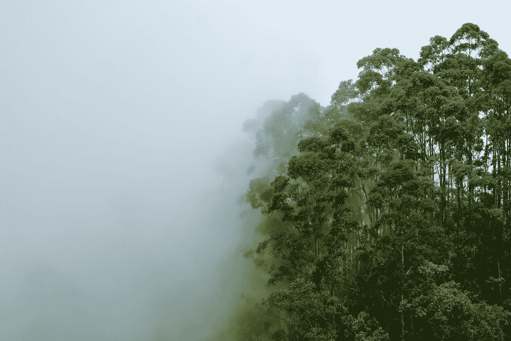
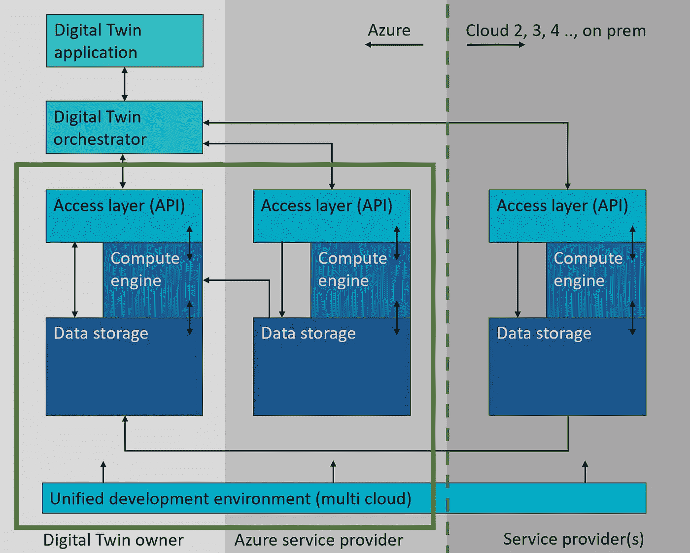
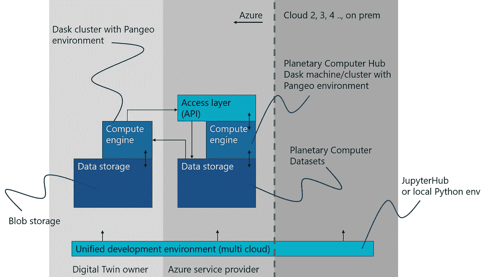

# 与 Dask 和 Pangeo 一起迈向 Azure 环境数字双胞胎

> 原文：<https://towardsdatascience.com/towards-environmental-digital-twins-in-azure-with-dask-and-pangeo-71d35414ec58?source=collection_archive---------25----------------------->

J.A.Neshan Paul 在 [Unsplash](https://unsplash.com?utm_source=medium&utm_medium=referral) 上的照片

环境的数字双胞胎可以帮助实现可持续发展目标和解决气候变化相关问题。他们将强烈依赖地理空间数据及其处理和分析。云环境提供了处理潜在的巨大地理空间数据集所需的灵活性和可伸缩性。在这里，我探索了 Azure 云功能，并将它们放在一个更广阔的多云视角中。

**环保数码双胞胎**

存在许多数字孪生的定义，但一个共同点是物理对象或过程的数字表示。通常，这些对象由数字孪生的用户控制。在环境数字双胞胎中，我将户外环境视为中心“对象”，它不拥有所有者，或者，例如，在土地所有者的情况下，没有人完全控制该对象。至少有三个群体可以从环境数字双胞胎中受益，它们是:

-影响环境的组织

-规划土地使用和基础设施的组织

-运营依赖于环境的组织

**云间交互**

在另一篇[博客文章](/designing-for-digital-twins-e2b3e07a5d1e)中，我讨论了当涉及大型地理空间数据集，如卫星数据或模拟大气数据时，我们当前面临的分散数据格局。这种情况将持续很多年，因为我已经说过，没有任何组织能够或愿意托管所有这些数据集。由于数据的规模，将数据从一个环境转移到另一个环境并不总是可行的，因此，我认为云之间的交互是成功的环境数字双胞胎的关键。为了最大限度地减少在云和本地环境之间传输的数据量，应该在传输之前对数据进行处理。在每个云环境中，应该为数据选择、聚合和评分以及针对自己的代码的处理提供处理能力。这篇博文的剩余部分将关注微软 Azure 云环境中的技术映射，它可以促进云间的交互(图 1 中的绿色矩形)。

图一。多云环境中的数字孪生设置，重点是支持云间交互的 Azure 功能——绿色矩形。图的详细解释可以在[这里](/designing-for-digital-twins-e2b3e07a5d1e)找到(图片由作者提供)

**蔚蓝能力**

微软的[环境可持续发展目标](https://www.microsoft.com/en-us/corporate-responsibility/sustainability)雄心勃勃，只有通过行业、政府、非政府组织和研究人员的合作才能实现。在某些方面，自然互动过程的运作以及与人类和地球系统的互动并没有被很好地理解。只有具备知识和洞察力，人们才能以可操作的洞察力有效应对气候变化。为了方便科学家和研究人员增加这些见解，微软建造了[行星计算机](https://planetarycomputer.microsoft.com/)。因此，行星计算机将有助于了解我们可以在哪里以及如何最好地减轻人类对环境的影响，以及支持决策者采取气候适应措施。行星计算机由四个主要部件组成，这四个部件也有助于建立环境数字双胞胎，它们是:

-行星计算机数据目录-搜索和查找开放数据集

-行星计算机 API 访问数据和检索数据

- Planetary Computer Hub —用于数据处理，与统一的开发人员环境相结合

-行星计算机应用程序-第三方开放式和封闭式应用程序构建在行星计算机基础架构上

组织可以建立他们的环境数字双胞胎，部分基于行星计算机，完全驻留在 Azure 中，以及所有其他 Azure 服务。在这里，我们将行星计算机的技术映射到环境数字孪生组件，这些组件促进了从 Azure cloud 看到的云间交互，参见图 2。

图二。Azure 中云内交互的技术映射支持云间交互的环境数字双胞胎(图片由作者提供)

**开放数据和数据存储**

微软已经装载了数 Pb 的数据，并通过行星计算机使它们可用，当前可用的数据集可以在[行星计算机数据目录](https://planetarycomputer.microsoft.com/catalog)中找到。除其他外，这些数据集包括 Landsat 8、Sentinel-2 以及一个单独的统一的 Landsat-Sentinel2 数据集、Aster 等。所有数据都存储在 Azure blob 上，可以通过 blob 存储 API 直接访问。由于在 blob 存储上查找数据集可能是一个挑战，因此它们通过开放时空资产目录 [STAC 规范](https://stacspec.org/)进行索引和搜索。

除了行星计算机提供的数据之外，数字双胞胎的主人还需要引入他们自己的数据，这些数据在大型数据集的情况下很可能会存储在 blob 中。然而，地理空间矢量数据可以登陆 Azure 管理的数据库(SQL，Postgres，CosmosDB)或 blob，并通过 [STAC OGC API-Features](https://www.ogc.org/blog/4394#:~:text=OGC%20API%20%2D%20Features%20enables%20any,footprint%20of%20the%20data%20represented.) 提供。

**计算引擎**

[行星计算机中枢](https://planetarycomputer.microsoft.com/docs/concepts/computing/)为基于 [Dask](https://docs.dask.org/en/latest/) 集群的研究人员提供便利。Dask 支持在机器或集群上高效地并行化 Python 代码。这些行星计算机集群可以通过 web 客户端启动和访问，它们预装了一个 Pangeo 环境。这使得研究人员能够在一个充满云和地理空间以及 ML Python 库的稳定环境中直接使用地理空间数据集。研究人员通过 JuypterHub 或您的本地 Python 环境与 Dask 集群进行交互。行星计算机中枢使研究人员能够在没有 it 知识的情况下快速启动云基础设施。当需要更大的集群时，Hub 提供开箱即用，或者当 Digital Twin 所有者需要自己的应用程序基础架构时，Dask 集群可以在 Azure 订阅中轻松创建。借助 Dask 云提供商，集群可以在 [Azure](https://cloudprovider.dask.org/en/latest/azure.html) 和[其他云](https://cloudprovider.dask.org/en/latest/)中创建。这也使得能够一次性使用 [Pangeo docker 映像](https://github.com/pangeo-data/pangeo-docker-images)，这样集群就预装了 Pangeo 环境，就像行星计算机中枢一样。

**统一开发环境**

行星计算机基于开源工具，具有开放数据并支持开放标准，使其对研究人员和开发人员来说是可访问的、透明的和灵活的。如果开发人员已经熟悉 Python，则不需要学习新的工具或语言，并且现有的 Python 代码可以被带到 Dask 环境中。Dask 集群可以通过 [JupyterHub](https://jupyterhub.readthedocs.io/en/stable/) web 客户端或本地 Python 环境访问。由于这种方法适用于多个公共云提供商，有了 Dask 云提供商，开发人员就有了一个统一的开发环境。

**最后一个音符**

有些情况下，上面介绍的技术可能不是最佳的，尤其是当不仅需要应用 Python 代码，或者需要特定的作业调度程序时。在 Digital Twin 所有者的 Azure 订阅中，可以使用许多其他选项来促进数据处理和自动化，如 [Azure Batch](https://docs.microsoft.com/en-us/azure/batch/batch-technical-overview) 、 [Azure Databricks](https://docs.microsoft.com/en-us/azure/databricks/scenarios/what-is-azure-databricks) 和[Azure Synapse Analytics Spark Pool](https://docs.microsoft.com/en-us/azure/synapse-analytics/spark/apache-spark-overview)、 [Azure Kubernetes Services](https://docs.microsoft.com/en-us/azure/aks/intro-kubernetes) 等。

**参考**至总体博客文章: [**为数字双胞胎设计**](/designing-for-digital-twins-e2b3e07a5d1e)

这里的意见是我的。