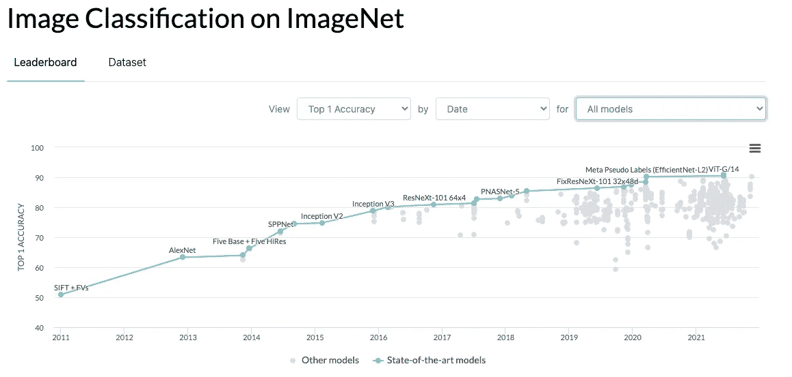

# 走向人工智能研究的更大目标

> 原文：<https://towardsdatascience.com/towards-greater-purpose-in-ai-research-91218cd108ff?source=collection_archive---------27----------------------->

## 意见

## *我对深度学习研究现状的看法以及我将如何改变现状*

图片来自 Unsplash(图片由[马克·弗莱彻·布朗](https://unsplash.com/photos/nN5L5GXKFz8)提供)

最近，我看了这个 TED 演讲:

该视频描述了爱因斯坦在 1905 年对物理学领域的贡献。在 4 篇独立的论文中，他理论化了光的粒子性质、新的原子模型、狭义相对论和世界著名的 E=MC 方程。

这和我有什么关系？嗯，我是一名有抱负的研究人员，已经发表了几篇论文(你可以在这里查看)。作为研究人员，我们都希望和渴望发表惊人的研究，从而彻底改变我们的领域(在爱因斯坦的情况下，改变我们对宇宙的基本理解)。此外，我们甚至都有其他的职业在消耗我们的时间——他是一名专利办事员，我是一名学生。

这个视频提醒了我研究的真正目的:进一步拓展这个领域，并真正以有意义的方式应用研究。不幸的是，我认为，特别是在一般的计算机视觉(CV)研究中，这个目的没有得到足够的重视。连我都为忘记了这个动机而感到内疚。

在这篇文章中，我想阐明我对当前研究状况的一些看法，以及为什么需要改变。然后，我将分享我的一些想法，关于我如何在人工智能研究中朝着更大的目标努力，我相信这是将 CV 应用于相关问题，如农村地区的民主化医疗保健。

# 我对当前研究状况的看法

直截了当地说，计算机视觉研究过于专注于击败最先进的技术(SOTA)。随着 NeurIPS 公认的论文最近发布，CVPR 截止日期刚刚过去，ICML 截止日期在新的一年即将到来，各种主题的新计算机视觉方法正在涌现，不可避免地，SOTA 的表现正在被打破。

专注于击败 SOTA 的问题在于，它转移了对相关话题的关注。对爱因斯坦来说，没有人能打败 SOTA。他的目标只是更好地了解这个世界，这使得未来的研究人员能够利用他的发现，做出相关的发现，提高人类的生活质量。然而，对于 CV 中的大多数 SOTA 方法，当它们被超越时，很快就被遗忘了。这场竞赛是为了争夺 SOTA，而不是为真正的成像挑战建立最有效和高效的模型，从而改变世界各地人们的生活。

我相信有代码的论文和他们的排行榜有助于延续这一点。排行榜显示了哪些型号在什么时间达到了什么精度或性能。看看 ImageNet 准确度排行榜。

ImageNet 最高准确度排行榜(图片来自代码为的[篇论文)](https://paperswithcode.com/sota/image-classification-on-imagenet)

正如我们所见，几个月之内，新车型就占领了 SOTA。如果任何不是这些方法专家的人试图理解它们，他们会很困惑。这些方法优先考虑精度的微小提高，而不是引入可以在实际应用中实际实现的方法。

这已经渗透到了高层会议的审议过程中。声称 SOTA 的方法很容易被接受，但是接近 SOTA 的方法却被拒绝。以 FixMatch 为例，它因“过于简单”而被 ICML 拒绝

如果会议优先考虑新颖复杂的方法，而不是更优雅简单的方法，这将使研究远离有用和适用。具有极其复杂的训练过程的方法在最终需要使用它们的 web 或移动应用程序中实现是具有挑战性的。研究界关注的不是最新最棒的——而是最新更准确的，即使这是以更高效的算法为代价。

一般的计算机视觉是难以置信的理论性，这就是为什么我喜欢在医学成像领域工作，新算法的实际应用是重要的，并在审查过程中加以考虑。虽然这个领域也非常关注新颖性，但新颖性也可以存在于所解决的问题中，在我看来，这是一个很好的研究领域。

但不管怎样，回到 CV。另一个问题是研究界的公然剽窃。以这个故事为例:

我建议你看看这条推文，但我会很快总结一下。报纸 MomentumNet 被另一家名为 model m-RevNet 的报纸公然抄袭——多么不同的名字，对吗？在 Twitter、Reddit 和其他论坛上发了一系列帖子后，作者终于坦白了。他的道歉中有一句话很突出:

> 我非常后悔，因为我在急功近利的时候犯了一个大错

作者受到出版物和引文的驱使。随着他的作品进入 CVPR 和 ICCV，他得到了他想要的。即使在最近的记忆中，这也不是人们被抓到剽窃的唯一案例。

虽然抄袭显然是错误的，但这些抄袭的故事凸显了研究中一个更大的问题。人们因身处 CVPR、奈厄利普斯、ICCV、AAAI 等地而受到尊重，这分散了创作革命作品的主要精力。虽然我们确实会表彰那些做出爱因斯坦式贡献的人，例如何和他对 ResNets 的介绍，但我们也会表彰那些在顶级会议上没有充分动力做出革命性发现或将他们的发现应用于极其重要的应用的人。

这就是出版物的问题。对我来说，一旦我看到我关于谷歌学术的论文，我就兴奋不已。当我得到一些引用时，我感到被认可了。我沉迷于获取 ArXiv 和 Scholar 上的论文，有一小段时间，我看不到研究中什么是重要的。

我的研究远不及爱因斯坦在 1905 年完成的工作。它没有任何潜力做出那种改变，不仅因为我的想法没有革命性，而且因为我没有制作这种革命性作品的意图。目的是在某项任务中对当前的方法进行改进，但这项任务并不是非常有意义。

发表研究背后的意图是这个问题的主要原因。最糟糕的是，新的研究人员立即被吸引到代码排行榜的论文榜首，而不是专注于如何将他们的研究真正应用到有意义的问题上。我们专注于 ImageNet 上 top-1 准确率 0.1%的绝对增长，而不是创建一个可以将分类应用于世界农村地区医疗诊断的管道。

为了结束这一部分，我想分享我的一个想法:一旦某个模型在 ImageNet 上获得 99.9%的最高准确率，会发生什么？虽然我们还不一定接近它，但以这种速度，应该有可能很快达到它。但是一旦我们到达这个标记，我们下一步做什么？再也没有任何 SOTA 表演可以宣称了。我们最终会开始应用难以置信的复杂算法来筛查世界农村地区的疾病患者吗？或者，我们会让 ImageNet 的[敌对变体成为我们新的基准数据集吗？只有时间能证明，但我希望是前者。](https://arxiv.org/abs/1907.07174)

# 我从事行业研究的计划

如果你关注[我的推特](https://twitter.com/ayaanzhaque)(你应该关注)，你会注意到我是 DeepMind 的超级粉丝。他们的新作品总是让我着迷，最近的作品是[的《思考网》](https://arxiv.org/abs/2107.05407)。我甚至在笔记本电脑上贴了一张 DeepMind 的贴纸。

DeepMind 贴纸(图片来自[艾萨克·皮尔庞特](https://www.redbubble.com/i/sticker/DeepMind-by-IsaacPierpont/46940109.EJUG5)

所以很明显，我真的希望有一天能在 DeepMind 或者 Google Brain 工作。但对我来说，这似乎不是最好的利用我的时间。虽然我真的相信 DeepMind 是革命性的、对社会有益的开创性研究，如 [AlphaFold](https://deepmind.com/blog/article/alphafold-a-solution-to-a-50-year-old-grand-challenge-in-biology) ，但我可能不会为 AlphaFold 这样的工作做出贡献，而是致力于像 PonderNet 这样的项目。对我来说，这不是最好的利用我的时间。我想解决世界上最大的挑战，其中两个是获得医疗保健和减轻贫困，而在 DeepMind 工作根本不允许我这样做。

虽然我会谈到我希望如何在我的职业生涯中使用研究，但我想谈谈我将如何实现在 DeepMind 工作的梦想。我目前的长期职业目标是创办自己的公司，等我大学毕业后，我可以把它卖掉换钱。因此，虽然获得博士学位可以成为这个计划的一部分，但在 DeepMind 工作却不行。

由于我一直梦想着在 DeepMind 工作，我将在今年年底申请一份工作。虽然所有的工作和实习清单都要求至少同时注册一个博士项目，但我想我还是会申请的。没什么坏处，对吧？如果我得到的回应能让我得到一份实际的实习/工作机会，我会欣喜若狂。我的希望会实现，但我可能只会做兼职，这样我就可以专注于大学。虽然这不是我最初想象的，但也足以让我满意了。

如果我得不到回应，这很有可能，我会继续前进，把这个梦想抛在脑后。有更大的事情要做，不幸的是，对我来说，在 DeepMind 工作不是其中的一部分。

# 我将做什么研究

正如本文前面所讨论的，我不太喜欢人们成为研究者的一些潜在动机。虽然我可以理解他们为什么有这样的动机，因为这最终是一份工作，人们需要养活自己，但我希望我能做些更大的事情。

这里有一个故事确实引起了我的共鸣。去年的某个时候，我联系了孟加拉国领先的研究机构 BRAC 大学公共卫生学院。我要求对我用于糖尿病视网膜病变(DR)筛查的人工智能算法进行验证研究。巧合的是，他们最近正在与谷歌研究人员团队合作一个跨国项目，以建立一个用于 DR 诊断的自动化管道。我不知道任何关于谷歌项目或进行该项目的团队的细节，但不幸的是，他们结束了这个项目。这使得 BRAC 团队陷入混乱，并且在这个过程中有大量未标记的数据。

这个故事一直困扰着我，因为我觉得研究的目的已经失去了。通过阅读爱因斯坦和其他著名科学家的故事，我总是被告知他们的目标是让世界变得更好。但是听说这个项目被终止了，这个项目本可以让孟加拉国的许多病人获得改变生活的诊断，我对研究的想法被改变了。如果他们作为研究人员的目标是改变世界，他们为什么要离开？

不幸的是，他们的目标不是改变世界。最终，他们是一个万亿美元的公司，必须赚钱，如果项目进展太慢，他们就没有理由留下来。

我想改变这一点。如果有一天我真的在谷歌这样的研究机构工作，我会尽我所能鼓励社会导向。专注于创造可以尽快帮助人们的研究，而不是简单地试图打破 CIFAR-10 的最新 SOTA(它将不可避免地在几个月内被打破)，这更符合我的胃口。

我想建立一个医疗成像研究创业公司，为孟加拉国的各种疾病提供免费诊断。因为孟加拉是我的祖国，我和这个社区有着各种各样的联系，所以它是我工作的完美地方。有了一个博士研究员和工程师团队，我将能够建立通用模型和廉价硬件，有效地为孟加拉国农村地区提供医疗筛查。

虽然这个梦想很乐观，但我希望它能成为现实。我是一个大梦想家，尤其是在 17 岁的年纪，但我认为我有决心实现它。但最终，只有时间能证明一切。总有一天我会回到这篇文章。

# 结束语

这篇文章只是我对简历研究现状的看法。我不能保证我的观点是正确的，因为我不像其他人那样了解最新的社区新闻，但我相信有许多人会同意我的观点。如果你不知道，请告诉我。我很乐意就这个话题展开讨论，并希望集思广益，找到鼓励真正革命性研究的方法。

我给研究界的信息是为你的研究找到一个目标。目的不应该仅仅是打败 SOTA。它应该对最需要帮助的人和社区产生有意义的影响。如果你对应用不感兴趣，那就朝着完全革命性的想法努力，比如 AlphaFold 或者爱因斯坦的广义相对论和狭义相对论。但不管怎样，你的研究应该有一个超越自我利益的目的。这样，我们就可以进行真正改变世界的研究。对我来说，我希望，我的贡献可以在一年内全部发生，这样 Ted-Ed 就可以制作一个关于我自己的奇迹年的视频。不太可能，但让我们看看我是否能让它发生。