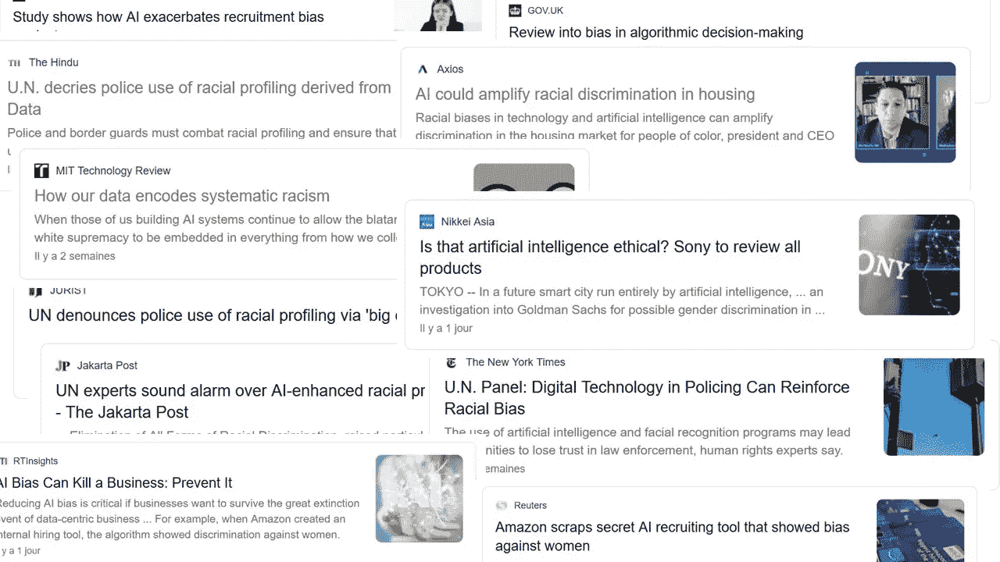
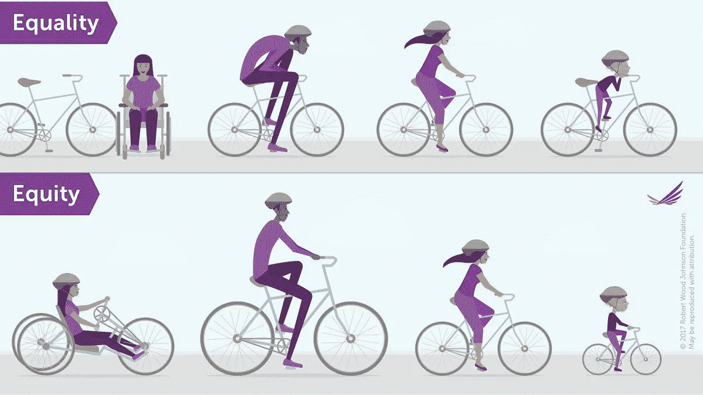
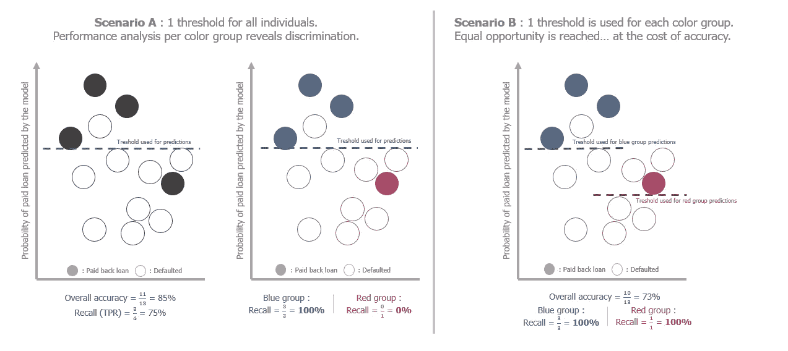

# 减少人工智能系统中的歧视

> 原文：<https://towardsdatascience.com/towards-less-discrimination-in-artificial-intelligence-systems-78b8a6e162e5?source=collection_archive---------36----------------------->

## [公平和偏见](https://towardsdatascience.com/tagged/fairness-and-bias)

随着 [auto-ML 平台](https://cloud.google.com/automl)的兴起，在没有数学知识的情况下设计机器学习系统变得前所未有的容易，但也没有意识到它们可能引发的沉重的伦理问题。然而，在最近的丑闻之后，专家们开始致力于为人工智能带来更多公平，你可以做出贡献。

[作者从[谷歌新闻](https://news.google.com/)截取的拼贴画]

早在 2020 年 6 月，两位人工智能专家在 Twitter 上展开了一场激烈的辩论:图灵奖获得者、脸书首席人工智能科学家 Yann LeCun，以及研究科学家、“人工智能中的黑人”小组的联合创始人、谷歌 Timnit Gebru 道德人工智能团队的前技术联合负责人。争论的根源是这种脸部去像素化器模型，它可以生成模糊脸部照片的高清图片。一名测试人员在推特上发布了该模型对奥巴马模糊照片的测试结果，看起来该模型倾向于生成白人面孔，即使模糊照片是黑人。

LeCun 回应说，当数据有偏差时，ML 系统就会有偏差，这是因为模型是在大多数白人面孔的数据集上训练的。另一方面，Gebru 回答说，我们不能仅仅减少 ML 对数据集偏差造成的伤害。在今年早些时候她在 FATE/CV 的演讲中，她坚持认为社会和结构问题不能通过简单的数据多样化来解决。事情很快升级，两个阵营都被成千上万的人加入或攻击，从业余爱好者到高调的人工智能研究人员，LeCun 最终道歉，而 Gebru 坚持认为他的反应是一种边缘化模式。由于受到攻击，LeCun 甚至退出了 Twitter。

我们可以从这个故事中学到两件事:

*   好的一面是，这些公平问题正在被越来越多的讨论，我们可以听到伦理专家分享他们在这个问题上的工作；
*   糟糕的是，大多数人不同意——或者不知道——如何在人工智能中实现公平。

## **在构建 ML/AI 系统时，识别和避免歧视性偏差并不容易。**

为什么？因为偏见往往是隐藏的模式，因此难以察觉。例如，预测住房贷款分配的模型可能会因为性别工资差距而偏向男性。根据原始历史数据训练的模型将固有地再现其偏见，坏消息是偏见在社会中根深蒂固，甚至专家也不知道一个无偏见的社会会是什么样子。但是，偏见实际上可能出现在机器学习管道的任何一个步骤中，从数据收集到将结果呈现给用户的方式，通过标记数据，选择性能指标或部署模型。如果您正在构建自己的监督模型，离群值(特征罕见的例子)通常会被错误预测；当数据点是人时，少数民族将是离群值，将遭受缺乏表现。如果您不是自己构建数据集或模型，或者您正在使用公共数据集或预训练的神经网络，则更难跟踪您将使用的数据固有的偏差。此外，没有大量可用的开源数据集，例如文本或人脸数据集，因此没有广泛的多样性。

此外，公平本身是一个复杂的问题，对于普通的数据科学家来说很难理解，尽管他们有良好的意愿，但可能不会很好地理解它。这是一个数据科学家可能面临的两难困境的例子:他应该支持公平的[还是平等的公平](https://www.researchgate.net/post/Equality-implies-sameness-Equity-implies-fairness-What-is-the-difference-between-Equality-Equity-Please-give-your-opinion)？每个人(或多或少)都知道法律和它所要求的公正、无障碍和多样性原则。然而，将它们转化为 KPI 和技术规格并不容易。现有的[股权指标](https://arxiv.org/pdf/1610.07524.pdf) [不能同时优化](https://www.liebertpub.com/doi/abs/10.1089/big.2016.0047?journalCode=big)，必须在它们之间做出权衡以满足其中一个:没有最优策略。

有时候，平等不足以解决不公平。[转载自[罗伯特·伍德·约翰逊基金会](http://www.rwjf.org/) ]

最后一点:人工智能中的伦理问题在人工智能社区中严重缺乏人气。大多数数据科学培训根本没有提到 ML 产生的潜在公平问题。越来越多的 auto-ML 工具出现在市场上，每个人都可以训练和部署人工智能模型，而不知道下面发生了什么以及可能会出错。

这幅全景图听起来可能相当悲观，但是每个人都已经可以采取行动来限制(如果不能防止的话)他们在工作或家庭中建立的 ML 系统中的歧视性偏见。

## 下面是几个开始行动的解决方案。

首先，与 ML 系统互动的人，从构建它们的数据科学家到使用它们的用户，必须被告知隐藏的歧视性偏见的风险。没有偏见的系统是不存在的，我们只能监控和限制我们意识到的偏见。此外，知道系统在某些方面有偏差，用户可以相应地使用算法结果。

为了避免偏见，我们可能倾向于在数据收集阶段从我们的数据集中排除受保护的变量(性别、年龄、种族……)，并且永远不回头。但相反，人们可能希望保留它们，不是为了建模，而是为了分析源数据集的分布和这些变量的模型性能。[著名的蒙田研究所称之为*主动股票*](https://www.institutmontaigne.org/ressources/pdfs/publications/algorithmes-controle-des-biais-svp-resume.pdf) 。通过盲目地从我们的数据集中删除受保护的变量，我们忽略了社会偏见。

如果你知道看什么样的标准，把一个不公平的分类器变成一个更公平的分类器是很容易的。例如，使用基于阈值的分类器(如逻辑回归)，可以根据人口子群调整阈值，以支持子群之间的公平性。假设你在一家银行工作，建立一个用于发放贷款的 ML 系统。在这种情况下，我们希望在能够偿还贷款的人中，每个小组中的相同比例的人实际上应该被授予贷款[(这个概念被称为*机会均等*](https://arxiv.org/abs/1610.02413) )。在数据科学术语中，这转化为子组之间相同的*真阳性率*或*召回率*，并且很容易选择一个[阈值来解决这个约束](https://research.google.com/bigpicture/attacking-discrimination-in-ml/)。相反，我们并不特别希望所有的子群体都获得相同数量的贷款(这一概念被称为*人口均等*)；这将转化为相同的*阳性率*。

如何使用基于阈值的分类器实现*机会均等的直观解释。【作者图片】*

尽管有这些工具，但要求数据科学家成为公平专家并重新定义这一概念将会适得其反。其他一些学科花了几十年时间研究什么是公平，什么是不公平，以得出不同的公平定义。通过让计算机科学家与伦理学家、哲学家或社会学家进行对话，我们可以构建促进公平的工具。数据科学家可以通过阅读社会学研究来启动新的 ML 项目，确定收集的数据和要建模的过程中预期的现有偏差。

为了帮助数据科学家处理这些话题，一些组织已经开始制定“道德人工智能”政策，明确定义公平标准和实践，以及专门的治理和团队。这个想法是通过提供工具和度量标准来实施它，从而将它应用到每个数据项目中。实践之一应该总是建立代表多样性的项目团队，并且包括历史上没有特权的群体。这不是最简单的解决方案:例如，截至今天，只有 15%的数据科学家是女性。这种差异的根源可能在于科学教育对女性的偏见。

从更积极的方面来看，ML 研究人员开始认识到伦理在他们工作中的重要性。例如，一些研究人员已经开始研究人脸数据集中广泛存在的数据覆盖问题(这可能是*人脸去像素器*偏向肤色的原因)。[在本文](https://arxiv.org/abs/2004.03355)中，作者提出了一种被称为*、*的新模型，该模型在确保提高少数族裔群体覆盖率的同时，实现了具有竞争力的图像质量。这些先进的工作是伟大的，但不应该让你忘记最基本但必要的公平步骤:花时间想一想，在每一个 ML 项目中，是否有可能歧视一群人的偏见。

我希望这篇文章能给你一些提示，告诉你如何开始在你未来的人工智能项目中减少歧视。请随意分享你听说过的解决公平问题的好主意！