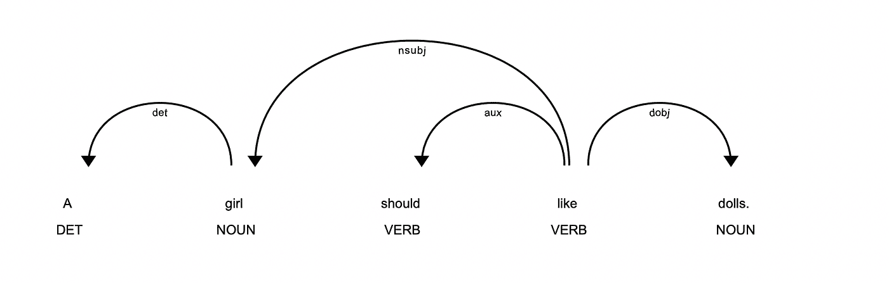
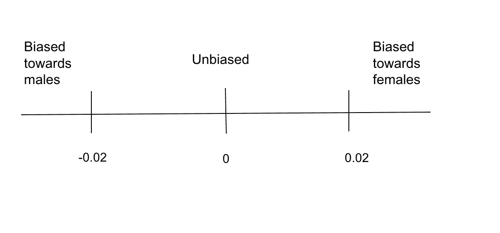
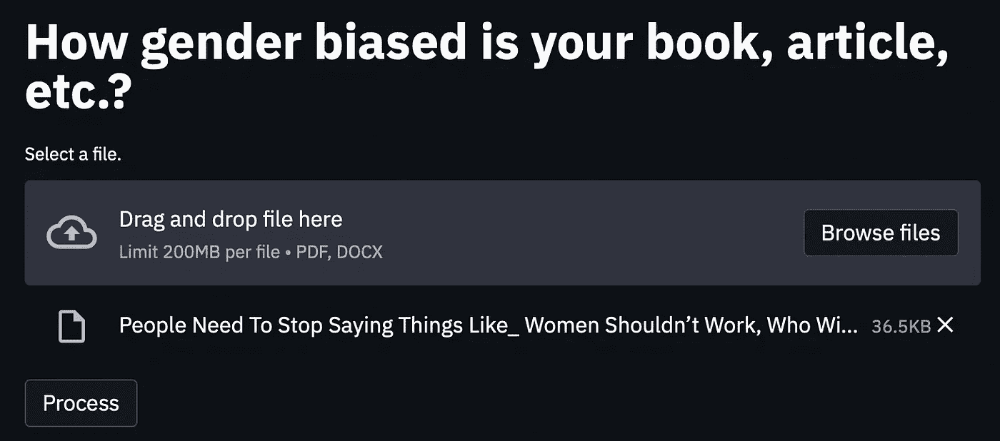
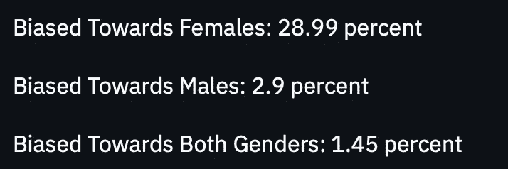

# 消除写作中的性别偏见

> 原文：<https://towardsdatascience.com/towards-removing-gender-bias-in-writing-f1307d0a2b71?source=collection_archive---------21----------------------->

## [公平和偏见](https://towardsdatascience.com/tagged/fairness-and-bias)

## **学习如何理解日常文学消费中的性别偏见，并在自己的写作中避免性别偏见。**

照片由[桑迪·米勒](https://unsplash.com/@sandym10)在 [Unsplash](https://unsplash.com/photos/KhStXRVhfog) 拍摄

**为什么会有性别偏见？**

我在一个性别偏见普遍存在的文化中长大。作为一名作家，我发现这令人担忧，并试图在我的故事中减轻偏见的影响。我相信解决这个问题始于发现，所以我决定开展一个项目来发现可能的性别偏见。

**免责声明**

这个项目是我第一次接触数据科学、机器学习和自然语言处理。这是对我一直感兴趣的数据科学领域的探索。因此，重要的是要注意，这个项目是一个概念的证明，而不是一个完美的算法。

**方法论**

我决定从句子层面来研究性别偏见。另一种选择是审查段落甚至整个文本。如果我发现一个有偏见的单词，我会将整个文本标记为有偏见的。我避开了这种方法，因为我觉得一个单词不一定会使整篇文章有偏见。相反，我觉得更重要的是，更好地理解这个特定单词与其他单词的关系，以及它在产生偏见方面所起的作用。对我来说，做到这一点的唯一方法是使用高水平的粒度和处理句子，而不是大块的文本。

在检查句子时，我想将每个句子分解成单词，并确定每个单词的词性。我需要决定我想要检查的词类，以确定这个句子是否有偏见。我最终选择了主语和宾语，原因如下:宾语是作者联系到性别主语(男人、男孩、女人、女孩等)的东西。).此外，这些词类最有可能成为性别偏见的目标，两者之间的关系通常表明偏见。例如，如果作者把一些老套的东西和主语“女孩”联系起来，比如“护士”或“洋娃娃”，那么很明显这个句子是有偏见的。为此，我选择考察主客体关系。此外，加强我的选择的东西是我的观察，在大多数带有性别刻板印象的句子中，有偏见的关系通常在这两个部分之间。

注意:我检查的句子来自性别平等法律中心的一篇文章[1]。我也用了其中的一些句子来帮助我开发自己的算法。

我使用 Python 库 Spacy 来解构每个句子——因为它是为数不多的为我解析句子的库之一——并加载了一个名为“encore_web_lg”的文件，这允许我将每个句子中的单词分成 Spacy 令牌对象。令牌有许多特性，但我使用的主要特性是:

*   token.pos_，用于词性
*   token.dep_，表示依存关系或单词与句子中其他单词的关系
*   token.text，它给了我单词的字符串形式
*   token.lemma_，它给了我这个词的词根形式，例如:token.lemma_ for Women 就是 woman

这是一个句子“女孩应该喜欢洋娃娃”的例子。以空间显示:

图片作者。

使用 Spacy，我创建了两种方法来检查每个句子的宾语和主语。我只在主语是男是女的情况下处理句子，这是通过检查主语的引理和小写形式是否在以下列表中来确定的:

lemma_female=['女孩'，'女人'，'女人'，'女性']

lemma_male=['男孩'，'男人'，'男人'，'男性']

注意:我之所以包括了 women 和 men，尽管它们都不是词根，是因为在某些情况下，Spacy 无法检测到单词形式是 woman，因此它默认为 women。为了解释这个问题，我不得不把女人和男人加入到词条列表中。

以句子“一个女孩喜欢洋娃娃”为例我的方法会给我主体——女孩和客体——洋娃娃。

但是，我意识到那句‘一个女孩喜欢洋娃娃’会是无偏见的，因为没有坚持说一个女孩应该喜欢洋娃娃，不像“一个女孩应该喜欢洋娃娃”这样的句子

因此，为了确保我的方法只查看有偏见的句子，我检查了限定词，比如单词 should。限定词是“改变陈述的绝对、确定或概括程度”的词语[2].我特别检查了必要性和数量限定词，因为它们表明输入句子的用户是否认为男性和女性应该做某事，或者对性别或两者进行概括:

必要性限定词=['必须'，'应当'，'应当'，'必需'，'必须'，'必须']

quantity_qualifiers=['all '，' only '，' most']

此外，我检查了单词是否是复数性别术语，因为如果是，用户将对整个性别进行概括，而不仅仅是单个成员。为此，我检查了受试者是否在以下列表中:

plural_form=['女人'，'男人'，'女孩'，'男孩'，'女性'，'男性']

如果句子包含一个或多个以上的短语，那么用来寻找主语和宾语的方法就会处理这个文本。

例如，现在用“一个女孩喜欢洋娃娃”这个句子。这个方法不会输出任何东西。而句子“女孩应该喜欢洋娃娃”它会给我主体女孩和客体娃娃。

接下来，我需要找到一种方法来确定被检测的主体和客体之间的关系是否有偏差。因为这个项目是在二进制中进行的，我意识到唯一的方法就是将检测到的关系与异性和对象的关系进行比较。如果这种关系有所不同，那么就有可能存在偏见。

对于项目的这一部分，我决定使用余弦相似度来计算单词之间的相似度，因为这是一种常用的用于比较单词的 NLP 技术。较高的余弦相似性得分意味着单词之间的关系更密切。较低的余弦相似性分数意味着相反的情况:单词具有更远的关系。单词之间的相似性依赖于 Twitter 数据，这些数据有助于根据 Twitter 上的用户使用单词的方式来计算相关性。

对于比较部分，以“一个女孩应该喜欢洋娃娃”为例。首先，我的方法会将主体识别为“女孩”,将对象识别为“玩偶”。然后，我需要将“女孩”、“洋娃娃”(洋娃娃的引理或根版本)与“男孩”、“洋娃娃”进行比较。用余弦相似度，我先找到了‘女孩’和‘娃娃’的相似度，是 0.58。然后我找到了‘男孩’和‘娃娃’的相似度，是 0.48。这些结果意味着“女孩”和“娃娃”以及“男孩”和“娃娃”都是密切相关的。然而，因为“女孩”和“洋娃娃”的分数更高，这两个词之间的关系比“男孩”和“洋娃娃”更密切。从第一个中减去第二个的相似度，我们得到 0.10。这两种关系的显著差异表明“女孩”和“娃娃”之间的关系存在偏见。除了处理像这样只有一个主语和宾语的句子，该算法还可以处理有多个主语和宾语的句子以及共轭句。

基于我从上述工作中得到的差异，我需要确定这种关系是否有偏见。因为关于什么样的差异被认为是有偏差的研究很少，所以我设置了一个大于 0.02 或小于 0.02 的基本度量来进行限定；我在测试了许多有偏见的案例后决定了这个数字——比如“一个女孩应该喜欢洋娃娃。”观察这些分数之间的差异。

按照我的标准，如果差异大于 0.02，就意味着这个句子偏向女性。如果小于 0.02，则偏向男性。如果在两者之间，就没有偏见。

这是光谱的图像:

图片作者。

基于余弦相似度的差异，如果是> . 02，我添加了一个偏向女性的句子计数，如果是

I also checked to see if the subject and object methods did not output anything but still had gendered terms. If so, I did not go through the process above. Instead, using the Python library vaderSentiment, I calculated the compound sentiment score of the sentence, which ranges from -1 (negative sentiment) to 1 (positive sentiment). If the score was less than 0 and had female gendered terms, male gendered terms, or both, I marked it as biased and added them to the respective count. I decided to use sentiment analysis because I wanted to identify general bias and detect bias in sentences where there were no qualifiers.

Lastly, I calculated the percentages of bias in the entire text — biased towards males, biased towards females, biased towards males and females — by dividing each of the counts by the total number of sentences. Then I displayed my output.

I decided to use Streamlit, which allowed me to efficiently create my app, to display my output. I organized the information I received from my work above in a format that Streamlit would accept and outputted it on the screen.

My algorithm extracts text from books, articles, etc. in PDF and Word document form. It first processes the text, then inputs each sentence through my above algorithm, calculates the biased percentages, and displays the sentences with bias as well as which type of bias they had.

**演示:**

我用来解释我的算法工作方式的句子很简单。我主要使用它，所以我的算法分析很容易理解。相反，下面是我的算法分析一篇更复杂的文章的例子:

这是我网站的主页。用户可以上传 PDF 或 DOCx (Word)文件。可以看出，我选择了分析[这篇](https://www.womensweb.in/2020/04/women-shouldnt-work-who-look-after-husband-kids-apr20wk2mad/)关于消除女性不应该工作的刻板印象的女性网络文章，并将其上传为 PDF 格式。

作者图片

单击“处理”按钮后，结果如下:

图片作者。

这篇文章似乎主要偏向女性。对男性和两性都没有什么偏见。现在让我们来看几个发现了偏见的句子。

从对女性的偏见开始，这里有一句话:

这一切都是从我们谈论社会上发生的普通事情开始的，不知从哪里，我的朋友说，“女人不应该去工作。”

*   在这个句子中，确定的主语是女性。确定的对象是工作。这句话被标记为有偏见，因为它有一个复数的性别术语——妇女，并有一个必要性修饰语——应该。在比较了‘woman’(women 的引理版本或单词的词根形式)和‘work’(work 的引理版本或其词根形式)的余弦相似度(0.32)和‘man’与‘work’的余弦相似度(0.39)之后，可以清楚地看出，两者之间存在 0.07 的绝对值差异。这使得句子偏向女性。

接下来，这里有一个偏向男性的句子:

*大多数男人在结婚前完全依赖他们的母亲，结婚后则依赖他们的妻子。*

*   在这个句子中，主语被确定为‘男人’，宾语被确定为‘母亲’。这个句子被标记出来是因为它有一个复数的性别术语——men 和一个数量修饰语——most。这个句子有多个宾语:“妻子”和“母亲”。使用 Python 库 gensim 和来自 Google news vectors 的数据来查找与被识别对象最接近的单词，我发现最接近的单词是‘母亲’。“男人”(男人的词条版本或男人的根形式)和“母亲”(母亲的词条版本或其根形式)的余弦相似度为 0.50，“女人”和“母亲”的余弦相似度为 0.68。绝对值差 0.18，说明两者有差别，意思是句子偏向男性。

最后，这里是唯一一个偏向男性和女性的句子:

*女性不能工作的另一个原因是男性的成长方式。*

*   在这个句子中，确定的主语是女性和男性。因为两者都是复数，这意味着作者对两性做了某种假设。因为在这种情况下，没有办法比较两种性别，所以算法会自动将句子标记为偏向男性和女性。

**我学到了什么:**

这个项目教会了我如何使用机器学习来解决文本中的性别偏见等问题。然而，它也向我展示了 ML 是如何同时扩张和限制的。尽管 ML 的范围很广，但有时它不能满足我的算法的需求。因此，我必须找到算法来填补 ML 的空白。

我还学习了许多不同的 Python 库，现在完全理解了如何使用其中的许多库。总的来说，我的数据科学知识库扩展了很多。我从一个完全的初学者到快速适应 Python，学习 NLP，特别是理解 Spacy 的复杂性——用于处理文本和识别词性的 Python 库，以及理解如何在我的工作中使用大型数据集。

**潜在的改进领域:**

*   截至目前，该项目在性别二元制范围内运作。在未来，我希望将它扩展到解决对非双性恋和跨性别者的偏见。
*   此外，我想强调一下某些职业对某些性别的偏见。例如，从事护理工作的男性或从事计算机科学的女性经常被打上烙印，所以我的目标是找到解决对这些群体的偏见和成见的方法。
*   为了将一个主题与多个对象进行比较，我最初想将该主题与每一个单独的对象进行比较。就像“女孩应该喜欢洋娃娃和卡车”这样的句子来说。，我会比较“女孩”和“洋娃娃”(洋娃娃的引理版本或其根形式)以及“女孩”和“卡车”(卡车的引理版本或其根形式)。但是，如果有两个以上的对象或潜在的更多的主题，这个过程将变得乏味和耗时。然而，我觉得这样做会使我的算法更准确。因此，我想寻找一种有效的方法来做到这一点。
*   最后，我目前正在努力减少加载大文件和显示结果所需的时间。因此，在未来，我希望找到提高算法速度和效率的方法。

如果您有任何问题，请随时通过 [LinkedIN](https://www.linkedin.com/in/srihitha-pallapothula-657a701b1/) 联系我。

感谢您的阅读。我希望你从我的项目中学到了一些东西！

**参考文献:**

[1] [性别陈规定型观念的例子:性别平等法](http://www.genderequalitylaw.org/examples-of-gender-stereotypes) (2015 年)，性别平等法律中心

[2] [使用限定词](https://changingminds.org/techniques/language/modifying_meaning/qualifiers.htm) (2005)，改变思想