# 走向深度学习的终点和 AGI 的起点

> 原文：<https://towardsdatascience.com/towards-the-end-of-deep-learning-and-the-beginning-of-agi-d214d222c4cb?source=collection_archive---------1----------------------->

## 最近的神经科学研究如何指出战胜对立例子和实现更具弹性、一致性和灵活性的人工智能形式的道路

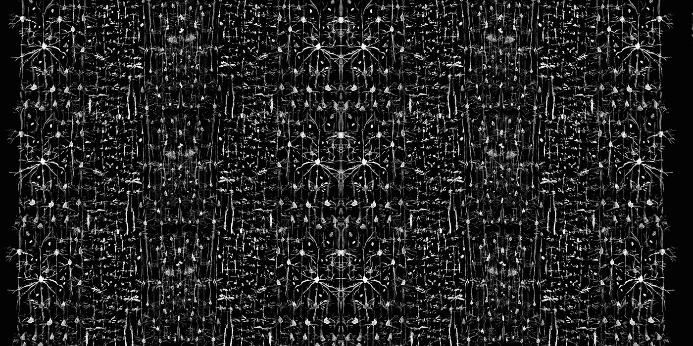

作者哈维尔·Ideami@ideami.com 的绘画

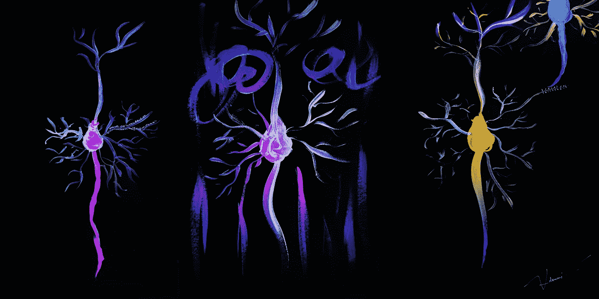

作者哈维尔·Ideami@ideami.com 的绘画

**对抗性例子**是当今深度学习的一个研究热点。**数据中微妙的、往往看不见的变化**会推动我们的网络犯下**可怕的错误**。作为人类，我们似乎对感官输入的这些干扰更有弹性(尽管不是完全免疫)。

在我们的**深度学习系统**中有一定的模式。他们取得了非凡的成就，但他们有时也很脆弱。就像暴风雨中的一棵僵硬的树，它们看起来很雄伟，但可能会在没有警告的情况下随时开裂。为什么会出现这种情况，我们如何改善这种情况？

来自神经科学领域的新研究开始让事情变得明朗起来。在这篇文章中，我们将探索它。

在他最近出版的书《一千个大脑:智能新理论**》中，我非常喜欢这本书，**科学家兼企业家杰夫·霍金斯**剖析了他的**团队** 对我们大脑新皮层的最新研究，大脑新皮层占据了大脑体积的 70%，负责我们的高级智能。(另外 30%被大脑更古老、更原始的部分占据)。**

**在一次迷人的旅程中，杰夫·霍金斯带我们深入到我们智力的中心。他认为:**

*   **大脑皮层中的**回路**非常复杂**。在仅仅**一平方毫米**中，我们有大约**十万个神经元**、**几十万个连接**(突触)和**千米长的轴突**和树突。****
*   **在周围的**大脑皮层看起来非常相似。地区之间的差异很小。****
*   **新大脑皮层的所有部分似乎都与运动的产生和运动任务**相连。在新大脑皮层的每个部分，科学家们都发现了与旧大脑中与运动相关的区域相连接的细胞。****

**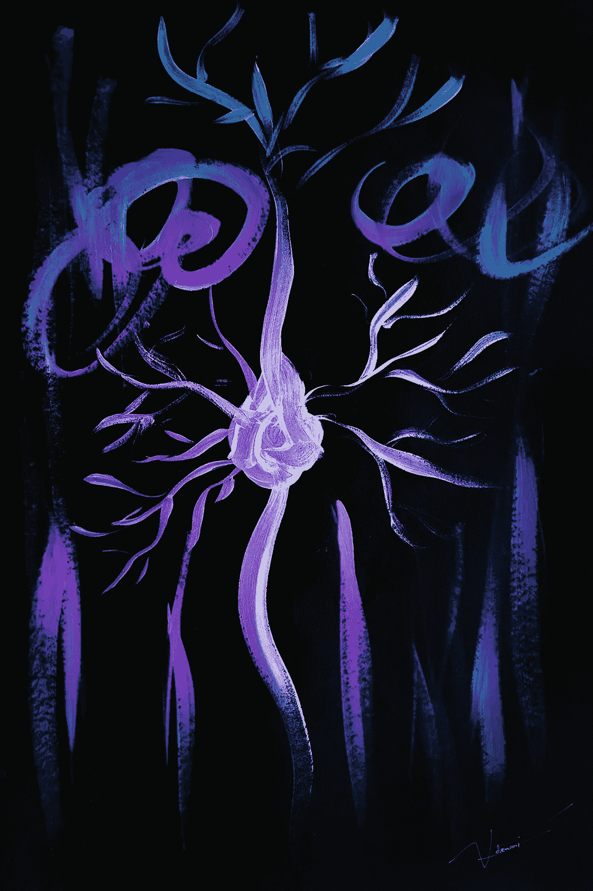**

**作者哈维尔·Ideami@ideami.com 的绘画**

# **一个电路来统治他们**

****弗农·芒特卡斯尔**是美国领先的神经生理学家，约翰·霍普金斯大学神经科学荣誉退休教授。他是大脑皮层柱状结构的发现者。他提出，通过进化，我们的大脑皮层变得更大，基本上是通过一遍又一遍地复制同样的东西，同样的基本回路。**

**当我在杰夫的书中读到蒙特卡斯尔的想法时，我想起了伟大科学家罗伯特·萨波尔斯基的一次精彩演讲。在回答是什么将我们与黑猩猩区分开来的问题([https://www.youtube.com/watch?v=AzDLkPFjev4](https://www.youtube.com/watch?v=AzDLkPFjev4))时，萨波尔斯基解释说，黑猩猩和人类之间的基因表达差异约有一半与嗅觉受体的编码基因有关，其他差异与骨盆弓的大小、体毛的数量、免疫系统识别能力、生殖隔离的某些方面等有关；这些和其他因素解释了黑猩猩和人类之间几乎所有的基因差异。那么，**与人类大脑相关的基因差异在哪里**？Sapolsky 解释说**几乎没有任何**，而**少数被确认的**存在于**基因中，这些基因与胎儿大脑发育过程中细胞分裂的次数有关。基本上，我们的神经元比黑猩猩多 3 倍。这种比例上的差异似乎是我们高级智能的关键。****

**这非常符合 Mountcastle 的单回路被复制许多许多次的想法(体积很重要，但体积足以将今天的深度学习系统推向 AGI 吗？下面我们继续探索)。**

**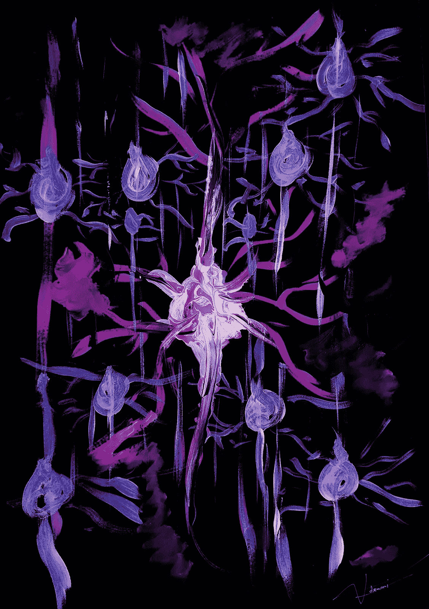**

**作者哈维尔·Ideami@ideami.com 的绘画**

**我们大脑皮层的所有部分都基于相似的原理在相同的基本回路上工作，这符合我们的大脑在不同场景中表现出的灵活性。如果体积很重要，**这是否意味着 GPT-11 可能会让我们更接近 AGI** ？**

**可惜，**没那么简单**。因为房间里有一头巨大的大象，杰夫在他的书和理论中解释了这一点。一个我们已经忽略太久的问题。**

# **150000 列**

**在我们去拜访房间里的大象之前，让我们建立一下背景。根据科学家的说法，我们的新大脑皮层中大约有 **150000 个皮质柱**。杰夫告诉我们，我们可以把这些柱子想象成细面条。所以，想象一下 **150000 根细意大利面紧挨着。**那是**你的新大脑皮层**打个比方**。****

**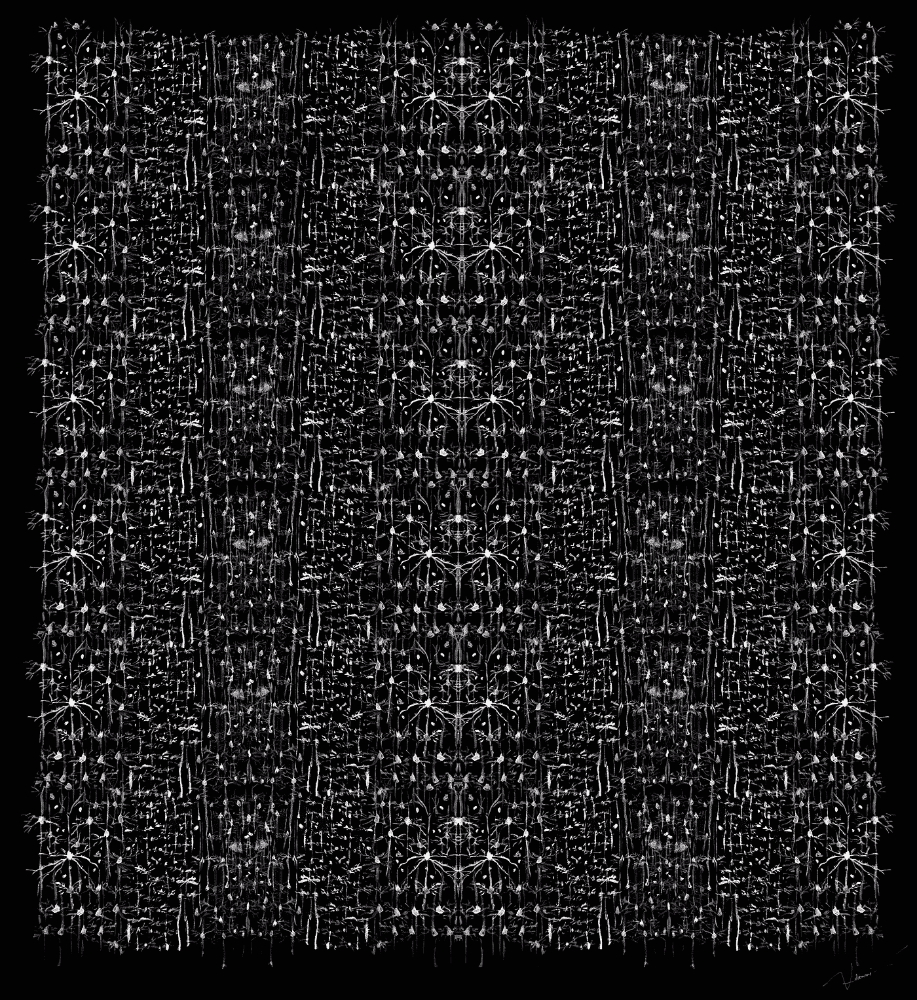**

**作者哈维尔·Ideami@ideami.com 的绘画**

**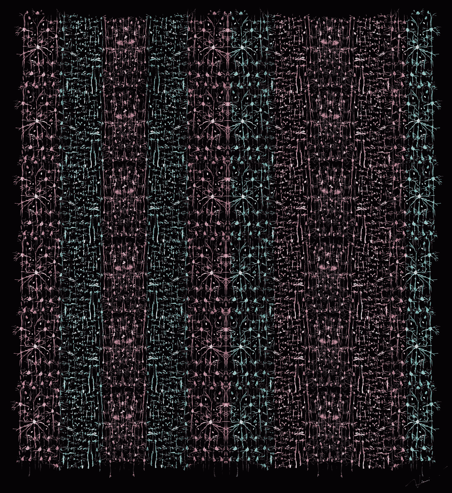**

**作者哈维尔·Ideami@ideami.com 的绘画**

**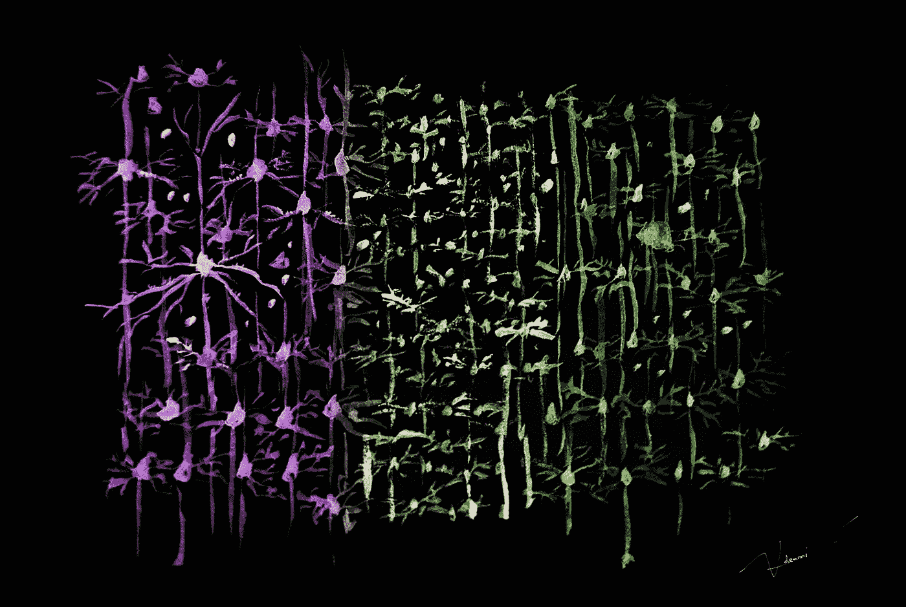**

**作者哈维尔·Ideami@ideami.com 的绘画**

**这些皮层柱内发生了什么？在过去的几年里，科学家们逐渐认识到大脑是一台预测机器。它**产生一个世界模型**并不断**预测接下来会发生什么**。**

****当**我们大脑的**预测不正确**时，我们意识到有些事情不对劲，我们的**大脑更新了它的世界模型**。随着时间的推移，我们的世界模型变得更加丰富和复杂。**

**所以在某种程度上，我们确实生活在模拟环境中。因为我们所感知的实际上是大脑构建的模型，而不是外面的“现实”。这解释了幻肢和其他类似的场景。**

**杰夫·霍金斯指出**我们的大脑通过**注意当我们移动**(或当那些输入移动)时它接收到的输入是如何变化的来学习世界的模型**。这就把我们带到了房间里的大象。**

# **明摆着的难题**

**世界在不断变化。**万物皆动。**有道理的是**随着事物的移动**和变化，**我们的大脑不断更新我们的世界模型**(我们很快就会看到我们的许多许多模型)。**

**正如**注意力机制近年来彻底改变了深度学习领域**，**注意力也是我们大脑如何学习这些模型的关键**。**

**但是，如果我们的新大脑皮层**不断地做出大量的预测**，并且**适应它的模型和它感知到的东西之间的任何偏差**，为什么我们没有注意到所有那些预测，而是感知到一个连续的现实？让我们一步一步来。**

**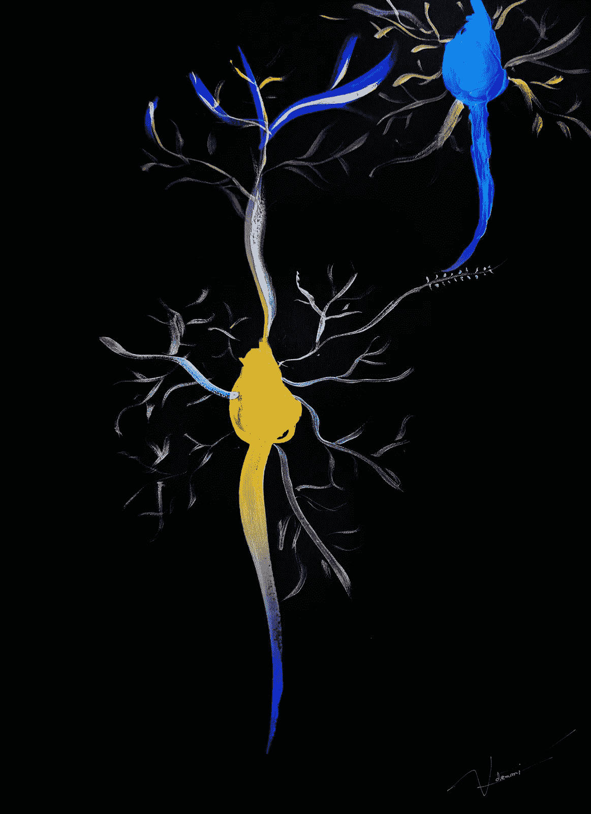**

**作者哈维尔·Ideami@ideami.com 的绘画**

**通过他们的最新研究，杰夫和他的团队获得了一些有趣的见解:**

*   ****我们的每一个皮质柱**(大约 150000)**都在学习世界的模型**，学习物体的模型，学习概念的模型，学习任何你能想象到的模型。就像我们的**老大脑**有 ***位置细胞*** 和 ***网格细胞*** 来制作我们周围环境的模型一样，他们提出**新大脑皮层**，**有等价的细胞，允许大脑制作物体、概念**等的模型。皮质柱**正在使用**杰夫称之为**的参照系**，这就像是多个维度的网格**帮助大脑组织任何种类的知识**。**
*   **杰夫告诉我们，思考是运动的一种形式。当我们在这些参考框架内改变位置 **时，思考**就会发生。所以你现在在想什么，你现在在想什么，取决于你的皮层柱在不同的参照系中的位置。当你的大脑在这些结构中导航时，你的思想也在不断进化。******

**注意到**运动**的概念开始到处出现。**运动**和**系统的动态本质**是房间里的大象。我们将很快讨论**这与对立例子的问题以及今天的**深度学习中发生的许多事情的局限性有什么联系。**

**所以，它是关于参考框架或 T42 地图，物理空间的地图，概念的地图，任何东西的地图。杰夫告诉我们，就像旧大脑中的参照系是学习不同环境的地图一样，新大脑皮层中的**参照系是**学习物体的地图**(在他们称之为" ***什么"*列**的情况下)，或者身体周围的**空间**(在" ***where"* 列**)或者概念的**地图******

**我喜欢 Jeff 使用的关于如何**成为任何领域的专家**的类比，我们需要**找到一个好的方法来组织我们关于该领域的知识**，我们需要在内部创建一个该领域的伟大参考框架或地图。想想看，为了在各自的专业领域出类拔萃，列奥纳多·达·芬奇或爱因斯坦所拥有的深刻而复杂的参照系。**

**好吧，那么**我们 15 万个皮层列**中的每一个都在**学习一个世界的预测模型**，因为它关注输入如何随着时间的推移而变化。并且**这些列中的每一列** **学习大量**元素、对象、概念等的模型。**

**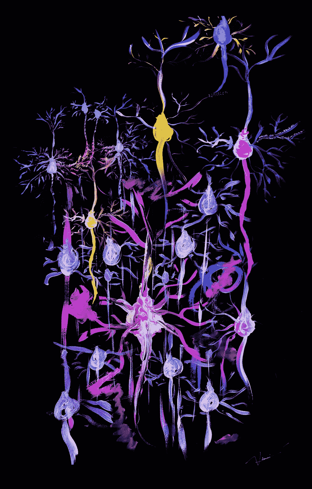**

**作者哈维尔·Ideami@ideami.com 的绘画**

**因此，我们对任何事物、物体或概念的知识分布在成千上万个皮层柱中，成千上万个互补模型中。这就关系到**杰夫理论** ( **一千个大脑**)的名字。**

**所有这些都与我们大脑的灵活性有关。我们的新大脑皮层**并不依赖于单个列**。知识分布在成千上万的人身上。因此，即使受伤损坏了一组柱子，大脑也能继续工作(在学术文献中有很多这方面的例子)。**

**接下来要考虑的是:**如果每次运动发生时，大脑都在创造新的预测**，**这些预测储存在哪里？****

**杰夫和他的团队提出，神经元中不同树突上出现的**尖峰是预测**(树突是神经元中的分支，通过它们的突触接收输入)。**树突尖峰将与之相连的细胞**置于中，杰夫称之为**一种预测状态**。因此，**预测发生在神经元内部**。这些预测**改变了神经元的电属性**并**使其比其他情况下更早**点火，但是**预测并没有通过轴突发送到其他神经元**，这**解释了为什么我们没有意识到它们中的大多数**。现在的问题是:我们如何确定一个特定的预测？**

**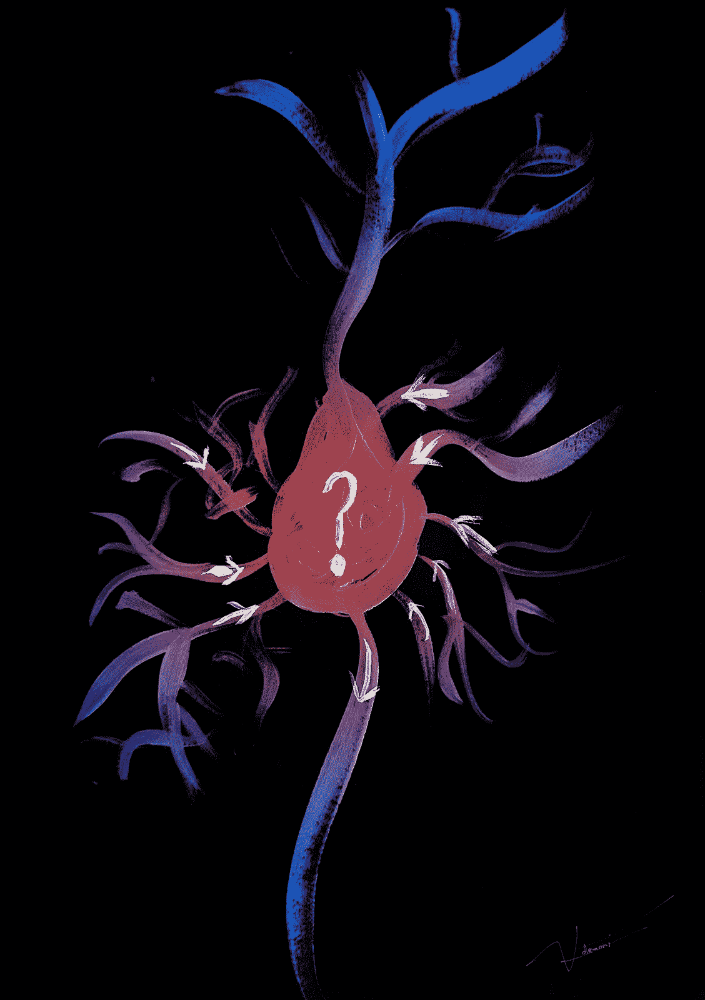**

**作者哈维尔·Ideami@ideami.com 的绘画**

# **投票一致**

**我们对现实的**感知**是投票过程的**结果。不同的**皮层列通过投票**达成共识，这就是**产生单一感知**的原因，它统一了来自系统不同部分的不同预测(这也可能与多种类型的感官输入有关)。****

****只有一些细胞需要投票**，代表例如我们正在感知的特定物体的**细胞。他们如何投票？****

****我们皮层柱**中的大多数连接是**上下** **新皮层的不同层**。但是**也有例外**。科学家发现，有些细胞通过新大脑皮层将轴突(输出连接)从一边发送到另一边。杰夫和他的团队认为这些远距离连接的细胞是负责投票的细胞。**

**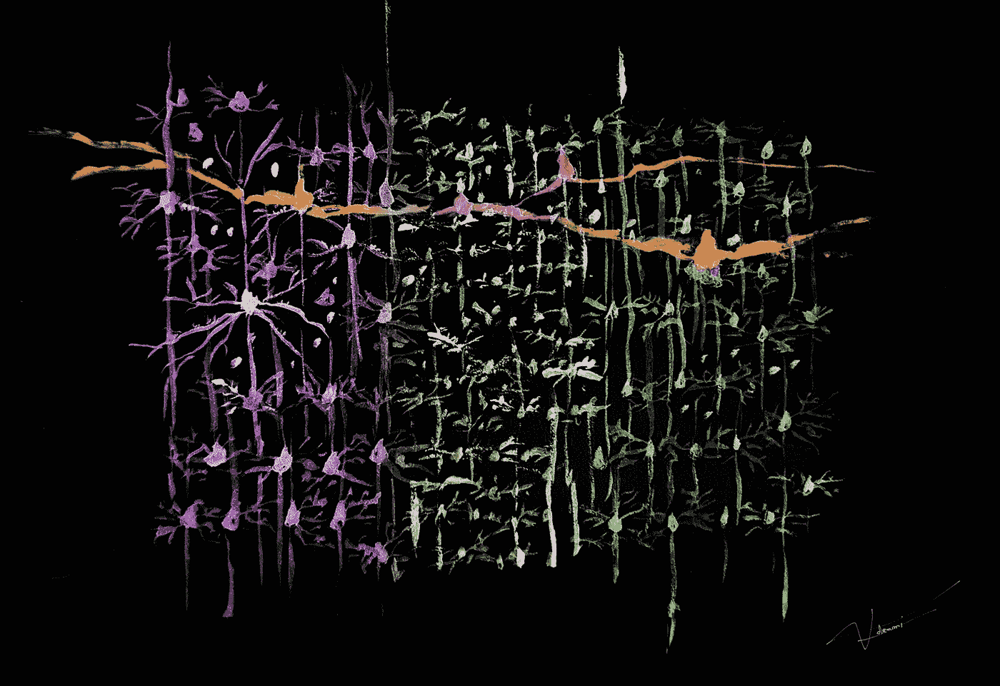**

**作者哈维尔·Ideami@ideami.com 的绘画**

**当我们认出一个物体时，我们的皮质柱已经达成共识。我们每一列中的**投票细胞**(神经元)**形成一个稳定的模式**，代表那个物体以及物体相对于我们的位置。**

**并且**只要我们继续感知同一个物体，**那些投票神经元的**状态不会改变**而我们继续与那个元素互动。当我们移动或物体移动时，其他神经元将改变它们的状态，但是**投票神经元将保持稳定**。**

**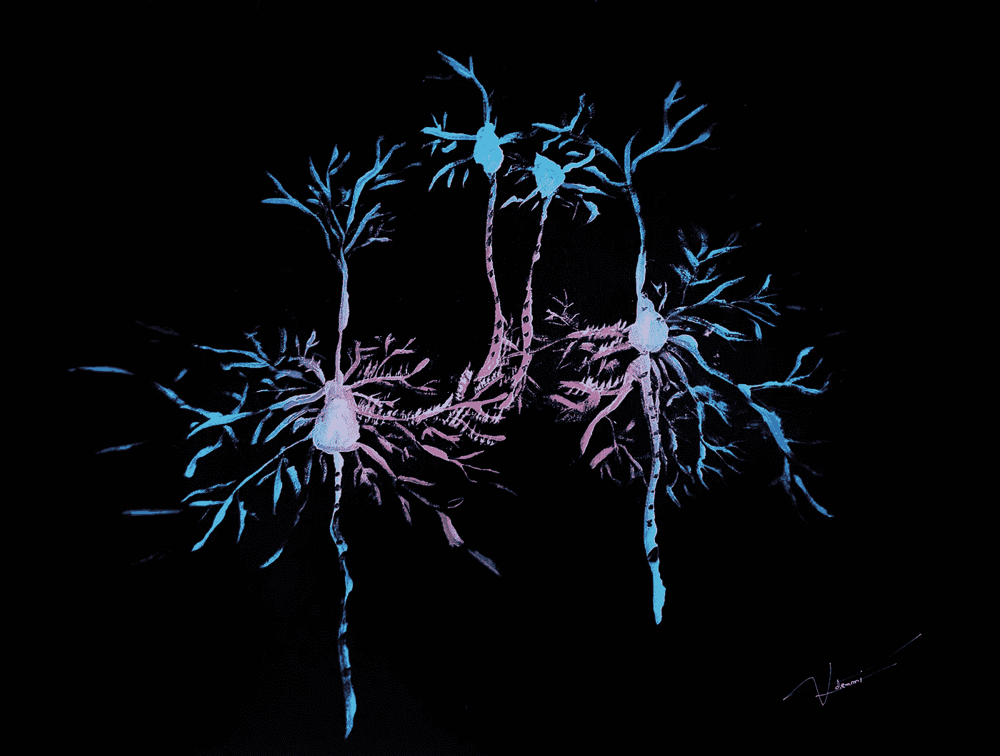**

**作者哈维尔·Ideami@ideami.com 的绘画**

****这就是为什么我们的感知是稳定的**并且**我们没有意识到**与**正在发生的移动预测**相关的一连串活动。**我们只是知道最终的稳定模式，这些模式来自投票的细胞达成的共识**。**

**因此:**

*   **运动是我们大脑感知世界的关键。正是由于运动(我们自己的或我们周围世界的运动)，我们的大脑可以丰富其内部的物体和概念模型(运动不一定是物理的，它可以是虚拟的，等等)。**
*   **使用**单一原则来处理各种输入**并为我们与之互动的每个元素创建**数千个预测和模型，使得这些**模型丰富多样**。****
*   **通过投票达成的**共识机制意味着我们对世界**的**感知**是稳定的**同时**是灵活的、有弹性的。******

是时候回到对立的例子和深度学习领域的地位了。

# 如何打败对立的例子

**人类****也不能对对抗性的例子免疫。我们感官输入的扰动会使我们困惑，并使我们错误地解释事物。我们大多数人都经历过各种各样的视错觉。然而，总的来说，**我们的感知是一致的，而且相当有弹性，**而且肯定比我们在今天的深度学习系统中发现的更加一致，在深度学习系统中，看不见的变化可以完全破坏我们的结果。**

这种弹性、一致性和灵活性背后的原因是什么？不管它是什么，它可能包括以下一些内容:

*   由我们的皮质柱创建的**模型**是**基于运动和参考框架的创建。当我们四处移动或世界在我们周围移动时，我们的大脑会为每个物体或概念创建成千上万个预测和模型。这提供了**灵活性**。我们不会把所有的鸡蛋放在一个篮子里。就像我们在深度学习中使用集成一样，我们在这个问题上赌上了成千上万个角度，而不是一个。**
*   我们的认知基于**多模态和稳定的投票动态**。与特定对象(或概念等)相关的不同模型正在使用多种**预测**，这些预测通常**连接到不同的感官模态** ( **视觉、触觉、听觉、手势、**等)。**在负责最终表示的单元之间进行投票**会产生对变化具有弹性的稳定模式。对象或环境**中的**最小变化**不会使稳定的投票模式**脱轨，因为这种模式是基于成千上万个独立预测的组合，而这些预测又是基于许多不同角度、视角以及通常不同的感官形态的组合。就像**集合**经常在 Kaggle 比赛中获胜一样，它也是大脑中正在发生的一种集合，使我们的人类感知**稳定、有弹性和灵活**(当然是相对而言，但与当前的深度学习系统相比尤其如此)。

因此，深度学习中对立例子的“终结”，我说的“终结”**并不是指绝对的终结，**只是**达到类似于我们作为人类所拥有的**的弹性、一致性和灵活性的水平，将有可能结合:

*   **运动**:物理的还是虚拟的。**深度学习系统需要**能够**通过**丰富它们的内部模型**来收集对世界**的不同观点和角度，因为它们在移动或世界在它们周围移动。机器人技术和人工智能将不得不进一步融合。除了机器人学，**运动也可以是虚拟的**，所以这个原理**超越了物理**。
*   **模型集合:**我们必须**超越单一的表象或模型。**为了对对立的例子和其他挑战具有弹性，深度学习需要**生成大量的预测和模型，并不断更新。**投票机制**然后**可以**创建稳定的模式和表示**，这将对敌对的干扰更有弹性。
*   持续学习:外面的世界不会等待。以上的一个结果是**学习需要持续不断。** **深度学习**系统如今**太静态**。持续学习是一个活跃的研究领域，它的重要性只会越来越大。
*   我们可以从 Jeff Hawkins 在他的书和理论中描述的参考框架中找到很多关于如何建立我们的表示和模型的灵感。正如 Jeff 指出的那样，像 Geoffrey Hinton 这样的深度学习领导者已经努力了很长时间，试图让深度学习模型更加灵活(见胶囊网络)。但是前面还有很长的路要走，而且越来越清楚的是，最新的神经科学研究正在用新的线索强化这个方向；我们的大脑比我们的深度学习模型更加灵活和有弹性，现在我们开始明白为什么了。

研究检测对立例子的新方法是一个有很多学术活动的有趣领域。现在缺少的是**重新思考我们的深度学习架构和系统**到**从当前的静态范式** **过渡到基于**多模态、多模型、基于共识的预测系统**的动态范式**，该系统**具有弹性、一致性和灵活性**。当我们到达那一点时，我们将能够隐藏或扰乱我们系统的部分，并且仍然维持稳定的预测。

正如杰夫指出的，随着我们试图将人工智能系统应用到需要大量灵活性和弹性的场景中，这一点将变得越来越重要。

Mountcastle 的想法，Sapolsky 的想法以及我们对 GPT 建筑的迷恋，所有这些都表明了体积的重要性。 **体积要紧。**拥有 **3 倍多的神经元**，或者**数千份相同的基本电路**，或者数千亿个参数而不是 10 亿个**，所有这些都很重要。**

对于深度学习领域的现状来说，这是一个好消息。有了像 **GPT** 系统**、**这样的项目，我们发现并确认了这样一个事实，即**体积很重要**。

但是，我们也开始意识到，尽管数量很重要，但**而不是**足够**带我们去我们想去的地方。**

如果你在一系列播客和场合中跟踪关于像 GPT-3 这样的系统的最新对话，比如说在 [**机器学习街头谈话**](https://www.youtube.com/watch?v=iccd86vOz3w) **播客**中，你会听到类似的结论。 **GPT-3 令人印象深刻，但它也有点脆弱，让人感觉像个黑客。**这与人类大脑的弹性和灵活性无关。

**体积很重要。但运动也是。**我们**不能仅仅通过纯粹的体积来逃避运动和变化**。这个世界就像一场永不停息的风暴。

**我们是静止的树**，那棵**变得越来越大**但是**一次又一次地折断**，因为**没有能力随着风暴移动**。

思考就是运动。在参考坐标系中移动。通过共识机制统一的数千个预测和模型的运动。

前进的道路是通过运动。

***后记*** :佩德罗·多明戈斯在他的书**《大师算法》** **中写了与深度学习有关的不同范式:**象征主义者、连接主义者、进化论者、贝叶斯主义者和类比主义者**。很明显，通往 AGI 的道路可能有许多不同的路线和方法组合。关于杰夫和他的团队的工作和理论，正如肯尼斯·斯坦利教授所说的，我遵循着一个有趣的梯度(关于杰夫的工作，这个梯度的幅度相当大)。我觉得杰夫的理论和工作(以及他所有才华横溢的团队)可能包含非常有趣和有用的**垫脚石，可以让我们更接近 AGI** (或者至少他们的研究可以为我们指出这些垫脚石)。所以，是的，我们可以通过许多不同的方式到达 AGI，但是到目前为止，我们所知道的唯一有足够弹性和灵活性的智能系统是我们肩膀上的那个。因此，深入探索来自神经科学的最新研究可能会为我们指明通往 AGI 之路的有用垫脚石，这的确很有意义。**

如果你想深入探索激发我们深度学习人工智能系统的实体之谜，并使你的想法成为可能，请查看下面的相关文章。

 [## 通往神经元中心的旅程

### 更接近激发深度学习网络的实体，并可能给我们关于如何走向更…

towardsdatascience.com](/journey-to-the-center-of-the-neuron-c614bfee3f9) 

作者哈维尔·Ideami@ideami.com 的绘画