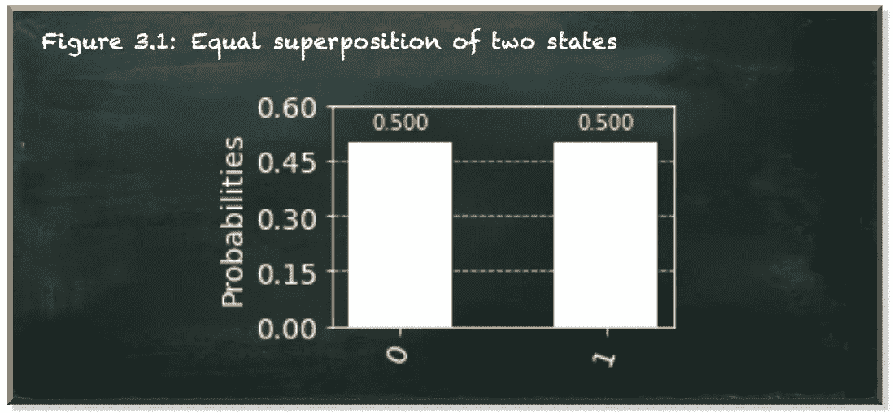
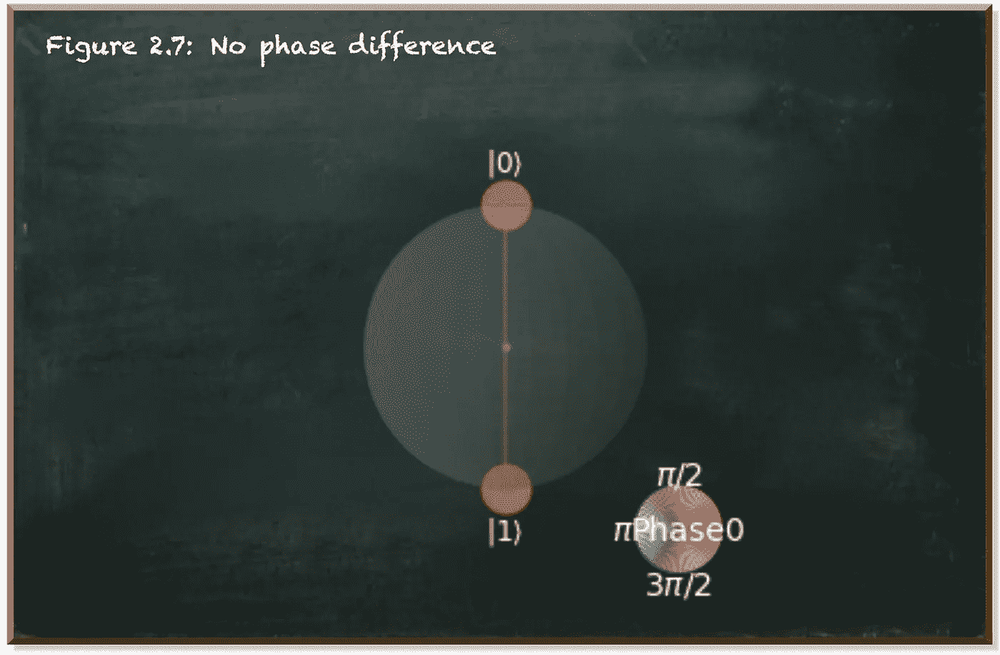
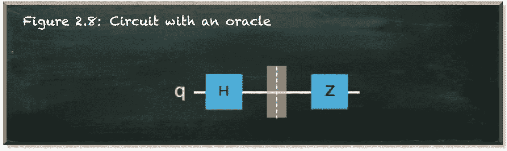
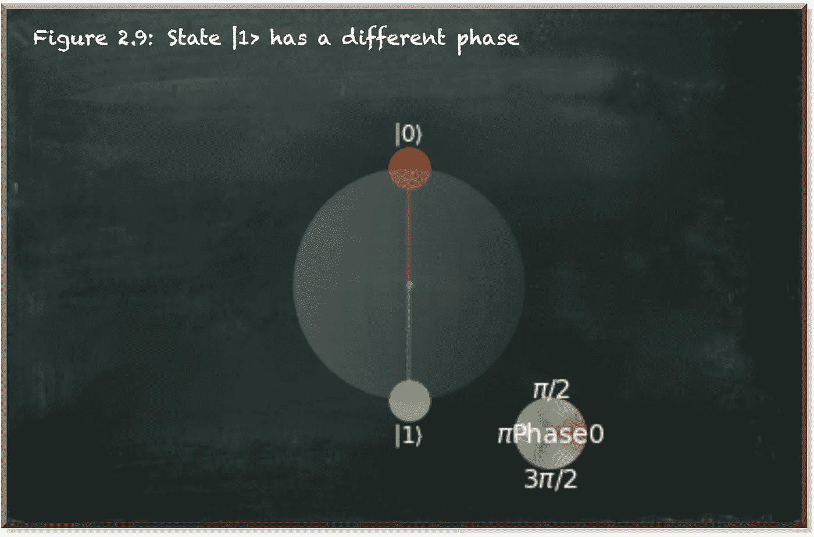
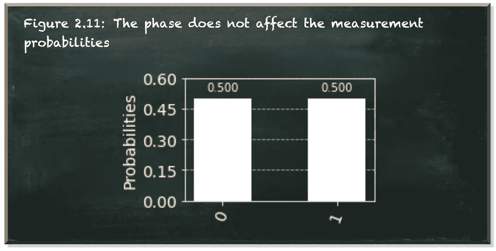
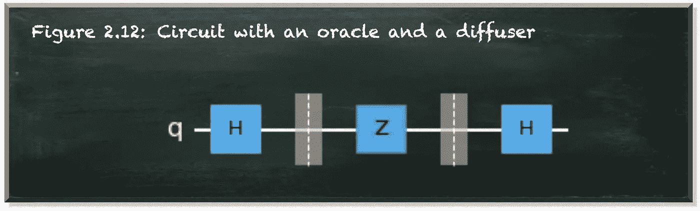
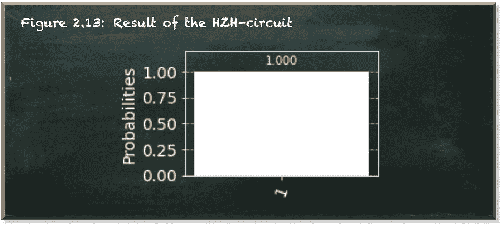
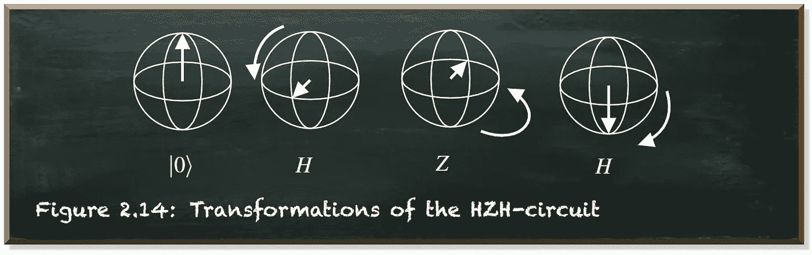
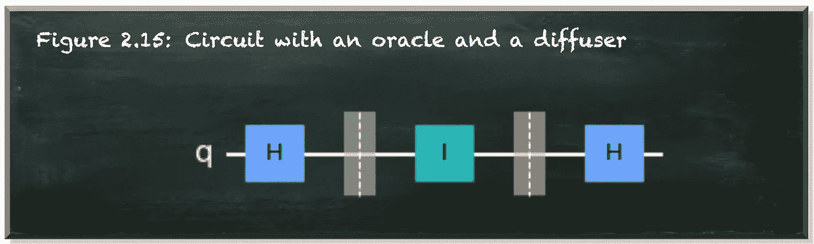
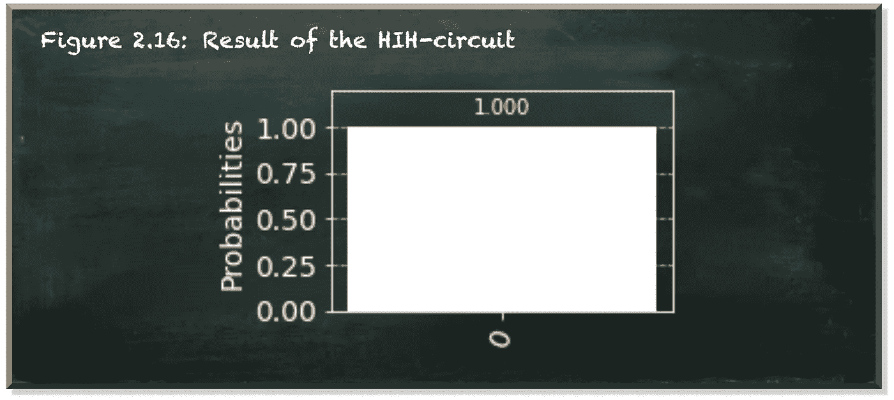

# 理解格罗弗的搜索算法

> 原文：<https://towardsdatascience.com/towards-understanding-grovers-search-algorithm-2cdc4e885660?source=collection_archive---------23----------------------->

## 电路恒等式的重要性

本帖是本书的一部分: [**用 Python 动手做量子机器学习**](https://www.pyqml.com/page?ref=medium_grover&dest=/) **。**

格罗弗的搜索算法是第一个也是最突出的例子之一，展示了量子电路如何比经典算法快几个数量级。

在[之前的文章](/where-the-quantum-advantage-comes-from-5accd926eb7a)中，我们建立了算法如何工作的概念理解。它遵循一个简单的程序。量子预言反转了被搜索状态的振幅。然后，扩散器翻转关于平均振幅的所有状态，因此，放大被搜索的状态。

作者弗兰克·齐克特的图片

建立一些直觉是一回事。将这种直觉转化为工作的量子电路是一个完全不同的故事。事实上，在量子电路中实现反射需要我们扩展思维。

第一阶段的思维不是用量子比特来思考，而是用状态来思考。当然，量子位是我们工作的计算单位。当然，多量子位系统的可能状态取决于我们使用的量子位。当然，量子系统的重要视觉化，例如布洛赫球，是建立在量子位元上。

但是我们也必须记住量子位元的一个重要特性。我们可以纠缠量子位。而且我们再也不能用两个分离的量子比特来代表两个纠缠的量子比特了。两个纠缠的量子位共享它们的状态。我们无法在没有另一个的情况下代表一个，因为如果我们测量其中一个量子位元，另一个的状态也会不可避免地改变。

此外，量子计算的强大之处在于，量子位不仅可以形成状态，而且我们可以同时处理它们的状态。因此，我们需要用状态来思考，而不是用量子位来思考。

先说格罗弗算法最简单的情况。我们有一个单量子位——两种可能的状态，开和关，|1⟩和|0⟩.

格罗弗算法的第一步总是一样的。我们将所有的量子位元放入相等的叠加态，让每个状态都有相同的振幅，因此也就有相同的测量机率。我们通过哈达玛之门实现这一目标。

现在，两个可能的状态，|0⟩和|1⟩，都有 0.5 的概率。

作者弗兰克·齐克特的图片

此外，两个状态共享相同的相位。

作者弗兰克·齐克特的图片

假设状态|1⟩描绘了我们想要找到的有利状态。然后，预言机由 z 门组成，当相应的量子位处于|1⟩.状态时，z 门切换振幅

作者弗兰克·齐克特的图片

结果，我们看到|1⟩.态的振幅发生了变化量子位现在处于|−⟩.状态它的两个国家|0⟩和|1⟩现在处于两个不同的阶段。

作者弗兰克·齐克特的图片

换句话说，我们把状态|1⟩的振幅从正翻转到负。

作者弗兰克·齐克特的图片

两种状态的测量概率仍为 0.5。扩散器的任务是放大振幅以有利于被搜索的状态。

作者弗兰克·齐克特的图片

单量子位元电路中的扩散器相当简单。这是另一个 H 门。

作者弗兰克·齐克特的图片

这个电路以绝对确定性产生|1⟩状态。

作者弗兰克·齐克特的图片

我们的量子位最终处于我们想要的状态|1⟩，因为哈达玛门把|−⟩状态变成了|1⟩.状态下图描述了我们在该电路中应用的旋转。

作者弗兰克·齐克特的图片

我们在量子位上应用了一个重要的序列，HZH 电路。这个电路被称为非门(x 门)的标识，它将|0⟩状态转换为|1⟩状态，反之亦然。

下面的等式证明了这个恒等式。

那么，我们为什么要使用 HZH 序列呢？如果它类似于非门，我们为什么不用它来代替呢？

简单来说，HZH-sequence 更灵活。这是格罗弗搜索算法的最简单形式。它从所有状态都相等开始(第一个 H 门)。它应用了一个神谕(Z 门)。它使用一个扩散器来放大所选状态|1⟩(第二个 h 门)的幅度。

为了证明这种灵活性，假设我们想选择|0⟩。这是先知的任务。起始状态和扩散器保持不变。|0⟩的神谕是 I-gate。或者，干脆什么都不做。

作者弗兰克·齐克特的图片

这个电路导致|0⟩状态，我们绝对确定地测量为 0。

作者弗兰克·齐克特的图片

仔细观察，我们可以很容易地发现这个电路根本不起作用。I-gate 什么也不做，Hadamard-gate 恢复正常。因此，我们最终处于默认的初始化状态|0⟩.

# 结论

虽然我们可以更简洁地重写这两个电路，但电路恒等式 HZH=X 和 HIH=I 让我们使用 Grover 算法的一般结构。简单地通过改变神谕，我们可以标记和放大不同的状态。我们不需要为我们想从列表中选择的每一个可能的状态想出一个新的算法。但我们只需要找到一个合适的先知。

我们的量子系统的状态越多，这种能力就越有用。

寻找两种可能状态中的一种甚至都不值得称为寻找。但是格罗弗算法的一般结构和这个非常简单的例子没有什么不同。它使用相移来增加有利状态的幅度，并减少所有其他状态的幅度。

本帖是本书的一部分: [**用 Python 动手做量子机器学习**](https://www.pyqml.com/page?ref=medium_grover&dest=/) **。**

在这里免费获得前三章。