# 汉诺塔——递归方法

> 原文：<https://towardsdatascience.com/tower-of-hanoi-a-recursive-approach-12592d1a7b20?source=collection_archive---------2----------------------->

## 使用 C++和 Python 解决汉诺塔难题的指南

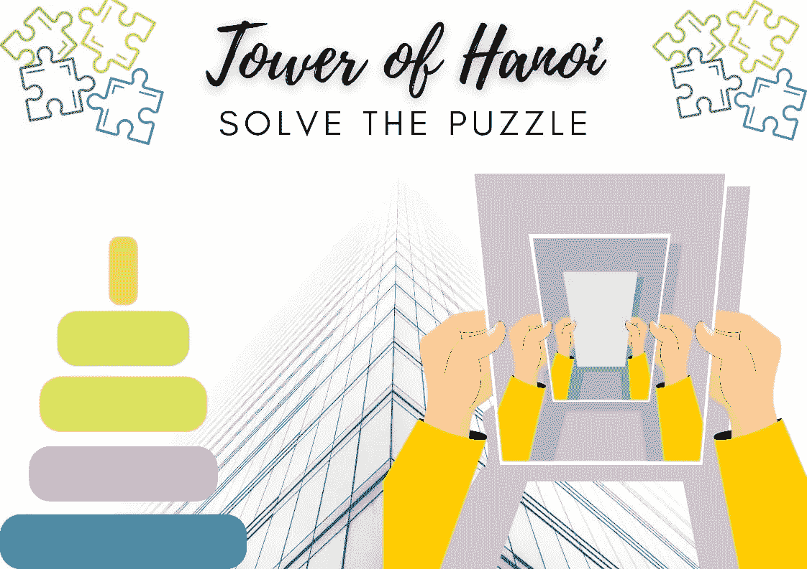

作者图片

河内塔也被称为梵天塔或卢卡斯塔。这是一个数学游戏或谜题，由三根棒和 n 个不同直径的圆盘组成。

游戏的目标是按照以下三条规则将整叠圆盘从一根棒转移到另一根棒上:

1.  一次只能移动一个磁盘。
2.  只有一个堆叠中最上面的盘可以移动到另一个堆叠或空棒的顶部。
3.  较大的磁盘不能放在较小的磁盘上面。

> 解决 n 个圆盘的汉诺塔难题所需的最少移动次数是(2^n)1。

## 用三个圆盘解出汉诺塔背后的逻辑:

**目的:**解决包含三个圆盘的汉诺塔难题。通过遵守上面已经提到的一组规则，盘的堆叠必须从杆 1 移动到杆 3。

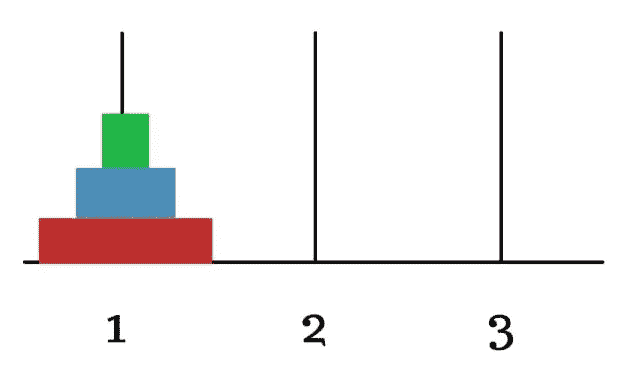

作者图片

**步骤 1 :** 最小的绿色圆盘，堆叠中最上面的圆盘从杆 1 移动到杆 3。

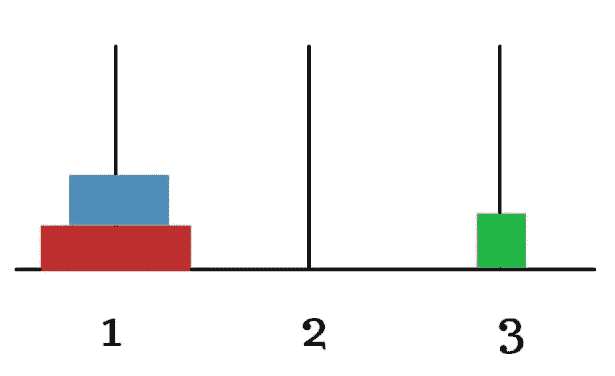

作者图片

**第二步:**接下来，杆 1 上最上面的圆盘是蓝色圆盘，它被转移到杆 2 上。

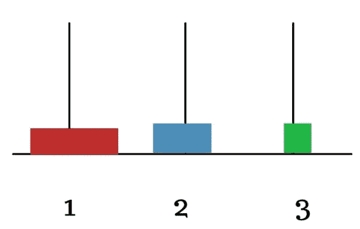

作者图片

**步骤 3 :** 将放在杆 3 上的最小圆盘移回到杆 2 的顶部。

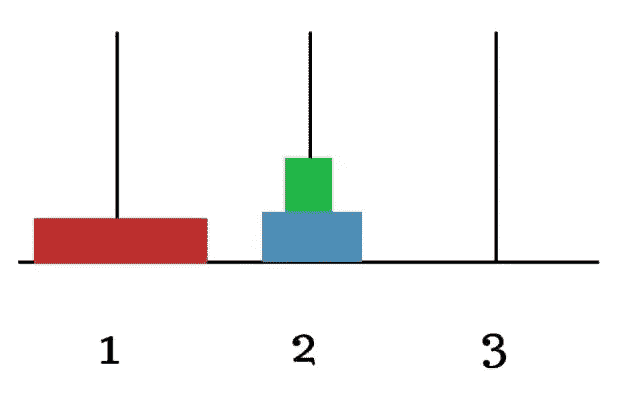

作者图片

**步骤 4 :** 现在最大的红色圆盘被允许从杆 1 移动到其目的地杆 3。

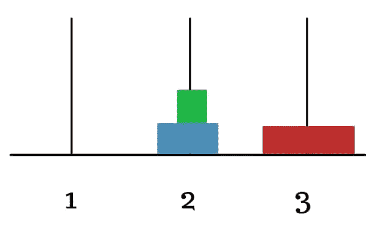

作者图片

**步骤 5 :** 现在，杆 2 上的两个圆盘必须移动到红色圆盘顶部的目标杆 3 上，因此首先将蓝色杆顶部最小的绿色圆盘移动到杆 1 上。

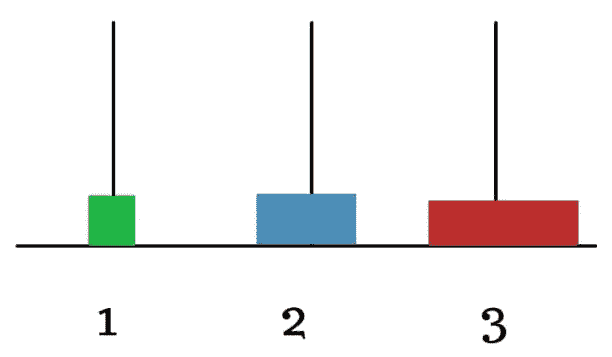

作者图片

**步骤 6 :** 接下来，蓝色圆盘被允许移动到其目的地棒 3，棒 3 将堆叠在红色圆盘的顶部。

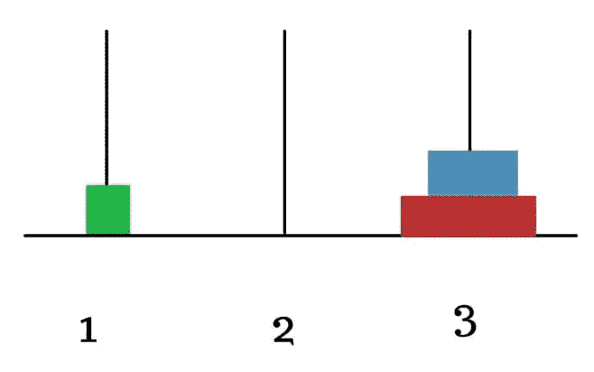

作者图片

**步骤 7 :** 最后，最小的绿色杆也被移动到杆 3，这将是堆叠中最上面的杆。

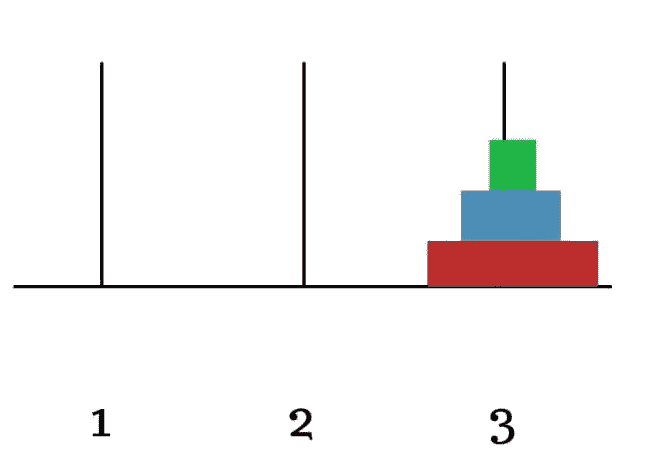

作者图片

所以汉诺塔三盘已经解决了！！

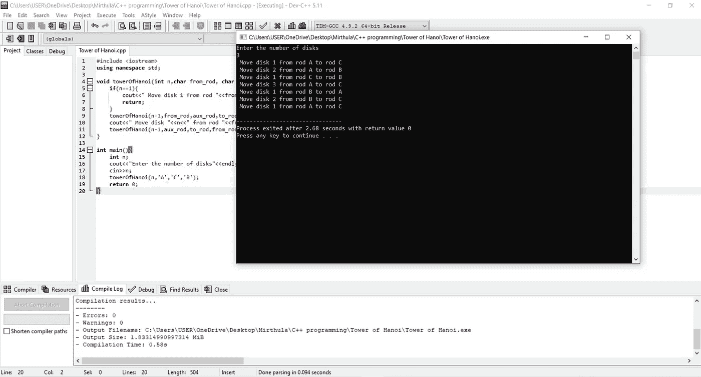

在 DEV C++中执行的三个磁盘的汉诺塔程序输出

## 让我们试着解决 n=4 个圆盘的汉诺塔难题。

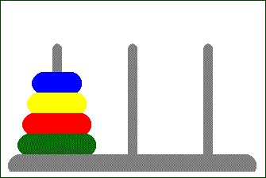

图片来源:BlogSpot

我们已经看到了如何求解 n=3 个圆盘的汉诺塔，同样的方法也适用于这里。

**策略:**

1.  递归解决将圆盘 1，2，3 从杆 A 移动到杆 b 的难题。

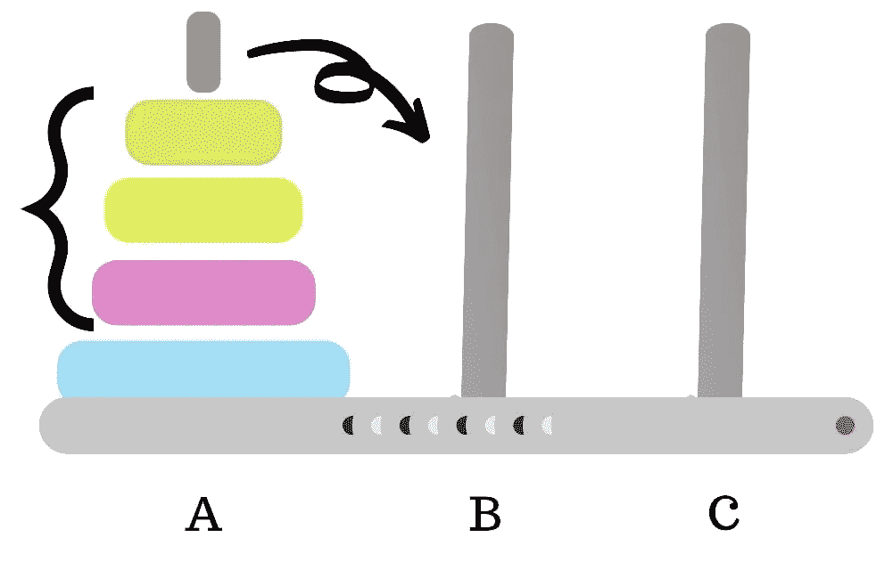

作者图片

2.然后将最大的圆盘 4 从棒 A 移动到目的棒 c

3.递归求解将圆盘 1，2，3 从 B 杆移动到 c 杆的难题。

## 用递归法求解汉诺塔规划；

函数 **hanoi(n，start，end)** 输出一系列步骤，将 n 个磁盘从起始杆移动到结束杆。

hanoi(3，1，3) = >在杆 1 中总共有 3 个磁盘，它必须从杆 1 移动到杆 3(目标杆)。

**假设:**

1≤开始≤3

1≤结束≤3

开始≠结束

## 递归是如何工作的？

设 f(n)是递归函数。

**三大法则:**

1.  展示 f(1)作品= >基础案例。
2.  假设 f(n-1)起作用。
3.  用 f(n-1)表示 f(1)的作品。

让我们以多米诺骨牌为例来理解上述规则。

想象一下，你必须击倒 n 张多米诺骨牌。

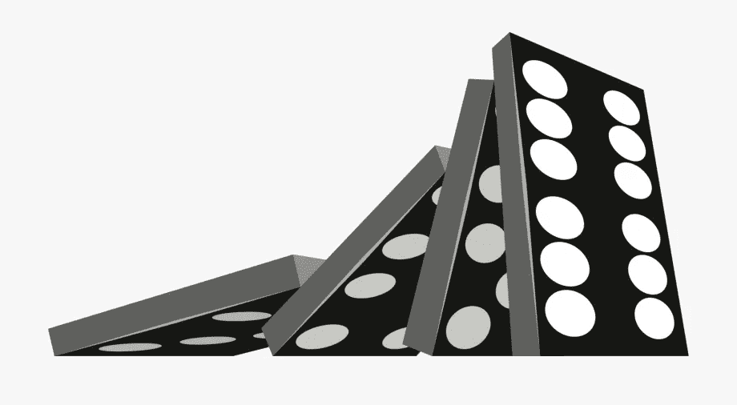

图片来源:网络剪贴画

只考虑第一张多米诺骨牌，当它被敲的时候，它会四分五裂。这是一个类比，表明 f(1)的基本情况是可行的。

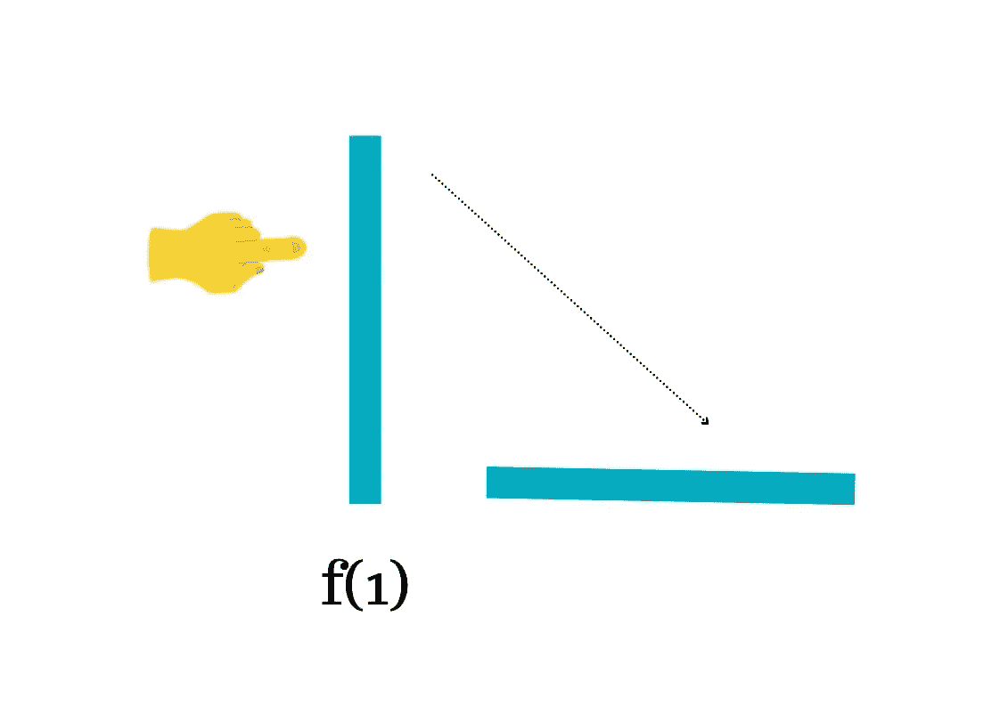

图片作者:f(1)基础案例作品

现在将 n-多米诺骨牌放在地板上，当 f(1)第一张多米诺骨牌倒下时，假定最后一张被记为 f(n-1)的多米诺骨牌被击倒。

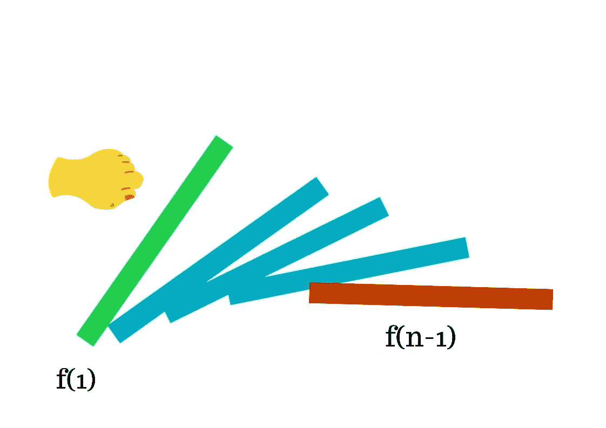

作者图片:假设 f(n-1)作品

如果我们把另一个多米诺骨牌 f(n)放在 f(n-1)后面，那么如果 f(n-1)被击倒，多米诺骨牌 f(n)就会倒下，这证明了第三个类比，即 f(n)使用 f(n-1)起作用。

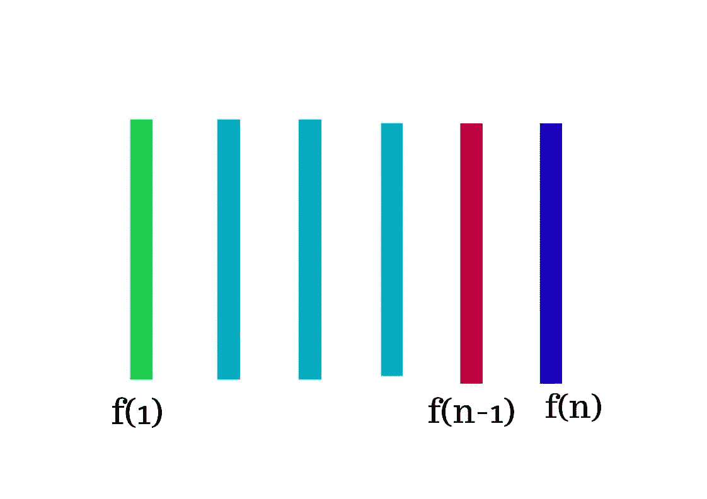

作者图片:将 f(n)放在 f(n-1)后面

正确定义 f(n)和 f(n-1)之间的关系是很重要的，这里如果 f(n)远离 f(n-1)保持安静，那么 f(n)永远不会下降(即)它永远不会起作用。

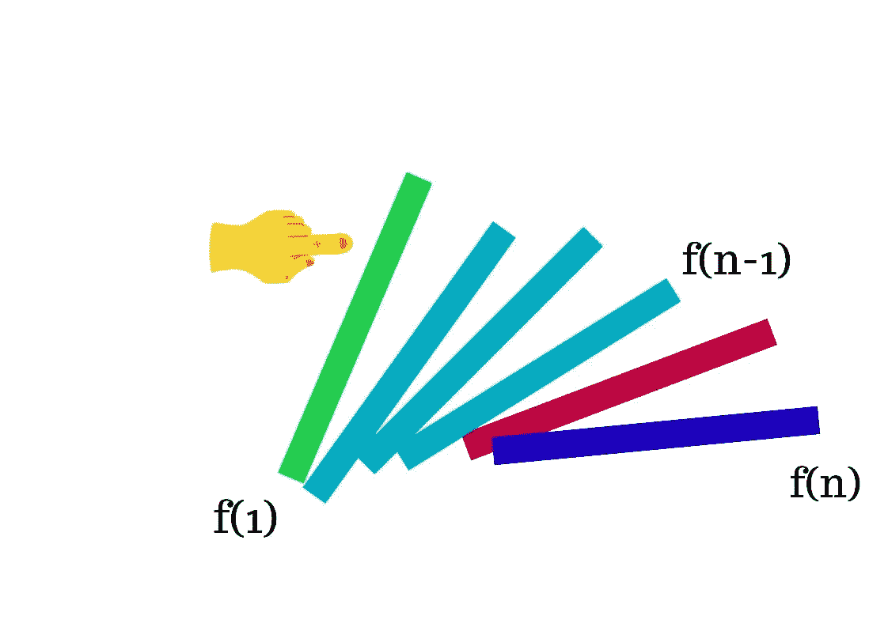

图片作者:f(n)作品使用 f(n-1)

这是一个简单的思想来展示递归是如何工作的。

## 实现汉诺塔的 C++程序

## Python 程序实现河内塔:

现在，上面的程序可以帮助你用 C++和 Python 用递归方法解决任意数量的磁盘的汉诺塔难题。

编码快乐！！