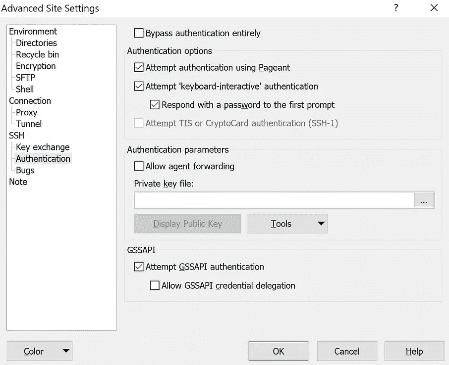

# 使用 LSTM 的毒性评论分类和使用 AWS EC2 的部署

> 原文：<https://towardsdatascience.com/toxic-comment-classification-using-lstm-and-deployment-using-aws-ec2-b84afe2b266b?source=collection_archive---------36----------------------->

## 在 AWS EC2 上将深度学习模型部署为 web 应用程序的分步指南。


保罗·席尔瓦在 [Unsplash](https://unsplash.com?utm_source=medium&utm_medium=referral) 上的照片

# 介绍

在线论坛和社交媒体平台为个人提供了提出自己的想法和自由表达对各种问题和事件的意见的手段。在某些情况下，这些在线评论包含露骨的语言，可能会伤害读者。包含露骨语言的评论可以分为无数类别，如有毒、严重有毒、淫秽、威胁、侮辱和身份仇恨。虐待和骚扰的威胁意味着许多人停止表达自己，放弃寻求不同的意见。

为了保护用户免受在线论坛或社交媒体网站上攻击性语言的影响，公司已经开始标记评论并阻止那些被发现使用不愉快语言的用户。一些机器学习模型已经被开发和部署，以过滤掉难以控制的语言，并保护互联网用户免受在线骚扰和网络欺凌。

以下文章可以被视为有毒评论分类器项目的第二部分，本文旨在阐述在 AWS EC2 上成功部署深度学习模型所需的步骤。尚未阅读有毒评论分类器项目第 1 部分的以下文章的读者可以通过以下[*链接*](/toxic-comment-classification-using-lstm-and-lstm-cnn-db945d6b7986?source=your_stories_page-------------------------------------) 阅读。

# 问题陈述

*“开发一个 web 应用程序，它可以精确计算用户输入的语句的毒性。”*

# 工作流程

有毒评论分类器项目的第一部分帮助我比较了两种不同深度学习架构的性能，LSTM 和 LSTM-CNN。它给了我一个很好的基础和必要的证据，让我得出结论，LSTM 模型是我用例的正确深度学习模型，因此，我选择将其作为后端部署到 AWS EC2 上的 web 应用程序。另外，对于 web 应用程序的前端，我决定选择 Gradio。一个非常棒的库，它提供了所有必要的工具，可以为任何机器学习或深度学习模型创建一个响应性的前端。

步骤 1:为整个项目创建一个目录结构。

在进行部署之前，我最终确定了项目的目录结构，并将有毒注释分类器项目第 1 部分中完成的全部工作划分到单独的 python 脚本中。我将提供每个 python 脚本的简要描述，并详细说明它的用途。

*   config.py-源文件夹中的第一个脚本是 config . py。该 python 脚本包含所有数据文件、保存的模型文件和 fastText 的 word 嵌入文件的相对路径。我还在这里定义了深度学习模型将评论分类到的毒性类别，以及一些重要的训练参数，如时期数、批量大小等。
*   data_cleaning.py —顾名思义，data_cleaning.py 脚本有助于数据清理和数据规范化。以下 python 脚本将数据转换为小写字符，并从数据中移除标点符号、空格、单词间空格“\n”、表情符号、非英语字符和数字。以下脚本在模型训练期间使用，并在我们的 web 应用程序中起着至关重要的作用，因为它确保干净的数据被发送到 LSTM 模型进行毒性分类。
*   data_preprocessing.py —下面的脚本文件被赋予执行两个关键任务的功能。首先，将处理后的干净数据转换成序列向量并保存为. pickle 文件。第二，使用 fastText 的单词嵌入，并为我们的深度学习模型创建嵌入层。
*   model_training.py —现在，数据已经清理完毕，可以用于训练，model.py 脚本文件用于训练我们的 LSTM 模型。此外，我们还使用这个 python 脚本来保存我们的 LSTM 模型，并在以后使用它来对我们的 web 应用程序上提交的有害评论进行分类。
*   website.py —存在于 website 文件夹中，website.py 脚本托管我们的 web 应用程序前端的代码以及 tokenizer 文件和保存的模型文件的相对路径。我还从 data_cleaning.py 脚本中导入了所有组件，以便在 web 应用程序上提交评论进行分类时帮助进行数据清理和数据规范化。

步骤 2:保存序列向量和训练好的 LSTM 模型。

在我们继续部署过程之前，我们必须保存序列向量和 LSTM 模型，因为它将有助于对托管的 web 应用程序执行有害评论分类。为了完成这个任务，我执行了 python 脚本*“model _ training . py”*，并将“data _ preprocessing . py”脚本中的 *do_load_existing_tokenizer 标志切换为***False*** 。这确保了创建保存序列向量的新文件。 ***注意:*** 一旦序列向量被创建并保存，将**do _ load _ existing _ tokenizer 标志回*到****True***。“*model _ training . py”*脚本还帮助将训练好的 LSTM 模型以. h5 格式保存在*“config . py”*脚本中定义的位置。***

*步骤 3:模型部署。*

*创建并生成了部署过程所需的所有文件后，我下载了完成部署所需的必要应用程序，在 AWS 上创建了一个帐户，最后，使用 AWS EC2 实例部署了我的应用程序。成功部署我的 LSTM 模型的每个步骤将在下面的中详细说明:*

*1 -在 Amazon Web Services 上创建一个帐户，并登录您的帐户。登录后，在 AWS 管理控制台顶部的搜索栏中搜索 EC2。选择“*EC2”*后，您将被重定向到 EC2 管理控制台，在这里您可以从“资源”选项卡中单击“*实例”*。*

**

*(图片由作者提供)*

**

*(图片由作者提供)*

*2 -单击 Instances 会将您重定向到包含所有正在运行或已停止的 EC2 实例的页面。如果你是第一次在 EC2 上部署机器学习或深度学习模型，你可以通过点击位于屏幕右上角的*“启动实例”*来创建一个新的实例。*

**

*(图片由作者提供)*

*3 -创建实例的第一步是为 EC2 实例选择所需的操作系统，在我的例子中，是 Ubuntu Server 18.04 LTS (HVM)。接下来，选择实例类型。t2.micro 在我的情况下，因为它是免费轮胎资格。最后，您可以点击位于屏幕右下角的“R *查看并启动”*，然后点击“*启动”*。*

**

*(图片由作者提供)*

**

*(图片由作者提供)*

**

*(图片由作者提供)*

*4 -现在将弹出一个窗口，让您选择是使用现有的密钥对还是创建一个新的密钥对。我将选择选项“*创建一个新的密钥对”*，给它命名，并最终下载密钥对。密钥对是在**T3 中下载的。pem** 文件格式。完成后，点击“*启动实例”*，最后点击*“查看实例”*。*

**

*(图片由作者提供)*

**

*(图片由作者提供)*

*5 -在创建实例的同时，我们下载了两个重要的应用程序 PuTTY 和 PuTTYgen。PuTTY 帮助您连接我们刚刚创建的 Ubuntu 服务器，PuTTYgen 帮助您从。我们在上一步中下载的 pem 文件。*

*6 -安装并打开 PuTTYgen，找到您的。pem 文件，并从 PuTTYgen " *里面加载"*这个。pem 文件。接下来，点击*“保存私钥”*，然后点击*“是”*。给你的私钥起个名字*“保存”*它。*

*7 -接下来，下载另一个名为 WinSCP 的应用程序。这个软件很重要，因为它允许我们连接到 EC2 实例，然后将所需的 web 应用程序文件拖放到我们的 EC2 实例中。*

*8 -安装并打开 WinSCP。在登录提示中，我们需要首先输入主机名。可以通过选择新创建的实例并复制位于屏幕下半部分打开的 **Details** 选项卡中的公共 IPv4 DNS 来检索主机名。复制主机名并将其粘贴到登录提示符中。对于用户名，输入 ubuntu，然后点击*“高级”*。从左侧出现的菜单中选择*“认证”*。在*“认证参数”*中，上传您使用 PuTTYgen 生成的私钥文件，然后按*“确定”*。最后，点击*“登录”*，然后选择*“是”*。*

****

*(图片由作者提供)*

*9 -一旦你获得了 ubuntu 服务器的访问权，你就可以拖放部署 web 应用程序所需的文件。在我的例子中，我传输了 website.py、data_cleaning.py、config.py、tokenizer.pickle、toxcicity _ classifier.h5 和 requirements.txt 文件。*

**

*(图片由作者提供)*

*10 -一旦上述操作完成，安装并打开油灰。PuTTY 帮助我们与 ubuntu 服务器通信，并允许我们安装所有必需的库，以确保我们的 web 应用程序成功运行。要连接我们的 ubuntu 服务器，我们需要输入主机名(公共 IPv4 DNS)并给下面的会话命名。完成后，导航到侧边菜单中的" *SSH"* 选项，展开它并点击 *"Auth "，* " *浏览*，然后上传您的私钥文件。使用侧面菜单导航回*“会话”*，并“*保存*”您的会话。最后，点击“*打开*”，你将能够访问你的 ubuntu 服务器的命令提示符。*

****

*(图片由作者提供)*

*11 -输入用户名为 ubuntu，现在你可以编写命令在你的 ubuntu 服务器上执行操作。在我们继续安装必需的库之前，我们需要安装 *pip。*在 PuTTY 提示符中键入下面提到的命令，并让它工作。*

```
**sudo apt-get update && sudo apt-get install python-3 pip**
```

****

*(图片由作者提供)*

*12 -还有一个关键的步骤，与您的 EC2 实例的配置相关。我们需要确保这个实例可以从任何地方访问。为此，从 EC2 管理控制台的侧面菜单导航到*“网络&安全”*，并点击*“安全组”*。接下来，点击*“创建安全组”*。给它一个名称和描述，然后点击*“Add Rule”*来添加一个新的**入站规则**。选择**类型**作为**所有流量**，选择**源**作为**任何地方**，最后点击*“创建安全组”。*现在，您可以导航回您的实例，选择我们创建的实例，右键单击并进入*“安全”*，选择选项*“更改安全组”。*搜索您刚刚创建的安全组，并点击*“添加安全组”。*不要忘记*【保存】*这些设置。*

**

*(图片由作者提供)*

*切换回 PuTTY，我现在已经安装了必要的 pip3 依赖项。现在运行下面的命令来安装所有必需的库。*

```
**pip3 install -r requirements.txt**
```

*14 -一旦安装了必需的库，在 PuTTY 中运行下面的命令，web 应用程序应该开始在 8080 端口上运行。*

```
**python3 website.py**
```

*现在获取 EC2 实例的公共 IPv4 DNS，将其复制到您的浏览器中，在公共 IPv4 DNS 的末尾添加:8080，然后点击 enter。web 应用程序现在将开始在您的浏览器上运行，这清楚地表明我们的应用程序已经成功部署在 AWS EC2 上。*

****警告:一旦您完成了对您部署的 web 应用程序的测试/试验，终止您的 EC2 实例总是最理想的。这防止了招致不必要的服务费的风险。为此，选择您的实例，右键单击它并从弹出的菜单中选择 Terminate Instance。****

# *结论*

*使用云技术部署 LSTM 模型，对我来说是 AWS EC2，帮助我完成了一个端到端的深度学习项目。在这个过程中，我遇到了 Gradio，这是一个非常棒的库，可以帮助您为深度学习应用程序创建一个最小化的前端。本质上，我获得了成功地将应用程序部署到云服务器上并确保它运行时不会遇到任何错误或故障所需的关键步骤的知识。这个过程可能看起来很耗时或者很辛苦，但在我看来，在云上部署你的机器学习或深度学习模型并看到它给出期望的输出的满足感是无与伦比的。*

*完成这个端到端项目所需的所有项目文件都可以在我的 [***Github***](https://github.com/shaunak09vb/Toxic-Comment-Classifier-AWS) 个人资料中找到。我希望你喜欢看我的博客。*