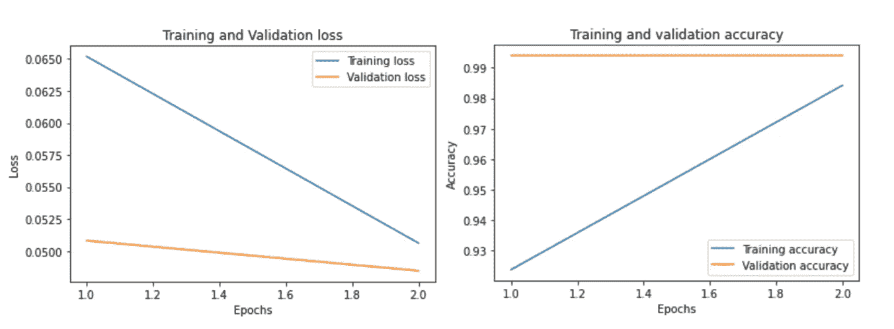
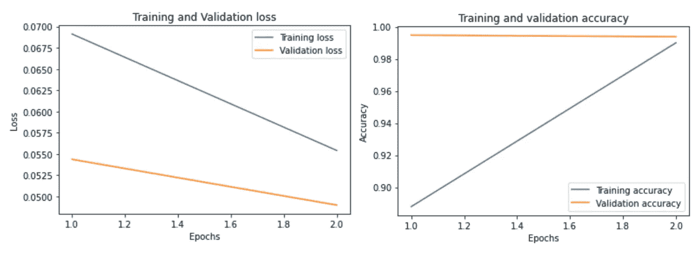
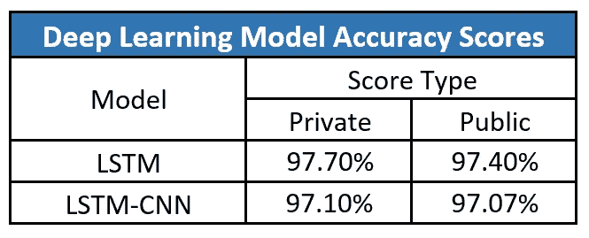

# 有毒评论分类使用 LSTM 和 LSTM。

> 原文：<https://towardsdatascience.com/toxic-comment-classification-using-lstm-and-lstm-cnn-db945d6b7986?source=collection_archive---------7----------------------->

## **我第一次尝试用深度学习解决自然语言处理用例。**

照片由[丹缘](https://unsplash.com/@dedge?utm_source=medium&utm_medium=referral)在 [Unsplash](https://unsplash.com?utm_source=medium&utm_medium=referral) 拍摄

# **简介**

在线论坛和社交媒体平台为个人提供了提出自己的想法和自由表达对各种问题和事件的意见的手段。在某些情况下，这些在线评论包含露骨的语言，可能会伤害读者。包含露骨语言的评论可以分为无数类别，如有毒、严重有毒、淫秽、威胁、侮辱和身份仇恨。虐待和骚扰的威胁意味着许多人停止表达自己，放弃寻求不同的意见。

为了保护用户免受在线论坛或社交媒体网站上攻击性语言的影响，公司已经开始标记评论并阻止那些被发现使用不愉快语言的用户。一些机器学习模型已经被开发和部署，以过滤掉难以控制的语言，并保护互联网用户免受在线骚扰和网络欺凌。

# **问题陈述**

*“到* *建立一个多头模型，能够检测不同类型的毒性，如威胁、淫秽、侮辱和基于身份的仇恨。”*

我之前曾经做过一个 NLP 用例(*[*假新闻分类器，用来处理新冠肺炎的 dis-information*](/fake-news-classifier-to-tackle-covid-19-disinformation-7a31e4296b83)*”*)，我在这个项目中的目标是专注于数据预处理和特征工程，并确保我的深度学习模型将使用的数据尽可能干净。另外，我决定使用 ***fastText 的*** 预训练单词嵌入来驾驭迁移学习的力量。*

# *工作流程*

*有毒评论分类器是一个由 Jigsaw/Conversation AI 组织的比赛，由 Kaggle 主办。用于建立分类模型的数据集是从比赛现场获得的，它包括训练集和测试集。以下工作流程中阐述的步骤将描述从数据预处理到模型测试的整个过程。*

## *数据探索、数据预处理和特征工程*

*步骤 1:检查缺失值。*

*首先，在将训练和测试数据导入 pandas 数据框架后，我决定检查下载数据中是否有缺失值。对训练和测试数据使用“isnull”函数，我发现没有丢失记录，因此，我继续进行项目的下一步。*

*第二步:文本规范化。*

*因为我现在确信我的数据中没有缺失的记录，所以我决定从数据预处理开始。首先，我决定规范化文本数据，因为来自在线论坛的评论通常包含不一致的语言，使用特殊字符代替字母(例如@rgument)，以及使用数字表示字母(例如 n0t)。为了解决数据中的这种不一致，我决定使用 ***Regex。*** 我执行的文本规范化步骤如下*

*   *删除文本之间的字符。*
*   *删除重复的字符。*
*   *将数据转换成小写。*
*   *删除标点符号。*
*   *删除单词之间不必要的空格。*
*   *正在删除“\n”。*
*   *删除非英语字符。*

*为了完成上面列出的步骤，我参考了以下 jupyter 笔记本[1] [2]。首先，我创建了一个字典，其中包含了在线论坛或社交媒体平台上常见的脏话。其次，我决定创建一个函数来执行上面列出的所有步骤，并给出干净的数据作为输出。这些步骤是在训练和测试数据上执行的。*

*第三步:词汇化。*

*既然数据现在是干净且一致的，那么是时候执行 ***术语化*** 了。词汇化是将一个词的不同屈折形式组合在一起的过程，这样它们就可以作为一个项目进行分析。例如，我们不希望机器学习算法将学习、研究和研究视为三个独立的词，因为事实上，它们不是。词汇化有助于将单词“学习”和“研究”简化为其词根形式，即学习。为了实现词汇化，我从“nltk”库中导入了“WordNetLemmatizer ”,创建了一个函数“lemma”来执行词汇化，并将其应用于我在步骤 2 中获得的干净数据。*

*步骤 4:停用字词的移除。*

*众所周知，对于涉及文本分类的用例，停用词去除是文本预处理中最关键的步骤之一。删除停用词可以确保更多的注意力放在那些定义文本含义的词上。*

*为了从我的数据中删除停用词，我借助了“spacy”库。Spacy 有一个常用停用词列表，即“停用词”，可以用来从任何文本数据中删除停用词。*

*二。虽然 spacy 的库提供的列表非常广泛，但我决定搜索可能对我的数据集唯一的附加停用词。*

*三。首先，我决定将单字母和双字母单词添加到停用词列表中。在阅读我的数据集中的随机评论时，我遇到了单个字母或两个字母的单词在没有任何上下文的情况下存在的例子，(例如:*哇，这么可爱的枕头 w！！*或者*他真是个快乐的家伙 bb。*)为了确保这种单字母或双字母单词的实例不会影响我的深度学习模型的性能，我将它们添加到了停用词列表中。尽管如此，我还是确保了像 *me* 、 *am* 、 *a* s 这样的单词，或者像 *I* 和 *a* 这样的字母不会被添加到停用词列表中。*

*四。一旦完成上述任务，我决定在我的数据集中搜索可能是停用词的单词，( ***标准是它们在数据集中出现得非常频繁，其次，它们对分类任务*** )没有显著贡献。为了完成这一步，我编写了下面给出的代码片段，它帮助我在数据集中找到停用词，这满足了上面强调的标准。最后，我将这些新获得的停用词添加到 spacy 的“停用词”列表中，从而创建了我的最终停用词列表。*

*动词 （verb 的缩写）现在我有了我想要的停用词列表，我使用它从我的训练数据和测试数据中删除停用词。一旦这一步完成，我就有了一个没有任何不一致的干净的数据集。*

*步骤 5:标记化、索引和索引表示。*

*众所周知，机器学习和深度学习模型对数值数据起作用，与用例无关。因此，要使用干净的文本数据训练深度学习模型，必须将数据转换为其等效的机器可读形式。实现这样的壮举。我们需要执行以下步骤[3]:*

1.  *标记化——我们需要将句子分解成独特的单词。如“我爱猫爱狗”会变成[“我”、“爱”、“猫”、“和”、“狗”]。*
2.  *索引—我们将单词放在一个类似字典的结构中，并给每个单词一个索引，例如{1:“我”，2:“爱”，3:“猫”，4:“和”，5:“狗”}。*
3.  *索引表示——我们可以用索引的形式表示评论中的单词序列，并将这个索引链输入到我们的深度学习模型中。例如[1，2，3，4，2，5]。*

*使用“Keras”库中的“Tokenizer”类，可以很容易地执行上述步骤。该类允许对文本语料库进行矢量化，通过将每个文本转换为整数序列(每个整数是字典中某个标记的索引)或向量，其中每个标记的系数可以是二进制的，基于字数，基于 tf-idf 等[4]。下面的代码片段演示了文本数据到序列向量的转换。*

*第六步:填充。*

*在线论坛或社交媒体平台上的评论长短不一，一些是一个词的回复，而另一些则是大量阐述的想法。可变长度的句子被转换成可变长度的序列向量，我们不能将长度不一致的向量传递给我们的深度学习模型。为了避免这个问题，我们使用填充。在填充的帮助下，我们可以通过用零填充不足部分来使较短的句子与其他句子一样长，另一方面，我们可以将较长的句子修剪为与较短的句子一样长[3]。我使用了“Keras”库中的“pad_sequences”函数，我将句子长度固定为 *200 个*单词，并应用了****post****padding*(****即对于较短的句子，0 将被添加到序列向量*** *的末尾)。*一旦我们完成了序列向量的填充，我们就可以开始创建深度学习模型了。***

## **模型创建和模型评估**

**步骤 1:将训练数据分为训练集和验证集。**

**由于我们已经完成了项目的数据预处理和特征工程部分，我们继续进行项目的模型创建和模型评估部分。在尝试对训练数据拟合深度学习模型之前，我将数据随机分为训练集和验证集。验证集占训练数据的 20%。**

**步骤 2:导入 fastText 的预训练单词嵌入。**

**如前所述，在 ***问题陈述****中，我想使用来自 ***fastTex* t** 的预训练单词嵌入来驾驭**迁移学习**的力量。为此，我将 fastText 单词嵌入加载到我自己的环境中，然后，通过为词汇表分配预先训练的单词嵌入来创建一个嵌入矩阵。***

**第三步:模型创建(LSTM)。**

**现在是时候选择深度学习模型，并使用训练集和验证集来训练该模型。因为我们正在研究自然语言处理用例，所以使用长短期记忆模型(LSTM)是理想的。LSTM 网络类似于 rnn，一个主要区别是隐藏层更新由存储单元代替。这使得他们能够更好地发现和揭示数据中的长期依赖性，这对于句子结构来说是必不可少的[5]。**

**首先，我导入了" [Talos](https://github.com/autonomio/talos) *"* 库，因为它将帮助我们执行超参数调整以及模型评估。使用“扫描”功能，我执行了一个 GridSearchCV，并找到了能给我最高精度的最佳参数。**

**二。接下来，使用最佳超参数，我定义了 LSTM 模型所需的层数，编译了模型，最后使用训练集和验证集训练了模型。**

**第四步:模型创建(LSTM-CNN)。**

**在我项目的研究阶段，我遇到了使用混合模型( ***，即 LSTM 和 CNN 一起工作的模型*** )实现有毒评论分类的论文。对于深度学习模型来说，这样的架构引起了我的兴趣。LSTM 可以有效地保存长文本序列中历史信息的特征，而 CNN 可以提取文本的局部特征[6]。结合这两种传统的神经网络架构将有助于我们利用它们的综合能力。因此，我决定实现一个 LSTM-CNN 混合模型作为我项目的一部分。目标是比较两种深度学习架构的性能，并确定我的项目的最佳深度学习模型。**

**类似于步骤 3 中的过程，我使用“Talos”*发现了我的**混合**模型的最佳超参数。*操作完成后，我评估了结果，挑选出了精确度最高的超参数。最后，我使用训练集和验证集来训练我的混合模型。**

**步骤 5:在训练阶段评估模型精度和模型损失。**

**由于我们已经完成了两个深度学习模型的训练，我们现在应该在整个训练过程中可视化它们的准确性和损失值。理想情况下，任何深度学习模型的损失值都应该随着时期数的增加而减少，另一方面，准确性应该随着时期数的增加而增加。这让我们对我们的深度学习模型的质量有了一个相当不错的想法，以及它是否经过了适当的训练。在下面的图像中可以看到每个历元的精度和损失值的趋势。**

****

**LSTM 模型在 2 个时期内的损失和精度值。(图片由作者提供)**

****

**LSTM-CNN 模型在 2 个时期内的损失和精度值。(图片由作者提供)**

**步骤 6:使用测试集计算模型准确性**

**基于准确性和损失值评估模型给了我有希望的结果。这让我有信心使用测试集评估我的深度学习模型的性能。正如本博客前面提到的，测试集是从 *Kaggle* 获得的，它通过了与训练数据相同的数据预处理和特征工程步骤。因为我现在已经有了经过处理的测试数据，所以我使用了“predict”函数来为测试数据中的输入生成输出。**

**我的两个深度学习模型的上述过程一完成，我就上传了各自的”。csv”输出文件到 Kaggle 竞赛，并提交它们以生成最终的准确度分数。我的两个深度学习模型的最大准确度分数可以在下图中看到。**

****

**传统 LSTM 模型和混合 LSTM-CNN 模型的精确度分数的比较。(图片由作者提供)**

# **结论**

**在评估了我的项目在培训阶段获得的结果以及我从竞赛网站上获得的结果之后，我可以宣称**传统的 LSTM 模式**比**混合的 LSTM-CNN 模式**在**表现得更好。**混合模型略微输给了传统的深度学习模型，后者表明传统的 LSTM 模型是有毒评论分类用例的正确选择。**

**下一步是将 LSTM 模型作为后端部署到一个 web 应用程序，该应用程序确定用户作为输入提供的评论的毒性。在 AWS EC2 上部署 LSTM 模型所需的所有步骤的详细介绍可以在本博客的第二部分中找到。一定要看看那个。**

# ****项目的主要收获****

**这个项目让我能够使用两种不同的深度学习模型，此外，我还能够在自然语言处理用例上实现它们。项目中的各种数据预处理和特征工程步骤使我认识到可以用来清理文本数据的有效方法。我了解各种深度学习模型的工作方式，如 CNN、LSTM 和 LSTM-CNN 混合模型。我了解了单词嵌入的概念以及使用预训练单词嵌入的优点。最后，“Talos”库的发现帮助我为我的深度学习模型执行无缝的超参数调整，并帮助我实现最佳结果。**

# **参考**

**[1]-[https://www.kaggle.com/fizzbuzz/toxic-data-preprocessing](https://www.kaggle.com/fizzbuzz/toxic-data-preprocessing)
【2】-[https://github . com/Susan Li 2016/NLP-with-Python/blob/master/Toxic % 20 comments % 20 lstm % 20g love . ipynb](https://github.com/susanli2016/NLP-with-Python/blob/master/Toxic%20Comments%20LSTM%20GloVe.ipynb)
【3】-[https://www . ka ggle . com/sbongo/for-初学者-攻坚-用毒-keras](https://www.kaggle.com/sbongo/for-beginners-tackling-toxic-using-keras)
【4】-[https://keras.io/api/preprocessing/text/](https://keras.io/api/preprocessing/text/)
【5】
【6】——张，李，田，，李，“用于文本分类的 CNN 混合模型”，2018 IEEE 第三届高级信息技术、电子与自动化控制会议(IAEAC)，重庆，2018，第 1675–1680 页，doi: 10.1109/IAEAC.2018.8577620**

***我为这个项目遵循的工作流程可以在我的*[***Github***](https://github.com/shaunak09vb/Toxic-Comment-Classifier-using-Deep-Learning)*页面找到。我希望你喜欢看我的博客。***