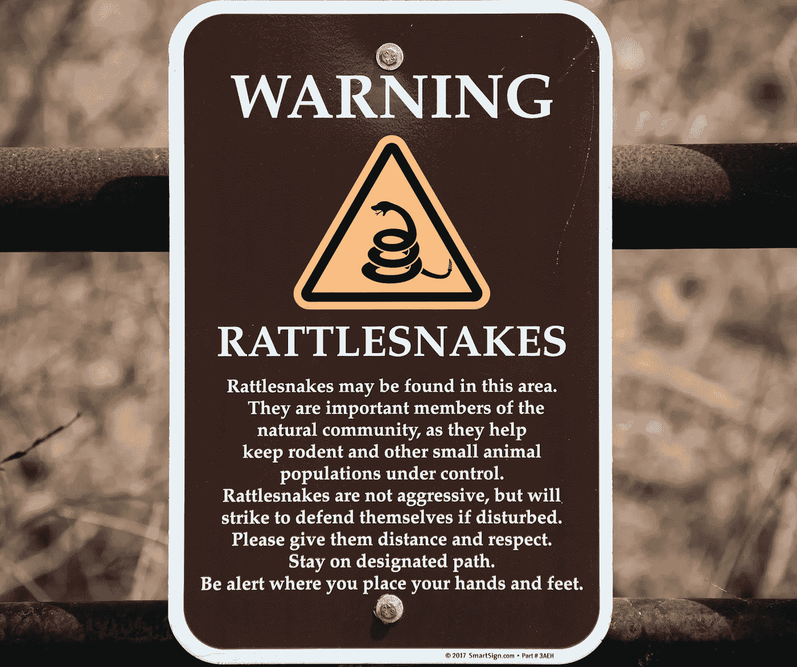
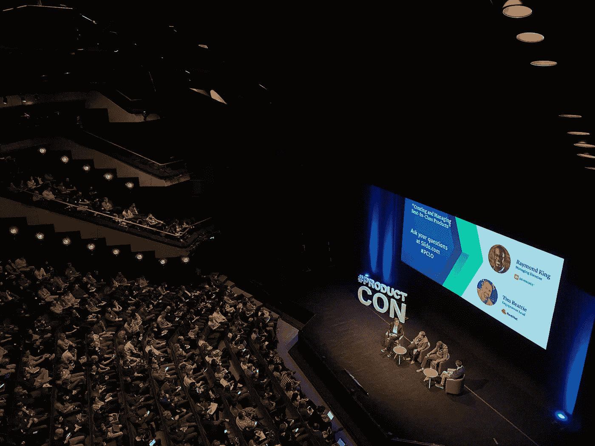
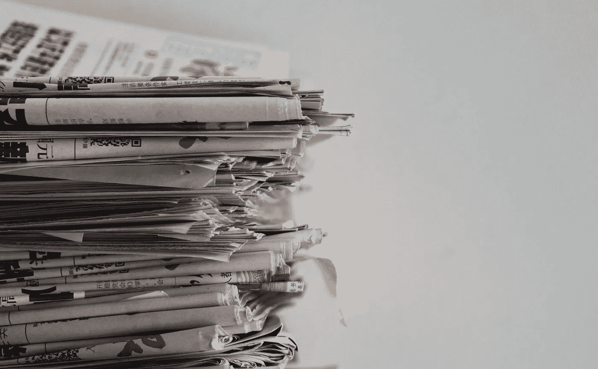
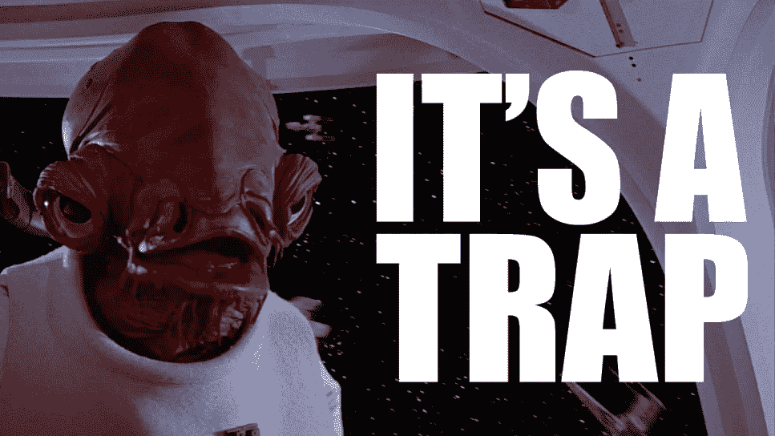
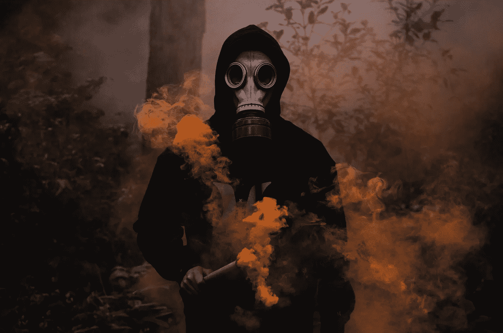
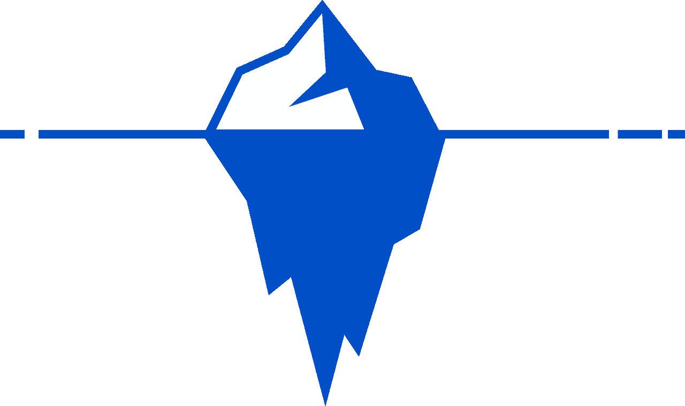
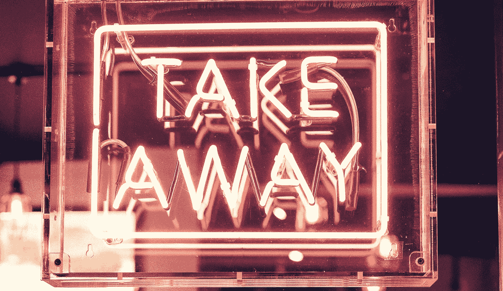

# 计算机科学中有害的同行评议以及如何应对……

> 原文：<https://towardsdatascience.com/toxic-peer-review-in-computer-science-and-what-to-do-about-it-562ed5608310?source=collection_archive---------19----------------------->

所有科学家都会在某个时候收到同行评议中的有毒评论。我们该如何处理这种情况？在 [Unsplash](https://unsplash.com/s/photos/danger?utm_source=unsplash&utm_medium=referral&utm_content=creditCopyText) 上由 [Mikael Seegen](https://unsplash.com/@mikael_seegen?utm_source=unsplash&utm_medium=referral&utm_content=creditCopyText) 拍照

## 同行评议及其最重大的失误

科学同行评审影响着所有计算机科学研究人员和学者的日常生活。通常情况下，这个过程会导致严重的问题和错误的决策，这是我们不愿承认的。

> 同行评审示例
> 
> 审核者 1:合格纸张— **接受**
> 审核者 2:纸张合格— **弱接受**
> 审核者 3:纸张不太好，修改后可能有用— **弱拒绝**
> 
> Meta Reviewer:
> 这篇论文莫名其妙的坏掉了——**拒绝**！

所有的科学家最终都会面临这种情况。他们每次都受伤。那么，这个系统坏了吗？我们为什么要玩这个游戏？！是时候看看同行评审的所有有趣的细节、它的弱点和一些真正有害的例子了！(警告:前方重磅触发！)

同行评审旨在向作者提供严谨的反馈。有时反馈可能非常直接。照片由[蒂姆·莫斯霍尔德](https://unsplash.com/@timmossholder?utm_source=unsplash&utm_medium=referral&utm_content=creditCopyText)在 [Unsplash](https://unsplash.com/s/photos/warning?utm_source=unsplash&utm_medium=referral&utm_content=creditCopyText) 上拍摄

在这篇文章中，我想解释计算机科学中的科学同行评审系统及其缺陷。此外，我认为这是一个很好的机会来揭露这个系统是如何不断受到攻击，并报告我自己在这个系统中经历的一些科学不端行为。

难道我们不能找到比有毒评论更好的解决方案吗？照片由[艾米丽·莫特](https://unsplash.com/@emilymorter?utm_source=unsplash&utm_medium=referral&utm_content=creditCopyText)在 [Unsplash](https://unsplash.com/s/photos/why?utm_source=unsplash&utm_medium=referral&utm_content=creditCopyText) 上拍摄

# 为什么我们需要同行评审？

同行评审是一种发展了多年的机制，其目的是确保出版物的质量。所有的科学家都容易犯错误。让某人独立检查你的工作以防止你发表错误的研究，这是对你最有利的。想象一下你工作中的一个严重错误会产生怎样的反效果！一旦出版，每个人都会看到！所以有人会说，这是科学家的安全带。

由于这些原因，许多科学家只把同行评议的工作视为基于科学的观察。因此，同行评议是科学许多部分的一部分。我在这里特别考虑了三种不同的同行评审:

*   会议上的同行评审
*   期刊中的同行评议
*   论文工作的审查，例如博士论文

会议是科学交流的重要手段。[产品学院](https://unsplash.com/@productschool?utm_source=unsplash&utm_medium=referral&utm_content=creditCopyText)在 [Unsplash](https://unsplash.com/s/photos/conference?utm_source=unsplash&utm_medium=referral&utm_content=creditCopyText) 上的照片

# 典型的会议同行评审是如何工作的？

同行评议最常见的形式是科学会议。这通常也是科学家职业生涯中第一次经历评审。根据领域的不同，会议可能从肤浅的反馈到复杂的竞争过程。在所有情况下，审查都是在固定期限的时间压力下进行的。由于所有的科学家都是大忙人，这种限制并非没有影响。在某些情况下，多达 30%的评论是在截止日期后**提交的——通常是由所谓的紧急评论者在 24 小时内提交的。显然，这种审查比可能需要数周才能完成的全面审查更容易出错。因此，同行评审通常被认为是一种随机决策。**

通常作者不知道该评论。这个过程叫做致盲。照片由 [Ryoji Iwata](https://unsplash.com/@ryoji__iwata?utm_source=unsplash&utm_medium=referral&utm_content=creditCopyText) 在 [Unsplash](https://unsplash.com/s/photos/blind?utm_source=unsplash&utm_medium=referral&utm_content=creditCopyText) 上拍摄

# 会议评论的类型

为了确保清晰和批判性的评论，大多数会议都采用盲法审查程序。在所谓的**单盲审查**中，审查者的身份被隐藏，这样负面反馈不会导致报复行为。尽管如此，一些作者试图通过使用的语言和术语来重新识别他们的审稿人。我只能建议不要这样做，因为这只会导致毫无根据的指控。

一些——通常是声誉很高的会议——试图进一步减少由于个人不喜欢而产生的潜在偏见。在这些情况下，会使用**双盲评审**。在这里，作者从论文中删除了他们的名字和所有可以识别他们的信息。因此，评论者也不知道他们实际上是在评价谁的作品，也不能偏爱某些个人喜欢的群体而不是其他作者。

同行评议并不总是公平的。由 [Edge2Edge 媒体](https://unsplash.com/@edge2edgemedia?utm_source=unsplash&utm_medium=referral&utm_content=creditCopyText)在 [Unsplash](https://unsplash.com/s/photos/random?utm_source=unsplash&utm_medium=referral&utm_content=creditCopyText) 上拍摄

# 同行评审是一个随机的过程

审核者的决定存在一定程度的随机性。他们可能会被论文中的某些措辞所影响，或者对论文的大意提出质疑。所以单个审稿人被认为不靠谱。大多数会议选择两到四个评审者，并考虑他们对正在考虑的工作的多数投票。

在顶级会议中，即使这样也不被认为是值得信任的。这里，所谓的**元评审者**被引入到流程中。meta 的任务是仲裁评审者在第一轮评审中没有达成共识的情况。在这些情况下，元可以引导讨论，并帮助审稿人找到对论文的适当评价。不幸的是，就像本文开头的例子一样，一些 metas 认为自己是某种不会犯错的神，给予世界其他地方智慧。因此，通常所有的元决策都要受到更高层的控制，比如技术项目主席。然而，这种选择也有引入另一个随机因素的风险，例如，如果六个技术项目主席必须手动检查超过 1500 个书面决策。

为了进一步减少随机性，一些科学家建议使用更多的评审员——比如 30 到 50 人。在这些情况下，显然不可能进行全面的审查，但反馈只会是“赞成”或“反对”。显然，这将产生更好的决策[，正如我们从助推理论](https://medium.com/codex/can-the-wisdom-of-the-crowd-also-improve-machine-learning-14b19596db9d)中所知。然而，这从未在真正的会议上实施过，因为大量的决定很可能会导致这样的问题，即审查者将仅根据标题或摘要来判断论文，而不会阅读完整的提交内容。

尤其是会议评论很难平衡。[廷杰伤害律师事务所](https://unsplash.com/@tingeyinjurylawfirm?utm_source=unsplash&utm_medium=referral&utm_content=creditCopyText)在 [Unsplash](https://unsplash.com/s/photos/scales?utm_source=unsplash&utm_medium=referral&utm_content=creditCopyText) 上的照片

# 会议评论的利与弊

一般来说，会议只采用一步或两步流程。因此，没有机会与评审人员进行深入讨论。即使是最复杂的会议审查程序也会遇到这个问题。

因此，你不应该因为负面或苛刻的评论而失去动力。很多工作是由志愿者在时间压力下完成的。此外，审查人员容易出错。试着理解他们批评的原因，并用它来改进你的工作。

一些会议以高退稿率为目标，作为只发表“最好”论文的衡量标准。由于风险很高，审查往往会变得非常苛刻。此外，对顶级会议论文的期望也非常高。尽管同行评议——尤其是在会议上——是一个随机的过程，但更好的论文更有可能通过同行评议。

尽管如此，由于上面提到的随机因素，不合格不一定是工作质量差的标志。有许多好论文在第一次提交时被会议拒绝的例子(例如， [nnU-Net](https://www.nature.com/articles/s41592-020-01008-z) 、[深度行动学习](https://www.nature.com/articles/s41598-021-82370-6)、[超级基准](https://ieeexplore.ieee.org/abstract/document/8716546?casa_token=5mGuUb7A2oQAAAAA:e9IqOGdN3Hxx3aG10ASVbisa6tBvuyArVo0dYzOf5vS_tzpVn1iy9ahN_-WIf0qMK192EouH)等等)。

科学期刊的评审周期比会议长得多。照片由 [Wherda Arsianto](https://unsplash.com/@wherda?utm_source=unsplash&utm_medium=referral&utm_content=creditCopyText) 在 [Unsplash](https://unsplash.com/s/photos/newspaper?utm_source=unsplash&utm_medium=referral&utm_content=creditCopyText) 上拍摄

# 为什么我们仍然用科学期刊发表文章？

期刊出版物的一个显著缺点是同行评审通常需要更长的时间。一轮审查可能需要三到六个月的时间。尽管如此，向期刊投稿还是有很高的价值，因为同行评议过程更加精细，更加注重深入的论证。在很多期刊上，作者和审稿人之间的讨论要来回几次。因此，审稿人关注提交作品的细节。他们知道他们的评估将被提交给作者，他们有机会相应地调整他们的工作和论证。如果他们的论点不够详细，他们的批评将很容易反驳。因此，像“不够好”或“不够新颖”这样的论点没有被使用。取而代之的是，需要提供一个已经解决了这个问题并且没有被作者涵盖的先前工作的列表。

因为作者知道他们必须与评论者争论，一些作者倾向于讨论评论者的所有观察。然而，这不是同行评审的目的。每一轮都应该**提高**论文。因此，作者不应该陷入常见的错误，如将评论视为个人或认为评论者是愚蠢的。审稿人是你论文的代表性读者。其他看报纸的人也会有类似的想法。

因此，**如果你**必须**向你的评审员提供额外的解释**，你也要**将它们添加到论文中**。讨论区是这样做的合适地方，因为其他读者也会有类似的问题。如果你的论文像病毒一样传播，并被公众广泛误解，这样的部分也可以成为一个安全带。在这种情况下，你可以指向讨论部分，它应该已经反击可预见的批评和误解。还有，你要确保你的论证是正确的。任何错误都会被审稿人发现，你的论文可能会被拒绝。

期刊拒绝意味着你不能再次提交论文，除非你完全重做论文。(如果你的论文被拒绝了，你可能还是想这么做。)

我推荐去高排名的期刊和场馆试试你的机会。桌面拒绝最多需要两个星期，它会让你觉得你至少努力过。像《自然》这样的出版商甚至有提交前调查的工具，在一两周内只对摘要进行评估。

在精细化同行评议的时代，我们还需要博士论文吗？琼·夸姆博卡在 [Unsplash](https://unsplash.com/s/photos/graduation-hat?utm_source=unsplash&utm_medium=referral&utm_content=creditCopyText) 上的照片

# 我们还应该写博士论文吗？

我想在本文中包括的第三种评论是论文工作的评论，如博士论文。一些导师要求通过同行评审的出版物来顺利完成博士学位。许多大学甚至允许累积作品，即提交一组同行评审的文章，而不是论文。尽管如此，这一程序仍有不少问题。

由于论文与正式学位相关，累积作品必须提供证据证明提交的作品确实主要基于提交人的贡献。因此，作者经常被要求要求他们的合作者签署同意使用一篇论文作为论文的一部分。在大多数情况下，不存在滥用，这些表格有助于发现试图使用相同的论文为*两个* *不同的* *人*毕业的情况。

然而，问题可能会出现，一些实际上没有自己写作品的人可能会试图利用一长串的合著贡献来获得学位。因此，一些大学仍然要求正式论文的写作。支持和反对这一点的理由很多。有些人认为这是浪费资源。对其他人来说，这是展示真正学术能力的唯一途径。

在任何情况下，最终的论文都将接受独立评审员的评估。显然，他们会尽最大努力评估工作。根据我的经验，它有助于表明这项工作已经产生了高排名的同行评审工作，这可以通过地点的影响或引用因素或工作本身的引用数量来证明。因此，在博士项目期间追求同行评议的出版物是非常可取的。

在某些情况下，作者甚至没有意识到可疑的行为。图片由[KnowYourMeme.com](https://knowyourmeme.com/memes/its-a-trap)

# 同行评审中的陷阱

出于上述原因，在同行评审的场所发表文章的压力可能会很大。因此，经历过以前的拒绝的作者可能会寻找排名较低的地点，以便让他们的作品迅速被接受。虽然这种选择看起来是一种快速的解决方法，但这条路也可能会带来麻烦。

掠夺性期刊通过全面的同行评审为快速出版做广告。通常这甚至是通过参考作者以前的出版物来完成的。不幸的是，他们只是简单地发表任何未经同行审查的贡献，并收取出版费或会议费。在这样的期刊上接受一篇论文可能会对作者的名誉造成严重损害，即使提交论文的作者不知道该期刊的性质，或者如果在他或她不知情的情况下，一位合著者被添加到作者名单中。[这种期刊的公开列表](https://predatoryjournals.com/journals/)有助于避免这种虚假的同行评议。

适用于期刊的方法显然也可以应用于会议。[掠夺性会议](https://www.technologynetworks.com/tn/articles/inside-a-fake-conference-a-journey-into-predatory-science-321619)也很难被发现。它们通常位于受欢迎的旅游地点，因此提交和旅行变得更加有吸引力。识别这种会议的一种方法是寻找在同一日期和地点发生的类似事件。您可能会找到几个“关于[在此插入主题]”的世界会议，这些会议同时举行，甚至共用同一个主题发言人。为了避免此类骗局事件，您可能需要咨询您的同事或会议排名，如[guide2research.com](https://www.guide2research.com/)。

最近，视频期刊也出现了。虽然同行评审过程似乎很严格，但《华尔街日报》出版和制作这段视频可能相当昂贵。因此，**作者最好在提交**到任何地点之前研究出版的潜在成本。

有害行为可能会带来短期成功。从长远来看，它只是降低了科学的质量。照片由[达尼洛·阿尔维斯](https://unsplash.com/@daniloalvesd?utm_source=unsplash&utm_medium=referral&utm_content=creditCopyText)在 [Unsplash](https://unsplash.com/s/photos/toxic?utm_source=unsplash&utm_medium=referral&utm_content=creditCopyText) 上拍摄

# 同行评审中的有害行为

在同行评审中，简单的不当行为通常非常罕见。有毒行为更为常见。这里报道的例子从令人不快但常见的到极端的情况。请注意，我花了整个职业生涯来收集这些例子。科学造假极其罕见。然而，人们不能否认它的存在。

一个很常见的**毒害行为就是对其他作品过度负面**。即使在匿名的同行评议中，你也不会看到自己机构的作品。由于许多会议对接受分数设置了硬门槛，你创建的任何负面评论都会增加你自己小组的论文被接受的概率。此外，你可能会发现与你自己的作品相似的作品，你可能会故意推迟它的出版。因此，一些审稿人的常见策略是找到简单的理由拒绝论文。像“不新颖”、“不够清楚”这样的陈述，以及其他仅仅是粗略的理由，通常会出现在这样的拒绝中。因此，你要确保你了解所有相关的文献，并将其与你自己的作品进行比较——在最好的情况下——以反驳缺乏新颖性的说法。尽可能突出你的方法或研究的优点，这样就可以避免缺乏清晰度的说法。如果你从事机器学习，你会希望避免机器学习的[七宗罪](/the-seven-sins-of-machine-learning-54dbf63fd71d)，因为它们很容易被快速拒绝。

另外**一些评论者试图增加他们自己的引用统计数据**。你会发现这样的评论给出了一个混合的评论，并要求引用几篇都是由同一组作者写的论文。虽然使用这种行为来增加自己的引用次数已经是有问题的，但这一程序有问题的另一个原因是:审稿人的身份很容易猜测，因此可能会妨碍同行评议过程的匿名性。因此，进行这样的审查是不可取的。

随着过去几年投稿数量的增加，同行评审的数量也在增加。所以，**有些时间**用完的评审**自己不做评审**。如果他们碰巧领导一个小组，他们有时会要求团队中的一名成员为他们执行评审。如果他们仍然检查评审的有效性，即使协助人员同意以保密的方式提供帮助，该过程仍然容易出错，因为保密的同行评审材料必须转移给第三方。因此，该程序在法律上是有问题的，特别是在没有明确法律条款的场所。幸运的是，这种趋势在几年前就已经被发现了，并且已经采取了一些应对措施，比如允许初级研究人员进行同行评议。这增加了可能的审阅者的数量，并减少了每个审阅者的工作量。

编辑和元审核者拥有很大的权力。谁会想到，权力越大，责任越大。把一个决定推向某个方向是很诱人的，因为你知道这是正确的。你是负责人，你的决定不可能改变。这将为作者、评审者和你自己节省大量时间，对吗？嗯，不。你可能会错过一个论点或一个重要的观察，这可能会影响你的决定。因此，过早地结束对一篇论文的有争议的评论有做出错误决定的风险，特别是如果你不得不推翻大多数的评论者，就像开始的例子一样。想象一下，作为一名作家，如果不能回应有争议的批评，你会有什么感受。

最后一个有问题的做法发生了**当** **元审稿人和编辑只分配论文给他们自己的学生**。这使得能够形成集团，并增加了接收类似的依赖审查的可能性。因此，某篇论文的审稿人最好来自世界各地的不同机构。

有一条细线，但一旦越过，显然就是不当行为。图片由 [Gerd Altmann](https://pixabay.com/de/users/geralt-9301/?utm_source=link-attribution&utm_medium=referral&utm_campaign=image&utm_content=64067) 在 [Pixabay](https://pixabay.com/de/?utm_source=link-attribution&utm_medium=referral&utm_campaign=image&utm_content=64067) 上拍摄

# 明显的不当行为

科学不端行为的案例很少，如果人们被抓住，可能会有严重的后果。尤其是抄袭其他作品很容易被发现，迟早会被发现。自从[出现剽窃检查器](https://www.ithenticate.com)以来，这个过程甚至可以自动执行，许多期刊和会议已经在使用它们，或者计划在不久的将来使用它们。因此从其他作品中复制&粘贴是不明智的。

为了增加自己的引用次数，一些作者从事所谓的造纸厂。通常，低等级期刊甚至[掠夺性期刊](https://predatoryjournals.com/journals/)被用于这些目的。此外，一些作者形成派系，从事大量的相互引用。虽然其中一些网络可能只是从某个领域的结构中出现，但也有明显的滥用情况。最近对一家造纸厂的调查发现[超过 400 篇论文被剽窃，包括抄袭的数字](https://www.sciencemag.org/news/2020/02/single-paper-mill-appears-have-churned-out-400-papers-sleuths-find)。

研究中不时会出现伪造的结果。严重的病例甚至成为一般新闻的头条新闻。做出重大发现当然是一件令人兴奋的事。然而，成名的时间将会很短。因此，对自己的观察非常谨慎符合所有科学家的利益。科学发现的意愿可能是强烈的，但是一旦实验不能被其他人复制，捏造甚至仅仅是粗心的后果就会被发现。特别是对于机器学习研究来说，这可能很容易因为没有给予足够的关注而出现。这种篡改的结果很可能不会被同行评审过程发现，因此对任何研究人员都是一个重大威胁。

一些科学不端行为要么没有被报道，要么很少受到迫害。我们遗漏了多少这样的案例？图片由[达尔文·拉甘松](https://pixabay.com/de/users/madartzgraphics-3575871/?utm_source=link-attribution&utm_medium=referral&utm_campaign=image&utm_content=2070977)在 [Pixabay](https://pixabay.com/de/?utm_source=link-attribution&utm_medium=referral&utm_campaign=image&utm_content=2070977) 上拍摄

# 冰山一角之下

以上案例大概是所有科学家都熟知的。然而，我也遇到过其他不太为人所知的不当行为。以下报告的案例已经发生并已被报告。因此，我建议任何人都不要这样做。然而，你可能会发现其中一些事件令人震惊。请注意，我一直活跃在许多不同的科学界。因此，你将无法猜测事件发生在哪个社区，我也建议你不要尝试这样做。我也不会回答到底是谁卷入了这些事件。

同行评议具有随机性。从概率论中我们知道，我们尝试的次数越多，论文最终发表的几率就越高。然而，这一程序需要时间，因为不允许同时提交文件。尽管如此，我还是看到了一些团体的尝试，他们非常理解同行评审过程的本质。在一个特殊的案例中，作者更改了标题、摘要和关键词，并且**提交了两次完全相同的论文**。在这次特别的会议上，评审者的选择是基于关键词的。因此，用一组不连贯的关键字两次找到同一个评论者的可能性很小。有了两次提交，你的论文被接受的机会增加了一倍。如果两份申请都被接受，你只需撤回一份。然而，在这个特殊的案例中，项目主席查看了所有共享同一组作者的论文，从而发现了欺诈企图。这件事被升级到这个特定科学团体的董事会，并根据团体的标准进行处理。

有时一篇论文看起来有些熟悉，你甚至可能会无意中看到自己的论文或小组的论文。显然，此类事件必须报告给项目主席，他们会处理这个问题。还有，论文被接受后，作者有时会更换。通常情况下，论文会在提交截止日期的最后几个小时到几分钟内完成。因此，必须有机会纠正最后一分钟的错误。然而，不应该发生的是，在论文被接受后，一个评审者突然以**合著者的身份出现。这一事件也已报告，并由相关的社区委员会进行了处理。**

然而，我在同行评审中遇到的最令人震惊的事件是上述几种做法结合的结果，**一系列非常不幸的事件**。在这种情况下，一位年轻的研究人员提交了一篇论文给该领域一个非常受人尊敬的，**双盲会议**。T4 的论文以非常微弱的差距被否决。一些评论有助于论文的改进。六个月后，论文再次提交给了一个著名的单盲会议。然而这一次，论文因抄袭立即被**拒绝。新的评审认为论文抄袭，并向会议主席报告了这一发现，会议主席**开始对提交论文的作者**进行调查。经过仔细考虑，调查发现**匿名、双盲、第一版**的**论文是在该领域另一个**非常知名的**组**的** **公共文件服务器上发现的。显然，**这篇论文是由第一次会议**的匿名审稿人之一上传**到文件服务器**的。似乎一位高级研究员将审查委托给他的一位下属。他没有想到的是，该集团的文件服务器没有针对搜索引擎的保护措施。因此，Google 开始索引文件服务器的内容。结果**二次会议审稿人在最前沿找相关研究时发现了论文**，他将论文认定为**抄袭为** **作者与文件服务器**的所有者不同。调查结束后，**提交论文的作者被判没有剽窃罪。此外，这一复杂的事件链并没有导致对将匿名论文上传到他们自己的公共文件服务器的组织采取任何措施。最终，**提交作者离开了学术界，再也没有从他们的博士学位毕业******

同行评议不公平。适当的自卫可以避免这些问题。萨姆·穆卡达姆在 [Unsplash](https://unsplash.com/s/photos/defense?utm_source=unsplash&utm_medium=referral&utm_content=creditCopyText) 上拍摄的照片

# 我该如何应对这样的问题？

如果您发现重大中毒行为，您可以举报。会议和杂志为决定性的事件提供机密的评论。如果您怀疑某个审稿人越界，请将您的怀疑报告给副主编或元审稿人。**在任何情况下，你都应该假定是无辜的**，因为只引用某个小组的论文的建议可能仅仅与事实有关。永远审视自己的怀疑。

**使用** [**ArXiv**](https://arxiv.org) **！一旦你以你和你的合著者的名义发表了你的想法，这些想法就不会再在匿名的同行评议中丢失了。这是保护你的知识产权的好方法。现在，在 ArXiv 上发布预印本已经被所有主要的机器学习和模式识别会议所接受。**显然，你要确保你的所有合著者都同意这一点，并且已经提交了潜在的发明披露。还要确保你更新了 ArXiv 提交的最终出版物的参考文献，以便其他研究人员可以找到同行评审和发表的论文。

ArXiv 不是经过科学同行评审的来源。如果论文只是在 ArXiv 上，那很可能是前期工作。它可能仍然包含潜在的错误，并可能在最终出版前进行更新。此外，不要将 ArXiv 出版物作为相关的现有技术进行报告，尤其是如果论文在提交截止日期之后*出现。*

并非所有的应对措施都必须由你自己来采取。会议和期刊现在严重依赖剽窃检查。在许多会议和期刊中，评审员现在会收到论文和剽窃报告，以便对作品进行评估。此外，元审查和审查者分配由项目委员会手动检查。通常，评审者和 metas 会得到一个机密的分数来评估他们的信任度。

所有不当行为都是秘密处理的。我们这样做是为了不损害整个科学。科学家通常应该被认为是知识渊博和值得信赖的。记住:不当行为很少，错误更频繁。总是假定无罪。

不幸的是，没有一个通用而明确的“行为准则”来阐明哪种类型的不当行为与哪种处罚相关联。案件是根据个人情况处理的。因此，后果也可能因社区和国家的不同而有很大差异。**了解适用于您的规则**，遵守它们，并**在同行评审中反对有害行为**，例如通过**提高您的同事对该主题的认识**。不要在社交媒体上做出私刑和指控的行为！

如果你发现了不当行为，每个科学机构都有一个仲裁机构，会妥善处理这个问题。在一些社区，对不当行为的公开指控本身可能被认为是不当行为，因为它损害了科学作为一个整体的声誉，违反了假定无罪的原则。记住:同行评审过程很复杂，风险很高，某些行为很容易被误解。总是怀疑每个人都是出于好意但是要为最坏的情况做好准备。

最后一个提示:**不要去参加拒绝你作品的会议，自己分发你的论文。**如果你曾经遇到有人在会场前这样做，你会马上意识到为什么这是*不可取的*。

我们能做些什么来进一步改善同行评审？照片由 [Clem Onojeghuo](https://unsplash.com/@clemono?utm_source=unsplash&utm_medium=referral&utm_content=creditCopyText) 在 [Unsplash](https://unsplash.com/s/photos/take-away?utm_source=unsplash&utm_medium=referral&utm_content=creditCopyText) 上拍摄

# 带回家的信息

读了这篇文章，很明显同行评议有很多问题。然而，我们还不知道有哪种系统运行得更好。此外，我们已经看到**没有单一版本的同行评审**。每个科学界都在根据自己的需要建立自己的标准。此外，为了找到更好的解决方案，许多同行评审制度也在不断变化。这也防止了该领域中的玩家继续利用，这些玩家简单地很好地了解该过程。如果你负责调整一个同行评审过程，确保没有一个相关人员拥有过多的权力。一般来说，所有贡献者的目标都是在公平和负责任的基础上行事。然而，滥用权力可能很诱人，同时也很难被发现。

ArXiv 可能是对抗不公平同行评审的最佳对策之一，因为它承担了早期出版需求的压力。然而，如果在某个时候没有成功地通过同行评审，ArXiv 提交材料就不能被视为完整的科学作品。

同行评审中的有害行为通常只会降低同行评审结果的质量。其目的是获得对其他群体的不公平优势。此外，有毒的同行评议可能会在其他科学家身上引发更多的毒性。因此，**一个人必须始终避免使用有毒的做法**，即使你自己就是这种行为的受害者。

一些行为可能看起来是不当行为，但也可能只是一系列不幸的事件。因此，总是假定无罪。如果您怀疑有不当行为，请联系您的仲裁机构。不要马上公开身份*这很可能会损害你自己的职业生涯*！所以，你希望别人怎样对待你，你就要怎样对待别人。

如果你喜欢这篇文章，你可以在这里找到[更多文章，在这里](https://medium.com/@akmaier)找到更多关于机器学习的教育材料[，或者看看我的](https://lme.tf.fau.de/teaching/free-deep-learning-resources/)[深度](https://www.youtube.com/watch?v=p-_Stl0t3kU&list=PLpOGQvPCDQzvgpD3S0vTy7bJe2pf_yJFj) [学习](https://www.youtube.com/watch?v=p-_Stl0t3kU&list=PLpOGQvPCDQzvgpD3S0vTy7bJe2pf_yJFj&index=1) [讲座](https://www.youtube.com/watch?v=p-_Stl0t3kU&list=PLpOGQvPCDQzvgpD3S0vTy7bJe2pf_yJFj)。如果你想在未来了解更多的文章、视频和研究，我也会很感激关注 YouTube、Twitter、脸书、LinkedIn 或 T21。本文以 [Creative Commons 4.0 归属许可](https://creativecommons.org/licenses/by/4.0/deed.de)发布，如果引用，可以转载和修改。