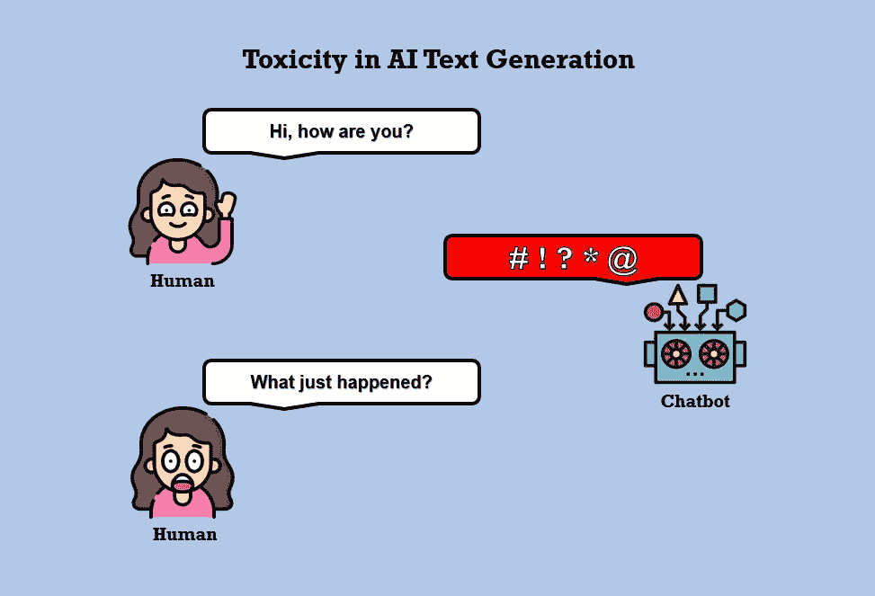
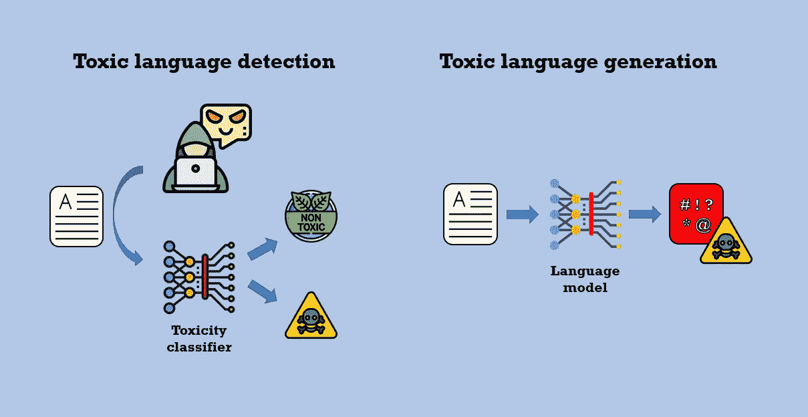
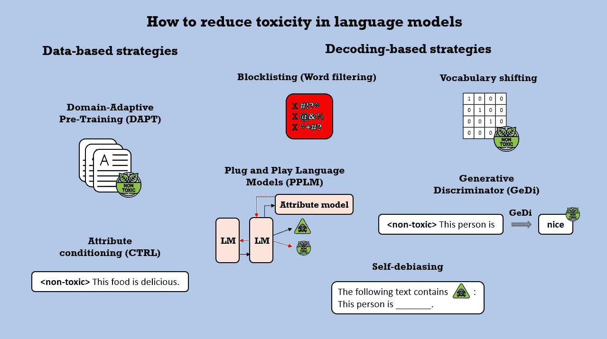
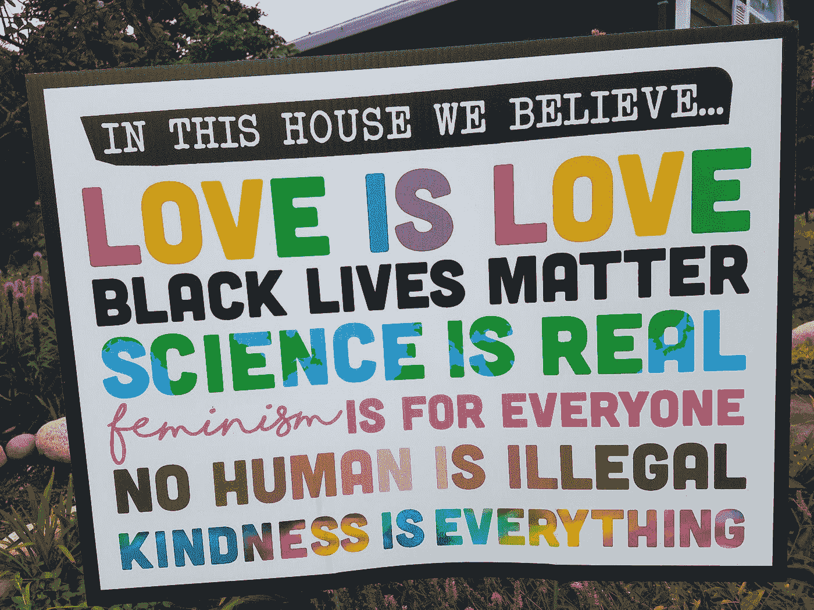
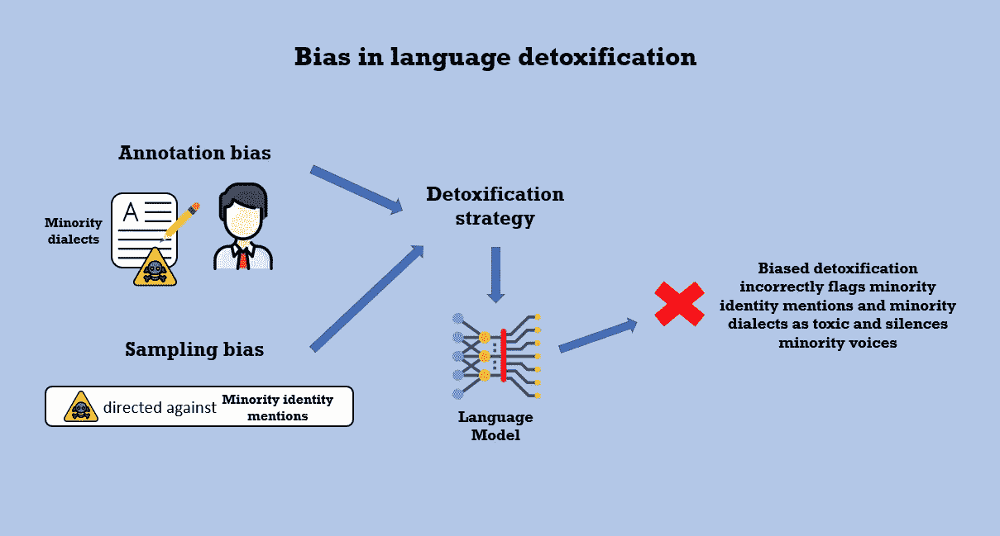

# 人工智能文本生成中的毒性

> 原文：<https://towardsdatascience.com/toxicity-in-ai-text-generation-9e9d9646e68f?source=collection_archive---------13----------------------->

Julia Nikulski 创作的图形显示了聊天机器人在与用户对话时产生的有毒语言。由 [Flaticon](https://www.flaticon.com/) 的 [Becris](https://creativemarket.com/Becris) 和 [Freepik](https://www.freepik.com/) 制作的图标。

## [公平和偏见](https://towardsdatascience.com/tagged/fairness-and-bias)

## 为什么语言模型会产生有害的输出，对此能做些什么

我最近实施了一个小型的 NLP 项目，在这个项目中，我问了两个开放域聊天机器人 36 个恋爱问题。**最初作为消遣的东西，让我注意到了 AI 文本生成中的毒性问题**。我最初问了语言模型(LM)GPT-2 36 个问题。但我被该模型产生的一些答案震惊了，这些答案包含仇恨和有问题的语言，我决定不公布它的答案。

除了一些关于 AI 出问题的轶事之外，我以前没有处理过文本生成的这个方面。然而，我意识到，意识到在面向用户的项目中应用语言模型所带来的潜在危害是至关重要的。所以我阅读了为什么语言模型倾向于创造出如此令人憎恶的语言，以及如何解决这个问题。

各种研究论文研究了自回归 LMs 固有的毒性和社会偏见——如 GPT-2[【1】](https://www.aclweb.org/anthology/2020.findings-emnlp.301.pdf)——以及双向编码器模型——如[伯特](https://www.aclweb.org/anthology/N19-1063.pdf)[【2】](https://www.aclweb.org/anthology/N19-1063.pdf)。本文概述了有毒语言的产生，并涵盖了其主要问题和解决方案。我讨论了文本生成中的毒性意味着什么，为什么会发生，以及目前是如何解决的。我还提出了一些与解毒语言模型相关的伦理考虑。

[摇滚猴子](https://unsplash.com/@rocknrollmonkey?utm_source=medium&utm_medium=referral)在 [Unsplash](https://unsplash.com?utm_source=medium&utm_medium=referral) 上的照片

# 1.什么是毒性？

正如 [Lilian Weng](https://github.com/lilianweng) 在她的[博客文章](https://lilianweng.github.io/lil-log/2021/03/21/reducing-toxicity-in-language-models.html)中提到的，关于 LMs 毒性的确切定义各不相同。 [Jigsaw](https://jigsaw.google.com/) 和谷歌反滥用技术团队开发了 [**透视 API**](https://www.perspectiveapi.com/) ，**识别在线对话中的有毒语言**。他们将毒性定义为

> 粗鲁、不尊重或不合理的评论可能会让你退出讨论。

**Dhamala 等人**[**【3】**](https://arxiv.org/pdf/2101.11718.pdf)**创建了一个数据集和度量标准来调查开放式文本生成中的社会偏见和毒性**。他们将有毒语言定义为传达内容

> 不尊重、辱骂、不愉快和/或有害。

Pavlopoulos 等人[【4】](https://arxiv.org/pdf/2006.00998.pdf)研究了潜在毒性评论的背景是否有助于提高毒性检测模型的性能。他们认为**毒性是一个*总括术语*，包括几个亚型，如攻击性、辱骂性和仇恨性语言**。基于这些定义，毒性不是一个明确定义的概念。这是一个宽泛的术语，涵盖了各种形式的攻击性、有问题的或有害的语言。

# 2.毒性检测与毒性产生

Julia Nikulski 制作的图形展示了有毒语言检测和有毒语言生成之间的区别。由 [Smashicons](https://smashicons.com/) 、[dinosoftlab](https://www.flaticon.com/authors/dinosoftlabs)、 [Becris](https://creativemarket.com/Becris) 、 [Freepik](https://www.freepik.com/) 和[eucalype](https://www.flaticon.com/authors/eucalyp)从 [Flaticon](https://www.flaticon.com/) 制作的图标。

在我为本文进行研究的过程中，我发现涉及 NLP 中毒性的学术论文可以大致分为两类，一类是涉及**毒性语言检测的主题，另一类是毒性语言生成**。虽然这篇博客文章的重点是有毒语言的生成，但是在寻找有毒语言模型的解决方案时，对有毒语言检测的一般理解是有帮助的。

各种研究专注于开发自动系统来检测人类书写的有毒语言，并在网上讨论中流行。虽然骂人的话似乎表明有毒，但没有这种话的语言仍然可能有毒。简单的“*我一看就知道*”——在构建数据集和模型来检测毒性时，这种方法是不够的。语境和语言中的细微差别很重要，决定什么导致冒犯通常是主观的[【6】](https://arxiv.org/pdf/2102.00086.pdf)。Sheth 等人[【7】](https://arxiv.org/pdf/2104.10788.pdf)对与定义和识别有毒物质相关的挑战进行了出色的概述。

在这一毒性检测领域，存在**偏差检测模型**的问题。用于检测毒性的自然语言理解(NLU)模型已被证明包括偏见——特别是对少数民族产生的文本和少数民族的身份提及[【1】](https://www.aclweb.org/anthology/2020.findings-emnlp.301.pdf)——这限制了模型正确标记有毒语言的能力[【6】](https://arxiv.org/pdf/2102.00086.pdf)。通过将无毒内容标记为有毒来压制少数群体的声音也引发了伦理问题。

与种族、性别、宗教、民族、性取向和其他受保护身份相关的社会偏见也存在于为生成文本而设计的 **LMs 中**。它们体现在这些模型产生的有毒语言中。这些 LMs 还输出包含诅咒语、威胁和侮辱的语言。Gehman 等人[【1】](https://www.aclweb.org/anthology/2020.findings-emnlp.301.pdf)表明，五种不同的 LMs——包括 GPT、GPT-2 和 GPT-3——**在 100 代中均产生至少一种毒性评论**。即使相对无害的输入作为提示提供给这些模型，也会导致有毒文本的生成。此处显示了该研究的互动概述[。](https://toxicdegeneration.allenai.org/)

马库斯·温克勒在 [Unsplash](https://unsplash.com?utm_source=medium&utm_medium=referral) 上拍摄的照片

# 3.为什么会出现毒性？

最先进的(SOTA)语言模型——如 GPT-2 和 GPT-3——使用来自网络的大型文本语料库进行预训练。LMs 学习预测序列中的下一个单词(或句子中的单词)。如果模型被输入包含诅咒语或暴力语言的训练数据，它将在训练阶段学习预测这些单词，并在稍后生成包含它们的输出。在通过这些模型进行推断的过程中，也学习和复制了具有刻板印象、贬低或忽略受保护身份的有偏见的语言。

[对](/dirty-secrets-of-bookcorpus-a-key-dataset-in-machine-learning-6ee2927e8650) [BookCorpus](https://huggingface.co/datasets/bookcorpus) 的一项调查——一个经常用于预训练包含超过 11，000 本书的 LMs 的数据集——显示它包括**与性别有关的有问题的内容，以及对流派、宗教和作者的歪曲表现**。[OpenWebTextCorpus](https://skylion007.github.io/OpenWebTextCorpus/)——一个重现用于 GPT-2 的训练数据的数据集——包含 Reddit 上出站链接的内容。Gehman 等人[【1】](https://www.aclweb.org/anthology/2020.findings-emnlp.301.pdf)证明**该数据集包含至少 50，000 个毒性句子，根据 [Perspective API](https://www.perspectiveapi.com/) 测得的**毒性分数(可解释为概率)为 0.51 或更高。

如前所述，在确定什么是有毒的时候，环境很重要。不幸的是，**在特定语境中无毒的语言可以被语言模型**重新“洗牌”，当给予暗示性提示[【1】](https://www.aclweb.org/anthology/2020.findings-emnlp.301.pdf)时，语言模型会产生有毒的输出。为了说明这一点，你可以想一想在客观描述犯罪时使用的词语。这些词然后被模型应用到一个句子中来表达威胁，清楚地显示出毒性。因此，控制预训练 LMs 的生成过程以及使用干净无毒的数据集进行预训练对于避免有毒输出非常重要[【1】](https://www.aclweb.org/anthology/2020.findings-emnlp.301.pdf)。

# 4.如何减少毒性的产生？

由 Julia Nikulski 创建的图形显示了语言模型的不同解毒策略。由 [Flaticon](https://www.flaticon.com/) 的 [Smashicons](https://smashicons.com/) 、[dinosoftlab](https://www.flaticon.com/authors/dinosoftlabs)和 [Freepik](https://www.freepik.com/) 制作的图标。

许多在复杂性和资源强度上不同的方法旨在减少语言模型产生的有害内容。我将简单介绍一些方法，并列出它们的优点和局限性。列出所有可用的方法超出了本文的范围。

根据 geh man et al .[【1】](https://www.aclweb.org/anthology/2020.findings-emnlp.301.pdf)，这些方法可以分为基于**数据或基于解码的策略**。基于数据的策略包括模型的额外预训练和改变模型参数，这使得这些方法在计算上很昂贵。基于解码的方法只是修改了 LM 的解码算法，模型参数保持不变[【1】](https://www.aclweb.org/anthology/2020.findings-emnlp.301.pdf)。**因此，解码策略通常具有从业者更容易获得且成本更低的优势**。

策略名称中的链接指向解释它们的博客文章(如果有的话)或介绍这些方法的原始学术论文。

## [领域自适应预训练(DAPT)](https://medium.com/jasonwu0731/pre-finetuning-domain-adaptive-pre-training-of-language-models-db8fa9747668)

**基于数据的策略**:使用无毒数据集 [ [1](https://www.aclweb.org/anthology/2020.findings-emnlp.301.pdf) ， [9](https://arxiv.org/pdf/2004.10964.pdf) ， [10](https://arxiv.org/pdf/2104.06390.pdf) 对 LM 进行额外的预训练。**优势**:最有效的减毒策略之一[【1】](https://www.aclweb.org/anthology/2020.findings-emnlp.301.pdf)。**局限性**:计算量大[【1】](https://www.aclweb.org/anthology/2020.findings-emnlp.301.pdf)。需要用于训练的额外数据，当通过众包利用人类时，收集这些数据可能会很昂贵。

## [属性条件](https://www.aclweb.org/anthology/2020.findings-emnlp.301.pdf)(基于 [CTRL](https://arxiv.org/abs/1909.05858) )

**基于数据的策略**:使用添加了“有毒”或“无毒”属性的训练样本进行进一步的 LM 预训练。在推断(文本生成)过程中，属性“无毒”可以添加到给予模型[【1】](https://www.aclweb.org/anthology/2020.findings-emnlp.301.pdf)的提示中。**局限性**:计算开销大。不如 DAPT、PPLM 和词汇转换[【1】](https://www.aclweb.org/anthology/2020.findings-emnlp.301.pdf)有效。

## [阻止列表(文字过滤)](https://lilianweng.github.io/lil-log/2021/03/21/reducing-toxicity-in-language-models.html)

**基于解码的策略**:在 LM 中，不需要的单词——如诅咒语、亵渎语和侮辱语——被分配零概率，以防止它们被生成(参见[【1】](https://www.aclweb.org/anthology/2020.findings-emnlp.301.pdf)和[此处](https://lilianweng.github.io/lil-log/2021/03/21/reducing-toxicity-in-language-models.html))。**优点**:易于实现。**局限性**:没有这些词的毒性[仍然会发生](https://lilianweng.github.io/lil-log/2021/03/21/reducing-toxicity-in-language-models.html)。这些词可以被接受使用的上下文被忽略。

## [词汇转移](https://lilianweng.github.io/lil-log/2021/03/21/reducing-toxicity-in-language-models.html)

**基于解码的策略**:使用模型词汇中每个记号的毒性和非毒性的二维表示来提高生成非毒性记号的概率[【1】](https://www.aclweb.org/anthology/2020.findings-emnlp.301.pdf)。**优势**:显示出比阻断列表[【1】](https://www.aclweb.org/anthology/2020.findings-emnlp.301.pdf)更好地降低毒性。**限制**:实现起来比阻止列表更复杂。

照片由 [Breanna Louise](https://unsplash.com/@memee_the_muse?utm_source=medium&utm_medium=referral) 在 [Unsplash](https://unsplash.com?utm_source=medium&utm_medium=referral) 上拍摄

## [即插即用语言模型(PPLM)](https://analyticsindiamag.com/what-are-plug-and-play-language-models-pplm-nlp/)

**基于解码的策略**:使用一个简单的模型(词袋或单层分类器)作为鉴别器(或属性模型)，通过改变 LM 的隐藏表示来指导其语言生成[ [1](https://www.aclweb.org/anthology/2020.findings-emnlp.301.pdf) ， [11](https://arxiv.org/pdf/1912.02164.pdf) ]。**优点**:最有效的减毒策略之一[【1】](https://www.aclweb.org/anthology/2020.findings-emnlp.301.pdf)。**限制**:计算量非常大。

## [生成鉴别器(GeDi)](https://blog.einstein.ai/gedi/)

**基于解码的策略**:使用属性条件(或类别条件)LM 作为鉴别器，它使用贝叶斯规则为主 LM 可以生成的所有潜在的下一个令牌计算类别可能性(例如，有毒或无毒)。优势:计算效率比 PPLM 高。在解毒方面胜过 PPLM。**局限性**:仍然是比较复杂的策略之一。

## [自去偏置](https://lilianweng.github.io/lil-log/2021/03/21/reducing-toxicity-in-language-models.html)

**基于解码的策略**:通过在提供给 LM [ [13](http://arxiv.org/abs/2103.00453) ]的输入提示前添加一个简短的属性描述(如“以下文本包含毒性”)，使用自去偏置算法来降低有毒单词产生的概率。**优势**:与 CTRL 策略相比，不需要额外的培训。 [**限制**](https://lilianweng.github.io/lil-log/2021/03/21/reducing-toxicity-in-language-models.html) :该策略目前仅使用 [Perspective API](https://www.perspectiveapi.com/) 提供的毒性和偏差属性进行评估。它经常过滤掉无害的单词。它的解毒能力受限于模型对相关偏差和毒性的“意识”[ [13](http://arxiv.org/abs/2103.00453) ]。

在受控世代的保护伞下，还有各种其他降低毒性的策略[ [11](https://arxiv.org/pdf/1912.02164.pdf) ] [**文本风格转移**](https://lilianweng.github.io/lil-log/2021/03/21/reducing-toxicity-in-language-models.html) 是一种将有毒句子翻译成无毒版本的相关方法。然而，它的主要应用一直与解决人类在社交媒体上产生的有毒文本有关，而不是消除语言模型的毒性。

Gehman 等人[【1】](https://www.aclweb.org/anthology/2020.findings-emnlp.301.pdf)在他们的调查中发现，网络文本语料库和神经语言生成都包含大量的有毒内容。他们的结果表明，没有一种解毒策略能清除所有的有毒语言。然而，这些策略降低了毒性分数和在 25 个文本生成中产生一次毒性评论的概率。总的来说，这显示了基于解码的方法的**前景，同时也强调了为语言模型仔细选择预训练数据集**的重要性。

# 5.解毒和语言模型的伦理考量

Julia Nikulski 创作的图表展示了偏见对语言解毒的影响。从 [Flaticon](https://www.flaticon.com/) 中 [Vitaly Gorbachev](https://www.flaticon.com/authors/vitaly-gorbachev) 、 [Smashicons](https://smashicons.com/) 、[dinosoftlab](https://www.flaticon.com/authors/dinosoftlabs)、 [Becris](https://creativemarket.com/Becris) 和 [Freepik](https://www.freepik.com/) 制作的图标。

第 2 节简要地谈到了毒性检测中的偏见问题，这种偏见经常以少数人的言论被误认为有毒为代价。这种偏见也存在于解毒的语言模型中。**如果少数民族身份提及和少数民族方言被解毒策略归类为有毒**，那么**少数民族和 NLP 系统之间的交流就会受阻**。LMs 无法理解和响应用户提示可能被视为微侵犯[ [10](https://arxiv.org/pdf/2104.06390.pdf) ]。

在无毒的环境中，有偏见的解毒也会导致回避某些话题，如宗教或性别。当用户与 NLP 系统交互时，这种回避可能会导致自我污名化，因为他们可能会觉得自己的身份和现实无关[ [10](https://arxiv.org/pdf/2104.06390.pdf) ]。因此，开发语言模型的解毒技术以及以减少偏差的方式设计它们是至关重要的。

**妇女和少数群体成员参与设计过程**有助于提高认识，减少这些系统中的偏见。此外，如果仔细选择，用于语言模型和解毒策略的预训练的数据集可以减少毒性和偏差。由谁来决定对哪些数据语言模型进行训练是一个复杂的问题，没有简单的答案。但是，需要讨论。

另外，在创建数据集时需要考虑**标注和**[10](https://arxiv.org/pdf/2104.06390.pdf)。注释偏差意味着负责创建标记数据集和确定句子毒性的人类可能会错误地将少数民族方言标记为有毒。抽样偏见增加了偏见解毒，因为有毒语言往往针对少数群体，在少数群体身份提及和有毒词语之间建立了关联。

照片由[亚历山大拉·博古斯拉夫斯卡](https://unsplash.com/@aleksandraboguslawska?utm_source=medium&utm_medium=referral)在 [Unsplash](https://unsplash.com?utm_source=medium&utm_medium=referral) 拍摄

# 最后的想法

语言模型中的毒性是一个比我预期的更加复杂和广泛的话题，无论是从技术实现还是伦理考虑。喷出仇恨和有毒语言、放大刻板印象和社会偏见的语言模型不利于公共话语、心理健康和民主制度。同时，有偏见的解毒策略会导致某些话题和无毒语言的污名化，压制少数群体的声音。因此，**实现负责任、无毒且无偏见的 LMs 需要细微差别、偏见意识以及最终用户参与模型设计的所有步骤**。

在写这篇文章的时候，**我考虑了我处理 NLP 模型的责任**。这项研究告诉我，让语言模型面向用户可能会有严重的影响，应该经过深思熟虑。我还决定不发表在我的 [36 问题项目](/36-questions-to-fall-in-love-with-ai-89037cc040ab)中产生的任何有害内容，因为我不希望未来通过抓取网络创建的任何数据集包含这些有问题的例子。

你想在媒体上阅读更多高质量的故事吗？考虑注册一个支持我和其他媒体作者的会员。

 [## 通过我的推荐链接加入 Medium-Julia Nikulski

### 作为一个媒体会员，你的会员费的一部分给了你所阅读的作家，你可以在…上看到所有的故事

medium.com](https://medium.com/@julia.nikulski/membership) 

您是否希望展示您的数据科学项目，但不确定如何展示？查看我的指南**如何建立数据科学组合网站**:

 [## 如何建立数据科学作品集网站

### 展示您的作品——从零开始创建网站

towardsdatascience.com](/how-to-build-a-data-science-portfolio-website-335b0f253822) 

# 学术论文参考文献

[1]盖曼，s .，古鲁兰根，s .，萨普，m .，崔，y .，史密斯，N. A. (2020)。真实毒性提示:评估语言模型中的神经毒性退化。 *计算语言学协会的发现:EMNLP 2020* ，3356–3369。

[2]梅，c .，王，a .，博迪亚，s .，鲍曼，S. R .，&鲁丁格，R. (2019)。[在句子编码器中测量社会偏见](https://doi.org/10.18653/v1/N19-1063)。*计算语言学协会北美分会 2019 年会议论文集:人类语言技术，第 1 卷(长短论文)*，622–628。

[3] Dhamala，j .，Sun，t .，Kumar，v .，Krishna，s .，Pruksachatkun，y .，Chang，K.-W .，& Gupta，R. (2021)。 [BOLD:用于测量开放式语言生成偏差的数据集和指标。](https://arxiv.org/pdf/2101.11718.pdf)*《2021 年美国计算机学会公平、问责和透明会议论文集*，862–872 页。

[4] Pavlopoulos，j .，Sorensen，j .，Dixon，l .，Thain，n .，Androutsopoulos，I. (2020 年)。[毒性检测:环境真的重要吗？](http://arxiv.org/abs/2006.00998)*ArXiv:2006.00998【Cs】*。

[5]瓦伊迪亚，a .，麦，f .，&宁，Y. (2020)。[多任务学习降低有毒评论检测中模型偏倚的实证分析。](http://arxiv.org/abs/1909.09758)*ArXiv:1909.09758【Cs】*。

[6]周，x .，Sap，m .，Swayamdipta，s .，Smith，N. A .，，Choi，Y. (2021)。[有毒语言检测自动化去偏的挑战。](http://arxiv.org/abs/2102.00086)*ArXiv:2102.00086【Cs】*。

[7] Sheth，a .，Shalin，V. L .，& Kursuncu，U. (2021 年)。[定义和检测社交媒体的毒性:背景和知识是关键。](http://arxiv.org/abs/2104.10788)*ArXiv:2104.10788【Cs】*。

[8]t . Dias Oliva，d . m . Antonia lli 和 a . Gomes(2021 年)。[战斗仇恨言论，消音变装女王？内容调节中的人工智能与 LGBTQ 在线之声的风险。](https://doi.org/10.1007/s12119-020-09790-w) *性&文化*， *25* (2)，700–732。

[9] Gururangan，s .，Marasovi，a .，Swayamdipta，s .，Lo，k .，Beltagy，I .，Downey，d .，和 Smith，N. A. (2020 年)。不要停止预训练:让语言模型适应领域和任务。*ArXiv:2004.10964【Cs】*。

[10]徐，a .，帕塔克，e .，华莱士，e .，古鲁兰根，s .，萨普，m .，&克莱因，D. (2021)。[去除语言模型的毒性有边缘化少数群体声音的风险。](https://arxiv.org/pdf/2104.06390.pdf)*ArXiv:2104.06390【Cs】*。

[11] Dathathri，s .，Madotto，a .，Lan，j .，Hung，j .，Frank，e .，Molino，p .，Yosinski，j .，和 Liu，R. (2020 年)。[即插即用语言模型:控制文本生成的简单方法](http://arxiv.org/abs/1912.02164)。*ArXiv:1912.02164【Cs】*。

[12] Krause，b .，Gotmare，A. D .，McCann，b .，Keskar，N. S .，Joty，s .，Socher，r .，& Rajani，N. F. (2020 年)。 [GeDi:生成鉴别器引导的序列生成。](http://arxiv.org/abs/2009.06367)*ArXiv:2009.06367【Cs】*。

[13]茨韦塔纳·希克、乌杜帕和舒茨(2021 年)。[自我诊断和自我去偏见:一个减少自然语言处理中基于语料库的偏见的建议。](http://arxiv.org/abs/2103.00453)*ArXiv:2103.00453【Cs】*。