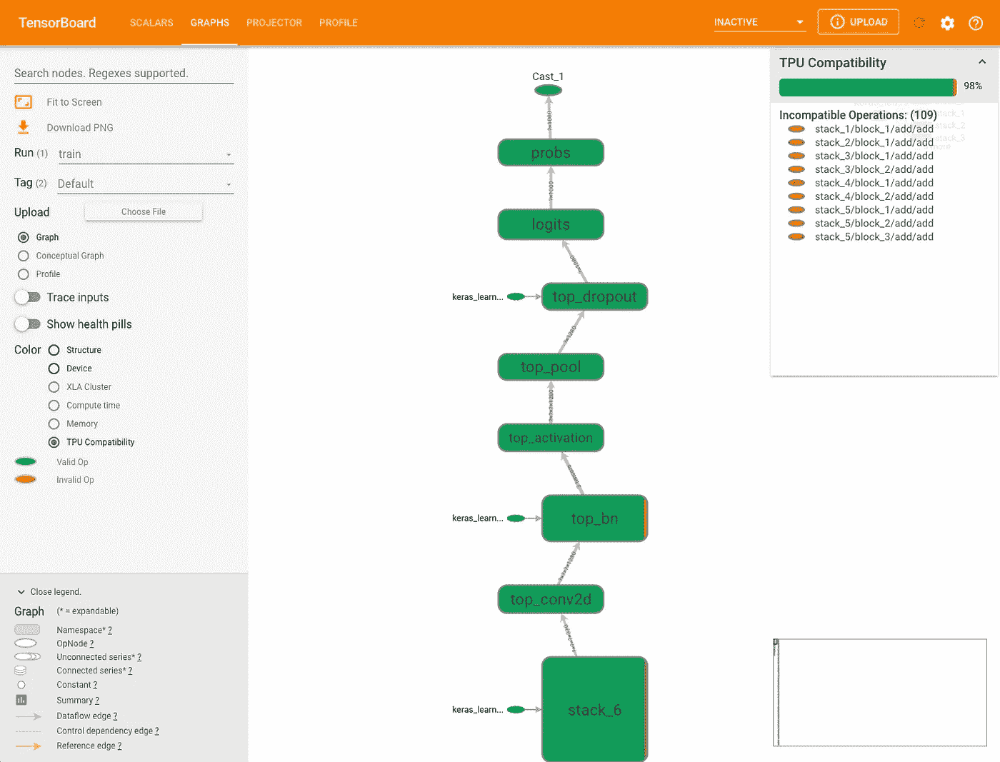
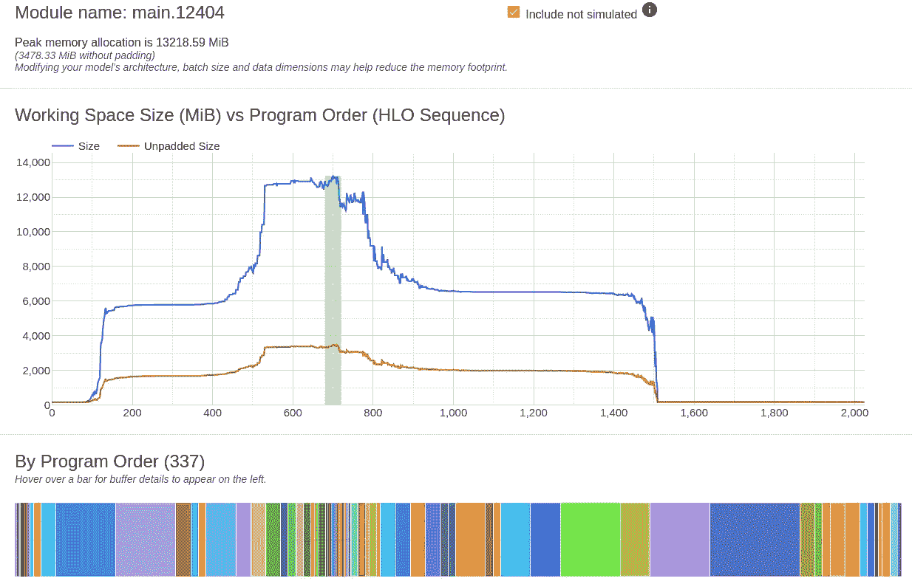

# TPU 培训

> 原文：<https://towardsdatascience.com/tpu-training-6eb84100d138?source=collection_archive---------16----------------------->

## [思想和理论](https://towardsdatascience.com/tagged/thoughts-and-theory)

## 利用专用 DNN 训练芯片的力量


由[费迪南·斯托尔](https://unsplash.com/@fellowferdi?utm_source=medium&utm_medium=referral)在 [Unsplash](https://unsplash.com?utm_source=medium&utm_medium=referral) 上拍摄的照片

过去十年深度学习成功背后的驱动力之一是图形处理单元(GPU)提供的巨大计算能力。虽然最初是为将图像渲染到显示设备而设计的，但它们的高度并行结构使训练速度提高了几个数量级。随着时间的推移，GPU 得到了增强，以满足 DNN 培训不断增长的需求。今天，它们是训练大规模人工智能的主要方法。然而，在过去的几年中，潜在的挑战者已经以专门为训练 DNNs 设计的新芯片的形式出现。这些芯片(或 ASIC——专用集成电路——更恰当的称呼)可能会以很小的成本实现加速训练。虽然市场上已经有许多专门的人工智能 ASICs(例如，见这里的)和许多其他的正在形成中(例如，见这里的)，但在撰写本文时，只有少数几个通过云服务提供给公众。这种情况有望在不久的将来发生改变，例如 Habana Gaudi 即将在 AWS 上发布[以及备受期待的](https://aws.amazon.com/ec2/instance-types/habana-gaudi/) [AWS Trainium](https://aws.amazon.com/machine-learning/trainium/) 。

对于现代机器学习开发团队来说，要保持竞争力，他们需要不断掌握新进展的脉搏。这包括在评估新的人工智能芯片及其在自己项目中的潜在应用时发展高水平的熟练程度。不幸的是，让你的训练工作量适应新的芯片有时会很有挑战性。这篇博文的目的是为如何应对这一挑战提供一点指导，同时也提供一些情感上的支持。这篇文章并不是要取代在线的官方文档和教程。

我要感谢 [Allen Wang](https://www.linkedin.com/in/allen-wang-011795a4/) 和 [Yitzhak Levi](https://www.linkedin.com/in/yitzhak-levi-49a217201/) 对这篇文章的贡献。

# 序幕

在本帖中，我们建议将让你的模型适应新的人工智能芯片的挑战分解为四个步骤:

1.  **高级兼容性分析**:对您的工作负载特性是否符合芯片规格进行早期评估。
2.  **调整你的模型在新的芯片上运行**:你可能需要对你的模型做一些调整，比如替换专用 AI 芯片不支持的操作。
3.  **优化新芯片的运行时性能**:有趣的事情开始了……为了充分利用芯片，您需要分析并最大限度地提高其利用率。
4.  **(重新)调整模型以收敛**:先前步骤中所需的更改(例如增加训练批量)可能需要调整模型超参数(例如学习率)，以确保及时收敛。

显然，这种分类是一种简化。实际上，您可能会发现自己在迭代地和/或并行地执行这些步骤。例如，您可能决定将优化运行时的任务交给性能分析专家，而另一组数据科学家则致力于调整您的学习算法，以收敛于大批量训练(例如，在 GPU 上使用[大批量模拟](/how-to-use-horovods-large-batch-simulation-to-optimize-hyperparameter-tuning-for-highly-a815c4ab1d34)以最大限度地降低成本)。

在接下来的几节中，我们将通过将这四个步骤应用到[谷歌云 TPU](https://cloud.google.com/tpu) DNN 加速器来更详细地演示它们。更具体地说，我们将讨论当您尝试使用 TensorFlow 版转换您的模型以在云 TPU v3–8(包含 8 个 TPU 内核)上运行时可能面临的一些挑战。虽然我们是在特定的人工智能芯片和特定的训练框架上进行分区，但我们讨论的许多考虑因素也适用于其他人工智能芯片和其他训练框架。

你可以在计算引擎上启动云 TPU(如这里描述的)或者使用托管服务，如[人工智能平台](https://cloud.google.com/ai-platform/training/docs/using-tpus)。对于本帖中描述的步骤，我们强烈建议在计算引擎上运行云 TPU。这将使调试和分析性能更加灵活。在撰写本文时，托管 API 不提供对 TPU 系统日志和 TPU 系统性能的相同可见性，不支持您[捕获性能配置文件](https://cloud.google.com/tpu/docs/cloud-tpu-tools)，也不支持使用 [tf.data.service](https://www.tensorflow.org/api_docs/python/tf/data/experimental/service) 卸载数据预处理。启动您的 TPU 时，请务必仔细按照说明进行操作，因为有一些细微之处是 TPU 设置所独有的(例如 [TPU 专用服务账户](https://cloud.google.com/tpu/docs/storage-buckets#finegrained-access))。

重要的是要记住，DNN 的发展前景仍然极具活力。当你读到这篇文章时，我们提出的一些观点可能已经过时了。请确保关注新版本和新工具的发布，并确保根据最新可用信息做出设计决策。

请原谅你可能遇到的任何不准确之处，或者更好的是，给我写信，告诉我你的更正。

# 步骤 1 —高级兼容性评估

自然，你想做的第一件事是尝试开发一个感兴趣的人工智能芯片是否与你的用例相关的早期评估。让你的模型适应新芯片的努力可能是巨大的，你越早排除某个死胡同越好。这种初始评估通常可以根据在线资源得出，包括系统规格和性能指标评测:

## ASIC 描述

一个好的起点是专用硬件的公开描述。这通常包括训练芯片的功能:支持什么模型层和架构、使用什么浮点类型、需要什么软件堆栈、芯片如何与 CPU 和数据存储接口、计算核心是否以及如何互连、硬件扩展到多核训练的程度等。此描述可用于识别与您的模型的潜在不兼容性。您可能会发现可用内存不能满足您的模型大小的需要，或者不支持您的训练可扩展性需要。在这种情况下，不要再往前走了。

[云 TPU 文档](https://cloud.google.com/tpu/docs/tpus)包含关于使用 TPU 的大量信息，包括 [TPU 编程模型](https://cloud.google.com/tpu/docs/tpus#programming_model)和最适合 TPU 的[工作负载类型](https://cloud.google.com/tpu/docs/tpus#when_to_use_tpus)。从这些资源中，您可能会得出这样的结论:TPU 不适合您的模型，例如，因为它们依赖于自定义 ops、高精度算术或大量的元素操作。

## 当心基准

您可能想了解的另一个资源是在线性能基准比较。在各种常见架构(包括 ResNet、MaskRCNN、Bert 等)上，您不难找到 TPU 与 GPU 的性能对比。不幸的是，弄清楚如何将这些结果应用到您自己的用例中是非常困难的。

首先，不言而喻的是，芯片制造商提供的基准应该以合理的怀疑态度对待。但是，即使是你认为公正的分析也可能极难解读。在某种程度上，这可以说是任何学科中的基准比较，但在深度学习领域尤其如此，因为有大量因素可以对性能产生有意义的影响。首先是运行时环境 CPU 内核的数量及其类型、操作系统、驱动程序版本、操作系统、软件框架类型和版本——这些单独的元素中的每一个都可以单独影响性能几十个百分点。然后是模型:即使您自己的模型体系结构与基准测试中最相似的模型之间存在最微小的差异，无论是在图形体系结构、输入数据格式、预处理管道、损失函数还是优化器方面，都会对性能产生巨大的影响。质量基准比较将包括有关已进行评估的精确属性的详细信息。但是，它们不太可能涵盖影响性能的所有参数。

MLPerf : [MLPerf](https://mlcommons.org/en/) 是一个经常被引用的人工智能训练和推理的基准套件，目前由 [MLCommons 财团](https://mlcommons.org/en/)管理。本白皮书[详细介绍了创建培训基准的理由以及参与规则。从对](https://arxiv.org/pdf/1910.01500.pdf)[基准测试结果](https://mlcommons.org/en/training-normal-10/)的粗略回顾中可以明显看出，该基准测试影响深远，涵盖了广泛的培训环境和模型架构。然而，如上所述，鉴于每个测试用例有许多不同的参数，您可能会发现很难推断出 AI 芯片之间的清晰比较，更不用说将这些结果应用到您自己的特定用例中了。我发现这些结果需要进行解释(例如参见[这篇](https://venturebeat.com/2020/07/29/google-claims-its-new-tpus-are-2-7-times-faster-than-the-previous-generation/)综述)，尤其是考虑到 ASICs 之间的潜在价格差异时(这些差异不包括在原始比较结果中)。

例如，MLPerf 基准测试的所有迹象都让人相信 8 个 NVIDIA A100 GPU 核心将远远超过 TPU v3–8(包含 8 个 TPU 核心)。然而，最近我们在一个模型上工作，与评论中涉及的模型没有什么不同，在这个模型上，TPU 运行实际上匹配，甚至略优于我们最知名的 A100 GPU 运行配置。这个模型似乎完全符合 TPU 的规格。与此同时，对这个模型的小改动会极大地改变它的 TPU 兼容性，并大大增加步进时间。MLPerf 报告没有给出这两种极端结果的任何指示。

虽然我们认识到人工智能培训基准评估的重要性和价值，但我们认为承认它们在预测评估中包含的特定测试案例之外的性能方面的局限性也很重要。

## 系统架构规范

如果完整的系统规格可用，您还有一个选择，就是通过对您的模型在专用硬件上的运行方式进行离线模拟，来尝试规划您的培训步骤的运行时间。这种分析需要对系统架构和 DNN 模型有深入的了解。我认识许多人，他们通过创建基于参数矩阵大小、触发器数量、内存大小、L2 缓存延迟等精确性能预测的电子表格，过上了不错的生活。根据我的经验，这种预测往往是“命中或错过”，在复杂的机器学习工作负载的情况下，更多的时候是“错过”。

## 跳进深水区

当该说的都说了，该做的都做了，除了堕落和肮脏，真的别无选择。虽然我承认有些人可能厌倦了走在潜在的死胡同的道路上，但我相信，即使您最终没有在 TPU 上训练您当前的模型，随着您的项目的发展和更多 ASICs 的出现，您在这个过程中发展的专业知识几乎肯定会很好地服务于您和您的团队。

# 第二步——调整你的模型以在 TPU 上运行

为了在定制的 ASIC 上成功运行，您可能需要对您的 AI 应用程序进行更改。需要改变的程度将取决于许多因素，包括 ASIC 软件堆栈的成熟度和支持的操作范围。定制 ASICs 可能会对 AI SW 开发平台或版本施加严格限制，这可能需要进行重大调整。您应该始终努力使用最新的软件包，因为这些包可能包含最广泛和最佳的 API 支持。TPU 享有相对健康的软件堆栈和大型开发人员社区的优势(这两者通常是相互关联的)。然而，它们可能仍然需要适应您的数据输入管道和计算图。我们将在下面的小节中演示几个例子。首先，我们将指出定制 ASICs 调试中潜在的复杂性。

## 为 TPU 调试

GPU 培训的一个显著优势是，模型设计和调试的重要部分可以在 CPU 上执行。如果你能在 CPU 上编译你的模型，那么 100 次中有 99 次你的模型在 GPU 上是有效的(有足够的内存)。这是现代人工智能开发人员经常想当然的事情。定制 ASICs 不一定是这种情况。这样做的结果是，通常需要直接在定制 ASIC 上进行调试，这可能会影响成本和/或持续时间。或者，ASIC 制造商可能会提供一个模拟框架，用于识别和修复可能在 CPU 上运行的潜在问题。理想情况下，这种模拟框架还将提供如何最大化 ASIC 利用率的指导。不幸的是，在撰写本文时，官方的 TPU 模拟框架还不存在。虽然可用的[文档](https://cloud.google.com/tpu/docs/tensorflow-ops)和[工具](https://cloud.google.com/tpu/docs/cloud-tpu-tools#tpu_compatibility_graph)可能有助于构建一个 TPU 兼容的模型，但直到你在 TPU 上运行它，你才能确定。

您可能面临的另一个困难是理解 TPU 报告的错误消息。正如我们在过去的的[中提到的，破译 TensorFlow 错误信息可能很难。TPU 上的错误消息，无论是那些报告给控制台的，还是那些通过](/debugging-in-tensorflow-392b193d0b8)[云监控](https://cloud.google.com/monitoring)可访问的，往往都特别隐晦(截至本文撰写之时)。我们将在下面的章节中提供一些例子。

## 更新您的数据输入管道

尽管数据输入管道在 TPU 的主机 CPU 上运行，而不是在 TPU 本身上运行，TPU [系统架构](https://cloud.google.com/tpu/docs/system-architecture-tpu-vm)对可以执行的操作施加了某些限制。启动 TPU 的[标准方式](https://cloud.google.com/tpu/docs/system-architecture-tpu-vm#tpu-node)依赖于通过 [gRPC](https://grpc.io/) 与 TPU 主机通信的专用虚拟机。这种架构的后果之一是不允许任何[自定义操作符](https://www.tensorflow.org/guide/create_op)或任何基于 python 的数据处理函数。这禁止使用 [tf.py_function](https://www.tensorflow.org/api_docs/python/tf/py_function) 和 [tf.numpy_function](https://www.tensorflow.org/api_docs/python/tf/numpy_function) ，它们通常用于绕过本机 TensorFlow API 施加的限制。它还禁止使用[TF . data . dataset . from _ generator](https://www.tensorflow.org/api_docs/python/tf/data/Dataset#from_generator)API，该 API 通常用于增加输入数据集创建的灵活性。

不幸的是，在撰写本文时，如果您的输入管道图无效，您很可能会得到一个模糊的 gRPC 错误消息，就像下面的块中的消息一样，您将不得不自己寻找罪魁祸首。

```
W ./tensorflow/core/distributed_runtime/eager/destroy_tensor_handle_node.h:57] Ignoring an error encountered when deleting remote tensors handles: Invalid argument: Unable to find the relevant tensor remote_handle: Op ID: 22643, Output num: 7Additional GRPC error information from remote target /job:worker/replica:0/task:0::{"created":"@1632916556.697142899","description":"Error received from peer ipv4:10.11.250.138:8470","file":"external/com_github_grpc_grpc/src/core/lib/surface/call.cc","file_line":1056,"grpc_message":"Unable to find the relevant tensor remote_handle: Op ID: 22643, Output num: 7","grpc_status":3}
```

TPU 常见的另一种输入管道错误与数据输入的大小有关，它会导致同样不明确的消息。正如我们将在下面看到的，有效利用 TPU 可能需要比您以前习惯的更大的批量。如果没有在输入数据管道上正确处理，您可能会遇到 CPU 内存问题。例如，如果每个输入样本是 1 MB，而您的全局批处理大小是 4096，那么您的批处理大小将是 4 GB。解决这个问题的一个方法是修改您的数据管道以生成“本地”批处理而不是“全局”批处理；也就是说，创建每个内核批量大小的批。这可以使用[TF . distribute . strategy . distribute _ datasets _ from _ function](https://www.tensorflow.org/api_docs/python/tf/distribute/Strategy#distribute_datasets_from_function)API 来完成。在我们的示例中，批量大小是 0.5 GB，这是一个更容易管理的大小。

**TPU-越南船民——救世在即**:

今年 6 月，谷歌[宣布](https://cloud.google.com/blog/products/compute/introducing-cloud-tpu-vms)一个新的云 TPU 架构，名为[云 TPU 虚拟机](https://cloud.google.com/tpu/docs/users-guide-tpu-vm)。与最初的架构相反，被称为 [TPU 节点](https://cloud.google.com/tpu/docs/system-architecture-tpu-vm#tpu-node)、 [TPU 虚拟机](https://cloud.google.com/tpu/docs/system-architecture-tpu-vm#tpu-vm)，允许对 TPU 主机的直接 SSH 访问，不需要中间虚拟机。其含义是深远的。这不仅消除了对数据输入管道创建的限制，还极大地提高了我们调试和分析输入管道性能的能力。此外，删除中间虚拟机可能会减少网络开销并提高性能。

新架构已经可以在“预览”模式下使用。根据我们的经验，它还没有完全成熟。但是未来看起来是光明的。

## 更新您的模型图

在 TPU 上训练您的模型可能还需要更改在 TPU 核心上运行的计算图。在这一节中，我们将演示为了符合 API 限制或 TPU 内存限制而可能实施的更改。

**TensorFlow Op 限制**:
ASIC 对支持的 Op 施加限制并不少见。这些限制可能来自硬件实施或支持软件堆栈的限制。TPU 文档包括一个[支持(和不支持)TensorFlow 操作](https://cloud.google.com/tpu/docs/tensorflow-ops)的列表。不幸的是，(在撰写本文时)这个列表自称是不完整的。 [TensorBoard](https://www.tensorflow.org/tensorboard) 的图形可视化工具包括一个 [TPU 兼容性](https://cloud.google.com/tpu/docs/cloud-tpu-tools#tpu_compatibility_graph)选项，如下图所示，但根据我们的经验，该测试并不完全可靠。只有当您尝试运行图表时，您才可能收到图表无效的第一个指示。



TPU 兼容性图(图片来自 [GCP 在线文档](https://cloud.google.com/tpu/docs/cloud-tpu-tools#tpu_compatibility_graph)

TPU 限制包括对使用自定义运算符和可能导致张量形状不确定的运算的限制:

**定制操作—** 在 GPU 上进行培训的优势之一是，它支持在软件堆栈的各个级别进行定制。你可以创建自己的基于 python 的操作(例如使用 [tf.numpy_function](https://www.tensorflow.org/api_docs/python/tf/numpy_function) )或者你可以在 [CUDA](https://developer.nvidia.com/cuda-zone) 中创建自己的 [GPU 内核](https://www.tensorflow.org/guide/create_op#gpu_kernels)。这种程度的灵活性在实现中非常有用:TensorFlow 本身不支持的操作，或者专门为您的用例优化的 GPU 内核。这些能力在 TPU 是缺乏的(在撰写本文时)。如果您的图包括这些类型的定制，您将需要用本地操作来替换它们。下面的块包含一段摘录，摘自您在图形包含一个 [tf.numpy_function](https://www.tensorflow.org/api_docs/python/tf/numpy_function) 调用的情况下可能会遇到的错误消息类型。

```
(0) Invalid argument: {{function_node __inference_train_function_117771}} Detected unsupported operations when trying to compile graph cluster_train_function_10723333522471149816[] on XLA_TPU_JIT: **PyFunc** (No registered '**PyFunc**' OpKernel for XLA_TPU_JIT devices compatible with node {{node model/segLoss/PyFunc}}){{node model/loss/PyFunc}}
```

**导致形状不确定的张量的操作** —与 GPU 相反，TPU 不允许某些 API，因为它们使用非静态形状的张量。需要注意的是，最近的 TensorFlow 版本已经扩展了对此类操作的支持。然而，尽管受到支持，其中许多在 TPU 上表现很差，你应该尽量避免它们。

下面是一个在 TPU 失败的代码摘录的例子(摘自[以前的博客文章](/the-tensorflow-keras-summary-capture-layer-cdc436cb74ef)):

```
shape = [None,1]
dtype = tf.float32
record_tensor = tf.Variable(
            shape=shape,
            *# initialize with batch size 1 since batch_size 
            # is unknown, and set validate_shape=False*
            initial_value=tf.zeros(shape=[1]+shape[1:],
                                   dtype=dtype),
            validate_shape=False,
            dtype=dtype,
            trainable=False)
```

要为 TPU 修改它，我们需要修正 batch_size 并将 *validate_shape* 改为 *True* 。在这种情况下遇到的错误类似于:

```
tensorflow.python.framework.errors_impl.InvalidArgumentError: Dst node should be assigned to an allowed device.
```

导致未确定形状的张量的 API 的一个经典例子是 [tf.boolean_mask](https://www.tensorflow.org/api_docs/python/tf/boolean_mask) 。假设我们正在处理一个分割模型，该模型将图像作为输入，并为每个像素生成一个标签。我们可能希望从我们的损失计算中屏蔽掉图像的某些区域(由于它们的模糊性或低水平的兴趣)。在 GPU [上，tf.boolean_mask](https://www.tensorflow.org/api_docs/python/tf/boolean_mask) 具有移除与这些区域上的损失计算相关联的所有操作的效果，并且可以显著提升性能。虽然 TensorFlow 最近增加了对 [tf.boolean_mask](https://www.tensorflow.org/api_docs/python/tf/boolean_mask) 的 TPU 支持，但通过计算所有像素的损失并在被遮罩的区域将结果值清零，您可能会获得更好的性能，如下面的代码块所示:

```
# given input logits, lables, mask and loss_fnif tpu:
    # zero out pixels according to mask
    mask = tf.cast(mask, logits.dtype)
    logits = logits * mask
    labels = labels * mask
else:
    # reduce number of loss_fn operations using tf.boolean_mask
    logits = tf.boolean_mask(logits, mask)
    labels = tf.boolean_mask(labels, mask)
sumLoss = tf.reduce_sum(loss_fn(logits, labels))
```

**TPU 内存限制** :
当您将模型加载到 TPU 时，您可能会惊讶地发现，模型所需的内存量大大超过了 GPU 所需的内存量。出现这种情况的原因很可能是内存填充。我们将在下一节进一步讨论填充的主题。在下面的代码块中，我们演示了在内存需求超过可用 TPUv3 内存(每个内核 16 GB)的情况下预期的错误类型。我们选择了一个极端的例子，填充将内存利用率提高了大约 3 倍，从 6.4GB 提高到 19 GB 以上。

```
(0) Resource exhausted: {{function_node __inference_train_function_80576}} Ran out of memory in memory space hbm. **Used 19.46G of 15.48G hbm. Exceeded hbm capacity by 3.98G**.
Total hbm usage >= 19.98G: 
    reserved 530.00M 
    program 19.46G
    arguments 0BOutput size 0B; shares 0B with arguments.Program hbm requirement 19.46G:
    global 276.0K
    scoped 173.0K
    HLO temp 19.46G (33.1% utilization: **Unpadded (6.40G) Padded (19.32G)**, 0.7% fragmentation (147.91M)) **Largest program allocations in hbm**:

  1\. Size: 14.00G 
     Operator: op_type="OneHot" op_name="model/loss/one_hot"
     Shape: s32[29360128,10]{1,0:T(8,128)}
     Unpadded size: 1.09G
     Extra memory due to padding: 12.91G (12.8x expansion)
     XLA label: %iota.2 = s32[29360128,10]{1,0:T(8,128)} iota(), iota_dimension=1, metadata={op_type="OneHot" op_name="model/loss/one_hot"}
     Allocation type: HLO temp
     ========================== 2\. Size: 2.62G
     Operator: op_name="model/layer_1/Conv2D"
     Shape: f32[128,256,896,18]{0,3,2,1:T(8,128)}
     Unpadded size: 1.97G
     Extra memory due to padding: 672.00M (1.3x expansion)
     XLA label: %fusion.9.remat.1.remat = f32[128,256,896,18]{0,3,2,1:T(8,128)} fusion(f32[1,1,8,18]{3,2,1,0:T(8,128)} %get-tuple-element.4316, f32[18]{0:T(256)} %get-tuple-element.4085, f32[128,256,896,8]{0,3,2,1:T(8,128)} %get-tuple-element.3899, f32[8]{0:T(256)} %rsqrt...
     Allocation type: HLO temp
     ==========================
```

错误消息包括最大内存分配的列表。在这种情况下，我们看到单个操作导致了 12.91GB 的额外填充。

除了重新设计您的模型以适应内存需求之外，一个令人信服的选择是用[混合精度](https://www.tensorflow.org/guide/mixed_precision)编译您的模型，并将[混合精度策略](https://www.tensorflow.org/api_docs/python/tf/keras/mixed_precision/Policy)设置为 *mixed_bfloat16* 。默认情况下，所有变量都存储为 tf.float32，这是一种 32 位浮点表示形式。Bfloat16 是由 Google 创建的 16 位浮点表示。参见[此处](https://cloud.google.com/tpu/docs/bfloat16)了解格式及其动态范围的详细信息。当您[修改您的模型](https://cloud.google.com/tpu/docs/bfloat16#changing)以使用混合精度时，激活和梯度存储为 tf.bfloat16，而权重保留在 tf.float32 中。这可以大大降低您的模型的内存需求，同时提高运行时性能。

根据 Google 的研究[报告](https://cloud.google.com/tpu/docs/bfloat16)，大多数模型的收敛性不会受到 tf.bfloat 的影响。但是，如果您选择了这个选项，您应该意识到这种可能性。我们将在本文的第 4 步进一步讨论这个问题。

# 步骤 3-优化您的模型以在 TPU 上执行

此时，您应该能够在 TPU 上成功运行一个训练周期。接下来是性能分析和优化的关键步骤。一个人工智能加速器的好坏取决于它为性能分析提供的工具。如果你不能分析性能，你就不能充分利用人工智能芯片。

在[之前的博客文章](/tensorflow-performance-analysis-314b56dceb59)中，我们详述了性能分析的重要性，并演示了[张量流分析器](https://www.tensorflow.org/guide/profiler)和[张量板](https://www.tensorflow.org/tensorboard)的使用。同样的技术也可用于分析 TPU 的性能。TPU 文档包括一个详细的指南[,介绍如何在 TPU 获取个人资料并在 TensorBoard 中分析结果。该文档还包括一个](https://cloud.google.com/tpu/docs/cloud-tpu-tools)[指南](https://cloud.google.com/tpu/docs/performance-guide)，介绍如何设计您的模型以优化 TPU 利用率。在本节中，我们将根据自己的经验重点介绍一些性能技巧。要了解更多细节，你应该回头参考这两个重要的指南。

## 减少填充的开销

要了解 TPU 最重要的特性之一是张量在内存中的存储方式。未能根据 TPU 的[内存平铺方案](https://cloud.google.com/tpu/docs/performance-guide#consequences_of_tiling)调整您的模型会导致大量的内存填充开销，这转化为未实现的潜力。在评估填充开销时，最重要的资源是 TensorBoard *profile* 页面上的 *memory_viewer* 选项卡。在下图中，我们展示了这个页面的一个例子。红色曲线显示未填充的内存利用率，蓝色曲线显示填充的内存利用率。在本例中，填充导致的内存占用大约是实际使用的内存大小的 4 倍。



摘自 TensorBoard(作者)

TPU 文档提供了关于如何最小化填充开销的指南。简化版是这样的:

1.  使用 128 的倍数的(每个内核)批处理大小，并且
2.  将每个图层的输出要素的维度设置为 8 的倍数。

当然，这可能并不适用于所有型号，在这种情况下，文档中会有更多的建议。不要忘记，正如我们在上面看到的，你可以选择启用[混合精度](https://www.tensorflow.org/guide/mixed_precision)，以增加将一批 128 大小的数据放入 TPU 存储器的可能性。

## 优化输入数据管道

可以用来测量训练系统与给定模型的兼容性的参数之一是主机将训练批次馈送到加速器中的能力(例如，通过每秒批次来测量)与加速器处理输入批次的能力之间的比率。io 带宽、输入管道中的数据处理操作量、CPU 内核的数量和类型以及加速器的速度都会影响这一比率。如果该比率小于 1，您可能会遇到输入管道瓶颈。在这种情况下，加速器在等待输入数据时将保持空闲，宝贵的计算周期将被浪费。这是一种不理想的情况，我们已经在[之前的帖子](/overcoming-data-preprocessing-bottlenecks-with-tensorflow-data-service-nvidia-dali-and-other-d6321917f851)中对此进行了阐述。

</overcoming-data-preprocessing-bottlenecks-with-tensorflow-data-service-nvidia-dali-and-other-d6321917f851>  

在 TPU 上训练时，由于其消耗数据的速度很快，您在数据准备管道上遇到瓶颈的可能性可能会增加。即使您的输入管道不包括繁重的处理，被解析、混洗和批处理的大量数据也很容易阻塞 CPU 资源。通过使用 [tf.data.service](https://www.tensorflow.org/api_docs/python/tf/data/experimental/service) 卸载到辅助 CPU 可能会减轻一些负担。(参见[此](https://github.com/tensorflow/ecosystem/tree/master/data_service)示例，了解如何使用 TPU)。然而，它并不是在所有情况下都有帮助，您可能需要求助于更具创造性的解决方案，包括:调整分配给管道不同部分的进程数量，更改数据的格式和/或精度，或将计算转移到 TPU 上。

## **递增 steps_per_exec**

最近，TensorFlow 在 [tf.keras.Model.compile](https://www.tensorflow.org/api_docs/python/tf/keras/Model?hl=ru#compile) 输入参数中添加了 *steps_per_exec* 标志。此设置控制每次调用内部训练函数时运行的训练步骤数。增加该数字可以减少 TPU 和主机之间的通信开销，最终提高性能。不过要记住的一点是，这将影响你进入训练回调函数的时间间隔。例如，如果您的回调类跟踪训练期间输入的批次数量，那么每次调用 *on_batch* 函数时，该值应该增加 *steps_per_exec* 而不是 *1* 。更多细节参见[文档](https://www.tensorflow.org/api_docs/python/tf/keras/Model?hl=ru#compile)。

你在一个定制的人工智能中发现的价值将在很大程度上取决于你在优化你的模型以有效使用它方面的成功。这种优化需要时间和精力，因此应该相应地进行规划。

# 第四步——调整你的模型，向 TPU 靠拢

如果你已经完成了这一步，那么你已经成功地在专用的 AI ASIC 上以你满意的速度运行了你的模型。为了达到这一步，您可能已经对您的模型进行了一些更改。您可能更换了一些操作员，重新格式化了您的数据，增加了您的批量，或者应用了[混合精度](https://www.tensorflow.org/guide/mixed_precision)。最后一步是验证你的模型成功收敛。这可能需要调整您的模型超参数，调整您的学习率，或者更换您的优化器。

即使您没有进行任何更改，这最后一步也是必需的。这是因为不同的硬件加速器以不同的方式实现，这可能会导致它们的行为存在数值差异。在一个 ASIC 上的收敛并不保证在另一个上的收敛。例如，TPUs 的高性能归功于它使用了较低精度的浮点类型 bfloat16(参见此处的)。您的模型可能对这种精度下降很敏感，在这种情况下，您需要重新调整它以收敛。

## 批量增加

为了充分利用 TPU，您可能需要将批量增加到超出您习惯的水平。您的模型可能对训练批次大小很敏感，对其进行调整以收敛(在相同数量的数据遍历上)可能会带来巨大的挑战。查看我们之前的[博客文章](/a-guide-to-highly-distributed-dnn-training-9e4814fb8bd3)了解更多关于这个话题的细节。

</a-guide-to-highly-distributed-dnn-training-9e4814fb8bd3>  

# 摘要

将你的模型转换为在定制的人工智能芯片上运行，可以节省大量的培训成本。然而，这可能需要相当大的努力。在这篇文章中，我们将重点放在 TPU 的训练上。在这一过程中，你可能会遇到各种各样的挑战。我们只讨论了几个例子。请务必参考丰富的在线文档以了解更多详细信息。