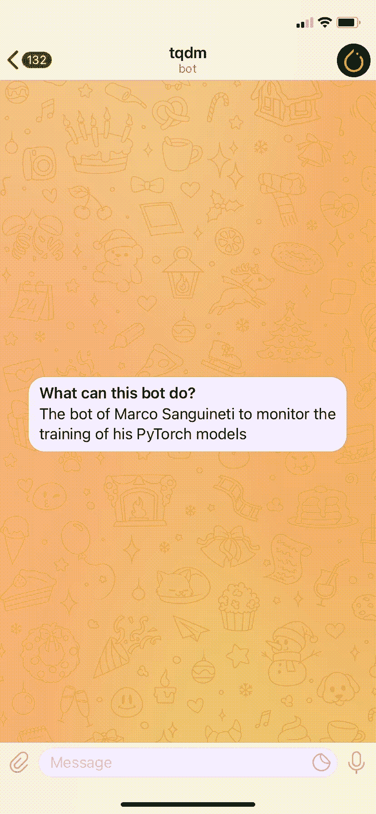
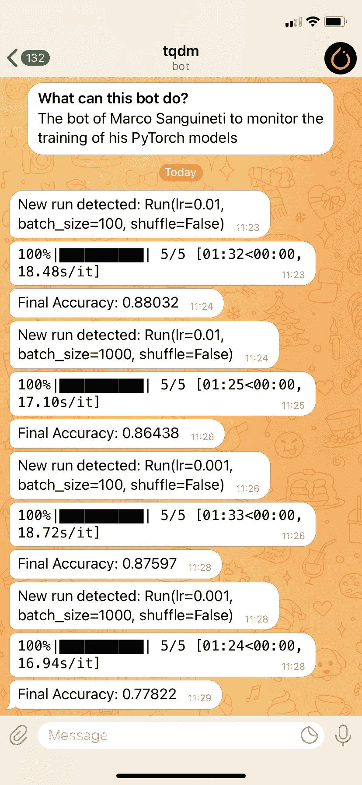
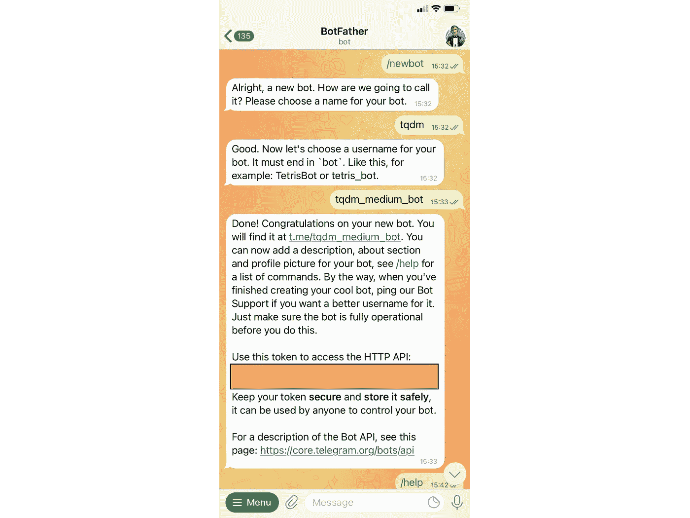
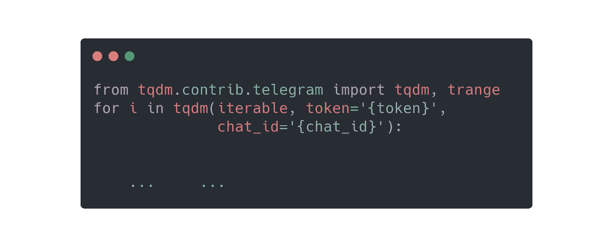
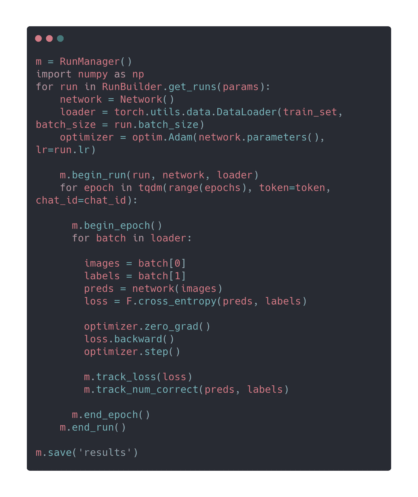
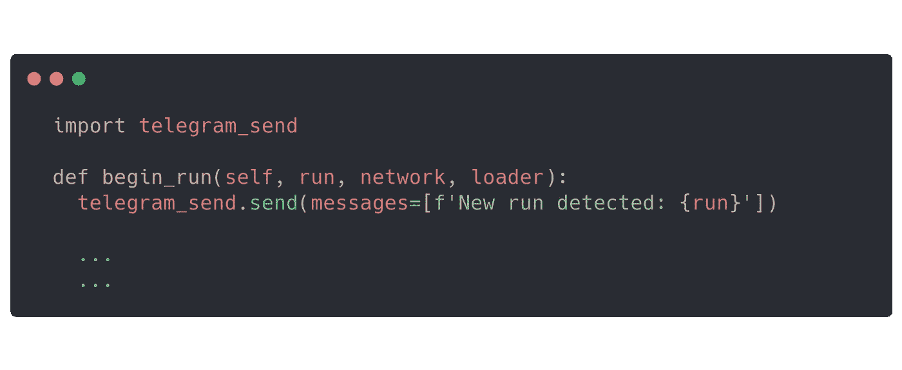
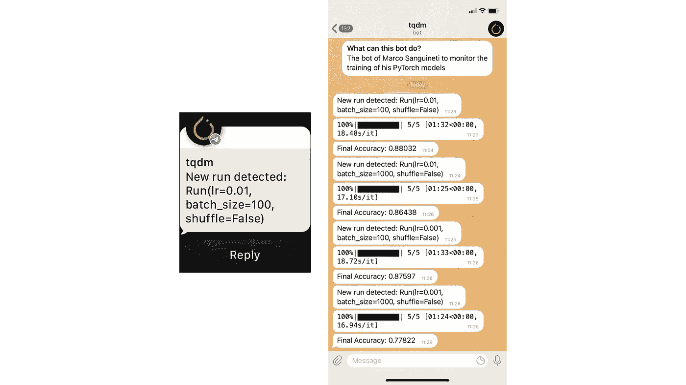

# Tqdm、Pytorch 和 Telegram:通过智能手机查看培训

> 原文：<https://towardsdatascience.com/tqdm-pytorch-and-telegram-check-training-from-your-smartphone-722566918ff6?source=collection_archive---------22----------------------->

## 让你的训练循环变得智能且易于使用

用电报机器人控制管道——图片由作者提供

无论你已经在深度学习领域工作了多年还是仅仅几个月，你无疑都会遇到一个典型的数据科学家的问题:**监控你的模型的训练**。

我开始直接在 **Jupyter 笔记本**里训练我的算法，间歇性地检查损失函数的趋势和准确性，希望观察谁知道趋势中的什么。我喜欢看训练曲线上下起伏。我会让你猜猜我在这上面浪费了多少时间，看着 **Tensorboard** 里面的曲线看得入迷。

然后我转向更结构化的方法，使用 **python** 和 **bash** 脚本，试图优化管道:但是*主动监控训练*的需求仍然存在。

> 监控长训练流水线的执行是节省时间和最大化性能的关键任务。

❌错误监控

*   浪费你的**时间**:我们不会中断无用的模拟，也不会注意到分歧
*   浪费你的**金钱**:运行模拟的电力或集群的成本
*   浪费你的精神健康:我们都想知道我们的算法表现如何

可以执行✅适当的监控

*   通过可以通过 CLI 定期检查的日志文件
*   通过**张量板**等功能接口
*   通过自定义界面

照片由[威廉·胡克](https://unsplash.com/@williamtm?utm_source=medium&utm_medium=referral)在 [Unsplash](https://unsplash.com?utm_source=medium&utm_medium=referral) 拍摄

因此，在这篇文章中，我们将看到如何将监控带在身边:使用一个著名的消息平台 **Telegram** 的机器人，再加上 **Tqdm** 和 **PyTorch** 。

# **Tqdm 表示进度**

> [Tqdm](https://tqdm.github.io/) 在阿拉伯语中是“进步”的意思( *taqadum* ，تقدّم)，在西班牙语中是“我如此爱你”的缩写( *te quiero demasiado* )。

对于监控 python 中的循环来说，这是一个非常方便的工具。你只需要传递一个 iterable 作为参数，就大功告成了！

tqdm 应用示例—作者图片

我发现这个工具非常方便，我已经开始在任何地方使用它，甚至在普通编程中，因为它允许你方便地监控任何迭代。

迪米特里·卡拉斯泰列夫在 [Unsplash](https://unsplash.com?utm_source=medium&utm_medium=referral) 拍摄的照片

在这个工具的各种功能中，与 [**Telegram**](https://web.telegram.org/z/) 的简单集成，“一个免费的、跨平台的、基于云的即时通讯服务”脱颖而出。我经常使用 Telegram 进行常规信息传递、文件传输或应用程序提供的大量机器人和服务。这就是为什么我发现在这个平台上创建一个机器人来监控我的代码的可能性非常有趣。

# 电报用 Tqdm

使用 python 语言创建一个与之交互的机器人既简单又直观。遵循[官方文件](https://tqdm.github.io/docs/contrib.telegram/)中的规定就足够了:

## 创建一个机器人

要创建这个机器人，你需要在 Telegram 上搜索**机器人父亲**。

> 机器人父亲是统治他们所有人的机器人。使用它来创建新的机器人帐户和管理您现有的机器人。

使用下图所示的简单命令集，我们可以创建一个**新机器人**:只需指定**名称**和**用户名**(注意:它必须是唯一的)。然后我们会收到一个用于我们机器人的**令牌**，但是要小心！这个令牌是私有的，不应该被共享。它将用于集成到我们的 python API 中，以及修改机器人的名称、图像和各种属性。

父亲对话—作者图片

然后，我们在应用程序上通过名字搜索我们的机器人，并与他开始对话。用命令 **/start 启动它。为了与机器人通信，我们需要我们刚刚创建的聊天的标识符。我们可以在“聊天 id”下找到它:**

> [https://api.telegram.org/bot](https://api.telegram.org/bot%7Btoken%7D/getUpdates)`[{token}](https://api.telegram.org/bot%7Btoken%7D/getUpdates)`[/get updates](https://api.telegram.org/bot%7Btoken%7D/getUpdates)

完成了！我们只需要使用通过这种方式获得的**令牌**和 **chat_id** 就可以在我们与机器人的聊天中直接接收。我们将像在正常对话中一样收到通知，在聊天中获得一个方便的进度条。

Tqdm 和电报集成—图片由作者提供

我测试了这个程序，用于训练一个用 **PyTorch** 构建的卷积神经网络进行图像分类。我发现 PyTorch 对于实现**定制训练循环**非常方便，因此特别适合于实现这种监控策略。同时，我们可以在一个**自定义 Tensorflow** **回调**内使用这些调用。

使用 Pytorch、tqdm 和 Telegram 定制训练循环—图片由作者提供

## 添加更多消息

之前创建的机器人允许我们向机器人发送任何文本消息。我们可以创建损失或准确性日志，或通知，以了解新模拟何时启动或何时完成。为此，我们使用 python 包 **telegram-send** ，可以通过以下方式安装:

> pip 安装电报-发送

配置非常简单，类似于我们之前为 bot 所做的:在我们的 CLI 或笔记本中，我们启动配置:

> 电报-发送-配置

我们将被要求提供机器人的**秘密** **令牌**，然后向机器人本身发送一条特定消息(5 个数字字符)以确认激活。一旦完成，将有可能自动生成任何文本消息。

用电报发送一条普通信息-发送-作者图片

# 总结

在本文中，我们看到了如何创建一个**电报** **机器人**，它可以与 **tqdm** 接口，这是 Python 中一个很棒的可迭代管理包。我们看到了如何将其集成到 **Pytorch** 、 **Tensorflow** 、训练循环 …以及如何将**文本**、消息直接从代码发送到我们的智能手机。

苹果手表通知和机器人快照——图片由作者提供

📚在我的[个人资料](https://marcosanguineti.medium.com/)上阅读更多文章

📨成为电子邮件订阅者，了解最新动态

💻加入媒体没有阅读限制

✏️对疑点或新内容的评论

下次见，马可