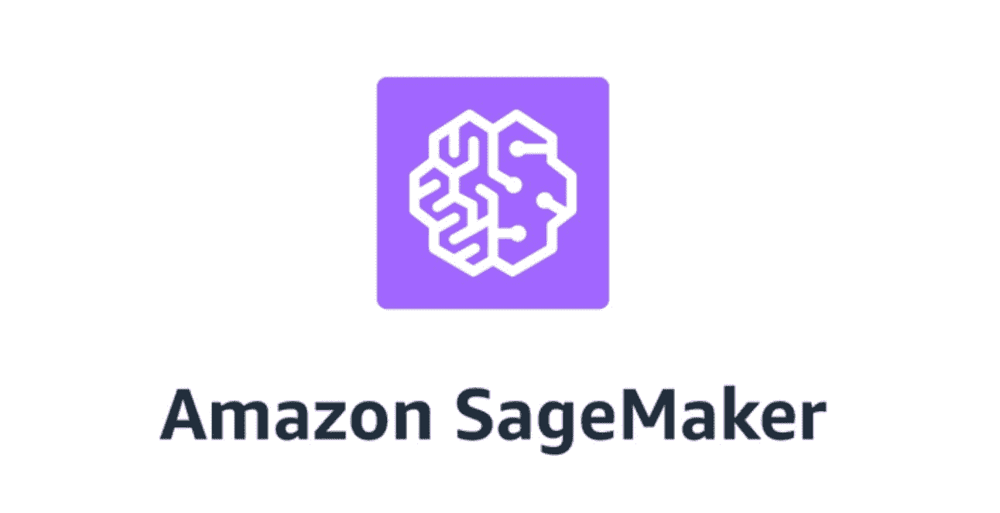
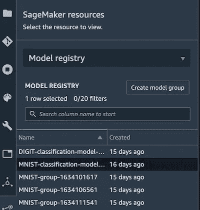
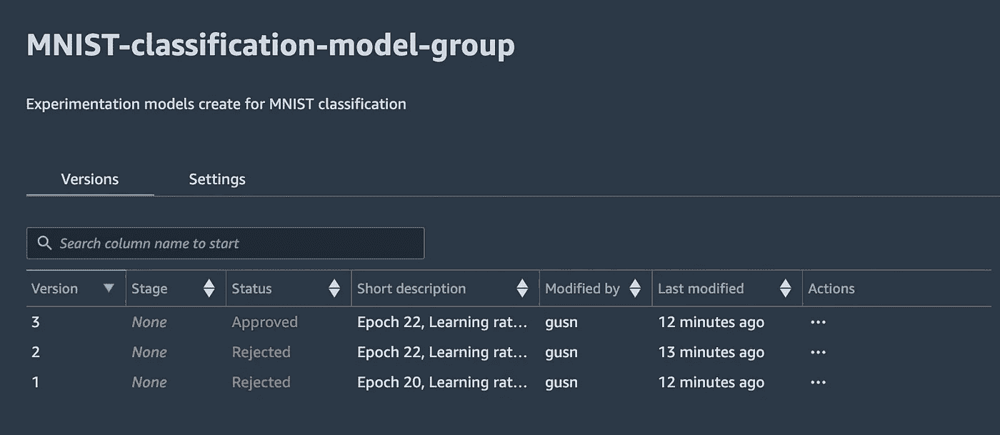
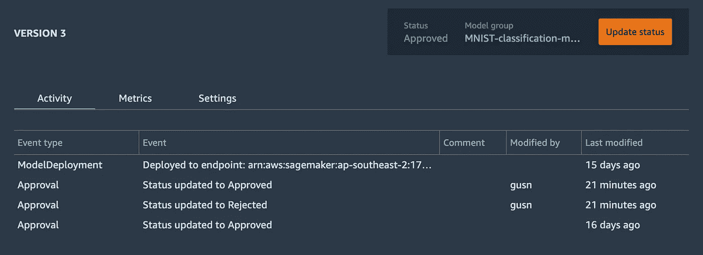
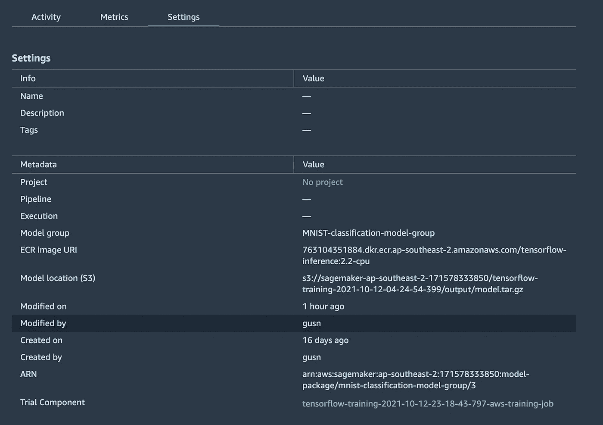

# 使用 Amazon SageMaker 模型注册表更好地跟踪、管理、发现和重用人工智能模型

> 原文：<https://towardsdatascience.com/track-manage-discover-and-reuse-ai-models-better-using-amazon-sagemaker-model-registry-a238ec73351c?source=collection_archive---------15----------------------->

## [提示和技巧](https://towardsdatascience.com/tagged/tips-and-tricks)

## Model registry 是一个集中的存储库，用于存储我们的模型。为什么我们需要一个？为什么我们不能把它们存储在我们的笔记本电脑上呢？我们通过机器学习开发生命周期(MLDLC)来回答这些问题


图片来自 [Unsplash](https://unsplash.com/)

## 可搜索的集中式存储

MLDLC 包括两个阶段:实验和随后的产物电离。在实验过程中，数据科学家使用不同的数据集、算法和超参数构建许多模型，目标是找到最佳模型。在他们的 Jupyter 笔记本上，他们记录了每个模型的指标，并对他们了解到的情况进行了评论。如果需要，他们可以返回笔记本，回忆他们所做的工作，例如，使用什么超参数和数据集来构建特定模型。

如果你的组织只有一个记忆力极好的数据科学家，这个过程可能会奏效。他们可能还记得在哪个笔记本上记录了一个实验。然而，想象一下一个拥有 40 多名数据科学家、分属四个不同团队的组织。你将不得不面对数百个笔记本，打开并通读，以找到你需要的实验。


图片来自 [Unsplash](https://unsplash.com/)

这是一个低效的过程，即使这些笔记本电脑都集中存放。这是模型注册中心需要解决的第一个问题。它必须提供一个**可搜索的集中存储，以记录与型号**相关的信息。

一旦发现了最佳模型，它就进入了产品化阶段，包括构建一个培训和部署管道，以定期自动培训和部署模型。为什么我们需要定期训练？因为，例如，像欺诈检测这样的机器学习(ML)模型需要经常使用最近的网站活动数据进行训练，以跟上欺诈活动趋势。

## 部署事件和版本跟踪

在产品电离过程中，拥有每日培训时间表的管道将构建和部署比所有科学家在实验过程中所能提供的数据更多的模型版本。这里要强调的一个重要因素是，数据科学家创建的模型可能在数据集、超参数和算法方面有所不同。然而，由 AI 管道创建的模型通常仅在数据集上有所不同，因为所使用的算法和超参数是实验揭示的最佳版本。

此外，能够跟踪在特定日期哪个版本的模型正在生产中运行是非常重要的。想象一下这个欺诈检测模型场景:我们有一个包含每日训练计划的欺诈检测模型。一天，一个客户服务团队报告了上周发生的一起未被发现的欺诈活动。为了调查我们的模型故障，我们需要回顾上周在生产中运行的模型版本，以便我们可以提取相关的训练数据并进行实验(更改算法或超参数)来尝试构建更好的模型。这说明了我们需要模型注册中心的第二个原因。跟踪和查看部署事件的能力至关重要。

## 模型可发现性和可重用性

如果你的组织有不止一个团队在构建他们的人工智能模型，用不了多久，一个团队就会意识到，他们花了几天时间来构建另一个团队已经构建好的模型。如果所有的模型都有一个中央存储区，所有的团队都可以浏览和部署已经可用的模型，那么这个问题就可以避免。


图片来自 [Unsplash](https://unsplash.com/)

## 亚马逊 SageMaker 模型注册表

经过一些研究和实验后，我的心被 SageMaker 模型注册中心所吸引，它满足了前面提到的所有三个需求，甚至更多。我将带您了解 SageMaker 生态系统中的流程，并强调它如何解决上述问题。



亚马逊 SageMaker

为了演示 SageMaker 模型注册表，我将使用我的 Tensorflow MNIST 分类模型作为说明。注意，我不会深入模型架构和训练过程的细节，因为我想把重点放在模型注册上。

**注册模型**
我首先使用 SageMaker Python SDK 的 TensorFlow API 训练了一个图像分类模型，以插入这个定制的训练脚本:tf-train.py

```
from sagemaker.tensorflow import TensorFlowtf_estimator = TensorFlow(
 entry_point=”tf-train.py”,
 role=”AmazonSageMakerRole”,
 instance_count=1,
 instance_type=”ml.p2.xlarge”,
 framework_version=”2.2",
 output_path=f”{s3_folder}/output/”,
 py_version=”py37")tf_estimator.fit({‘train’: f’s3://mybucket/dataset/train’,
                  ‘eval’: f’s3://mybucket/dataset/eval’},
                 logs=”Training”)
```

为了在 SageMaker 模型注册中心注册这个模型，我必须首先创建模型组。一个模型组可以存储一个模型的多个版本。

```
sm_client = boto3.client('sagemaker')model_group_name = "MNIST-group-" + str(round(time.time()))
model_package_group_input_dict = {
 "ModelPackageGroupName" : model_group_name,
 "ModelPackageGroupDescription" : "MNIST digit classification"
}create_model_package_group_response = sm_client.create_model_package_group(**model_package_group_input_dict)
```

接下来，我必须在这个模型组中存储我之前训练的模型。你可以在这里添加一些元数据。描述有助于记录与该模型版本相关的任何重要信息，如超参数、精确度和纪元。您只需提及您想要强调的最重要的信息，因为您可以随时在与此模型注册相关的培训工作中查看完整的超参数和其他培训详细信息，稍后我将向您展示这些信息。还可以定义运行这个模型进行推理和转换所需的实例(机器)的类型，相当方便。例如，某些型号可能需要具有最低内存要求的 GPU。批准状态(批准或拒绝)用于模型审核，以便您可以让其他人知道哪个模型被批准用于生产。

```
model = tf_estimator.create_model(role="AmazonSageMakerRole")model.register(
    model_package_group_name=model_group_name,
    content_types=["application/json"],
    response_types=["application/json"],
    inference_instances=["ml.t2.medium", "ml.c5.xlarge"],
    transform_instances=["ml.c5.xlarge"],
    approval_status="Approved",
    description="Trial 1 - Epoch 10, Learning rate 0.7 Accuracy 95%"
)
```

## 浏览注册表中的模型

您已经在模型注册中心构建并注册了一些模型。接下来，如何浏览这些模型？您可以通过代码浏览模型注册表中所有可用的模型，但是更好的方法是使用 Amazon SageMaker Studio GUI。Amazon SageMaker Studio 是一个完全集成的 IDE，专门为 ML 设计。把它想象成类固醇上的 Jupyter 笔记本。您不仅可以在不同的机器上同时打开和运行多个笔记本，还可以在 Studio GUI 中访问其他服务，如模型注册、功能存储、管道等。这种紧密的集成使得管理 ML 任务变得非常容易，而不需要在不同的工具之间切换。

正如您在下面看到的，我可以轻松地查看和搜索我之前创建的模型组。



模型注册组

单击模型会将我带到一个页面，在这个页面上我可以查看这个模型组下曾经部署过的所有模型版本，以及它们的批准状态、描述、作者和最后修改日期。模型注册中心自动分配一个增量版本号。



模型注册组中的模型版本

双击模型的第三个版本会将我带到 model version details 页面，该页面向我显示了重要的审计跟踪信息，例如该模型何时被批准或拒绝，谁在何时执行了该操作，以及该模型被部署到哪个端点。



查看部署事件

“metrics”选项卡将向您显示您选择在培训期间记录的指标，如准确性、损失或 r2。settings 选项卡将向您显示存储模型文件的 S3 存储区，最重要的是，模型版本 ARN，这是引用该模型版本所需的唯一标识符。您将需要这个模型版本 ARN 来从模型注册中心部署模型的特定版本。



查看模型版本详细信息

试用组件包含一个链接，该链接将带您进入正确的 SageMaker 培训工作，该工作描述了进一步的详细信息，例如生成该模型的培训集和评估指标。


查看培训工作详细信息

到目前为止，Amazon SageMaker 模型注册中心已经解决了可搜索的集中式模型记录、部署事件、版本跟踪和模型发现以及可重用性。现在让我们看看 SageMaker 模型注册中心如何满足我们最后的需求:可发现性和可重用性。

首先，让我们看看如何从模型注册中心部署模型的特定版本。

## 从注册表部署模型

在撰写本文时，还没有从 Amazon SageMaker Studio GUI 部署模型的机制。然而，从代码部署模型非常简单。您可以通过传递您想要部署的 ARN 模型版本来创建模型包。接下来，通过输入端点名称、初始实例数量和实例类型来调用 model.deploy。为什么需要多个实例计数？因为 SageMaker 具有内置的负载平衡功能，可以自动将流量分配给 x 个实例。

```
from sagemaker import ModelPackagemodel = ModelPackage(role="AmazonSageMakerRole",
                     model_package_arn=model_version_arn,
                     sagemaker_session=sm_session)timestamp = time.strftime("-%Y-%m-%d-%H-%M", time.gmtime())endpoint_name = f"NEW-DIGITS-{timestamp}"
model.deploy(1, "ml.c5.xlarge", endpoint_name=endpoint_name)
```

部署这个模型只需要几行代码，你可以在任何地方运行这些代码——在你的笔记本电脑上或者在云中运行的人工智能管道中..

## 将模型从模型注册中心部署到现有端点

SageMaker 端点非常类似于 REST API。您可以通过 api url 调用 REST API。要使用 SageMaker 端点进行推理调用，请使用 SageMaker Python SDK 或 boto3 库通过名称引用它。

```
predictor = Predictor(endpoint_name)
input = {'instances': [[0.5, 0.2, -5.2]]}
result = predictor.predict(input)
```

我们在前面学习了如何将模型从模型注册中心部署到新的端点。例如，您总是在每次部署新模型时创建一个新的端点名称，然后删除现有的端点。然而，这种方法有一个缺点。每当您部署新模型时，调用此端点的其他系统都需要知道新名称，如果您运行预定的 AI 管道训练，这可能是每天都要进行的。

用新模型简单地更新现有端点要容易得多，因为不需要通知其他消费者。下面的代码向您展示了这是如何做到的。

```
from sagemaker import Predictorsm_client = boto3.client('sagemaker')
timestamp = time.strftime("-%Y-%m-%d-%H-%M", time.gmtime())model_name = f'DEMO-modelregistry-model-{timestamp}'
container_list = [{'ModelPackageName': model_version_arn}]create_model_response = sm_client.create_model(
    ModelName = model_name,
    ExecutionRoleArn = 'arn:aws:iam::6253:role/SageMakerRole',
    Containers = container_list
)predictor = Predictor(endpoint_name)
predictor.update_endpoint(model_name=model_name,
          initial_instance_count=1, instance_type="ml.c5.xlarge")
```

首先，使用您想要部署的 model_version_arn 创建一个模型。然后，用刚刚创建的模型的名称调用“predictor.update_endpoint”。您需要再次输入 initial _ instance _ count 和 instance _ type’有点不方便，这迫使您从现有的端点配置中获取这些值。如果您所需要做的只是传入模型的名称，而保持其他一切不变，那就更简单了。

更新过程是无缝的，没有停机时间，即使在您更新时有请求到达您的端点，这令人印象深刻！

## 多账户支持

使用 SageMaker 模型注册中心，您可以指定一个 AWS 帐户作为您组织内所有模型的中央存储库。拥有不同 AWS 帐户的其他团队可以获得 IAM 角色访问权限，让他们在集中帐户的模型注册表中注册模型，浏览现有模型，甚至将模型部署到他们自己的 AWS 帐户中。每个团队还可以在自己的 AWS 帐户中拥有自己的模型注册中心，以管理只与他们的团队相关的模型。你可以在这里找到关于这个[的更多细节。](https://docs.aws.amazon.com/sagemaker/latest/dg/model-registry-deploy-xaccount.html)

拥有一个易于搜索的集中式模型库将显著提高模型的可发现性，这反过来将鼓励可重用性。谁愿意浪费精力去构建已经可用的东西呢？


图片来自 [Unsplash](https://unsplash.com/)

## 摘要

模型注册表是确保鼓励可发现性和可重用性的更有生产力和效率的 MLDLC 的关键组件。它的重要性随着你的 AI/ML 团队的规模而增加。Amazon SageMaker 模型注册中心在 Amazon SageMaker 生态系统中仍然是一个相当新的产品。然而，在其当前的形式中，它已经满足了注册管理机构模式的所有主要要求。我真的很期待这个令人敬畏的工具的进一步发展。

特别感谢 Romina Sharifpour 对本次实验的支持。

你可以在我的 [github repo](https://github.com/msubzero2000/sagemaker-mlops/blob/master/sagemaker-train-deploy-update-model-registry.ipynb) 中访问这个实验的 Jupyter 笔记本。