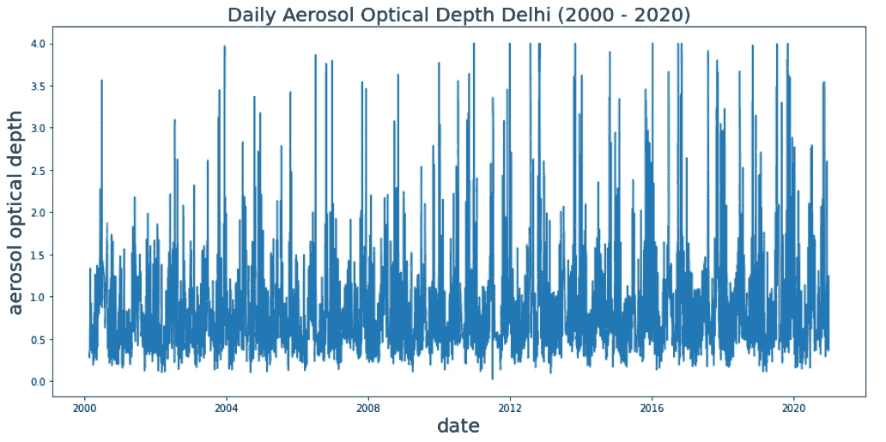
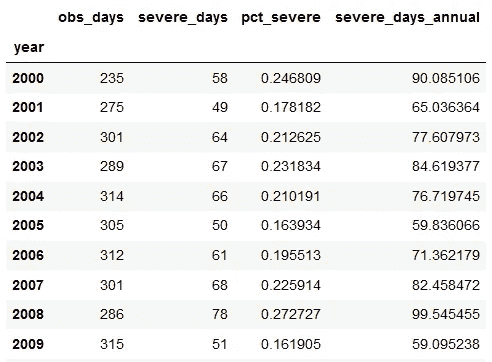
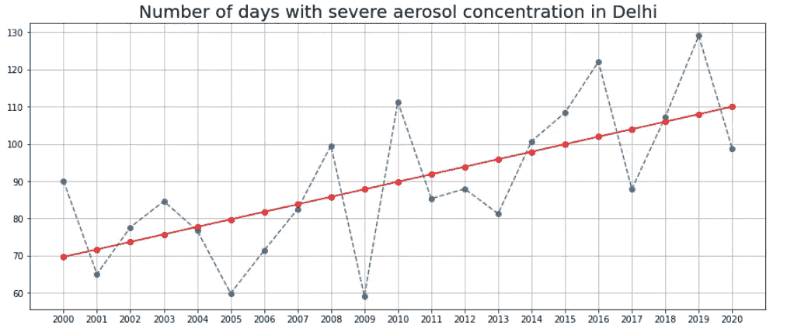

# 追踪来自太空的气溶胶污染

> 原文：<https://towardsdatascience.com/tracking-aerosol-pollution-from-space-8ff53bb64d0f?source=collection_archive---------18----------------------->

## 利用 Google Earth 引擎提取某地区气溶胶污染的时间序列


照片由[在](https://unsplash.com/@callmefred?utm_source=unsplash&utm_medium=referral&utm_content=creditCopyText) [Unsplash](https://unsplash.com/?utm_source=unsplash&utm_medium=referral&utm_content=creditCopyText) 上叫我弗雷德

# 1.介绍

如今，在世界许多地方都能经常看到烟雾弥漫的天气。悬浮在空气中的细小固体颗粒通过吸收或散射阳光在造成烟雾条件中起着主要作用。这些粒子被称为气溶胶。气溶胶的来源包括来自工厂的污染、火灾产生的烟雾、风暴产生的灰尘、火山灰等(来源:NASA)。气溶胶可能对人类健康有害。它们还会干扰温度、云的形成和大气循环模式。因此，监测其水平并将其保持在限制范围内是很重要的。

NASA 的 Terra 卫星上的中分辨率成像光谱仪(MODIS)传感器每天跟踪气溶胶光学厚度(AOD)。它是一个无量纲数，与观测位置上方大气垂直柱中的气溶胶量有关。AOD 告诉我们，这些气溶胶粒子阻止了多少阳光直射到地面。值 0.01 对应于非常干净的大气，值 0.4 对应于雾蒙蒙的空气条件。AOD 值大于 1 代表严重污染时大气中气溶胶浓度高。一些自然现象如野火和沙尘暴会导致介于 1 和 3 之间的高 AOD 值。MODIS 传感器报告的最大 AOD 为 4。

在这篇博客中，我们将使用谷歌地球引擎(GEE)提取每日 AOD 数据(2000-2020 年),并找出德里市气溶胶污染的严重程度。

# 2.工作流程

工作流程可以分为三大部分

*   使用 GEE 收集 AOD 数据。
*   将数据作为 pandas dataframe 导入并绘图。
*   统计每年严重污染的天数。

# 3.使用 GEE 收集 AOD 数据

我们将从导入相关的库和认证 GEE 开始。

```
# Import relevant libraries
import ee# Authenticate GEE and initialize
try:
    ee.Initialize()
except Exception as e:
    ee.Authenticate()
    ee.Initialize()
```

接下来，我们导入感兴趣区域(RoI)的矢量 shapefile 和 AOD 的光栅图像。每天的 AOD 值是从收集的不同图像中获得的，这些图像以卫星观察到该位置的日期进行标记。我们定义了一个函数`reduce_del`,通过对 RoI 内包含的像素值进行平均，将它们减少到一个统计量。然后，该函数被映射到集合中的所有图像上，以导出该区域在所选持续时间内的平均 AOD。然后，生成的时间序列将作为 CSV 文件导出到 Google Drive。

```
# Import the boundaries of the region of interest
delhi = ee.FeatureCollection("FAO/GAUL/2015/level1") \
            .filter(ee.Filter.eq('ADM1_NAME','Delhi'))# Import the raster data on aerosol concentration and apply regional filters.
# It vastly improves run time of the code by reducing the number of images in the collection.
asol = ee.ImageCollection("MODIS/006/MCD19A2_GRANULES")\
        .filterBounds(delhi)\
        .filterDate('2000-01-01', '2020-12-31');# Reduce the image data into a statistic for Delhi
def reduce_del(img):
    stat = img.reduceRegion(reducer=ee.Reducer.mean(), geometry=delhi, scale=1000).get('Optical_Depth_047')
    date = img.date().format()
    mydict = {'date': date, 'stat': stat}
    return ee.Feature(None).set(mydict)# Convert ImageCollection into FeatureCollection and filter the FeatureCollection keeping only notNull values
reduced_del = ee.FeatureCollection(asol.map(reduce_del)).filter(ee.Filter.notNull(['date','stat']))# Code for exporting Delhi AOD data to GDrive as a batch process.
task = ee.batch.Export.table.toDrive(
    collection = reduced_del,
    description = 'aod_stat_del',
    folder = 'satellite',
    fileFormat = 'CSV',
    selectors = ['date','stat']
)task.start()
```

# 4.将数据作为时间序列导入并绘图

我们将数据从 Google Drive 下载到本地机器，并使用 Pandas 导入。AOD 值以 0.001 的比例报告。通过将所有值除以 1000，我们将这些值重新调整为 1。由于同一天有多个观察值，我们取它们的平均值来得出每天的单个值。

```
import pandas as pd
import numpy as np
import matplotlib.pyplot as plt
from scipy import stats
import matplotlib.pyplot as pltaerosoldf = pd.read_csv('C:\\Users\\ADMIN\\Desktop\\satellite\\geemap\\data\\aod_stat_del.csv')# Define a function to transform the dataframe into time series
# Rescale AOD values from 0.001 to 1 by dividing the numbers by 1000.
# Group the observations by day and take the average AOD value
def tseries(df):

    df['date_formatted'] = pd.to_datetime(df['date']).dt.normalize()

    df.stat = df.stat/1000

    df = df.groupby('date_formatted').agg(mean_stat =    pd.NamedAgg(column = 'stat', aggfunc = 'mean'))

    return dfaerosoldf = tseries(aerosoldf)# we create a figure with pyplot and set the dimensions to 15 x 7
fig, ax = plt.subplots(figsize=(15,7))# we'll create the plot by setting our dataframe to the data argument
ax.plot(aerosoldf.index, aerosoldf.mean_stat)# we'll set the labels and title
ax.set_ylabel('aerosol optical depth',fontsize=20)
ax.set_xlabel('date',fontsize=20)
ax.set_title('Daily Aerosol Optical Depth Delhi (2000 - 2020)',fontsize=20);plt.show()
```



AOD 时间序列:作者图片

# 5.数据处理

每日时间序列图看起来很乱。我们绘制了大跨度的数据(20 年的每日数据)，目的是验证气候变化的说法。值得注意的是，AOD 值超过 1 的次数在近期有所增加，这意味着严重污染事件的频率有所增加。让我们数一数每年 AOD 大于 1 的天数。

```
# Retrieve year information from date index
aerosoldf['year'] = aerosoldf.index.year
#Define AOD threshold as 1 
aerosoldf['threshold'] = 1
#Create a binary column which takes value 1 when AOD exceeds threshold and 0 otherwise
aerosoldf['severe'] = np.where(aerosoldf['mean_stat'] > aerosoldf['threshold'], 1,0)#Group the observations and count the number of days having severe pollution in each year
aerosol = aerosoldf.groupby('year').agg(obs_days = pd.NamedAgg(column = 'severe', aggfunc = 'count'),
                                        severe_days = pd.NamedAgg(column = 'severe', aggfunc = 'sum'))# As the number of observed days are not uniform across years, we calculate the percentage of severe days and multiply by 365 to make it comparable across yearsaerosol['severe_days_annual'] = aerosol['severe_days'] / aerosol['obs_days'] * 365
aerosol
```



显示每年严重天数的数据框架的前 10 行:作者图片

```
# Function to find slope and intercept of trendline
def trendline(df):
    # get coeffs of linear fit
    slope, intercept, r_value, p_value, std_err = stats.linregress(df.index,df['severe_days_annual'])

    pct = intercept + slope * df.index
    return(pct)#Plot
fig = plt.figure(figsize=(15,6))ax = fig.add_subplot(111)ax.plot(aerosol.index.astype(int), aerosol.severe_days_annual, linestyle="dashed", marker = 'o')ax.plot(aerosol.index.astype(int), trendline(aerosol), color = 'red', marker='o')ax.set_xticks(range(2000,2021))# we'll set the labels and title
ax.set_title('Number of days with severe aerosol concentration in Delhi',fontsize=20);
plt.grid()
plt.show()
```



图表显示严重污染事件的频率增加:图片由作者提供

# 6.结论

趋势图显示，一年中大约有 4 个月，德里空气受到高水平气溶胶的严重污染。一年中的严重天数从 2000 年的 70 天增加到 2020 年的 110 天。与二十年前相比，严重污染事件的发生频率增加了近 60%。那是惊人的！！这突出表明，由于污染的影响是跨国的，因此需要在国家和国际一级开展有意义的对话并制定行动计划。

免责声明:本博客表达的观点是个人观点。

# 参考

*   [https://earth data . NASA . gov/earth-observation-data/near-real-time/hazards-and-disasters/air-quality](https://earthdata.nasa.gov/earth-observation-data/near-real-time/hazards-and-disasters/air-quality)
*   MCD 19 a 2.006:NASA 陆地过程分布式活动档案中心(LP DAAC)发布的 Terra & Aqua MAIAC 陆地气溶胶光学厚度每日 1 公里
*   吴(2020)。geemap:一个 Python 包，用于与 Google Earth 引擎进行交互式地图绘制。《开放源码软件杂志》，5(51)，2305 页。【https://doi.org/10.21105/joss.02305 
*   Gorelick，m . Han cher，m . Dixon，m . Ilyushchenko，s .，Thau，d .，& Moore，R. (2017)。谷歌地球引擎:面向所有人的全球地理空间分析。环境遥感。